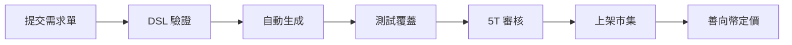

# 🏪 OmniFactory Marketplace - v1.1.0

**ESGGO Classic 善向永續 經典版** | **元件上架市集**

---

## 📋 已上架元件 (11 總數)

| 編號 | 元件 | 分類 | 價格 (善向幣) | 狀態 |
|------|------|------|---------------|------|
| 001 | OmniButton | Atom | Free | ✅ 上架 |
| 002 | OmniInput | Atom | Free | ✅ 上架 |
| 003 | OmniBadge | Atom | Free | ✅ 上架 |
| 004 | OmniCard | Atom | Free | ✅ 上架 |
| 005 | OmniIcon | Atom | Free | ✅ 上架 |
| 006 | OmniDivider | Atom | Free | ✅ 上架 |
| 007 | OmniFormField | Molecule | Free | ✅ 上架 |
| 008 | OmniKPICard | Molecule | Silver (300) | ✅ 上架 |
| 009 | OmniModal | Organism | Silver (300) | ✅ 上架 |
| 010 | MobileBottomNav | Mobile | Free | ✅ 上架 |
| 011 | MobileDrawer | Mobile | Free | ✅ 上架 |
| 012 | OmniAssistant | Organism | Gold (500) | ✅ 上架 |

---

## 🎯 9 大永續核心模組

| 等級 | 模組 | 價格 | 5T | 狀態 |
|------|------|------|-----|------|
| Platinum | Carbon Dashboard | 1000 | T1-T5 | ✅ 可購 |
| Gold | AI ESG Assistant | 500 | T1-T4 | ✅ 可購 |
| Gold | SDGs Matrix | 500 | T1-T3 | ✅ 可購 |
| Silver | Governance Audit | 300 | T4-T5 | ✅ 可購 |
| Silver | Evidence Vault | 300 | T5 | ✅ 可購 |
| Silver | Stakeholder Map | 300 | T1 | ✅ 可購 |
| Bronze | Report Generator | 100 | T4 | ✅ 可購 |
| Bronze | Compliance Matrix | 100 | T3 | ✅ 可購 |
| Bronze | Risk Heatmap | 100 | T3-T4 | ✅ 可購 |

---

## 🏭 自訂元件上架流程

### 提交格式

1. 複製 `.kilo/component-requirements/OmniAssistant-REQ-v1.1.0.md`
2. 填寫元件需求
3. 提交至 `/api/factory/submit`

---

## 💰 用戶權限與定價

| 等級 | 月費 | 自訂頁數 | 購買額度 |
|------|------|---------|----------|
| Free | $0 | 1 頁 | 100 幣 |
| Pro | $29/月 | 3 頁 | 500 幣 |
| Enterprise | $99/月 | 無限 | 2000 幣 |

---

## 🔗 API 端點

| 方法 | 端點 | 功能 |
|------|------|------|
| POST | `/api/factory/submit` | 提交需求單 |
| GET | `/api/factory/status/:id` | 查看生成狀態 |
| POST | `/api/factory/publish` | 上架至市集 |
| GET | `/api/factory/marketplace` | 瀏覽市集 |

---