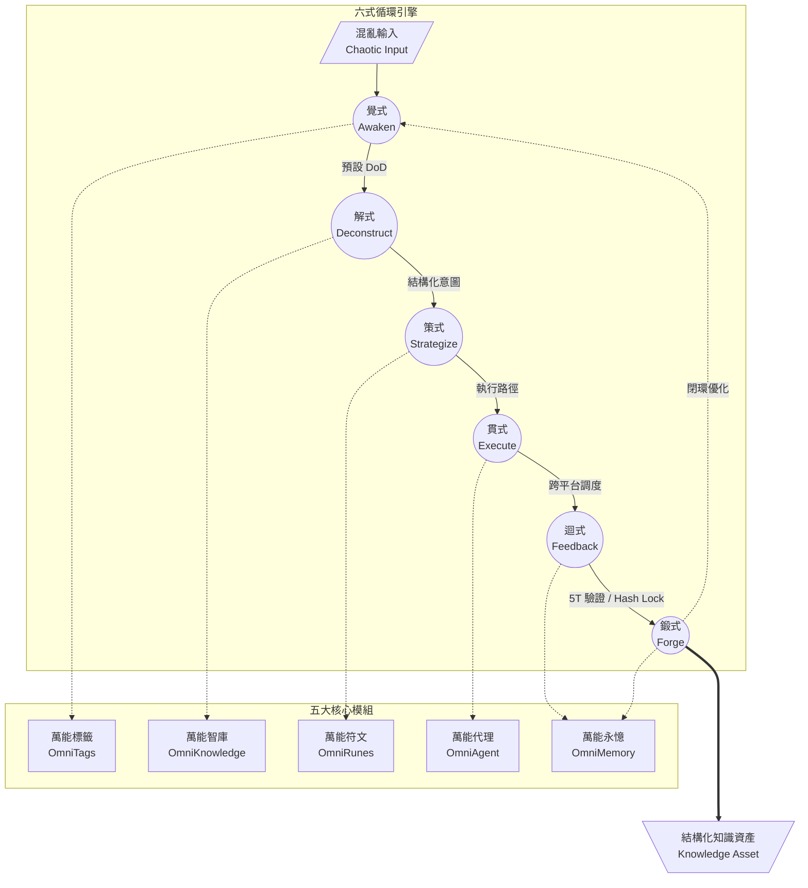

# 架構決策紀錄 (ADR): 萬能元件心核｜以終為始 ♾️ 終始矩陣 (OmniComponent Matrix)

## 狀態 (Status)
**Accepted** - 系統級核心治理準則與實作標準。

## 上下文與問題 (Context & Problem Statement)
隨著 OmniAgentSwarm 的擴展，處理混亂資訊的能力必須標準化。我們需要一套可持續運作的系統方法論，將使用者的模糊意圖或混亂輸入，系統化地轉譯為可執行、可追溯、可沉澱、可再優化的行動與知識資產。這不僅是單一功能，而是系統整體的閉環思維模式。

## 決策 (Decision)
我們決定在 OmniCore 層實作「**萬能元件心核｜以終為始 ♾️ 終始矩陣**」架構。其核心為「六式循環」與「五大核心模組」，構成系統的進化引擎。

### 五大核心模組 (Core Modules)
1. **萬能標籤 (OmniTags)**：負責分類、路由、意圖標記。
2. **萬能永憶 (OmniMemory)**：負責上下文、歷史、版本、回饋沉澱。
3. **萬能智庫 (OmniKnowledge)**：負責知識檢索、策略建議、標準化輸出。
4. **萬能符文 (OmniRunes)**：負責能力封裝、規則化接口、跨模組調度。
5. **萬能代理 (OmniAgent)**：負責實際執行、分派、協作與結果回收。

### 六式循環引擎 (The Six-Form Loop)
1. **覺式 (Awaken)**：接收輸入，喚醒任務。以終為始，預先設定驗收標準 (DoD)。
2. **解式 (Deconstruct)**：拆解意圖，形成結構化任務。
3. **策式 (Strategize)**：生成策略，構建執行路徑。
4. **貫式 (Execute)**：跨平台執行，落地任務，調用對應代理。
5. **迴式 (Feedback)**：收集結果，回饋修正，執行 5T 驗證與 Hash Lock。
6. **鍛式 (Forge)**：沉澱知識至永憶庫，啟動下一輪優化。

### 系統架構圖 (Architecture Diagram)

## 實作細節 (Implementation Details)
已於 `lib/omni-core/matrix.ts` 實作 `OmniMatrix` 核心類別。該類別提供了 `awaken`, `deconstruct`, `strategize`, `execute`, `feedback`, `forge` 以及 `runLifecycle` 方法，作為系統調用的基礎介面。

## 核心原則 (Core Principles Alignment)
- **以終為始 (End-as-Beginning)**: 每個任務進入「覺式」前必先定義 `expectedDoD`。
- **無增即是有 (Less is More)**: 結構化過程濾除雜訊，保留純淨意圖。
- **不可篡改與可追溯 (Trustworthy & Traceable)**: 迴式執行時，透過 `OmniCore` 產生 `Hash Lock` 封印。
- **可迭代 (Iterable)**: 鍛式將輸出結果寫入 `dcInsertEternalMemory` 作為永續資產。

## 後續影響 (Consequences)
1. 所有的 Agent 工作流 (包含 Antigravity 處理新需求) 應對齊此矩陣流程。
2. 開發者能使用 `OmniMatrix.runLifecycle(input)` 輕易將外部輸入整合進系統記憶迴圈。
3. 知識庫與資產將因為「鍛式」的自動化沉澱而迅速豐富，進而提升「萬能智庫」的推論精準度。
