# ESG GO White Paper

## 永續自主治理平台 / Sustainable Autonomous Governance Platform

**Version:** 1.0\
**Date:** February 2026\
**Classification:** Public

---

## 目錄 / Table of Contents

- [Part I: 核心理念 / Core Concepts](#part-i-核心理念--core-concepts)
  - [1. 執行摘要 / Executive Summary](#1-執行摘要--executive-summary)
  - [2. 問題陳述 / Problem Statement](#2-問題陳述--problem-statement)
  - [3. 願景與使命 / Vision and Mission](#3-願景與使命--vision-and-mission)
- [Part II: 技術架構 / Technical Architecture](#part-ii-技術架構--technical-architecture)
  - [4. 5T 協議 / 5T Protocol](#4-5t-協議--5t-protocol)
  - [5. ESGss：永續系統主幹 / ESGss: Sustainability System Backbone](#5-esgss永續系統主幹--esgss-sustainability-system-backbone)
  - [6. JunAiKey：AI 自主治理核心 / JunAiKey: AI Autonomous Governance Core](#6-junaikey-ai-自主治理核心--junaikey-ai-autonomous-governance-core)
  - [7. InfoOne V1.0：全域實作平台 / InfoOne V1.0: Global Implementation Platform](#7-infoone-v10-全域實作平台--infoone-v10-global-implementation-platform)
- [Part III: 系統能力 / System Capabilities](#part-iii-系統能力--system-capabilities)
  - [8. 九階段運行模型 / Nine-Phase Operation Model](#8-九階段運行模型--nine-phase-operation-model)
  - [9. 自主修復機制 / Self-Healing Mechanism](#9-自主修復機制--self-healing-mechanism)
  - [10. Evidence Vault：不可篡改證據層 / Evidence Vault: Immutable Evidence Layer](#10-evidence-vault-不可篡改證據層--evidence-vault-immutable-evidence-layer)
  - [11. 多標準合規引擎 / Multi-Standard Compliance Engine](#11-多標準合規引擎--multi-standard-compliance-engine)
- [Part IV: 應用場景 / Use Cases](#part-iv-應用場景--use-cases)
  - [12. 企業永續治理 / Enterprise Sustainability Governance](#12-企業永續治理--enterprise-sustainability-governance)
  - [13. 供應鏈透明化 / Supply Chain Transparency](#13-供應鏈透明化--supply-chain-transparency)
  - [14. 政府監管應用 / Government Regulatory Applications](#14-政府監管應用--government-regulatory-applications)
  - [15. 第三方驗證機構 / Third-Party Verification Bodies](#15-第三方驗證機構--third-party-verification-bodies)
- [Part V: 技術實現 / Technical Implementation](#part-v-技術實現--technical-implementation)
  - [16. 系統架構設計 / System Architecture Design](#16-系統架構設計--system-architecture-design)
  - [17. 安全性與隱私保護 / Security and Privacy Protection](#17-安全性與隱私保護--security-and-privacy-protection)
  - [18. API 與整合能力 / API and Integration Capabilities](#18-api-與整合能力--api-and-integration-capabilities)
- [Part VI: 商業模式與路線圖 / Business Model and Roadmap](#part-vi-商業模式與路線圖--business-model-and-roadmap)
  - [19. 市場定位與商業模式 / Market Positioning and Business Model](#19-市場定位與商業模式--market-positioning-and-business-model)
  - [20. 產品路線圖與願景 / Product Roadmap and Vision](#20-產品路線圖與願景--product-roadmap-and-vision)

---

# Part I: 核心理念 / Core Concepts

## 1. 執行摘要 / Executive Summary

### 1.1 文件概述 / Document Overview

ESG GO 是一個革命性的永續自主治理平台，旨在解決當代
ESG（環境、社會、治理）數據管理領域面臨的核心挑戰。透過結合物聯網（IoT）數據收集、人工智慧分析、區塊鏈技術與多標準合規引擎，ESG
GO
為企業、政府機構與第三方驗證組織提供了一個可信、透明且高效的永續發展解決方案。

ESG GO is a revolutionary sustainable autonomous governance platform designed to
address the core challenges in contemporary ESG (Environmental, Social,
Governance) data management. By integrating IoT data collection, artificial
intelligence analysis, blockchain technology, and a multi-standard compliance
engine, ESG GO provides enterprises, government agencies, and third-party
verification organizations with a trustworthy, transparent, and efficient
sustainable development solution.

### 1.2 核心價值主張 / Core Value Proposition

| 價值維度 / Value Dimension           | 描述 / Description                                                                                   |
| ------------------------------------ | ---------------------------------------------------------------------------------------------------- |
| **數據可信 / Data Trust**            | SHA-256 數位簽章封印，確保數據不可篡改 / SHA-256 digital signature sealing ensures data immutability |
| **治理可見 / Governance Visibility** | 完整生命週期追蹤，所有操作可溯源 / Complete lifecycle tracking, all operations traceable             |
| **系統智能 / System Intelligence**   | AI 驅動的自主修復與優化建議 / AI-driven autonomous repair and optimization recommendations           |
| **合規自動 / Compliance Automation** | 支援 GRI 2026、FSC97、SASB、TCFD 多標準 / Supports GRI 2026, FSC97, SASB, TCFD multi-standard        |

### 1.3 平台概述 / Platform Overview

ESG GO 平台包含以下核心模組：

- **Omni ESG Reports Center (SRC)** - 萬能永續報告中心，容納 200+ 功能的超級系統
- **5T Protocol** - 永續數據治理協議
- **JunAiKey** - AI 自主治理核心
- **Evidence Vault** - 不可篡改證據庫
- **Indicator Mapper** - 多標準合規引擎

---

## 2. 問題陳述 / Problem Statement

### 2.1 當前 ESG 治理的三大困境 / Three Major Challenges in Current ESG Governance

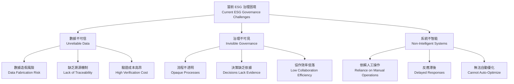

#### 2.1.1 數據不可信 / Unreliable Data

傳統 ESG 數據管理面臨嚴重的信任危機：

- **數據造假風險**：企業可能基於利益動機操縱 ESG 數據
- **缺乏溯源機制**：難以追蹤數據來源與處理過程
- **驗證成本高昂**：第三方審計需要大量人力與時間投入

Traditional ESG data management faces a serious trust crisis:

- **Data Fabrication Risk**: Enterprises may manipulate ESG data based on profit
  motives
- **Lack of Traceability**: Difficult to track data sources and processing
- **High Verification Cost**: Third-party audits require significant human
  resources and time

#### 2.1.2 治理不可見 / Invisible Governance

缺乏透明度的治理導致：

- **流程不透明**：利益相關者無法了解決策過程
- **決策缺乏依據**：管理層難以基於數據做出明智決策
- **協作效率低落**：部門間數據共享困難

Governance lacking transparency leads to:

- **Opaque Processes**: Stakeholders cannot understand decision-making processes
- **Decisions Lack Evidence**: Management struggles to make informed decisions
  based on data
- **Low Collaboration Efficiency**: Data sharing between departments is
  difficult

#### 2.1.3 系統不智能 / Non-Intelligent Systems

現有系統缺乏智能化能力：

- **依賴人工操作**：大量重複性工作需要人工處理
- **反應滞後**：無法即時響應環境變化
- **無法自動優化**：缺乏自我學習與改進能力

Existing systems lack intelligent capabilities:

- **Reliance on Manual Operations**: Large amounts of repetitive work require
  manual processing
- **Delayed Responses**: Cannot respond immediately to environmental changes
- **Cannot Auto-Optimize**: Lack of self-learning and improvement capabilities

### 2.2 市場機遇 / Market Opportunity

隨著全球對永續發展的重視，ESG 報告與合規需求快速增長：

- **監管壓力**：各國政府陸續強制要求 ESG 揭露
- **投資者需求**：機構投資者越來越重視 ESG 表現
- **消費者意識**：消費者越來越關注企業的永續實踐

With global emphasis on sustainable development, ESG reporting and compliance
needs are growing rapidly:

- **Regulatory Pressure**: Governments are mandating ESG disclosures
- **Investor Demand**: Institutional investors increasingly prioritize ESG
  performance
- **Consumer Awareness**: Consumers are increasingly concerned about corporate
  sustainability practices

---

## 3. 願景與使命 / Vision and Mission

### 3.1 願景 / Vision

**打造全球首個可信賴的永續自主治理生態系統，成為企業、政府與驗證機構之間的信任橋樑。**

**To build the world's first trustworthy sustainable autonomous governance
ecosystem, becoming the trust bridge between enterprises, governments, and
verification agencies.**

### 3.2 使命 / Mission

| 使命維度 / Mission Dimension       | 具體目標 / Specific Goals                                                                                                                              |
| ---------------------------------- | ------------------------------------------------------------------------------------------------------------------------------------------------------ |
| **賦能企業 / Empower Enterprises** | 提供全面的 ESG 數據管理與報告解決方案 / Provide comprehensive ESG data management and reporting solutions                                              |
| **連接生態 / Connect Ecosystem**   | 建立企業、政府、驗證機構之間的可信數據交換網絡 / Establish a trusted data exchange network between enterprises, governments, and verification agencies |
| **推動創新 / Drive Innovation**    | 透過 AI 與區塊鏈技術推動永續治理的智能化 / Promote intelligent sustainable governance through AI and blockchain technology                             |
| **創造價值 / Create Value**        | 幫助利益相關者做出更好的永續發展決策 / Help stakeholders make better sustainable development decisions                                                 |

### 3.3 核心哲學 / Core Philosophy

ESG GO 遵循五大核心原則：

ESG GO follows five core principles:

| 原則 / Principle   | 內涵 / Meaning                                 | 實踐 / Practice                                               |
| ------------------ | ---------------------------------------------- | ------------------------------------------------------------- |
| **真 (Truth)**     | 數據真實可驗證 / Verifiable Data Truth         | 5T 協議確保數據真實性 / 5T Protocol ensures data authenticity |
| **善 (Goodness)**  | 算法透明公正 / Transparent and Fair Algorithms | 開放計算邏輯供審計 / Open calculation logic for auditing      |
| **美 (Beauty)**    | 用戶體驗卓越 / Excellent User Experience       | Liquid Glass UI 設計系統 / Liquid Glass UI Design System      |
| **信 (Trust)**     | 不可篡改的信任 / Immutable Trust               | SHA-256 數位簽章 / SHA-256 Digital Signatures                 |
| **通 (Transcend)** | 無縫整合跨越 / Seamless Integration            | 標準化 API 與數據格式 / Standardized APIs and Data Formats    |

---

# Part II: 技術架構 / Technical Architecture

## 4. 5T 協議 / 5T Protocol

### 4.1 協議概述 / Protocol Overview

5T 協議是 ESG GO 平台的核心數據治理框架，定義了永續數據的五個關鍵維度：

5T Protocol is the core data governance framework of the ESG GO platform,
defining five key dimensions of sustainable data:

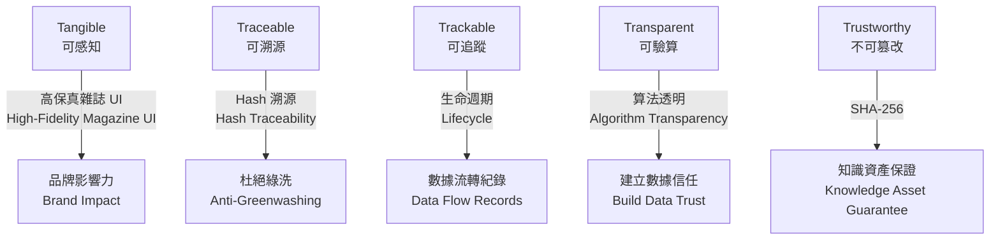

### 4.2 各維度詳細定義 / Detailed Definition of Each Dimension

#### 4.2.1 Tangible（可感知）

**定義 / Definition**：數據以高保真、多維度的方式呈現，使利益相關者能夠直觀理解
ESG 表現。

Data is presented in a high-fidelity, multi-dimensional way, allowing
stakeholders to intuitively understand ESG performance.

**核心要素 / Core Elements**：

- 視覺化儀表板 / Visual dashboards
- 交互式報告 / Interactive reports
- 趨勢圖表 / Trend charts
- 比較分析 / Comparative analysis

#### 4.2.2 Traceable（可溯源）

**定義 /
Definition**：每個數據點都有明確的來源記錄，包括數據採集設備、採集時間、採集方法等。

Each data point has a clear source record, including data collection device,
collection time, collection method, etc.

**核心要素 / Core Elements**：

- 來源哈希 / Source hash
- 設備指紋 / Device fingerprint
- 採集方法記錄 / Collection method records
- 族譜追蹤 / Genealogy tracking

#### 4.2.3 Trackable（可追蹤）

**定義 /
Definition**：數據的整個生命週期都被完整記錄，包括創建、修改、驗證、鎖定等所有狀態變化。

The entire lifecycle of data is fully recorded, including all state changes such
as creation, modification, verification, and locking.

**核心要素 / Core Elements**：

- 生命週期事件 / Lifecycle events
- 操作者記錄 / Operator records
- 時間戳記 / Timestamps
- 變更差異追蹤 / Change delta tracking

#### 4.2.4 Transparent（可驗算）

**定義 /
Definition**：所有計算邏輯與算法完全透明，任何人都可以驗算結果的正確性。

All calculation logic and algorithms are completely transparent, anyone can
verify the correctness of results.

**核心要素 / Core Elements**：

- 公式公開 / Formula transparency
- 計算過程記錄 / Calculation process records
- 零幻覺驗證 / Zero-hallucination verification
- 多標準映射 / Multi-standard mapping

#### 4.2.5 Trustworthy（不可篡改）

**定義 / Definition**：採用密碼學方法確保數據一旦鎖定，就無法被篡改。

Using cryptographic methods to ensure that once data is locked, it cannot be
tampered with.

**核心要素 / Core Elements**：

- SHA-256 數位簽章 / SHA-256 digital signatures
- 共識時間戳 / Consensus timestamps
- 封印狀態 / Sealed status
- 不可逆操作 / Irreversible operations

### 4.3 5T 數據模型 / 5T Data Model

```typescript
interface IOmniAtom<T> {
    // Tangible - 可感知
    tangible: {
        metricName: string;
        metricValue: T;
        visualRef?: string;
    };

    // Traceable - 可溯源
    traceable: {
        originHash: string;
        genealogy: string[];
        sourceOrigin: string;
        extractionMethod: "OCR" | "IoT" | "Manual";
    };

    // Trackable - 可追蹤
    trackable: {
        currentHookId: string;
        pathLog: Array<{
            timestamp: number;
            nodeId: string;
            action: "CREATED" | "UPDATED" | "VALIDATED" | "LOCKED" | "SEALED";
        }>;
    };

    // Transparent - 可驗算
    transparent: {
        algorithmId: string;
        verificationProof: string;
        formula: string;
        standardRef: string;
    };

    // Trustworthy - 不可篡改
    trustworthy: {
        isFrozen: boolean;
        signerKey: string;
        consensusTimestamp: number;
        contentHash: string;
    };
}
```

---

## 5. ESGss：永續系統主幹 / ESGss: Sustainability System Backbone

### 5.1 系統概述 / System Overview

ESGss（Eternal Sustainability System）是 ESG GO
平台的核心基礎設施，作為連接所有模組與功能的「神經中樞」。作為一個容納 200+
功能的超級系統，ESGss 為企業提供高保真、合規、可溯源的永續報告解決方案。

ESGss (Eternal Sustainability System) is the core infrastructure of the ESG GO
platform, serving as the "neural center" connecting all modules and functions.
As a supersystem accommodating 200+ functions, ESGss provides enterprises with
high-fidelity, compliant, and traceable sustainable reporting solutions.

### 5.2 功能領域 / Functional Domains

| 領域代碼 / Domain Code | 領域名稱 / Domain Name | 功能數量 / Function Count | 範疇說明 / Scope Description                                                                                          |
| ---------------------- | ---------------------- | ------------------------- | --------------------------------------------------------------------------------------------------------------------- |
| **ENV**                | 環境 (Environment)     | 60                        | 碳排放、能源、水資源、廢棄物、供應鏈環境 / Carbon emissions, energy, water resources, waste, supply chain environment |
| **SOC**                | 社會 (Social)          | 55                        | 員工、供應商、社區、客戶、人權 / Employees, suppliers, community, customers, human rights                             |
| **GOV**                | 治理 (Governance)      | 50                        | 董事、風險管理、合規、道德、反貪腐 / Board, risk management, compliance, ethics, anti-corruption                      |
| **AGC**                | 代理 (Agency)          | 35                        | 數據代理、AI 代理、自動化流程、API 整合 / Data agents, AI agents, automated processes, API integration                |

### 5.3 優先級功能 / Priority Functions

#### P0 - 核心基礎設施（20個功能）

| ID    | 功能名稱 / Function Name    | 領域 / Domain | 5T          | 說明 / Description                                      |
| ----- | --------------------------- | ------------- | ----------- | ------------------------------------------------------- |
| P0-01 | IComponentCore 核心類型定義 | GOV           | Truth       | 所有數據的基礎合約 / Base contract for all data         |
| P0-02 | SHA-256 數位簽章封印        | GOV           | Trust       | 不可篡改的信任根基 / Immutable trust foundation         |
| P0-03 | StandardCalculator 計算引擎 | ENV           | Transparent | 透明的 ESG 計算 / Transparent ESG calculation           |
| P0-04 | 生命週期事件追蹤            | GOV           | Trackable   | 完整數據流轉紀錄 / Complete data flow records           |
| P0-05 | 證據鏈 (Evidence Chain)     | GOV           | Traceable   | 可溯源的證據結構 / Traceable evidence structure         |
| P0-06 | Liquid Glass UI 設計系統    | AGC           | Tangible    | 高保真視覺體驗 / High-fidelity visual experience        |
| P0-07 | GRI 2026 指標映射引擎       | GOV           | Transparent | 標準合規映射 / Standard compliance mapping              |
| P0-08 | FSC 97 指標映射             | GOV           | Transparent | 台灣金管會合規 / FSC compliance                         |
| P0-09 | SASB 指標映射               | GOV           | Transparent | 產業別永續指標 / Industry sustainability indicators     |
| P0-10 | TCFD 氣候風險映射           | ENV           | Transparent | 氣候相關財務揭露 / Climate-related financial disclosure |
| P0-11 | 報告生成引擎 (Report Forge) | GOV           | Trust       | 自動化報告產出 / Automated report generation            |
| P0-12 | 零幻覺驗算協議              | AGC           | Transparent | AI 數據驗證 / AI data verification                      |

---

## 6. JunAiKey：AI 自主治理核心 / JunAiKey: AI Autonomous Governance Core

### 6.1 系統概述 / System Overview

JunAiKey（萬能元鑰 / Omni-Sprite）是 ESG GO 平台的 AI 自主治理核心，集成了
Gnosis Engine 與 WuZuo Note 功能，為用户提供智能化的永續發展輔助。

JunAiKey (Omni-Sprite) is the AI autonomous governance core of the ESG GO
platform, integrating Gnosis Engine and WuZuo Note functions to provide
intelligent sustainable development assistance for users.

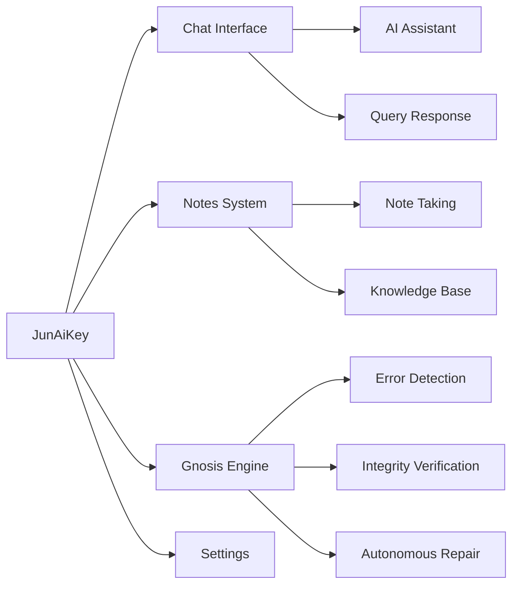

### 6.2 核心功能 / Core Features

| 功能 / Feature                      | 描述 / Description                                                             | 技術支撐 / Technical Support |
| ----------------------------------- | ------------------------------------------------------------------------------ | ---------------------------- |
| **智能對話 / Intelligent Dialogue** | 基於 Gemini AI 的自然語言處理 / Natural language processing based on Gemini AI | Google Gemini API            |
| **知識庫 / Knowledge Base**         | 用戶知識管理與檢索 / User knowledge management and retrieval                   | UserKnowledgeBase            |
| **智能洞察 / Intelligent Insights** | 數據分析與洞察生成 / Data analysis and insight generation                      | Gnosis Engine                |
| **自主修復 / Autonomous Repair**    | 自動檢測並修復系統問題 / Automatic detection and repair of system issues       | WuZuo Protocol               |

### 6.3 Gnosis Engine / 智能判斷引擎

Gnosis Engine 是 JunAiKey 的核心智能組件，負責：

- **完整性檢測**：驗證 5T 數據完整性
- **異常檢測**：識別數據異常與潛在風險
- **自主決策**：根據預設規則自動做出決策
- **學習優化**：從歷史數據中學習並優化決策

Gnosis Engine is the core intelligent component of JunAiKey, responsible for:

- **Integrity Detection**: Verify 5T data integrity
- **Anomaly Detection**: Identify data anomalies and potential risks
- **Autonomous Decision-Making**: Automatically make decisions based on preset
  rules
- **Learning Optimization**: Learn from historical data and optimize decisions

---

## 7. InfoOne V1.0：全域實作平台 / InfoOne V1.0: Global Implementation Platform

### 7.1 平台概述 / Platform Overview

InfoOne V1.0 是 ESG GO 平台的用戶界面層，提供了全面的 Web
與移動端訪問能力。作為「全域實作平台」，InfoOne V1.0 將複雜的 ESG
數據管理功能以直觀、高效的方式呈現給用戶。

InfoOne V1.0 is the user interface layer of the ESG GO platform, providing
comprehensive web and mobile access capabilities. As the "Global Implementation
Platform," InfoOne V1.0 presents complex ESG data management functions to users
in an intuitive and efficient manner.

### 7.2 技術架構 / Technical Architecture

| 層級 / Layer                  | 技術選型 / Technology          | 說明 / Description                     |
| ----------------------------- | ------------------------------ | -------------------------------------- |
| 前端框架 / Frontend Framework | Next.js 14 + TypeScript        | App Router, Server/Client 分離         |
| UI 引擎 / UI Engine           | Tailwind CSS + Framer Motion   | 液態玻璃美學 / Liquid Glass Aesthetics |
| 後端服務 / Backend Service    | Supabase (NCBDB)               | NoSQL 資料庫 / NoSQL Database          |
| AI 智能 / AI Intelligence     | Google Stitch MVP/MCP + Gemini | AI 輔助生成與審計                      |
| 調試協議 / Debug Protocol     | Google Jules                   | 萬能因果修復協議                       |
| 數位簽章 / Digital Signature  | SHA-256                        | 不可篡改封印                           |

### 7.3 核心模組 / Core Modules

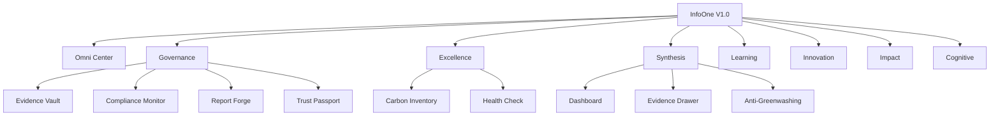

### 7.4 Liquid Glass UI 設計系統 / Liquid Glass UI Design System

InfoOne V1.0 採用 Liquid Glass（液態玻璃）設計語言，實現：

- **高保真視覺效果**：細膩的光影與透明度效果
- **流暢的動畫過渡**：基於 Framer Motion 的平滑動畫
- **沉浸式體驗**：深色/淺色模式自適應
- **響應式佈局**：完美適配各種設備尺寸

InfoOne V1.0 uses Liquid Glass design language to achieve:

- **High-Fidelity Visual Effects**: Delicate light, shadow, and transparency
  effects
- **Smooth Animation Transitions**: Smooth animations based on Framer Motion
- **Immersive Experience**: Dark/light mode adaptation
- **Responsive Layout**: Perfect adaptation to various device sizes

---

# Part III: 系統能力 / System Capabilities

## 8. 九階段運行模型 / Nine-Phase Operation Model

### 8.1 模型概述 / Model Overview

ESG GO 平台採用九階段運行模型來管理永續數據的完整生命週期：

The ESG GO platform uses a nine-phase operation model to manage the complete
lifecycle of sustainable data:

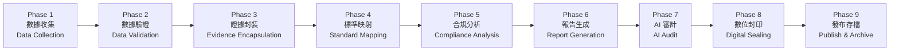

### 8.2 各階段詳細說明 / Detailed Description of Each Phase

#### Phase 1: 數據收集 / Data Collection

- **輸入**：原始數據（IoT 感測器、OCR 掃描、人工輸入）
- **處理**：數據標準化與格式轉換
- **輸出**：結構化原始數據
- **5T 維度**：Traceable - 記錄來源與採集方法

#### Phase 2: 數據驗證 / Data Validation

- **輸入**：結構化原始數據
- **處理**：完整性檢查、格式驗證、範圍檢查
- **輸出**：驗證通過/失敗的數據
- **5T 維度**：Transparent - 驗證邏輯完全透明

#### Phase 3: 證據封裝 / Evidence Encapsulation

- **輸入**：驗證通過的數據
- **處理**：創建 5T 原子、生成來源哈希
- **輸出**：5T 原子結構
- **5T 維度**：Traceable + Tangible - 可溯源且可感知

#### Phase 4: 標準映射 / Standard Mapping

- **輸入**：5T 原子結構
- **處理**：映射到 GRI/FSC97/SASB/TCFD 指標
- **輸出**：標準化指標數據
- **5T 維度**：Transparent - 映射邏輯可驗算

#### Phase 5: 合規分析 / Compliance Analysis

- **輸入**：標準化指標數據
- **處理**：合規差距分析、風險評估
- **輸出**：合規報告與建議
- **5T 維度**：Transparent - 分析邏輯透明

#### Phase 6: 報告生成 / Report Generation

- **輸入**：合規報告與原始數據
- **處理**：AI 輔助報告撰寫、格式化
- **輸出**：初稿報告
- **5T 維度**：Tangible - 高保真呈現

#### Phase 7: AI 審計 / AI Audit

- **輸入**：初稿報告
- **處理**：AI 驅動的質量檢查、零幻覺驗證
- **輸出**：審計通過/需要修改的報告
- **5T 維度**：Trustworthy - 審計記錄不可篡改

#### Phase 8: 數位封印 / Digital Sealing

- **輸入**：審計通過的報告
- **處理**：SHA-256 哈希計算、數位簽章
- **輸出**：封印的報告
- **5T 維度**：Trustworthy - 絕對不可篡改

#### Phase 9: 發布存檔 / Publish & Archive

- **輸入**：封印的報告
- **處理**：發布到目標渠道、存檔到區塊鏈
- **輸出**：已發布的報告與存檔證明
- **5T 維度**：Trackable - 完整生命週期記錄

---

## 9. 自主修復機制 / Self-Healing Mechanism

### 9.1 機制概述 / Mechanism Overview

ESG GO 平台的自主修復機制基於 Gnosis Engine 與 WuZuo
Protocol，能夠自動檢測、診斷並修復系統問題。

The autonomous repair mechanism of ESG GO platform, based on Gnosis Engine and
WuZuo Protocol, can automatically detect, diagnose, and repair system issues.

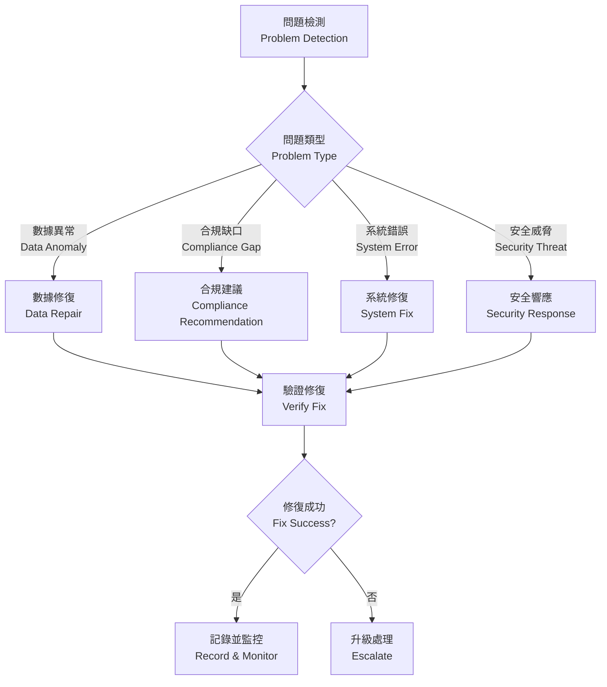

### 9.2 修復策略 / Repair Strategies

| 問題類型 / Problem Type | 檢測方法 / Detection Method | 修復策略 / Repair Strategy |
| ----------------------- | --------------------------- | -------------------------- |
| **數據異常**            | 統計分析、範圍檢查          | 標記異常、請求人工審核     |
| **合規缺口**            | Indicator Mapper 分析       | 生成補全建議、優先級排序   |
| **系統錯誤**            | 異常監控、日誌分析          | 自動重啟服務、迴退版本     |
| **安全威脅**            | 入侵檢測、行為分析          | 隔離威脅、觸發告警         |

### 9.3 智能判斷 / Intelligent Judgment

Gnosis Engine 實現了智能判斷能力：

- **完整性檢測**：每秒檢查 5T 數據完整性
- **異常模式識別**：使用機器學習識別異常模式
- **自主決策**：根據預設規則與學習結果自動做出決策
- **持續學習**：從每次修復中學習，優化未來決策

---

## 10. Evidence Vault：不可篡改證據層 / Evidence Vault: Immutable Evidence Layer

### 10.1 系統概述 / System Overview

Evidence Vault 是 ESG GO 平台的不可篡改證據庫，採用 SHA-256 哈希封印技術，為所有
ESG 數據提供可信賴的存儲與驗證服務。

Evidence Vault is the immutable evidence database of the ESG GO platform, using
SHA-256 hash sealing technology to provide trusted storage and verification
services for all ESG data.

### 10.2 核心功能 / Core Features

| 功能 / Feature                    | 描述 / Description                  |
| --------------------------------- | ----------------------------------- |
| **哈希封印 / Hash Sealing**       | 為每條記錄生成唯一的 SHA-256 哈希值 |
| **驗證查詢 / Verification Query** | 快速驗證數據是否被篡改              |
| **時間戳記 / Timestamping**       | 記錄精確的創建與修改時間            |
| **審計日誌 / Audit Log**          | 完整的操作歷史記錄                  |

### 10.3 數據結構 / Data Structure

```typescript
type VaultEntry = {
    id: string; // 唯一標識符
    type: string; // 數據類型
    hash: string; // SHA-256 哈希值
    date: string; // 日期時間
    status: "Locked" | "Verified" | "Pending Seal";
    previousHash?: string; // 前一個區塊的哈希
    metadata?: Record<string, any>;
};
```

### 10.4 工作流程 / Workflow

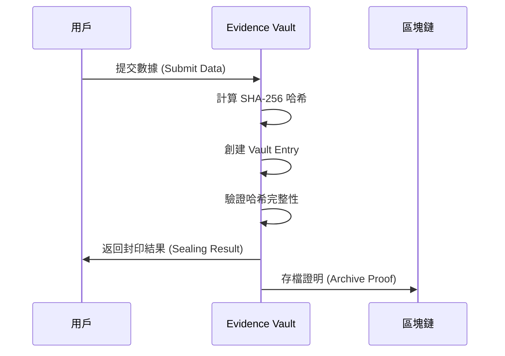

---

## 11. 多標準合規引擎 / Multi-Standard Compliance Engine

### 11.1 支援的標準 / Supported Standards

ESG GO 平台支援以下主要 ESG 報告標準：

| 標準 / Standard | 全稱 / Full Name                                    | 地區 / Region | 強制性 / Mandatory |
| --------------- | --------------------------------------------------- | ------------- | ------------------ |
| **GRI 2026**    | Global Reporting Initiative                         | 全球 / Global | 自願但廣泛採用     |
| **FSC 97**      | 金融監督管理委員會                                  | 台灣 / Taiwan | 上市公司強制       |
| **SASB**        | Sustainability Accounting Standards Board           | 美國 / US     | 自願               |
| **TCFD**        | Task Force on Climate-related Financial Disclosures | 全球 / Global | 日益普及           |

### 11.2 Indicator Mapper / 指標映射引擎

Indicator Mapper 是多標準合規引擎的核心組件，負責：

- **指標定義管理**：維護所有標準的指標庫
- **自動映射**：根據數據內容自動映射到相關指標
- **差距分析**：識別合規缺口並生成建議
- **合規評分**：計算綜合合規分數

```typescript
interface IStandardIndicator {
    code: string; // 指標代碼 (e.g., "GRI-305-1")
    name: string; // 指標名稱
    pillar: "E" | "S" | "G"; // ESG 支柱
    standard: IndicatorStandard; // 所屬標準
    unit: string; // 測量單位
    isFscMandatory: boolean; // FSC 是否強制
    crossRefs: string[]; // 跨標準引用
    formula?: string; // 計算公式
}
```

### 11.3 合規流程 / Compliance Process

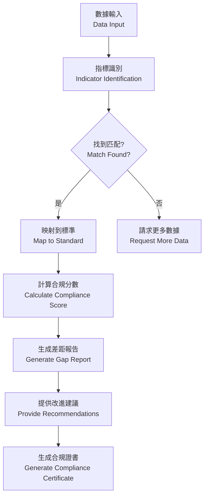

### 11.4 指標覆蓋 / Indicator Coverage

| 標準 / Standard | 環境指標 / E Indicators | 社會指標 / S Indicators | 治理指標 / G Indicators | 總計 / Total |
| --------------- | ----------------------- | ----------------------- | ----------------------- | ------------ |
| GRI 2026        | 20+                     | 20+                     | 15+                     | 55+          |
| FSC 97          | 8                       | 6                       | 6                       | 20           |
| SASB            | 15+                     | 10+                     | 8+                      | 33+          |
| TCFD            | 5                       | -                       | 3                       | 8+           |

---

# Part IV: 應用場景 / Use Cases

## 12. 企業永續治理 / Enterprise Sustainability Governance

### 12.1 應用概述 / Application Overview

ESG GO
平台為企業提供全面的永續治理解決方案，涵蓋從數據收集到報告生成的完整流程。

The ESG GO platform provides enterprises with comprehensive sustainability
governance solutions, covering the complete process from data collection to
report generation.

### 12.2 核心功能 / Core Features

| 功能 / Feature | 價值 / Value             |
| -------------- | ------------------------ |
| **碳排放管理** | 自動計算範疇一/二/三排放 |
| **能源監控**   | 即時追蹤能源消耗與效率   |
| **供應鏈管理** | 端到端供應鏈可視性       |
| **報告自動化** | AI 輔助生成合規報告      |
| **風險評估**   | 即時識別 ESG 風險        |

### 12.3 企業用例 / Enterprise Use Cases

#### 案例：製造企業的碳排放管理

**挑戰**：製造企業需要追蹤並報告範疇一（直接）、範疇二（間接能源）和範疇三（價值鏈）排放。

**解決方案**：

1. 部署 IoT 感測器收集能源數據
2. 使用 OCR 收集供應商發票
3. 自動計算碳排放並映射到 GRI-305
4. 生成符合 FSC97 要求的報告

---

## 13. 供應鏈透明化 / Supply Chain Transparency

### 13.1 / Application Overview

應用概述ESG GO 平台實現供應鏈的完全透明化，確保每個環節的 ESG
表現都可追溯、可驗證。

The ESG GO platform achieves complete supply chain transparency, ensuring that
ESG performance at each stage is traceable and verifiable.

### 13.2 核心功能 / Core Features

| 功能 / Feature | 描述 / Description      |
| -------------- | ----------------------- |
| **供應商註冊** | 標準化的供應商入網流程  |
| **ESG 評估**   | 自動化的供應商 ESG 評分 |
| **追溯查詢**   | 端到端產品溯源          |
| **預警系統**   | 供應商風險預警          |
| **協作平台**   | 與供應商共享數據        |

### 13.3 數據流 / Data Flow

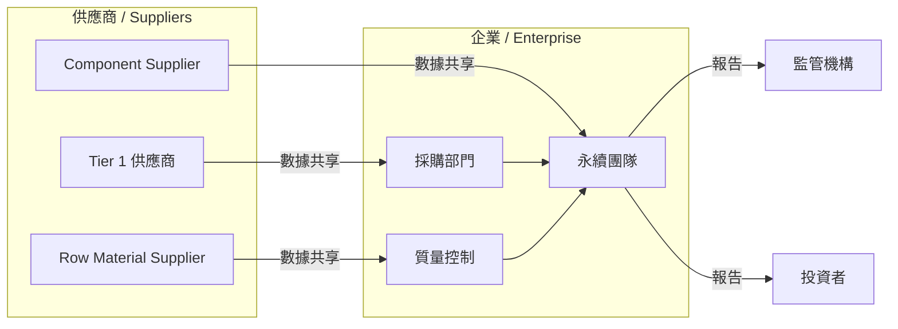

---

## 14. 政府監管應用 / Government Regulatory Applications

### 14.1 應用概述 / Application Overview

政府機構可以使用 ESG GO 平台進行：

- **合規監管**：監控企業 ESG 揭露合規情況
- **數據分析**：分析產業趨勢與風險
- **政策制定**：基於數據制定永續政策
- **公眾披露**：向公眾提供企業 ESG 資訊

Government agencies can use the ESG GO platform for:

- **Compliance Monitoring**: Monitor corporate ESG disclosure compliance
- **Data Analysis**: Analyze industry trends and risks
- **Policy Making**: Develop sustainable policies based on data
- **Public Disclosure**: Provide corporate ESG information to the public

### 14.2 核心功能 / Core Features

| 功能 / Feature   | 描述 / Description      |
| ---------------- | ----------------------- |
| **企業申報管理** | 接收並驗證企業 ESG 報告 |
| **智能審計**     | AI 輔助的合規審計       |
| **風險預警**     | 識別高風險企業          |
| **數據可視化**   | 產業級 ESG 儀表板       |
| **法規更新**     | 追蹤法規變化並通知企業  |

---

## 15. 第三方驗證機構 / Third-Party Verification Bodies

### 15.1 應用概述 / Application Overview

第三方驗證機構可以使用 ESG GO 平台：

- **數據驗證**：驗證企業提交的 ESG 數據
- **報告審計**：審計企業永續報告
- **認證服務**：提供 ESG 認證服務
- **獨立評估**：進行獨立的 ESG 評估

Third-party verification bodies can use the ESG GO platform:

- **Data Verification**: Verify corporate-submitted ESG data
- **Report Auditing**: Audit corporate sustainability reports
- **Certification Services**: Provide ESG certification services
- **Independent Assessment**: Conduct independent ESG assessments

### 15.2 驗證流程 / Verification Process

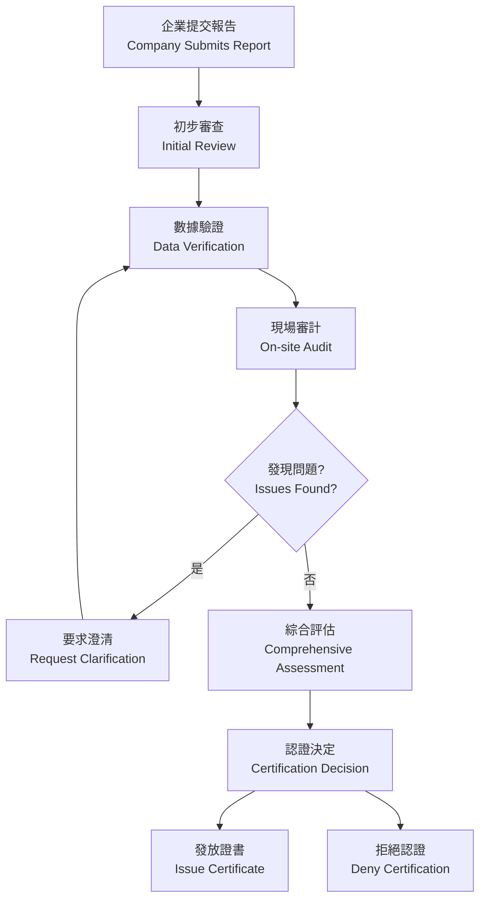

---

# Part V: 技術實現 / Technical Implementation

## 16. 系統架構設計 / System Architecture Design

### 16.1 總體架構 / Overall Architecture

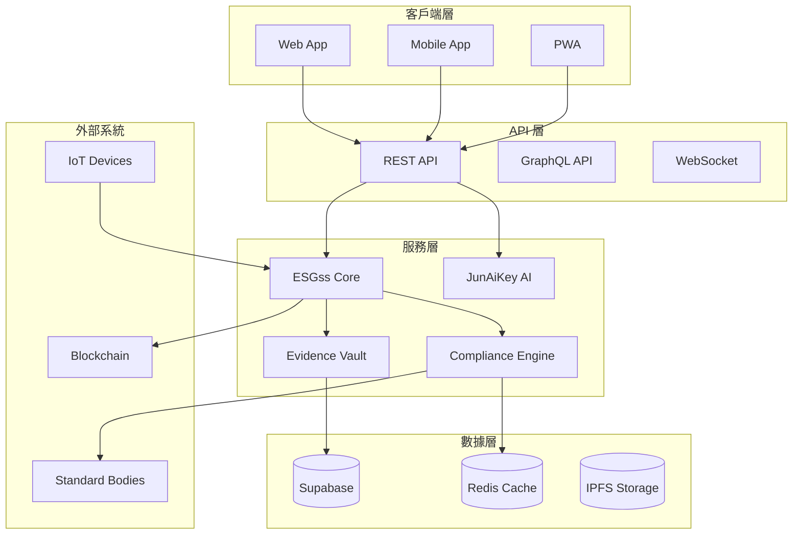

### 16.2 技術棧 / Technology Stack

| 層級 / Layer | 技術 / Technology | 版本 / Version |
| ------------ | ----------------- | -------------- |
| **前端**     | Next.js           | 14.x           |
| **語言**     | TypeScript        | 5.x            |
| **UI 框架**  | Tailwind CSS      | 3.x            |
| **動畫**     | Framer Motion     | 11.x           |
| **後端**     | Supabase          | Latest         |
| **緩存**     | Redis             | 7.x            |
| **AI**       | Google Gemini     | Latest         |
| **調試**     | Google Jules      | Latest         |

---

## 17. 安全性與隱私保護 / Security and Privacy Protection

### 17.1 安全架構 / Security Architecture

| 安全層面 / Security Aspect | 實現方式 / Implementation              |
| -------------------------- | -------------------------------------- |
| **數據加密**               | 傳輸加密 (TLS 1.3)、靜態加密 (AES-256) |
| **身份認證**               | OAuth 2.0 / JWT Token                  |
| **訪問控制**               | RBAC + ABAC 權限管理                   |
| **審計日誌**               | 完整操作記錄與追蹤                     |
| **漏洞防護**               | 定期安全掃描與更新                     |

### 17.2 數據隱私 / Data Privacy

- **數據脫敏**：敏感數據自動脫敏處理
- **隱私計算**：支持本地化數據處理
- **GDPR 合規**：符合 GDPR 數據保護要求
- **數據主權**：支持數據區域化存儲

---

## 18. API 與整合能力 / API and Integration Capabilities

### 18.1 API 架構 / API Architecture

ESG GO 提供完整的 API 接口：

- **RESTful API**：標準 REST 接口
- **GraphQL API**：靈活的數據查詢
- **WebSocket**：即時數據推送
- **Webhook**：事件驅動通知

### 18.2 核心 API 端點 / Core API Endpoints

| 端點 / Endpoint           | 方法 / Method | 描述 / Description |
| ------------------------- | ------------- | ------------------ |
| `/api/data/submit`        | POST          | 提交 ESG 數據      |
| `/api/data/verify`        | POST          | 驗證數據完整性     |
| `/api/evidence/seal`      | POST          | 封印證據           |
| `/api/evidence/verify`    | GET           | 驗證證據           |
| `/api/compliance/analyze` | POST          | 分析合規情況       |
| `/api/report/generate`    | POST          | 生成報告           |
| `/api/standards/mapping`  | POST          | 標準映射           |

### 18.3 整合選項 / Integration Options

| 整合類型 / Integration Type | 描述 / Description     |
| --------------------------- | ---------------------- |
| **SDK**                     | 多語言軟體開發工具包   |
| **Webhook**                 | 自定義事件回調         |
| **iPaaS**                   | 與主流 iPaaS 平台集成  |
| **自定義**                  | 根據需求定制的集成方案 |

---

# Part VI: 商業模式與路線圖 / Business Model and Roadmap

## 19. 市場定位與商業模式 / Market Positioning and Business Model

### 19.1 市場定位 / Market Positioning

| 定位維度 / Positioning Dimension | 描述 / Description             |
| -------------------------------- | ------------------------------ |
| **目標市場**                     | 全球企業、政府機構、驗證機構   |
| **價值主張**                     | 可信、透明、智慧的永續治理平台 |
| **競爭優勢**                     | 5T 協議、AI 驅動、區塊鏈保障   |
| **差異化**                       | 端到端解決方案、多標準支持     |

### 19.2 商業模式 / Business Model

| 收入來源 / Revenue Stream | 描述 / Description     |
| ------------------------- | ---------------------- |
| **訂閱費用**              | 按功能模組和使用量訂閱 |
| **專業服務**              | 實施、培訓、諮詢服務   |
| **認證費用**              | 平台認證服務收費       |
| **數據服務**              | 匿名化數據分析服務     |

### 19.3 定價策略 / Pricing Strategy

| 方案 / Plan | 目標客戶 / Target Customers | 功能 / Features    |
| ----------- | --------------------------- | ------------------ |
| **基礎版**  | 中小企業                    | 基礎報告、標準映射 |
| **專業版**  | 大型企業                    | 完整功能、AI 審計  |
| **企業版**  | 跨國企業                    | 定製開發、專屬支持 |
| **政府版**  | 政府機構                    | 監管功能、數據分析 |

---

## 20. 產品路線圖與願景 / Product Roadmap and Vision

### 20.1 發展階段 / Development Phases

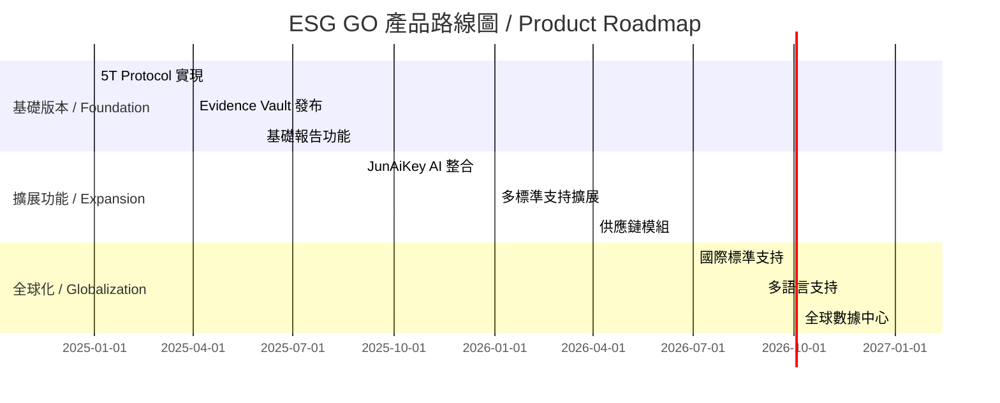

### 20.2 長期願景 / Long-Term Vision

| 時間範圍 / Timeframe | 願景 / Vision                          |
| -------------------- | -------------------------------------- |
| **1-2 年**           | 成為亞太地區領先的 ESG 治理平台        |
| **3-5 年**           | 覆蓋全球主要市場，成為行業標準         |
| **5-10 年**          | 構建永續數據生態系統，推動全球永續發展 |

### 20.3 戰略目標 / Strategic Goals

1. **技術領先**：保持 5T 協議與 AI 技術的行業領先地位
2. **生態擴展**：建立廣泛的合作夥伴網絡
3. **客戶成功**：幫助客戶實現永續發展目標
4. **社會影響**：為全球永續發展做出貢獻

---

# 結論 / Conclusion

ESG GO 代表了永續治理的未來方向。通過融合 5T
協議、人工智慧與區塊鏈技術，我們為企業、政府和驗證機構提供了一個可信、透明且高效的永續發展解決方案。

ESG GO represents the future direction of sustainable governance. By integrating
5T Protocol, artificial intelligence, and blockchain technology, we provide
enterprises, governments, and verification agencies with a trustworthy,
transparent, and efficient sustainable development solution.

我們邀請所有利益相關者與我們一起，共同推動全球永續發展事業的進步。

We invite all stakeholders to join us in advancing the cause of global
sustainable development.

---

**聯繫方式 / Contact Information**\
**網站 / Website**: esggo.example.com\
**郵箱 / Email**: info@esggo.example.com

---

_本白皮書最終解釋權歸 ESG GO 所有 / This white paper is subject to final
interpretation by ESG GO_
