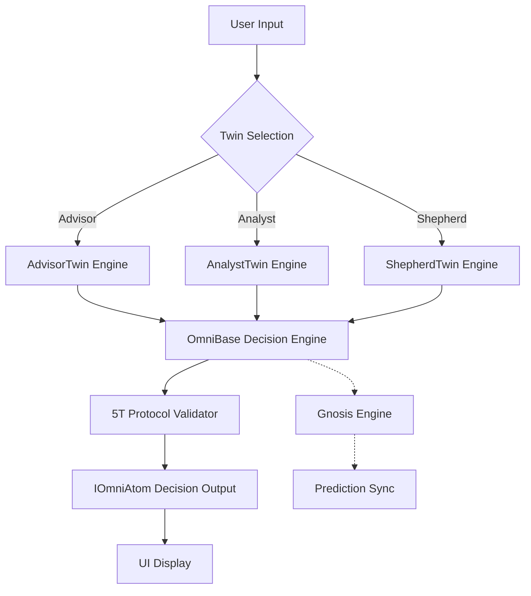
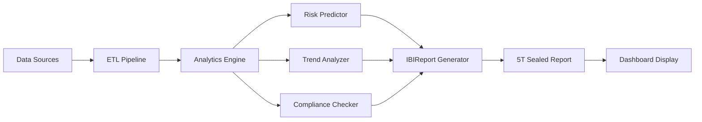
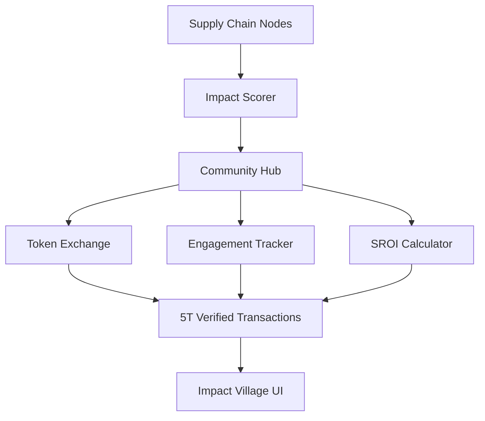
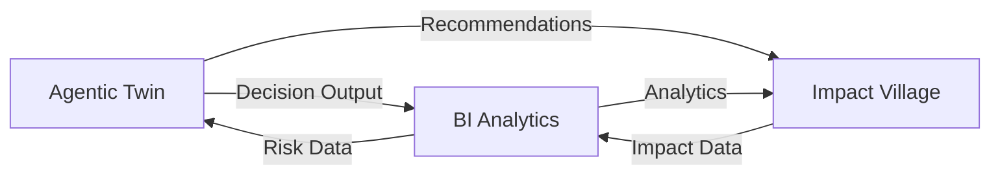

# 🗺️ Implementation Roadmap: New Omni Modules (Commit 161b760)

**Generated:** 2026-02-27\
**Status:** PLANNED\
**Modules:** Agentic Twin | BI Analytics | Impact Village

---

## 📋 Executive Summary

This roadmap details the implementation plan for three new Omni modules added in
commit 161b760:

| Module         | UUID                    | Route                  | Domain | Priority |
| -------------- | ----------------------- | ---------------------- | ------ | -------- |
| Agentic Twin   | `mod-adv-twin-0001`     | `/omni/agentic-twin`   | Adv    | P1       |
| BI Analytics   | `mod-adv-bi-0001`       | `/omni/bi-analytics`   | Adv    | P1       |
| Impact Village | `mod-comm-village-0001` | `/omni/impact-village` | Comm   | P2       |

---

## 🏗️ Phase 1: Foundation & Shared Infrastructure

### 1.1 Module Registry Updates

**Task:** Ensure all three modules are registered in
[`src/config/omni-modules.ts`](src/config/omni-modules.ts:69)

```typescript
// Already present in codebase:
AGENTIC_TWIN: {
    domain: 'Adv',
    name: 'Agentic Twin (AI)',
    uuid: 'mod-adv-twin-0001',
    route: '/omni/agentic-twin',
    description: 'AI 雙棲決策輔助引擎',
    status: 'PLANNED'
},
BI_ANALYTICS: {
    domain: 'Adv',
    name: 'BI & Analytics',
    uuid: 'mod-adv-bi-0001',
    route: '/omni/bi-analytics',
    description: '高階商業智慧與風險預測',
    status: 'PLANNED'
},
IMPACT_VILLAGE: {
    domain: 'Comm',
    name: 'Impact Village',
    uuid: 'mod-comm-village-0001',
    route: '/omni/impact-village',
    description: '供應鏈與社區影響力互動聚落',
    status: 'PLANNED'
}
```

### 1.2 Shared Type Definitions

**Note:** Many type definitions already exist in [`src/core/omni-types.ts`](src/core/omni-types.ts). Use existing types where applicable:

- [`IAgenticTwin`](src/core/omni-types.ts) - Already defined
- [`ITwinDecision`](src/core/omni-types.ts) - Already defined
- [`ITwinScenario`](src/core/omni-types.ts) - Already defined

For BI Analytics and Impact Village, extend existing types from the Village and Report Forge systems:

```typescript
// Import from existing locations:
import { IForgeIndicator } from '@/core/omni-types';
import { IGnosisPrediction } from '@/lib/gnosis-engine';
import { IVillageStats, IImpactCard } from '@/types/village';
```

---

## 🤖 Module 1: Agentic Twin (mod-adv-twin-0001)

### Technical Architecture



### Core Components

| Component          | File Location                                                                | Purpose                     |
| ------------------ | ---------------------------------------------------------------------------- | --------------------------- |
| Twin Engine        | [`src/core/omni-agentic-twin.ts`](src/core/omni-agentic-twin.ts)             | Main twin processing logic  |
| Decision Validator | [`src/core/omni-decision-validator.ts`](src/core/omni-decision-validator.ts) | 5T compliance validation    |
| Persona Manager    | [`src/core/omni-persona-manager.ts`](src/core/omni-persona-manager.ts)       | Twin personality management |

### Data Flow

1. **Input Processing:** User decision query → Twin Engine
2. **Reasoning:** Query analyzed against [`OmniBase`](src/core/OmniBase.ts)
   knowledge base
3. **Validation:** 5T Protocol verification via
   [`IProtocol5T`](src/core/omni-types.ts:429)
4. **Output:** Decision recommendation with confidence score
5. **Tracking:** Decision logged to lifecycle events

### API Endpoints

| Endpoint                     | Method | Auth  | Rate Limit    | Purpose                         |
| ---------------------------- | ------ | ----- | ------------- | ------------------------------- |
| `/api/agentic-twin/query`    | POST   | ✅    | 30/min       | Submit decision query           |
| `/api/agentic-twin/twins`    | GET    | ✅    | 60/min       | List available twins            |
| `/api/agentic-twin/history`  | GET    | ✅    | 60/min       | Retrieve past decisions         |
| `/api/agentic-twin/validate` | POST   | ✅    | 30/min       | Validate decision 5T compliance |

### UI Components

- [`src/app/omni/agentic-twin/page.tsx`](src/app/omni/agentic-twin/page.tsx) -
  Main page
- [`src/components/agentic-twin/TwinCard.tsx`](src/components/agentic-twin/TwinCard.tsx) -
  Twin selector card
- [`src/components/agentic-twin/DecisionPanel.tsx`](src/components/agentic-twin/DecisionPanel.tsx) -
  Decision display
- [`src/components/agentic-twin/TwinChat.tsx`](src/components/agentic-twin/TwinChat.tsx) -
  Chat interface

### Implementation Tasks

- [x] Create twin engine core class (via AgenticTwinService)
- [ ] Create decision validator component (omni-decision-validator.ts)
- [ ] Create persona manager component (omni-persona-manager.ts)
- [ ] Implement decision chain reasoning
- [ ] Build persona-specific response patterns
- [ ] Integrate with Gnosis Engine for predictions
- [ ] Create UI with LiquidGlass containers
- [ ] Add Framer Motion animations for twin interactions
- [ ] Implement 5T Protocol validation for all decisions

---

## 📊 Module 2: BI Analytics (mod-adv-bi-0001)

### Technical Architecture



### Core Components

| Component        | File Location                                                            | Purpose                   |
| ---------------- | ------------------------------------------------------------------------ | ------------------------- |
| Analytics Engine | [`src/core/omni-analytics-engine.ts`](src/core/omni-analytics-engine.ts) | Core analytics processing |
| Risk Predictor   | [`src/core/omni-risk-predictor.ts`](src/core/omni-risk-predictor.ts)     | ML-based risk forecasting |
| Report Generator | [`src/core/omni-report-generator.ts`](src/core/omni-report-generator.ts) | BI report creation        |

### Integration with Existing Systems

- **Gnosis Engine:** Extend
  [`src/lib/gnosis-engine.ts`](src/lib/gnosis-engine.ts) for ESG-specific
  predictions
- **Indicator Mapper:** Leverage
  [`src/core/IndicatorMapper.ts`](src/core/IndicatorMapper.ts) for metric
  mapping
- **Evidence Vault:** Use [`IReportForgeResult`](src/core/omni-types.ts:379)
  pattern for report storage

### API Endpoints

| Endpoint                      | Method | Auth  | Rate Limit    | Purpose                           |
| ----------------------------- | ------ | ----- | ------------- | --------------------------------- |
| `/api/bi-analytics/dashboard` | GET    | ✅    | 60/min       | Retrieve analytics dashboard data |
| `/api/bi-analytics/report`    | POST   | ✅    | 20/min       | Generate new BI report            |
| `/api/bi-analytics/risk`      | GET    | ✅    | 60/min       | Get risk assessments              |
| `/api/bi-analytics/trends`    | GET    | ✅    | 60/min       | Get trend analysis                |
| `/api/bi-analytics/predict`   | POST   | ✅    | 10/min       | Trigger prediction model          |

### UI Components

- [`src/app/omni/bi-analytics/page.tsx`](src/app/omni/bi-analytics/page.tsx) -
  Main analytics dashboard
- [`src/components/bi-analytics/MetricsGrid.tsx`](src/components/bi-analytics/MetricsGrid.tsx) -
  KPI display
- [`src/components/bi-analytics/RiskHeatmap.tsx`](src/components/bi-analytics/RiskHeatmap.tsx) -
  Risk visualization
- [`src/components/bi-analytics/TrendChart.tsx`](src/components/bi-analytics/TrendChart.tsx) -
  Trend graphs

### Key Metrics to Track

- ESG Performance Scores
- Carbon Footprint Trends
- Compliance Status
- Risk Probability Matrix
- Stakeholder Engagement

---

## 🌐 Module 3: Impact Village (mod-comm-village-0001)

### Technical Architecture



### Core Components

| Component            | File Location                                                              | Purpose               |
| -------------------- | -------------------------------------------------------------------------- | --------------------- |
| Supply Chain Manager | [`src/core/omni-supply-chain.ts`](src/core/omni-supply-chain.ts)           | Supply chain tracking |
| Impact Calculator    | [`src/core/omni-impact-calculator.ts`](src/core/omni-impact-calculator.ts) | SROI calculations     |
| Community Hub        | [`src/core/omni-community-hub.ts`](src/core/omni-community-hub.ts)         | Community engagement  |

### Integration Points

- **Village Types:** Extend existing [`IVillageStats`](src/types/village.ts:34),
  [`IImpactCard`](src/types/village.ts:76)
- **Token System:** Use existing token transaction patterns
- **Card System:** Integrate with existing card rarity system

### API Endpoints

| Endpoint                     | Method | Auth  | Rate Limit    | Purpose               |
| ---------------------------- | ------ | ----- | ------------- | --------------------- |
| `/api/impact-village/nodes`  | GET    | ✅    | 60/min       | List community nodes  |
| `/api/impact-village/chain`  | GET    | ✅    | 60/min       | Get supply chain data |
| `/api/impact-village/engage` | POST   | ✅    | 30/min       | Record engagement     |
| `/api/impact-village/score`  | GET    | ✅    | 60/min       | Get impact scores     |
| `/api/impact-village/sroi`   | GET    | ✅    | 30/min       | Calculate SROI        |

### UI Components

- [`src/app/omni/impact-village/page.tsx`](src/app/omni/impact-village/page.tsx) -
  Main village view
- [`src/components/impact-village/SupplyChainMap.tsx`](src/components/impact-village/SupplyChainMap.tsx) -
  Chain visualization
- [`src/components/impact-village/CommunityCard.tsx`](src/components/impact-village/CommunityCard.tsx) -
  Node display
- [`src/components/impact-village/ImpactScoreGauge.tsx`](src/components/impact-village/ImpactScoreGauge.tsx) -
  Score display

### Features

1. **Supply Chain Mapping:** Visualize supplier relationships with
   sustainability ratings
2. **Community Impact:** Track stakeholder engagement and SROI
3. **Token Integration:** Connect with existing token system
4. **Card Integration:** Leverage Impact Cards from existing village system

---

## 🔗 Integration Points Summary

### Cross-Module Data Sharing



### Shared Dependencies

| Module         | Depends On                    | Provides To             |
| -------------- | ----------------------------- | ----------------------- |
| Agentic Twin   | OmniBase, GnosisEngine        | Decisions → BI, Village |
| BI Analytics   | IndicatorMapper, GnosisEngine | Reports → Twin, Village |
| Impact Village | Village Types, Token System   | Scores → Twin, BI       |

---

## 📅 Implementation Phases

### Phase 1: Foundation (Shared)

- [x] Update module registry to DEVELOPMENT status (Agentic Twin now in DEVELOPMENT)
- [x] Verify existing type definitions in omni-types.ts
- [ ] Set up API route structure with auth middleware
- [ ] Implement base LiquidGlass container

### Phase 2: Agentic Twin (Weeks 1-3)

- [x] Build twin engine core (AgenticTwinService exists)
- [ ] Implement decision validation
- [ ] Create UI components
- [ ] Add Framer Motion animations
- [ ] Implement 5T Protocol validation

### Phase 3: BI Analytics (Weeks 2-4)

- [ ] Create analytics engine core (omni-analytics-engine.ts)
- [ ] Create risk predictor (omni-risk-predictor.ts)
- [ ] Create report generator (omni-report-generator.ts)
- [ ] Build analytics dashboard UI
- [ ] Implement Gnosis Engine integration
- [ ] Add 5T sealed reports

### Phase 4: Impact Village (Weeks 3-5)

- [ ] Create supply chain manager (omni-supply-chain.ts)
- [ ] Create impact calculator (omni-impact-calculator.ts)
- [ ] Create community hub (omni-community-hub.ts)
- [ ] Build community hub UI
- [ ] Integrate with existing village system
- [ ] Implement SROI calculations

### Phase 5: Integration & Testing (Weeks 4-6)

- [ ] Cross-module data flow
- [ ] End-to-end 5T protocol testing
- [ ] Performance optimization
- [ ] Documentation

---

## ⚠️ Risks & Mitigation

| Risk                | Impact | Mitigation                               |
| ------------------- | ------ | ---------------------------------------- |
| AI Model Complexity | High   | Start with rule-based twins, then add ML |
| Data Integration    | Medium | Use existing OmniOne patterns            |
| Performance         | Medium | Implement caching via Redis              |
| 5T Compliance       | High   | Use OmniBase validation helpers          |
| API Security        | High   | Add auth & rate limiting to all endpoints|

---

## 📦 Deliverables Checklist

### For Each Module:

- [ ] Core engine class
- [ ] Type definitions
- [ ] API endpoints (4+)
- [ ] UI page component
- [ ] UI sub-components (3+)
- [ ] Unit tests
- [ ] Integration tests
- [ ] Documentation

---

## 🎯 Success Criteria

1. All modules implement 5T Protocol (Traceable, Trackable, Transparent,
   Tangible, Trustworthy)
2. UI follows Liquid Glass design pattern with Framer Motion
3. Modules can exchange data via OmniAtom format
4. All routes accessible from Omni Hub navigation
5. API responses include 5T verification metadata

---

## 🔐 Security Requirements

All API endpoints must implement:

1. **Authentication**: All endpoints require valid JWT token
2. **Rate Limiting**: Per-endpoint limits specified in API tables
3. **Input Validation**: Sanitize all user inputs to prevent injection
4. **Audit Logging**: Log all API calls for compliance
5. **5T Verification**: All outputs must include 5T metadata

### Example API Handler Structure

```typescript
// api/agentic-twin/query/route.ts
import { withAuth } from '@/lib/auth-client';
import { limiters } from '@/core/rate-limiter';

export async function POST(request: Request) {
  // 1. Rate limiting check
  const ip = request.headers.get('x-forwarded-for') || 'unknown';
  const { success } = await limiters.aiSymphony(ip);
  if (!success) return new Response('Rate limit exceeded', { status: 429 });

  // 2. Authentication (via middleware)
  // 3. Input validation
  // 4. Business logic
  // 5. 5T verification
  // 6. Response with 5T metadata
}
```

---

**Next Step:** Review this plan and approve to begin Phase 1 implementation.
