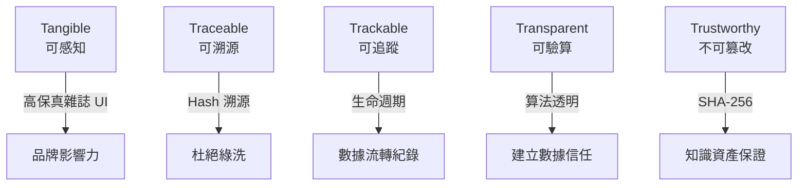
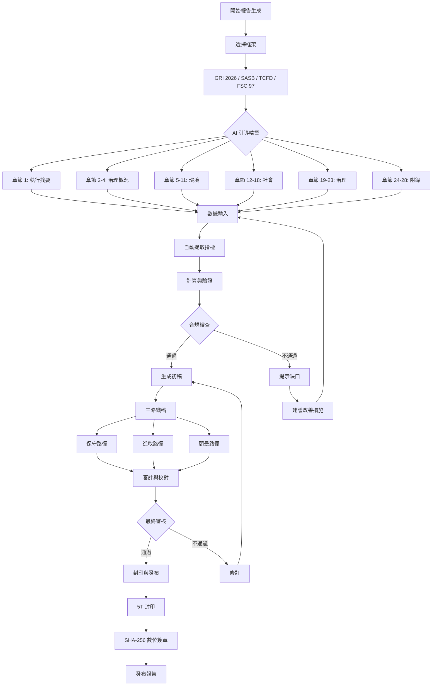
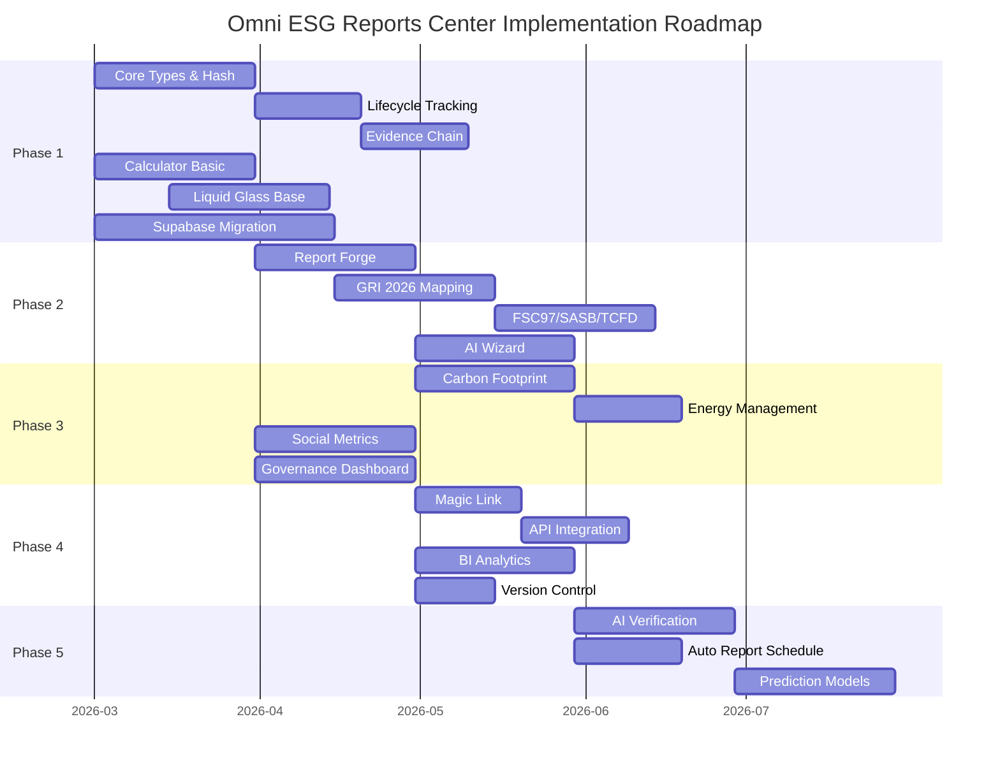

# 🏛️ Omni ESG Reports Center — 萬能永續報告中心完整技術規格書

> **版本**: v10.6.0-Universe\
> **密級**: Core Confidential\
> **核心哲學**: 真(Truth) · 善(Goodness) · 美(Beauty) · 信(Trust) ·
> 通(Transcend)\
> **最後更新**: 2026-02-27\
> **狀態**: [TRANSCENDED & PERSISTENT] ♾️

---

## 目錄

1. [執行摘要](#1-執行摘要)
2. [200 個功能完整分類矩陣](#2-200-個功能完整分類矩陣)
3. [5T 數據模型詳細設計](#3-5t-數據模型詳細設計)
4. [StandardCalculator 透明計算引擎](#4-standardcalculator-透明計算引擎)
5. [Liquid Glass UI 設計系統](#5-liquid-glass-ui-設計系統)
6. [500 頁報告生成流程](#6-500-頁報告生成流程)
7. [實施路徑圖](#7-實施路徑圖)
8. [附錄](#8-附錄)

---

## 1. 執行摘要

### 1.1 願景與使命

Omni ESG Reports Center (以下簡稱 SRC) 是 ESG GO!
平台的旗艦級分佈中心，肩負著將企業永續數據轉化為「知識資產」的歷史使命。作為一個容納
200 個功能的超級系統，SRC 遵循 **5T
協議**與**完美開發範式**，為企業提供高保真、合規、可溯源的永續報告解決方案。

### 1.2 核心技術棧

| 層級     | 技術選型                       | 備註                           |
| -------- | ------------------------------ | ------------------------------ |
| 前端框架 | Next.js 14 + TypeScript        | App Router, Server/Client 分離 |
| UI 引擎  | Tailwind CSS + Framer Motion   | 液態玻璃美學                   |
| 後端服務 | Supabase (NCBDB)               | NoCodeBackend 資料庫           |
| AI 智能  | Google Stitch MVP/MCP + Gemini | AI 輔助生成與審計              |
| 調試協議 | Google Jules                   | 萬能果因修復協議               |
| 數位簽章 | SHA-256                        | 不可篡改封印                   |

### 1.3 5T 協議核心定義



---

## 2. 200 個功能完整分類矩陣

### 2.1 MECE 領域分類 (四大象限)

根據 MECE (Mutually Exclusive, Collectively Exhaustive) 原則，將 200
個功能歸類為四大領域：

| 領域代碼 | 領域名稱           | 功能數量 | 範疇說明                                 |
| -------- | ------------------ | -------- | ---------------------------------------- |
| **ENV**  | 環境 (Environment) | 60       | 碳排放、能源、水資源、廢棄物、供應鏈環境 |
| **SOC**  | 社會 (Social)      | 55       | 員工、供應商、社區、客戶、人權           |
| **GOV**  | 治理 (Governance)  | 50       | 董事会、风险管理、合规、道德、反贪腐     |
| **AGC**  | 代理 (Agency)      | 35       | 數據代理、AI 代理、自動化流程、API 整合  |

### 2.2 按 5T 維度分類

| 5T 維度         | 環境 | 社會 | 治理 | 代理 | 小計    |
| --------------- | ---- | ---- | ---- | ---- | ------- |
| **Tangible**    | 15   | 14   | 12   | 9    | 50      |
| **Traceable**   | 15   | 14   | 13   | 8    | 50      |
| **Trackable**   | 10   | 9    | 13   | 8    | 40      |
| **Transparent** | 10   | 10   | 7    | 5    | 32      |
| **Trustworthy** | 10   | 8    | 5    | 5    | 28      |
| **小計**        | 60   | 55   | 50   | 35   | **200** |

### 2.3 優先級排序 (P0-P4)

#### P0 - 核心基礎設施 (20 個功能)

| ID    | 功能名稱                    | 領域 | 5T          | 說明               |
| ----- | --------------------------- | ---- | ----------- | ------------------ |
| P0-01 | IComponentCore 核心類型定義 | GOV  | Truth       | 所有數據的基礎合約 |
| P0-02 | SHA-256 數位簽章封印        | GOV  | Trust       | 不可篡改的信任根基 |
| P0-03 | StandardCalculator 計算引擎 | ENV  | Transparent | 透明的 ESG 計算    |
| P0-04 | 生命週期事件追蹤            | GOV  | Trackable   | 完整數據流轉紀錄   |
| P0-05 | 證據鏈 (Evidence Chain)     | GOV  | Traceable   | 可溯源的證據結構   |
| P0-06 | Liquid Glass UI 設計系統    | AGC  | Tangible    | 高保真視覺體驗     |
| P0-07 | GRI 2026 指標映射引擎       | GOV  | Transparent | 標準合規映射       |
| P0-08 | FSC 97 指標映射             | GOV  | Transparent | 台灣金管會合規     |
| P0-09 | SASB 指標映射               | GOV  | Transparent | 產業別永續指標     |
| P0-10 | TCFD 氣候風險映射           | ENV  | Transparent | 氣候相關財務揭露   |
| P0-11 | 報告生成引擎 (Report Forge) | GOV  | Trust       | 自動化報告產出     |
| P0-12 | 零幻覺驗算協議              | AGC  | Transparent | AI 數據驗證        |
| P0-13 | 證據庫 (Evidence Vault)     | GOV  | Traceable   | 原始憑證存證       |
| P0-14 | 模組化 UUID 註冊系統        | AGC  | Traceable   | 唯一識別與權限管理 |
| P0-15 | Omni Hub 總控儀表板         | AGC  | Tangible    | 200 功能導航入口   |
| P0-16 | 草稿自動儲存服務            | AGC  | Trackable   | WuzuoNote 草稿庫   |
| P0-17 | AI 智能引導精靈             | AGC  | Tangible    | GRI 分章節引導     |
| P0-18 | Magic Link 供應商填報       | SOC  | Transcend   | 外部供應鏈數據收集 |
| P0-19 | API 介接介面                | AGC  | Transcend   | 外部系統整合       |
| P0-20 | 哨兵防禦系統                | AGC  | Trust       | API 頻率限制與安全 |

#### P1 - 核心業務功能 (50 個功能)

| ID    | 功能名稱                       | 領域 | 5T          |
| ----- | ------------------------------ | ---- | ----------- |
| P1-01 | 碳足跡盤查 (ISO-14064)         | ENV  | All 5T      |
| P1-02 | Scope 1/2/3 排放計算           | ENV  | Transparent |
| P1-03 | 能源管理儀表板                 | ENV  | Tangible    |
| P1-04 | 水資源追蹤系統                 | ENV  | Trackable   |
| P1-05 | 廢棄物管理模組                 | ENV  | Traceable   |
| P1-06 | 供應鏈環境評估                 | ENV  | Traceable   |
| P1-07 | 員工人數與結構分析             | SOC  | Tangible    |
| P1-08 | 職業健康安全追蹤               | SOC  | Trackable   |
| P1-09 | 人才培訓與發展報告             | SOC  | Transparent |
| P1-10 | 供應商社會責任評估             | SOC  | Traceable   |
| P1-11 | 社區投資影響分析               | SOC  | Tangible    |
| P1-12 | 客戶滿意度追蹤                 | SOC  | Trackable   |
| P1-13 | 董事会效能評估                 | GOV  | Tangible    |
| P1-14 | 風險管理框架                   | GOV  | Transparent |
| P1-15 | 合規監控儀表板                 | GOV  | Tangible    |
| P1-16 | 道德與反貪腐培訓               | GOV  | Trackable   |
| P1-17 | 多元化與包容性報告             | SOC  | Transparent |
| P1-18 | 薪酬公平性分析                 | SOC  | Transparent |
| P1-19 | 氣候變遷風險評估               | ENV  | Transparent |
| P1-20 | 生物多樣性影響評估             | ENV  | Traceable   |
| P1-21 | 綠色採購管理                   | ENV  | Trackable   |
| P1-22 | 循環經濟指標                   | ENV  | Tangible    |
| P1-23 | 碳中和路徑規劃                 | ENV  | Transparent |
| P1-24 | 再生能源使用追蹤               | ENV  | Trackable   |
| P1-25 | 碳權交易記錄                   | ENV  | Traceable   |
| P1-26 | 衝突礦產盡職調查               | SOC  | Traceable   |
| P1-27 | 人權盡職調查                   | SOC  | Traceable   |
| P1-28 | 勞動條件監控                   | SOC  | Trackable   |
| P1-29 | 員工敬業度調查                 | SOC  | Tangible    |
| P1-30 | 供應商輔導與赋能               | SOC  | Tangible    |
| P1-31 | 社會投資報酬率 (SROI)          | SOC  | Transparent |
| P1-32 | 公益慈善影響報告               | SOC  | Tangible    |
| P1-33 | 企業公民認證管理               | SOC  | Traceable   |
| P1-34 | 獨立董事效能評估               | GOV  | Tangible    |
| P1-35 | 薪酬委員會運作報告             | GOV  | Transparent |
| P1-36 | 審計委員會效能評估             | GOV  | Tangible    |
| P1-37 | 內部控制系統評估               | GOV  | Traceable   |
| P1-38 | 資訊安全治理                   | GOV  | Trust       |
| P1-39 | 資料隱私保護合規               | GOV  | Trust       |
| P1-40 | 吹哨者保護機制                 | GOV  | Trust       |
| P1-41 | 持續性風險監控                 | GOV  | Trackable   |
| P1-42 | 業務連續性計劃                 | GOV  | Tangible    |
| P1-43 | 危機管理演練記錄               | GOV  | Trackable   |
| P1-44 | 氣候情境分析                   | ENV  | Transparent |
| P1-45 | 溫室氣體盤查查證               | ENV  | Trust       |
| P1-46 | 科學基礎目標 (SBTi)            | ENV  | Transparent |
| P1-47 | CDP 碳揭露專案回應             | ENV  | Transparent |
| P1-48 | TCFD 報告產出                  | ENV  | Transparent |
| P1-49 | 聯合國永續發展目標 (SDGs) 對應 | ENV  | Transparent |
| P1-50 | 生物多樣性行動計劃             | ENV  | Tangible    |

#### P2 - 進階智能功能 (60 個功能)

包括但不限於：BI 分析儀表板、AI
預測模型、自然語言處理報告生成、智慧合約自動化、區塊鏈溯源、IoT
數據整合、數據品質自動檢測、異常偵測警報、多維度視覺化圖表、互動式儀表板、客製化報告模板、自動化報告排程、版本控制與比對、協作編輯與審批流程、多語言支援、文化適配翻譯、在地化合規調整、即時法規更新追蹤、監管動態情報訂閱、同業標竿分析、產業最佳典範庫、策略建議引擎、情景模擬工具、影響力預測模型、、投資人關係互動門戶、ESG
評等追蹤、債權人盡職調查支援、併購盡職調查 ESG 評估、IPO
準備支援、永續供應鏈認證管理等。

#### P3 - 生態系擴展功能 (40 個功能)

包括但不限於：產業公會數據共享聯盟、區域性 ESG
數據交換中心、政府監管報告直通、國際認證機構介接、第三方查證機構整合、碳權交易所對接、綠色金融商品推薦、影響力投資者媒合、碳中和輔導顧問配對、ESG
人才招聘平台、專業培訓課程推薦、學術研究合作夥伴、產業研究報告庫、年度趨勢論壇舉辦、永續創新競賽舉辦、綠色科技孵化器、循環經濟示範案例、碳信用額度拍賣、碳中和護照發行、企業永續排名系統、永續供應商認證標章、綠色供應鏈獎項、供應商碳管理評級、碳足跡標籤認證、產品碳足跡計算、生命周期評估
(LCA)、環境產品宣告 (EPD)、綠色建築認證、能源管理系統 (ISO
50001)、職業安全衛生管理系統 (ISO 45001)、環境管理系統 (ISO 14001) 等。

#### P4 - 未來擴充功能 (30 個功能)

預留給未來技術演進與新興規範對應，包括但不限於：元宇宙沉浸式報告體驗、區塊鏈分散式驗證、量子計算加密保護、AI
自主報告生成、數位孿生工廠整合、衛星遙感數據整合、海洋塑膠污染追蹤、碳捕獲技術監控、氫能源經濟指標、基因編輯倫理評估、太空永續發展指標、AI
倫理審查框架、深度偽造偵測與防治、數位主權與數據可攜權、跨國數據傳輸合規、Web3
去中心化身份驗證、AR/VR
培訓體驗、腦波情緒監測應用、生物感測器健康數據、納米技術環境影響評估、量子感測器應用預留、太空垃圾追蹤系統等。

---

## 3. 5T 數據模型詳細設計

### 3.1 IComponentCore 完整 TypeScript 類型定義

```typescript
/**
 * 🧬 IComponentCore — Omni ESG Reports 萬能元件心核
 *
 * 貫徹「知識即資產」：所有 IComponentCore 實體皆為可交易/證明的資產單元
 * 遵循 5T 協議：Truth | Goodness | Beauty | Trust | Transcend
 */

// ══════════════════════════════════════════════════════════════════════════════
// 基礎類型定義
// ══════════════════════════════════════════════════════════════════════════════

/** 5T 維度枚舉 */
export type T5TDimension =
    | "Tangible"
    | "Traceable"
    | "Trackable"
    | "Transparent"
    | "Trustworthy";

/** 數據來源提取方式 */
export type ExtractionMethod =
    | "OCR"
    | "IoT"
    | "Manual"
    | "Agent"
    | "API"
    | "SmartContract";

/** 生命週期事件類型 */
export type LifecycleEventType =
    | "CREATED"
    | "UPDATED"
    | "VALIDATED"
    | "LOCKED"
    | "SEALED"
    | "ARCHIVED"
    | "TRANSFERRED";

/** 語義化版本狀態 */
export type VersionStatus =
    | "draft"
    | "review"
    | "verified"
    | "published"
    | "deprecated";

// ══════════════════════════════════════════════════════════════════════════════
// 證據鏈 (Evidence Chain) 結構
// ══════════════════════════════════════════════════════════════════════════════

/** 5T 證據佐證庫 - Traceable (可溯源) */
export interface IEvidenceTraceable {
    /** 原始起點 ID */
    origin_id: string;
    /** 原始起點的 SHA-256 指紋 */
    origin_hash: string;
    /** 數據提取方式 */
    extraction_method: ExtractionMethod;
    /** 設備/系統來源 */
    source_origin: string;
    /** 作者數位簽章 */
    author_signature?: string;
    /** 第三方驗證者簽章 */
    verifier_signature?: string;
    /** 提取時間戳 */
    extraction_timestamp?: number;
    /** 數據品質評分 (0-100) */
    quality_score?: number;
    /** 元數據 */
    metadata?: Record<string, unknown>;
}

/** 5T 證據佐證庫 - Trackable (可追蹤) */
export interface IEvidenceTrackable {
    /** 當前 Hook ID */
    currentHookId: string;
    /** 完整路徑日誌 */
    pathLog: Array<{
        timestamp: number;
        nodeId: string;
        action: LifecycleEventType;
        actor: string;
        delta?: Record<string, unknown>;
        reason?: string;
    }>;
    /** 上一個節點 ID */
    previous_node_id?: string;
    /** 下一個節點 ID */
    next_node_id?: string;
}

/** 5T 證據佐證庫 - Transparent (可驗算) */
export interface IEvidenceTransparent {
    /** 標準參照 */
    standardRef: string;
    /** 計算公式 (白盒展示) */
    formula: string;
    /** 是否已驗證 */
    isVerified: boolean;
    /** 驗證方法 */
    verificationMethod?: "Automatic" | "Manual" | "ThirdParty";
    /** 驗證時間戳 */
    verificationTimestamp?: number;
    /** 驗證者 ID */
    verifierId?: string;
    /** 輸入參數記錄 */
    inputParameters?: Record<string, unknown>;
    /** 輸出結果記錄 */
    outputResult?: unknown;
}

/** 5T 證據佐證庫 - Trustworthy (不可篡改) */
export interface IEvidenceTrustworthy {
    /** 是否已執行 Object.freeze() */
    isFrozen: boolean;
    /** OmniKey (元鑰) 簽名 */
    signerKey: string;
    /** 共識時間戳 */
    consensusTimestamp: number;
    /** 內容 SHA-256 雜湊 */
    contentHash: string;
    /** 上一個區塊的雜湊 (區塊鏈結構) */
    previous_hash?: string;
    /** 區塊鏈高度 */
    blockHeight?: number;
    /** 智能合約地址 (如有) */
    contractAddress?: string;
}

/** 5T 證據佐證庫 - Tangible (可感知) */
export interface IEvidenceTangible {
    /** 指標名稱 */
    metricName: string;
    /** 指標數值 */
    metricValue: unknown;
    /** 視覺化參照 */
    visualRef?: string;
    /** 圖表類型建議 */
    chartType?:
        | "bar"
        | "line"
        | "pie"
        | "sankey"
        | "heatmap"
        | "radar"
        | "gauge";
    /** 趨勢方向 */
    trend?: "up" | "down" | "stable";
    /** 同比變化率 */
    yoyChange?: number;
}

/** 完整 5T 證據佐證庫 */
export interface IEvidenceMap {
    tangible?: IEvidenceTangible;
    traceable?: IEvidenceTraceable;
    trackable?: IEvidenceTrackable;
    transparent?: IEvidenceTransparent;
    trustworthy?: IEvidenceTrustworthy;
    /** 自定義擴展 */
    [key: string]: unknown;
}

// ══════════════════════════════════════════════════════════════════════════════
// 生命週期事件 (Lifecycle Events) 格式
// ══════════════════════════════════════════════════════════════════════════════

/** 生命週期事件 */
export interface ILifecycleEvent<T = unknown> {
    /** 事件類型 */
    event: LifecycleEventType;
    /** 操作者 (User ID or Agent ID) */
    actor: string;
    /** 事件時間戳 (毫秒) */
    time: number;
    /** 變更內容差異 (Delta) */
    delta?: Partial<T>;
    /** 更動理由 */
    reason?: string;
    /** 事件來源 */
    source?: string;
    /** 相關聯的證據 ID */
    evidence_id?: string;
    /** 附加元數據 */
    metadata?: Record<string, unknown>;
}

// ══════════════════════════════════════════════════════════════════════════════
// 核心介面 - IComponentCore
// ══════════════════════════════════════════════════════════════════════════════

/**
 * 🧬 IComponentCore<T> — 萬能元件心核
 *
 * @typeParam T - 數據本體的類型參數
 *
 * 所有進入 Omni ESG Reports 的數據都必須包裝為 IComponentCore 實體，
 * 確保來源可溯、過程可追、算法透明、不可篡改。
 */
export interface IComponentCore<T = unknown> {
    // ─────────────────────────────────────────────────────────────────────────────
    // 1. 唯一識別心核 (Identity) — Truth
    // ─────────────────────────────────────────────────────────────────────────────

    /** 全域唯一識別碼 (UUID v4) */
    readonly uuid: string;

    /** 語義化版本 (e.g., "1.0.0-verified", "v2.1.0-draft") */
    readonly version: string | number;

    /** 版本狀態 */
    readonly versionStatus: VersionStatus;

    /** 創建時間戳 (毫秒) */
    readonly timestamp: number;

    /** 最後修改時間戳 */
    readonly lastModified: number;

    // ─────────────────────────────────────────────────────────────────────────────
    // 2. 證據左證庫 (Evidence) — Traceable
    // ─────────────────────────────────────────────────────────────────────────────

    /** 5T 證據佐證庫 */
    readonly evidence: IEvidenceMap;

    /** 額外擴展證據 */
    readonly extensions?: Record<string, unknown>;

    // ─────────────────────────────────────────────────────────────────────────────
    // 3. 實作生命週期 Hook (Lifecycle) — Trackable
    // ─────────────────────────────────────────────────────────────────────────────

    /** 生命週期事件鏈 */
    lifecycle_events: Array<ILifecycleEvent<T>>;

    /** 當前生命週期狀態 */
    readonly lifecycleStatus: LifecycleEventType;

    // ─────────────────────────────────────────────────────────────────────────────
    // 4. 數據本體 (Data) — Goodness
    // ─────────────────────────────────────────────────────────────────────────────

    /** 數據本體 */
    data?: T;

    /** 標籤用於分類與檢索 */
    tags?: string[];

    /** 網域參照 */
    domainRef?: string;

    /** 父級 Atom ID (用於階層結構) */
    parentAtom?: string;

    /** 子級 Atom IDs (用於階層結構) */
    childAtoms?: string[];

    // ─────────────────────────────────────────────────────────────────────────────
    // 5. 不可篡改鎖 (Seal) — Trustworthy
    // ─────────────────────────────────────────────────────────────────────────────

    /** 是否已執行 Object.freeze() */
    isFrozen: boolean;

    /** SHA-256 簽章 */
    readonly contentHash?: string;

    /** 上一個區塊的雜湊 */
    readonly previous_hash?: string;

    /** 封印時間戳 */
    readonly sealedAt?: number;

    /** 封印者 ID */
    readonly sealedBy?: string;

    // ─────────────────────────────────────────────────────────────────────────────
    // 6. 5T 維度元數據
    // ─────────────────────────────────────────────────────────────────────────────

    /** 5T 維度標記 */
    readonly t5tDimensions?: T5TDimension[];

    /** 主要 5T 維度 */
    readonly primaryDimension?: T5TDimension;
}

// ══════════════════════════════════════════════════════════════════════════════
// 衍生類型定義
// ══════════════════════════════════════════════════════════════════════════════

/** 已封印的 IComponentCore (唯讀) */
export type ISealedComponentCore<T = unknown> = Readonly<IComponentCore<T>> & {
    readonly isFrozen: true;
    readonly contentHash: string;
    readonly sealedAt: number;
};

/** 草稿狀態的 IComponentCore */
export type IDraftComponentCore<T = unknown> = IComponentCore<T> & {
    readonly versionStatus: "draft";
    readonly isFrozen: false;
};

/** 驗證狀態的 IComponentCore */
export type IVerifiedComponentCore<T = unknown> = IComponentCore<T> & {
    readonly versionStatus: "verified";
    readonly evidence: IEvidenceMap & {
        traceable: IEvidenceTraceable;
        transparent: IEvidenceTransparent;
    };
};
```

### 3.2 證據鏈 (Evidence Chain) 詳細結構

```typescript
/**
 * 📜 EvidenceChain — 完整證據鏈結構
 *
 * 確保每一筆數據都有完整的溯源軌跡，形成不可否認的證據鏈
 */

export interface IEvidenceChain {
    /** 鏈條唯一識別碼 */
    chain_id: string;

    /** 鏈條創建時間 */
    created_at: number;

    /** 區塊列表 */
    blocks: IEvidenceBlock[];

    /** 鏈條狀態 */
    status: "active" | "sealed" | "archived";

    /** 區塊鏈共識機制 */
    consensus: "SHA-256" | "PoA" | "PoS";
}

export interface IEvidenceBlock {
    /** 區塊編號 */
    block_number: number;

    /** 區塊雜湊 */
    block_hash: string;

    /** 前一區塊雜湊 */
    previous_hash: string;

    /** 區塊創建時間 */
    timestamp: number;

    /** 區塊包含的交易 */
    transactions: IEvidenceTransaction[];

    /** 區塊驗證者 */
    validator?: string;

    /** 區塊簽章 */
    signature?: string;
}

export interface IEvidenceTransaction {
    /** 交易 ID */
    transaction_id: string;

    /** 關聯的 ComponentCore UUID */
    component_uuid: string;

    /** 交易類型 */
    type: "CREATE" | "UPDATE" | "VALIDATE" | "SEAL" | "TRANSFER";

    /** 交易時間 */
    timestamp: number;

    /** 交易執行者 */
    actor: string;

    /** 交易數據指紋 */
    data_hash: string;

    /** 交易元數據 */
    metadata?: Record<string, unknown>;
}
```

### 3.3 生命週期事件 (Lifecycle Events) 格式

```typescript
/**
 * 🔄 LifecycleEventManager — 生命週期事件管理
 *
 * 完整記錄每個元件的生命週期，支持追蹤與審計
 */

// 標準生命週期狀態機
export const LIFECYCLE_STATE_MACHINE = {
    CREATED: {
        allowedTransitions: ["UPDATED", "VALIDATED", "LOCKED"],
        description: "元件已創建",
    },
    UPDATED: {
        allowedTransitions: ["UPDATED", "VALIDATED", "LOCKED"],
        description: "元件已更新",
    },
    VALIDATED: {
        allowedTransitions: ["LOCKED", "SEALED"],
        description: "元件已通過驗證",
    },
    LOCKED: {
        allowedTransitions: ["SEALED", "ARCHIVED"],
        description: "元件已鎖定，禁止修改",
    },
    SEALED: {
        allowedTransitions: ["ARCHIVED"],
        description: "元件已封印，不可篡改",
    },
    ARCHIVED: {
        allowedTransitions: [],
        description: "元件已歸檔",
    },
} as const;

/**
 * 建立標準生命週期事件的工廠函數
 */
export function createLifecycleEvent<T>(
    eventType: LifecycleEventType,
    actor: string,
    delta?: Partial<T>,
    reason?: string,
): ILifecycleEvent<T> {
    return {
        event: eventType,
        actor,
        time: Date.now(),
        delta,
        reason,
        metadata: {
            environment: process.env.NODE_ENV,
            version: process.env.APP_VERSION || "unknown",
        },
    };
}

/**
 * 驗證生命週期狀態轉換是否合法
 */
export function validateLifecycleTransition(
    currentStatus: LifecycleEventType,
    nextStatus: LifecycleEventType,
): boolean {
    const allowed =
        LIFECYCLE_STATE_MACHINE[currentStatus]?.allowedTransitions || [];
    return allowed.includes(nextStatus);
}
```

---

## 4. StandardCalculator 透明計算引擎

### 4.1 設計原則

```typescript
/**
 * 🔵 StandardCalculator — ESG GO Omni Layer (Goodness Module)
 *
 * 核心哲學：演算法公開，邏輯可驗。善意即透明。
 *
 * 零幻覺驗算協議 (Zero Hallucination Protocol)：
 * - 所有 ESG 計算公式必須透明化且為決定性演算法 (Deterministic Algorithm)
 * - 絕對禁止 LLM 進行數值猜測
 * - 前後端將透過此類別進行雙重驗證
 * - 所有係數必須有明確的來源參照
 */
```

### 4.2 環境領域計算公式清單

#### 4.2.1 碳排放計算 (Carbon Emissions)

| ID     | 計算項目         | 公式                                               | 單位           | 來源參照         |
| ------ | ---------------- | -------------------------------------------------- | -------------- | ---------------- |
| ENV-01 | Scope 1 直接排放 | $E_1 = \sum (AD_i \times EF_i)$                    | tCO2e          | ISO 14064-1      |
| ENV-02 | Scope 2 外購電力 | $E_2 = \sum (KWh_j \times EF_j) / 1000$            | tCO2e          | 台灣經濟部能源署 |
| ENV-03 | Scope 3 供應鏈   | $E_3 = \sum (AD_k \times EF_k \times DCF)$         | tCO2e          | GHG Protocol     |
| ENV-04 | 碳排放強度       | $CI = E_{total} / Revenue$                         | tCO2e/百萬營收 | 自定義           |
| ENV-05 | 範疇一甲烷排放   | $CH_4 = AD \times GWP_{CH4} \times 10^{-3}$        | tCO2e          | IPCC AR6         |
| ENV-06 | 範疇一氧化亞氮   | $N_2O = AD \times GWP_{N2O} \times 10^{-3}$        | tCO2e          | IPCC AR6         |
| ENV-07 | 範疇一氟化氣體   | $HFCs = AD \times GWP_{HFC}$                       | tCO2e          | IPCC AR6         |
| ENV-08 | 生物質燃料排放   | $E_{bio} = AD \times EF_{bio} \times (1-R)$        | tCO2e          | ISO 14064        |
| ENV-09 | 碳移除量         | $CR = \sum (Removal_i \times Efficiency_i)$        | tCO2e          | 自定義           |
| ENV-10 | 碳中和達成率     | $CNR = (E_{total} - CR) / E_{baseline} \times 100$ | %              | 自定義           |

**係數表：**

```typescript
// 碳排放係數資料庫
export const CARBON_COEFFICIENTS = {
  // 台灣電力排碳係數 (2024)
  TAIWAN_GRID_EF: {
    value: 0.495, // kgCO2e/kWh
    year: 2024,
    source: '經濟部能源署',
    unit: 'kgCO2e/kWh'
  },
  
  // IPCC AR6 全球暖化潛勢 (100年)
  GWP: {
    CH4: 27.9,
    N2O: 273,
    CO2: 1,
    HFC-134a: 1530,
    HFC-143a: 5810,
    HFC-32: 677,
    CF4: 7350,
    C2F6: 12400,
    SF6: 23500,
    NF3: 17400
  },
  
  // 燃料排放係數
  FUEL_EF: {
    '汽油': 2.31, // kgCO2e/L
    '柴油': 2.68, // kgCO2e/L
    '天然氣': 2.02, // kgCO2e/m3
    ' LPG': 1.51 // kgCO2e/L
  },
  
  // 飛航係數
  AVIATION_EF: {
    '短程': 0.255, // kgCO2e/km/人
    '長程': 0.195  // kgCO2e/km/人
  }
};
```

#### 4.2.2 能源管理計算 (Energy Management)

| ID     | 計算項目       | 公式                                                           | 單位       | 來源參照  |
| ------ | -------------- | -------------------------------------------------------------- | ---------- | --------- |
| ENR-01 | 總能源消耗     | $E_{total} = \sum (E_i)$                                       | MWh        | ISO 50001 |
| ENR-02 | 能源密集度     | $EI = E_{total} / Production$                                  | 因產業而異 | ISO 50001 |
| ENR-03 | 再生能源比例   | $RER = E_{renewable} / E_{total} \times 100$                   | %          | 自定義    |
| ENR-04 | 能源效率提升   | $EER = (E_{baseline} - E_{current}) / E_{baseline} \times 100$ | %          | ISO 50001 |
| ENR-05 | 節能目標達成率 | $ATR = E_{actual} / E_{target} \times 100$                     | %          | 自定義    |
| ENR-06 | 碳排放因子調整 | $EF_{adj} = EF_{base} \times (1 - improvement)$                | -          | 自定義    |

#### 4.2.3 水資源管理計算 (Water Management)

| ID     | 計算項目       | 公式                                                  | 單位    | 來源參照     |
| ------ | -------------- | ----------------------------------------------------- | ------- | ------------ |
| WTR-01 | 總取水量       | $W_{in} = \sum (W_{surface} + W_{ground} + W_{rain})$ | m3      | GRI 303-3    |
| WTR-02 | 總排水量       | $W_{out} = \sum (W_{discharge} + W_{evaporation})$    | m3      | GRI 303-4    |
| WTR-03 | 水回收率       | $WRR = W_{recycled} / W_{in} \times 100$              | %       | GRI 303-3    |
| WTR-04 | 水風險評分     | $WRS = \sum (Risk_i \times Weight_i)$                 | Score   | WRI Aqueduct |
| WTR-05 | 單位產品耗水量 | $WPI = W_{total} / Production$                        | m3/單位 | 自定義       |

#### 4.2.4 廢棄物管理計算 (Waste Management)

| ID     | 計算項目       | 公式                                                  | 單位 | 來源參照  |
| ------ | -------------- | ----------------------------------------------------- | ---- | --------- |
| WST-01 | 總廢棄物產生量 | $Waste_{total} = \sum (Waste_i)$                      | 公噸 | GRI 306-3 |
| WST-02 | 廢棄物分類率   | $SCR = Waste_{classified} / Waste_{total} \times 100$ | %    | 自定義    |
| WST-03 | 資源回收率     | $RRR = Waste_{recycled} / Waste_{total} \times 100$   | %    | GRI 306-4 |
| WST-04 | 最終處置率     | $DR = Waste_{disposed} / Waste_{total} \times 100$    | %    | GRI 306-5 |
| WST-05 | 有害廢棄物比例 | $HWR = Waste_{hazardous} / Waste_{total} \times 100$  | %    | GRI 306-2 |

### 4.3 社會領域計算公式清單

#### 4.3.1 員工指標計算

| ID     | 計算項目     | 公式                                                              | 單位       | 來源參照   |
| ------ | ------------ | ----------------------------------------------------------------- | ---------- | ---------- |
| SOC-01 | 員工流動率   | $Turnover = (Hires + Terminations) / 2 \div Headcount \times 100$ | %          | GRI 401-1  |
| SOC-02 | 新進員工率   | $NewHire = NewHires / Headcount \times 100$                       | %          | GRI 401-1  |
| SOC-03 | 離職率       | $TurnoverRate = Terminations / Headcount \times 100$              | %          | GRI 401-1  |
| SOC-04 | 育嬰留任率   | $ParentalRetention = Retained / Eligible \times 100$              | %          | GRI 401-3  |
| SOC-05 | 培訓時數     | $TrainingHours = \sum (Participants \times Hours)$                | 小時       | GRI 404-1  |
| SOC-06 | 人均培訓時數 | $APH = TrainingHours / Headcount$                                 | 小時/人    | GRI 404-1  |
| SOC-07 | 薪資差距比   | $GenderPayGap = Median_{male} / Median_{female} - 1$              | Ratio      | GRI 405-2  |
| SOC-08 | 多元化指數   | $DI = 1 - \sum (p_i^2)$                                           | Index      | 自定義     |
| SOC-09 | 工傷率       | $IR = (Injuries / HoursWorked) \times 200,000$                    | 每200,工時 | GRI 403-9  |
| SOC-10 | 職業病率     | $OIR = (Illness / HoursWorked) \times 200,000$                    | 每200,工時 | GRI 403-10 |

#### 4.3.2 社會投資報酬率 (SROI)

```typescript
/**
 * SROI 計算引擎
 *
 * 社會投資報酬率 (Social Return on Investment) 衡量每投入 1 元所產出的社會價值
 *
 * 公式：SROI = 總社會價值 / 總投資成本
 *
 * 社會價值貨幣化因子 (Value Factors) 來自Social Value Bank
 */
export const SROI_VALUE_FACTORS = {
    // 環境價值因子
    environmental: {
        "碳排放減少": 2500, // 每噸 CO2 排放減少的社會成本 (TWD)
        "廢棄物回收": 1500, // 每公噸回收的社會價值 (TWD)
        "再生能源產出": 3500, // 每 MWh 再生能源的社會價值 (TWD)
        "水資源節省": 200, // 每 m3 節水的社會價值 (TWD)
    },

    // 社會價值因子
    social: {
        "穩定就業": 15000, // 每創造一個穩定就業機會的社會價值 (TWD)
        "人才培訓": 8000, // 每完成一個培訓課程的社會價值 (TWD)
        "社區投資": 5000, // 每投入社區的社會價值 (TWD)
        "志願服務": 1500, // 每小時志願服務的社會價值 (TWD)
    },

    // 治理價值因子
    governance: {
        "合規培訓": 3000, // 每完成一個合規培訓的社會價值 (TWD)
        "風險管理": 20000, // 每有效管理一個風險的社會價值 (TWD)
        "透明度提升": 10000, // 每提升一個透明度等級的社會價值 (TWD)
    },
};

/**
 * 計算 SROI
 */
export function calculateSROI(
    totalInvestment: number,
    outcomes: Record<string, number>,
): {
    ratio: number;
    breakdown: Record<string, { value: number; factor: number }>;
} {
    let totalSocialValue = 0;
    const breakdown: Record<string, { value: number; factor: number }> = {};

    for (const [outcomeType, quantity] of Object.entries(outcomes)) {
        // 查找對應的價值因子
        let factor = 0;
        for (const category of Object.values(SROI_VALUE_FACTORS)) {
            if (category[outcomeType]) {
                factor = category[outcomeType];
                break;
            }
        }

        if (factor > 0) {
            const value = quantity * factor;
            breakdown[outcomeType] = { value, factor };
            totalSocialValue += value;
        }
    }

    return {
        ratio: totalInvestment > 0 ? totalSocialValue / totalInvestment : 0,
        breakdown,
    };
}
```

### 4.4 治理領域計算公式清單

#### 4.4.1 董事会效能評估

| ID     | 計算項目             | 公式                                                              | 單位     | 來源參照          |
| ------ | -------------------- | ----------------------------------------------------------------- | -------- | ----------------- |
| GOV-01 | 董事会独立性         | $Independence = IndependentDirectors / TotalDirectors \times 100$ | %        | GRI 2-9           |
| GOV-02 | 董事会多元化         | $Diversity = 1 - \sum (group_i / Total)^2$                        | Index    | GRI 405-1         |
| GOV-03 | 董事会出勤率         | $Attendance = Present / Scheduled \times 100$                     | %        | GRI 2-16          |
| GOV-04 | 女性董事比例         | $WomenRatio = WomenDirectors / TotalDirectors \times 100$         | %        | GRI 405-1         |
| GOV-05 | 董事会会议次数       | 实际统计                                                          | 次數     | GRI 2-16          |
| GOV-06 | 战略议题讨论时间占比 | $StrategyTime = StrategyHours / TotalHours \times 100$            | %        | 自定義            |
| GOV-07 | 董事会技能多样性     | $SkillDiversity =                                                 | SkillSet | / TotalDirectors$ |

#### 4.4.2 風險管理指標

| ID      | 計算項目             | 公式                                                        | 單位 | 來源參照  |
| ------- | -------------------- | ----------------------------------------------------------- | ---- | --------- |
| RISK-01 | 風險覆蓋率           | $RiskCoverage = IdentifiedRisks / TotalRisk \times 100$     | %    | ISO 31000 |
| RISK-02 | 風險緩解達成率       | $MitigationAchievement = Mitigated / Identified \times 100$ | %    | ISO 31000 |
| RISK-03 | 營運持續性準備度     | $BCPReadiness = TestedBCPs / TotalBCPs \times 100$          | %    | ISO 22301 |
| RISK-04 | 異常事件平均回應時間 | 实际统计                                                    | 小時 | 自定義    |
| RISK-05 | 風險管理培訓完成率   | $TrainingCompletion = Completed / Required \times 100$      | %    | 自定義    |

### 4.5 計算引擎核心類別

```typescript
/**
 * StandardCalculator — 標準計算引擎
 *
 * 所有 ESG 計算公式的白盒實現，確保透明性與可驗算性
 */
export class StandardCalculator {
    // ═══════════════════════════════════════════════════════════════════════════
    // 碳排放計算 (Carbon Emissions)
    // ═══════════════════════════════════════════════════════════════════════════

    /**
     * 計算 Scope 1 直接溫室氣體排放
     * @param activities 活動數據陣列 [{ activityData: number, emissionFactor: number }]
     * @returns 總排放量 (tCO2e)
     */
    static calculateScope1Emissions(
        activities: Array<
            { activityData: number; emissionFactor: number; gwp?: number }
        >,
    ): number {
        const emissions = activities.map(
            ({ activityData, emissionFactor, gwp = 1 }) => {
                if (activityData < 0 || emissionFactor < 0) {
                    throw new Error(
                        "StandardCalculator: Negative values not permitted in emissions calculation.",
                    );
                }
                return (activityData * emissionFactor * gwp) / 1000; // 轉換為噸
            },
        );

        return this.roundToPrecision(
            emissions.reduce((sum, val) => sum + val, 0),
            4,
        );
    }

    /**
     * 計算 Scope 2 外購電力碳排放
     * @param electricityKwh 用電量 (度 / kWh)
     * @param emissionFactor 電力排碳係數 (kgCO2e / kWh)
     * @returns 排放量 (公噸 / tCO2e)
     */
    static calculateScope2Electricity(
        electricityKwh: number,
        emissionFactor: number,
    ): number {
        if (electricityKwh < 0 || emissionFactor < 0) {
            throw new Error(
                "StandardCalculator: Negative values are not permitted in Scope 2 calculation.",
            );
        }

        // 理論公式: (度數 * 係數) / 1000 = 噸
        const rawEmissionsTonnes = (electricityKwh * emissionFactor) / 1000;
        return this.roundToPrecision(rawEmissionsTonnes, 4);
    }

    /**
     * 計算 Scope 3 碳排放
     * @param upstreamActivities 上游活動數據
     * @returns 總排放量 (tCO2e)
     */
    static calculateScope3Emissions(
        upstreamActivities: Array<{
            category: string;
            activityData: number;
            emissionFactor: number;
            distance?: number; // 公里
        }>,
    ): number {
        const emissions = upstreamActivities.map(
            ({ activityData, emissionFactor, distance }) => {
                if (activityData < 0 || emissionFactor < 0) {
                    throw new Error(
                        "StandardCalculator: Negative values not permitted in Scope 3 calculation.",
                    );
                }

                // 距離修正因子 (如有)
                const distanceFactor = distance
                    ? 1 + (distance / 1000) * 0.05
                    : 1;
                return (activityData * emissionFactor * distanceFactor) / 1000;
            },
        );

        return this.roundToPrecision(
            emissions.reduce((sum, val) => sum + val, 0),
            4,
        );
    }

    /**
     * 計算碳排放強度
     * @param totalEmissions 總排放量 (tCO2e)
     * @param revenue 營收 (百萬)
     * @returns 碳排放強度
     */
    static calculateCarbonIntensity(
        totalEmissions: number,
        revenue: number,
    ): number {
        if (revenue <= 0) {
            throw new Error(
                "StandardCalculator: Revenue must be greater than zero.",
            );
        }

        return this.roundToPrecision(totalEmissions / revenue, 2);
    }

    // ═══════════════════════════════════════════════════════════════════════════
    // 能源管理計算 (Energy Management)
    // ═══════════════════════════════════════════════════════════════════════════

    /**
     * 計算能源密集度
     * @param totalEnergy 總能源消耗 (MWh)
     * @param production 產量 (自定義單位)
     * @param unitName 產量單位名稱
     * @returns 能源密集度
     */
    static calculateEnergyIntensity(
        totalEnergy: number,
        production: number,
        unitName: string,
    ): { value: number; unit: string } {
        if (production <= 0) {
            throw new Error(
                "StandardCalculator: Production must be greater than zero.",
            );
        }

        return {
            value: this.roundToPrecision(totalEnergy / production, 2),
            unit: `MWh/${unitName}`,
        };
    }

    /**
     * 計算再生能源比例
     * @param renewableEnergy 再生能源消耗量 (MWh)
     * @param totalEnergy 總能源消耗量 (MWh)
     * @returns 再生能源比例 (%)
     */
    static calculateRenewableEnergyRatio(
        renewableEnergy: number,
        totalEnergy: number,
    ): number {
        if (totalEnergy <= 0) {
            throw new Error(
                "StandardCalculator: Total energy must be greater than zero.",
            );
        }

        const ratio = (renewableEnergy / totalEnergy) * 100;
        return this.roundToPrecision(ratio, 2);
    }

    // ═══════════════════════════════════════════════════════════════════════════
    // 社會領域計算 (Social Metrics)
    // ═══════════════════════════════════════════════════════════════════════════

    /**
     * 計算員工流動率
     * @param hires 新進人數
     * @param terminations 離職人數
     * @param headcount 期末員工人數
     * @returns 流動率 (%)
     */
    static calculateTurnoverRate(
        hires: number,
        terminations: number,
        headcount: number,
    ): number {
        if (headcount <= 0) {
            throw new Error(
                "StandardCalculator: Headcount must be greater than zero.",
            );
        }

        const rate = ((hires + terminations) / 2 / headcount) * 100;
        return this.roundToPrecision(rate, 2);
    }

    /**
     * 計算工傷率 (Injury Rate)
     * @param injuries 傷害事故數
     * @param hoursWorked 總工作時數
     * @returns 工傷率 (每 200,000 工時)
     */
    static calculateInjuryRate(injuries: number, hoursWorked: number): number {
        if (hoursWorked <= 0) {
            throw new Error(
                "StandardCalculator: Hours worked must be greater than zero.",
            );
        }

        const rate = (injuries / hoursWorked) * 200000;
        return this.roundToPrecision(rate, 2);
    }

    /**
     * 計算性別薪資差距
     * @param medianMale 男性中位數薪資
     * @param medianFemale 女性中位數薪資
     * @returns 薪資差距比 (正數表示男性較高)
     */
    static calculateGenderPayGap(
        medianMale: number,
        medianFemale: number,
    ): number {
        if (medianFemale <= 0) {
            throw new Error(
                "StandardCalculator: Median female salary must be greater than zero.",
            );
        }

        const gap = (medianMale / medianFemale - 1) * 100;
        return this.roundToPrecision(gap, 2);
    }

    // ═══════════════════════════════════════════════════════════════════════════
    // 治理領域計算 (Governance Metrics)
    // ═══════════════════════════════════════════════════════════════════════════

    /**
     * 計算董事会独立性
     * @param independentDirectors 獨立董事人數
     * @param totalDirectors 董事總人數
     * @returns 独立性比例 (%)
     */
    static calculateBoardIndependence(
        independentDirectors: number,
        totalDirectors: number,
    ): number {
        if (totalDirectors <= 0) {
            throw new Error(
                "StandardCalculator: Total directors must be greater than zero.",
            );
        }

        const independence = (independentDirectors / totalDirectors) * 100;
        return this.roundToPrecision(independence, 2);
    }

    /**
     * 計算多元化指數 (Simpson's Diversity Index)
     * @param groups 各群體人數陣列
     * @returns 多元化指數 (0-1)
     */
    static calculateDiversityIndex(groups: number[]): number {
        const total = groups.reduce((sum, count) => sum + count, 0);
        if (total <= 0) {
            throw new Error(
                "StandardCalculator: Total must be greater than zero.",
            );
        }

        const diversityIndex = 1 - groups.reduce((sum, count) => {
            const proportion = count / total;
            return sum + (proportion * proportion);
        }, 0);

        return this.roundToPrecision(diversityIndex, 4);
    }

    // ═══════════════════════════════════════════════════════════════════════════
    // 工具方法
    // ═══════════════════════════════════════════════════════════════════════════

    /**
     * 精度處理 (解決浮點數誤差)
     */
    private static roundToPrecision(value: number, precision: number): number {
        const factor = Math.pow(10, precision);
        return Math.round(value * factor) / factor;
    }

    /**
     * 邏輯勾稽檢查
     * 驗證子項目加總是否等於總數 (允許極小的浮點數誤差)
     */
    static verifySumConsistency(
        total: number,
        parts: number[],
        tolerance: number = 0.0001,
    ): boolean {
        const partsSum = parts.reduce((acc, curr) => acc + curr, 0);
        return Math.abs(total - partsSum) <= tolerance;
    }

    /**
     * 取得計算引用來源標註
     */
    static getSourceReference(category: string): string {
        const references: Record<string, string> = {
            "carbon": "Reference: ISO 14064-1, GHG Protocol, IPCC AR6",
            "energy": "Reference: ISO 50001, 經濟部能源署",
            "water": "Reference: GRI 303, ISO 46001",
            "waste": "Reference: GRI 306, ISO 14001",
            "social": "Reference: GRI 400 Series, SASB",
            "governance": "Reference: GRI 200 Series, TCED",
        };

        return references[category] || "Reference: Omni ESG Reports Standard";
    }
}
```

---

## 5. Liquid Glass UI 設計系統

### 5.1 Design Tokens 完整定義

```css
/* ══════════════════════════════════════════════════════════════════════════════
   🌊 Liquid Glass 設計系統 — Design Tokens
   ══════════════════════════════════════════════════════════════════════════════
   主色調: #63a6b0 (Aqua Flow)
   設計哲學: 上善若水 — 流動、透明、深邃
*/

/* ─────────────────────────────────────────────────────────────────────────────
   色彩系統 (Color System)
   ───────────────────────────────────────────────────────────────────────────── */

/* 主題變數綁定 */
:root, .theme-aqua {
    /* 基礎色彩 */
    --theme-bg: #050c14;
    --theme-surface: #0d1a26;
    --theme-surface-2: #112233;

    /* 主色調 - Aqua Flow */
    --theme-primary: #63a6b0;
    --theme-primary-light: #8bc4cc;
    --theme-primary-dark: #4a8490;
    --theme-primary-muted: rgba(99, 166, 176, 0.12);

    /* 強調色 */
    --theme-accent: #ffd700;
    --theme-accent-light: #ffe44d;
    --theme-accent-muted: rgba(255, 215, 0, 0.12);

    /* 液態玻璃效果 */
    --theme-glass-border: rgba(99, 166, 176, 0.18);
    --theme-glass-bg: rgba(5, 12, 20, 0.72);
    --theme-glass-highlight: rgba(255, 255, 255, 0.08);

    /* 文字色彩 */
    --theme-text-main: #e2e8f0;
    --theme-text-sub: #cbd5e1;
    --theme-text-muted: #94a3b8;
    --theme-text-primary: #63a6b0;

    /* 卡片色彩 */
    --theme-card-bg: rgba(13, 26, 38, 0.85);
    --theme-card-bg-2: rgba(17, 34, 51, 0.75);
    --theme-card-border: rgba(99, 166, 176, 0.15);

    /* 陰影 */
    --theme-shadow: rgba(0, 0, 0, 0.5);
    --theme-shadow-glow: rgba(99, 166, 176, 0.25);

    /* 狀態色彩 */
    --theme-success: #10b981;
    --theme-warning: #f59e0b;
    --theme-error: #ef4444;
    --theme-info: #3b82f6;

    /* 反轉色彩 */
    --theme-invert: #ffffff;
}

/* 淺色主題 - Daylight */
.theme-daylight {
    --theme-bg: #eef2f7;
    --theme-surface: #ffffff;
    --theme-surface-2: #f1f5f9;
    --theme-primary: #0369a1;
    --theme-primary-muted: rgba(3, 105, 161, 0.10);
    --theme-accent: #d97706;
    --theme-glass-border: rgba(3, 105, 161, 0.20);
    --theme-glass-bg: rgba(255, 255, 255, 0.82);
    --theme-text-main: #0f172a;
    --theme-text-sub: #1e293b;
    --theme-text-muted: #475569;
    --theme-card-bg: rgba(255, 255, 255, 0.90);
    --theme-card-bg-2: rgba(241, 245, 249, 0.85);
    --theme-shadow: rgba(15, 23, 42, 0.12);
}

/* 紫夜主題 - Moonlight */
.theme-moonlight {
    --theme-bg: #13132b;
    --theme-surface: #1a1a3e;
    --theme-surface-2: #1f1f4a;
    --theme-primary: #a682ff;
    --theme-primary-muted: rgba(166, 130, 255, 0.12);
    --theme-accent: #71e8df;
    --theme-glass-border: rgba(166, 130, 255, 0.20);
    --theme-glass-bg: rgba(19, 19, 43, 0.75);
    --theme-text-main: #e0e0ff;
    --theme-text-sub: #c4c4e8;
    --theme-text-muted: #8c8ca1;
    --theme-card-bg: rgba(26, 26, 62, 0.88);
}

/* ─────────────────────────────────────────────────────────────────────────────
   字體系統 (Typography)
   ───────────────────────────────────────────────────────────────────────────── */

:root {
    /* 字體家族 */
    --font-sans: "Inter", system-ui, -apple-system, sans-serif;
    --font-mono: "JetBrains Mono", "Fira Code", monospace;
    --font-display: "Playfair Display", Georgia, serif;

    /* 字體大小 */
    --text-xs: 0.75rem; /* 12px */
    --text-sm: 0.875rem; /* 14px */
    --text-base: 1rem; /* 16px */
    --text-lg: 1.125rem; /* 18px */
    --text-xl: 1.25rem; /* 20px */
    --text-2xl: 1.5rem; /* 24px */
    --text-3xl: 1.875rem; /* 30px */
    --text-4xl: 2.25rem; /* 36px */
    --text-5xl: 3rem; /* 48px */

    /* 字體行高 */
    --leading-none: 1;
    --leading-tight: 1.25;
    --leading-normal: 1.5;
    --leading-relaxed: 1.625;

    /* 字體字重 */
    --font-light: 300;
    --font-normal: 400;
    --font-medium: 500;
    --font-semibold: 600;
    --font-bold: 700;
}

/* ─────────────────────────────────────────────────────────────────────────────
   間距系統 (Spacing)
   ───────────────────────────────────────────────────────────────────────────── */

:root {
    --space-0: 0;
    --space-1: 0.25rem; /* 4px */
    --space-2: 0.5rem; /* 8px */
    --space-3: 0.75rem; /* 12px */
    --space-4: 1rem; /* 16px */
    --space-5: 1.25rem; /* 20px */
    --space-6: 1.5rem; /* 24px */
    --space-8: 2rem; /* 32px */
    --space-10: 2.5rem; /* 40px */
    --space-12: 3rem; /* 48px */
    --space-16: 4rem; /* 64px */
    --space-20: 5rem; /* 80px */
    --space-24: 6rem; /* 96px */
}

/* ─────────────────────────────────────────────────────────────────────────────
   邊界半徑 (Border Radius)
   ───────────────────────────────────────────────────────────────────────────── */

:root {
    --radius-none: 0;
    --radius-sm: 0.125rem; /* 2px */
    --radius-base: 0.25rem; /* 4px */
    --radius-md: 0.375rem; /* 6px */
    --radius-lg: 0.5rem; /* 8px */
    --radius-xl: 0.75rem; /* 12px */
    --radius-2xl: 1rem; /* 16px */
    --radius-3xl: 1.5rem; /* 24px */
    --radius-full: 9999px;
}

/* ─────────────────────────────────────────────────────────────────────────────
   動畫時間 (Animation)
   ───────────────────────────────────────────────────────────────────────────── */

:root {
    --duration-fast: 150ms;
    --duration-base: 250ms;
    --duration-slow: 350ms;
    --duration-slower: 500ms;
    --duration-slowest: 1000ms;

    --ease-linear: linear;
    --ease-in: cubic-bezier(0.4, 0, 1, 1);
    --ease-out: cubic-bezier(0, 0, 0.2, 1);
    --ease-in-out: cubic-bezier(0.4, 0, 0.2, 1);
    --ease-bounce: cubic-bezier(0.68, -0.55, 0.265, 1.55);
    --ease-liquid: cubic-bezier(0.4, 0, 0.2, 1); /* 液態玻璃專用 */
}

/* 自定義動畫關鍵幀 */
@keyframes ripple {
    0% {
        transform: scale(0);
        opacity: 0.5;
    }
    100% {
        transform: scale(4);
        opacity: 0;
    }
}

@keyframes float {
    0% {
        transform: translateY(0px) rotate(0deg);
    }
    50% {
        transform: translateY(-10px) rotate(1deg);
    }
    100% {
        transform: translateY(0px) rotate(0deg);
    }
}

@keyframes gradient-shift {
    0% {
        background-position: 0% 50%;
    }
    50% {
        background-position: 100% 50%;
    }
    100% {
        background-position: 0% 50%;
    }
}

@keyframes pulse-glow {
    0%, 100% {
        box-shadow: 0 0 20px var(--theme-shadow-glow);
    }
    50% {
        box-shadow: 0 0 40px var(--theme-shadow-glow);
    }
}

@keyframes shimmer {
    0% {
        background-position: -200% 0;
    }
    100% {
        background-position: 200% 0;
    }
}
```

### 5.2 元件庫規範

```typescript
/**
 * Liquid Glass Component Library
 * 
 * 遵循 Tailwind CSS + Framer Motion 實現液態玻璃美學
 * 核心特色：
 * - backdrop-filter: blur + saturate
 * - 邊框發光效果
 * - 懸停時的液態 ripple 動畫
 */

// ══════════════════════════════════════════════════════════════════════════════
// 基礎液態玻璃卡片
// ══════════════════════════════════════════════════════════════════════════════

/* CSS Utility Classes */
.liquid-glass {
  background-color: var(--theme-glass-bg);
  backdrop-filter: blur(16px) saturate(160%);
  -webkit-backdrop-filter: blur(16px) saturate(160%);
  border: 1px solid var(--theme-glass-border);
  box-shadow: 0 4px 30px var(--theme-shadow);
  border-radius: 1rem;
}

.liquid-glass-card {
  background-color: var(--theme-card-bg);
  backdrop-filter: blur(16px) saturate(160%);
  -webkit-backdrop-filter: blur(16px) saturate(160%);
  border: 1px solid var(--theme-glass-border);
  border-radius: 1rem;
  box-shadow: 0 4px 24px var(--theme-shadow);
  transition: border-color 0.3s ease, box-shadow 0.3s ease;
}

.liquid-glass-card:hover {
  border-color: color-mix(in srgb, var(--theme-primary) 40%, transparent);
  box-shadow: 0 8px 36px color-mix(in srgb, var(--theme-primary) 15%, transparent);
}

/* 文字發光效果 */
.text-glow-primary {
  text-shadow: 0 0 12px color-mix(in srgb, var(--theme-primary) 55%, transparent);
}

.text-glow-accent {
  text-shadow: 0 0 12px color-mix(in srgb, var(--theme-accent) 55%, transparent);
}
```

### 5.3 動畫與互動標準

```typescript
/**
 * Framer Motion 動畫配置
 *
 * 實現「液態玻璃」的流動感與沉浸體驗
 */

import { Transition, Variants } from "framer-motion";

// 液態波紋動畫
export const liquidRippleVariants: Variants = {
    initial: { scale: 0, opacity: 0.5 },
    animate: { scale: 4, opacity: 0 },
    exit: { opacity: 0 },
};

// 懸浮動畫 (卡片飄浮效果)
export const floatVariants: Variants = {
    initial: { y: 0, rotate: 0 },
    animate: {
        y: [-5, 5, -5],
        rotate: [0, 1, 0],
        transition: {
            duration: 6,
            repeat: Infinity,
            ease: "easeInOut",
        },
    },
};

// 淡入上移動畫 (列表項目)
export const fadeInUpVariants: Variants = {
    initial: { opacity: 0, y: 20 },
    animate: {
        opacity: 1,
        y: 0,
        transition: {
            duration: 0.4,
            ease: [0.4, 0, 0.2, 1],
        },
    },
};

// 縮放淡入動畫 (Modal/弹出框)
export const scaleInVariants: Variants = {
    initial: { opacity: 0, scale: 0.95 },
    animate: {
        opacity: 1,
        scale: 1,
        transition: {
            duration: 0.3,
            ease: [0.4, 0, 0.2, 1],
        },
    },
};

// 交錯動畫 (Staggered List)
export const staggerContainerVariants: Variants = {
    animate: {
        transition: {
            staggerChildren: 0.1,
            delayChildren: 0.1,
        },
    },
};

export const staggerItemVariants: Variants = {
    initial: { opacity: 0, y: 20 },
    animate: {
        opacity: 1,
        y: 0,
        transition: {
            duration: 0.4,
            ease: [0.4, 0, 0.2, 1],
        },
    },
};

// 液態玻璃邊框動畫
export const glassBorderVariants: Variants = {
    initial: { borderColor: "rgba(99, 166, 176, 0.18)" },
    hover: {
        borderColor: "rgba(99, 166, 176, 0.4)",
        boxShadow: "0 8px 32px rgba(99, 166, 176, 0.15)",
        transition: {
            duration: 0.3,
            ease: "easeOut",
        },
    },
};

// 標準過渡配置
export const standardTransition: Transition = {
    duration: 0.3,
    ease: [0.4, 0, 0.2, 1],
};

export const smoothTransition: Transition = {
    duration: 0.5,
    ease: [0.4, 0, 0.2, 1],
};

// 頁面進場動畫
export const pageTransitionVariants: Variants = {
    initial: { opacity: 0 },
    animate: {
        opacity: 1,
        transition: {
            duration: 0.6,
            ease: [0.4, 0, 0.2, 1],
            when: "beforeChildren",
            staggerChildren: 0.1,
        },
    },
    exit: {
        opacity: 0,
        transition: { duration: 0.3 },
    },
};
```

### 5.4 導航與頁面佈局標準

```typescript
/**
 * Omni Navigation Structure
 *
 * 遵循「英碼繁博」準則：
 * - 導航使用英文
 * - 說明使用繁體中文
 */

// 導航結構定義
export const OMNI_NAVIGATION = {
    // 主要導航
    primary: [
        {
            id: "hub",
            label: "Omni Hub",
            route: "/omni",
            description: "萬能永續報告中心入口",
            icon: "home",
        },
        {
            id: "reports",
            label: "Reports Center",
            route: "/governance/report-forge",
            description: "報告生成與管理",
            icon: "document-text",
        },
        {
            id: "metrics",
            label: "ESG Metrics",
            route: "/synthesis/dashboard",
            description: "環境、社會、治理指標儀表板",
            icon: "chart-bar",
        },
        {
            id: "evidence",
            label: "Evidence Vault",
            route: "/synthesis/evidence-drawer",
            description: "證據鏈存證與溯源",
            icon: "lock-closed",
        },
        {
            id: "analytics",
            label: "Analytics",
            route: "/innovation/visualization",
            description: "數據視覺化與分析",
            icon: "chart-pie",
        },
    ],

    // 次要導航
    secondary: [
        {
            id: "governance",
            label: "Governance",
            route: "/governance",
            description: "治理模組",
        },
        {
            id: "excellence",
            label: "Excellence",
            route: "/excellence",
            description: "卓越營運",
        },
        {
            id: "impact",
            label: "Impact",
            route: "/impact",
            description: "影響力評估",
        },
        {
            id: "innovation",
            label: "Innovation",
            route: "/innovation",
            description: "創新實驗室",
        },
        {
            id: "learning",
            label: "Learning",
            route: "/learning",
            description: "永續學院",
        },
    ],

    // 系統工具
    system: [
        {
            id: "settings",
            label: "Settings",
            route: "/settings",
            description: "系統設定",
        },
        { id: "help", label: "Help", route: "/help", description: "說明文件" },
    ],
};
```

---

## 6. 500 頁報告生成流程

### 6.1 報告章節結構模板

根據 GRI 2026 標準框架，500 頁完整報告的章節結構如下：

```typescript
/**
 * Report Chapter Structure Template
 *
 * 遵循 GRI 2026 Universal Standards
 * 預估產出: 400-600 頁
 */

export const REPORT_CHAPTER_STRUCTURE = [
    // ════════════════════════════════════════════════════════════════════════════
    // 第一部分：執行摘要與高層承諾 (約 30 頁)
    // ════════════════════════════════════════════════════════════════════════════
    {
        chapter: 1,
        title: "執行摘要 (Executive Summary)",
        pages: 8,
        subsections: [
            "1.1 報告邊界與範圍",
            "1.2 關鍵績效摘要",
            "1.3 年度重大亮點",
            "1.4 未來展望與承諾",
        ],
        gri_ref: ["GRI 2-1", "GRI 2-22"],
    },
    {
        chapter: 2,
        title: "董事長暨永續發展委員會主席函",
        pages: 6,
        subsections: [
            "2.1 永續發展願景與策略",
            "2.2 年度成就與挑戰",
            "2.3 對利害關係人的承諾",
        ],
        gri_ref: ["GRI 2-22"],
    },
    {
        chapter: 3,
        title: "關於本報告",
        pages: 10,
        subsections: [
            "3.1 報告編製原則",
            "3.2 報告週期與發佈時間",
            "3.3 資料蒐集方法",
            "3.4 第三方驗證聲明",
            "3.5 詢問本報告之聯絡方式",
        ],
        gri_ref: ["GRI 2-1", "GRI 2-2", "GRI 2-3", "GRI 2-5"],
    },
    {
        chapter: 4,
        title: "企業概況與永續治理",
        pages: 6,
        subsections: [
            "4.1 組織架構",
            "4.2 所有權與公司法結構",
            "4.3 供應鏈結構",
            "4.4 利害關係人識別與溝通",
        ],
        gri_ref: ["GRI 2-1", "GRI 2-2", "GRI 2-6", "GRI 2-29"],
    },

    // ════════════════════════════════════════════════════════════════════════════
    // 第二部分：環境保護 (約 180 頁)
    // ════════════════════════════════════════════════════════════════════════════
    {
        chapter: 5,
        title: "環境管理政策與策略",
        pages: 20,
        subsections: [
            "5.1 環境管理方針",
            "5.2 環境管理組織與職責",
            "5.3 環境目標與績效指標",
            "5.4 氣候變遷風險與機會",
            "5.5 低碳轉型路徑圖",
        ],
        gri_ref: ["GRI 302-1", "GRI 303-1", "GRI 306-1"],
        tcfd_ref: [
            "Governance-a",
            "Governance-b",
            "Strategy-a",
            "Strategy-b",
            "Risk Management-a",
        ],
    },
    {
        chapter: 6,
        title: "溫室氣體排放與盤查",
        pages: 50,
        subsections: [
            "6.1 範疇一直接排放 (Scope 1)",
            "6.2 範疇二能源間接排放 (Scope 2)",
            "6.3 範疇三其他間接排放 (Scope 3)",
            "6.4 碳排放趨勢分析",
            "6.5 碳排放強度分析",
            "6.6 碳減量目標與成效",
            "6.7 碳中和進度報告",
            "6.8 碳權配置與交易記錄",
            "6.9 第三方查證聲明",
        ],
        gri_ref: [
            "GRI 305-1",
            "GRI 305-2",
            "GRI 305-3",
            "GRI 305-4",
            "GRI 305-5",
        ],
        tcfd_ref: [
            "Metrics & Targets-a",
            "Metrics & Targets-b",
            "Metrics & Targets-c",
        ],
    },
    {
        chapter: 7,
        title: "能源管理",
        pages: 40,
        subsections: [
            "7.1 能源消耗總量",
            "7.2 能源密集度",
            "7.3 再生能源使用",
            "7.4 能源效率改善措施",
            "7.5 節能成效分析",
            "7.6 能源管理系統認證",
        ],
        gri_ref: [
            "GRI 302-1",
            "GRI 302-2",
            "GRI 302-3",
            "GRI 302-4",
            "GRI 302-5",
        ],
    },
    {
        chapter: 8,
        title: "水資源與污水管理",
        pages: 35,
        subsections: [
            "8.1 取水量與水源",
            "8.2 排水量與水質",
            "8.3 水回收與再利用",
            "8.4 水資源風險評估",
            "8.5 節水成效分析",
        ],
        gri_ref: ["GRI 303-3", "GRI 303-4", "GRI 303-5"],
    },
    {
        chapter: 9,
        title: "廢棄物與循環經濟",
        pages: 35,
        subsections: [
            "9.1 廢棄物產生量與類別",
            "9.2 廢棄物處理方式",
            "9.3 資源回收率",
            "9.4 有害廢棄物管理",
            "9.5 循環經濟推動措施",
            "9.6 包裝材料管理",
        ],
        gri_ref: ["GRI 306-3", "GRI 306-4", "GRI 306-5"],
    },
    {
        chapter: 10,
        title: "生物多樣性與生態保護",
        pages: 25,
        subsections: [
            "10.1 營運據點生物多樣性影響",
            "10.2 生態保護措施",
            "10.3 森林保護與植樹計畫",
            "10.4 瀕危物種保護",
        ],
        gri_ref: ["GRI 304-1", "GRI 304-2", "GRI 304-3", "GRI 304-4"],
    },
    {
        chapter: 11,
        title: "綠色供應鏈管理",
        pages: 25,
        subsections: [
            "11.1 供應商環境評估",
            "11.2 供應商碳管理要求",
            "11.3 綠色採購政策",
            "11.4 供應商輔導計畫",
            "11.5 產品碳足跡管理",
        ],
        gri_ref: ["GRI 308-1", "GRI 308-2"],
    },

    // ════════════════════════════════════════════════════════════════════════════
    // 第三部分：社會責任 (約 150 頁)
    // ════════════════════════════════════════════════════════════════════════════
    {
        chapter: 12,
        title: "人力資源與勞動條件",
        pages: 40,
        subsections: [
            "12.1 員工結構與分布",
            "12.2 新進與離職員工",
            "12.3 人才招募與留任",
            "12.4 薪酬與福利",
            "12.5 工作時間與休假",
            "12.6 勞動條件監控",
        ],
        gri_ref: ["GRI 401-1", "GRI 401-2", "GRI 401-3", "GRI 402-1"],
    },
    {
        chapter: 13,
        title: "職業健康與安全",
        pages: 35,
        subsections: [
            "13.1 職業安全衛生政策",
            "13.2 工傷與職業病統計",
            "13.3 安全衛生教育訓練",
            "13.4 緊急應變演練",
            "13.5 職業健康檢查",
            "13.6 安全衛生認證",
        ],
        gri_ref: [
            "GRI 403-1",
            "GRI 403-2",
            "GRI 403-3",
            "GRI 403-4",
            "GRI 403-5",
            "GRI 403-6",
            "GRI 403-7",
            "GRI 403-8",
            "GRI 403-9",
            "GRI 403-10",
        ],
    },
    {
        chapter: 14,
        title: "人才發展與培訓",
        pages: 30,
        subsections: [
            "14.1 培訓政策與計畫",
            "14.2 培訓時數與經費",
            "14.3 人才晉升與發展路徑",
            "14.4 職涯發展輔導",
            "14.5 多元化與包容性",
        ],
        gri_ref: [
            "GRI 404-1",
            "GRI 404-2",
            "GRI 404-3",
            "GRI 405-1",
            "GRI 405-2",
        ],
    },
    {
        chapter: 15,
        title: "人權與多元平等",
        pages: 25,
        subsections: [
            "15.1 人權政策與盡職調查",
            "15.2 童工與強制勞動防治",
            "15.3 原住民與弱勢團體權利",
            "15.4 性別平等與DEI",
            "15.5 薪酬公平性",
        ],
        gri_ref: [
            "GRI 406-1",
            "GRI 407-1",
            "GRI 408-1",
            "GRI 409-1",
            "GRI 410-1",
            "GRI 411-1",
            "GRI 405-1",
            "GRI 405-2",
        ],
    },
    {
        chapter: 16,
        title: "供應鏈社會責任",
        pages: 25,
        subsections: [
            "16.1 供應商社會評估",
            "16.2 勞動條件輔導",
            "16.3 供應商人權盡職調查",
            "16.4 衝突礦產管理",
        ],
        gri_ref: ["GRI 414-1", "GRI 414-2"],
    },
    {
        chapter: 17,
        title: "社區參與與公益",
        pages: 25,
        subsections: [
            "17.1 社區溝通與影響評估",
            "17.2 公益慈善捐贈",
            "17.3 志願服務計畫",
            "17.4 社會投資報酬率 (SROI)",
            "17.5 永續社區共建",
        ],
        gri_ref: ["GRI 413-1", "GRI 413-2"],
    },
    {
        chapter: 18,
        title: "客戶責任與產品安全",
        pages: 25,
        subsections: [
            "18.1 客戶健康與安全",
            "18.2 產品標示與資訊揭露",
            "18.3 客戶隱私保護",
            "18.4 客戶滿意度",
            "18.5 產品碳足跡",
        ],
        gri_ref: ["GRI 416-1", "GRI 416-2", "GRI 418-1"],
    },

    // ════════════════════════════════════════════════════════════════════════════
    // 第四部分：公司治理 (約 100 頁)
    // ════════════════════════════════════════════════════════════════════════════
    {
        chapter: 19,
        title: "公司治理概況",
        pages: 25,
        subsections: [
            "19.1 治理架構",
            "19.2 董事会結構與多元化",
            "19.3 董事会運作",
            "19.4 功能性委員會",
            "19.5 治理效能評估",
        ],
        gri_ref: [
            "GRI 2-9",
            "GRI 2-10",
            "GRI 2-11",
            "GRI 2-12",
            "GRI 2-13",
            "GRI 2-14",
            "GRI 2-15",
            "GRI 2-16",
            "GRI 2-17",
        ],
    },
    {
        chapter: 20,
        title: "風險管理",
        pages: 25,
        subsections: [
            "20.1 風險管理政策與架構",
            "20.2 氣候變遷風險",
            "20.3 營運風險",
            "20.4 財務風險",
            "20.5 法規遵循風險",
            "20.6 資訊安全風險",
        ],
        gri_ref: ["GRI 2-23", "GRI 2-24"],
    },
    {
        chapter: 21,
        title: "誠信與道德",
        pages: 20,
        subsections: [
            "21.1 企業倫理政策",
            "21.2 反貪腐與反洗錢",
            "21.3 吹哨者保護",
            "21.4 內部控制",
            "21.5 外部獨立董事監督",
        ],
        gri_ref: ["GRI 205-1", "GRI 205-2", "GRI 205-3", "GRI 206-1"],
    },
    {
        chapter: 22,
        title: "法規遵循",
        pages: 20,
        subsections: [
            "22.1 適用法規識別",
            "22.2 環境法規遵循",
            "22.3 勞動法規遵循",
            "22.4 產品安全法規",
            "22.5 資料隱私法規",
            "22.6 處分與罰款記錄",
        ],
        gri_ref: ["GRI 2-27", "GRI 419-1"],
    },
    {
        chapter: 23,
        title: "資訊安全與數位治理",
        pages: 20,
        subsections: [
            "23.1 資安政策與組織",
            "23.2 資安風險評估",
            "23.3 資安事件管理",
            "23.4 資料治理與隱私",
            "23.5 數位轉型策略",
        ],
        gri_ref: ["GRI 418-1"],
    },

    // ════════════════════════════════════════════════════════════════════════════
    // 第五部分：附錄 (約 40 頁)
    // ════════════════════════════════════════════════════════════════════════════
    {
        chapter: 24,
        title: "GRI 指標對照表",
        pages: 15,
        subsections: [
            "24.1 GRI Universal Standards 索引",
            "24.2 GRI Sector Standards 索引",
            "24.3 揭露對照表",
        ],
    },
    {
        chapter: 25,
        title: "SASB 指標對照表",
        pages: 8,
        subsections: [
            "25.1 SASB 產業指標索引",
            "25.2 揭露對照表",
        ],
    },
    {
        chapter: 26,
        title: "TCFD 對照表",
        pages: 5,
        subsections: [
            "26.1 TCFD 揭露對照",
        ],
    },
    {
        chapter: 27,
        title: "詞彙表",
        pages: 5,
        subsections: [
            "27.1 永續發展術語定義",
        ],
    },
    {
        chapter: 28,
        title: "第三方驗證聲明",
        pages: 7,
        subsections: [
            "28.1 獨立保證意見書",
        ],
    },
];
```

### 6.2 AI 引導流程



### 6.3 GRI 2026 對照表

```typescript
/**
 * GRI 2026 Standards 完整對照表
 *
 * 包含所有 Universal Standards 與 Sector Standards
 */

export const GRI_2026_STANDARDS = {
    // ════════════════════════════════════════════════════════════════════════════
    // GRI 1: Foundation (基礎)
    // ════════════════════════════════════════════════════════════════════════════
    "GRI 1": {
        name: "Foundation",
        nameZh: "基礎",
        version: "2026",
        description: "GRI 永續報告標準的基礎原則與要求",
    },

    // ════════════════════════════════════════════════════════════════════════════
    // GRI 2: General Disclosures (一般揭露)
    // ════════════════════════════════════════════════════════════════════════════
    "GRI 2": {
        name: "General Disclosures",
        nameZh: "一般揭露",
        version: "2026",
        indicators: {
            "GRI 2-1": {
                name: "Organizational details",
                nameZh: "組織詳細資訊",
                category: "Foundation",
            },
            "GRI 2-2": {
                name: "Entities included in sustainability reporting",
                nameZh: "永續報告包含的實體",
                category: "Foundation",
            },
            "GRI 2-3": {
                name: "Reporting period, frequency and contact point",
                nameZh: "報告週期、頻率與聯絡點",
                category: "Foundation",
            },
            "GRI 2-4": {
                name: "Restatements of information",
                nameZh: "資訊重述",
                category: "Foundation",
            },
            "GRI 2-5": {
                name: "External assurance",
                nameZh: "外部保證",
                category: "Foundation",
            },
            "GRI 2-6": {
                name:
                    "Activities, value chain and other business relationships",
                nameZh: "活動、價值鏈與其他商業關係",
                category: "Foundation",
            },
            "GRI 2-7": {
                name: "Employees",
                nameZh: "員工",
                category: "Foundation",
            },
            "GRI 2-8": {
                name: "Workers who are not employees",
                nameZh: "非員工工作者",
                category: "Foundation",
            },
            "GRI 2-9": {
                name: "Governance structure and composition",
                nameZh: "治理結構與組成",
                category: "Governance",
            },
            "GRI 2-10": {
                name: "Nomination and selection of the highest governance body",
                nameZh: "最高治理機構之提名與遴選",
                category: "Governance",
            },
            "GRI 2-11": {
                name: "Chair of the highest governance body",
                nameZh: "最高治理機構主席",
                category: "Governance",
            },
            "GRI 2-12": {
                name:
                    "Role of the highest governance body in overseeing the management of impacts",
                nameZh: "最高治理機構在監督影響管理中的角色",
                category: "Governance",
            },
            "GRI 2-13": {
                name: "Delegation of responsibility for managing impacts",
                nameZh: "委託責任以管理影響",
                category: "Governance",
            },
            "GRI 2-14": {
                name:
                    "Role of the highest governance body in sustainability reporting",
                nameZh: "最高治理機構在永續報告中的角色",
                category: "Governance",
            },
            "GRI 2-15": {
                name: "Conflicts of interest",
                nameZh: "利益衝突",
                category: "Governance",
            },
            "GRI 2-16": {
                name: "Communication of critical concerns",
                nameZh: "關鍵疑慮的溝通",
                category: "Governance",
            },
            "GRI 2-17": {
                name: "Collective knowledge of the highest governance body",
                nameZh: "最高治理機構的集體知識",
                category: "Governance",
            },
            "GRI 2-18": {
                name:
                    "Evaluation of the performance of the highest governance body",
                nameZh: "最高治理機構績效評估",
                category: "Governance",
            },
            "GRI 2-19": {
                name: "Remuneration policies",
                nameZh: "薪酬政策",
                category: "Governance",
            },
            "GRI 2-20": {
                name: "Process to determine remuneration",
                nameZh: "薪酬決定程序",
                category: "Governance",
            },
            "GRI 2-21": {
                name: "Annual total compensation ratio",
                nameZh: "年度總薪酬比率",
                category: "Governance",
            },
            "GRI 2-22": {
                name: "Statement on sustainable development strategy",
                nameZh: "永續發展策略聲明",
                category: "Strategy",
            },
            "GRI 2-23": {
                name: "Policy commitments",
                nameZh: "政策承諾",
                category: "Policies",
            },
            "GRI 2-24": {
                name: "Embedding policy commitments",
                nameZh: "政策承諾的嵌入",
                category: "Policies",
            },
            "GRI 2-25": {
                name: "Processes to remediate negative impacts",
                nameZh: "補救負面影響的程序",
                category: "Remediation",
            },
            "GRI 2-26": {
                name: "Mechanisms for seeking advice and raising concerns",
                nameZh: "尋求建議和提出疑慮的機制",
                category: "Remediation",
            },
            "GRI 2-27": {
                name: "Compliance with laws and regulations",
                nameZh: "法規遵循",
                category: "Compliance",
            },
            "GRI 2-28": {
                name: "Membership associations",
                nameZh: "協會會員資格",
                category: "Stakeholder Engagement",
            },
            "GRI 2-29": {
                name: "Approach to stakeholder engagement",
                nameZh: "利害關係人參與方法",
                category: "Stakeholder Engagement",
            },
            "GRI 2-30": {
                name: "Collective bargaining agreements",
                nameZh: "團體協約",
                category: "Stakeholder Engagement",
            },
        },
    },

    // ════════════════════════════════════════════════════════════════════════════
    // GRI 3: Material Topics (重大主題)
    // ════════════════════════════════════════════════════════════════════════════
    "GRI 3": {
        name: "Material Topics",
        nameZh: "重大主題",
        version: "2026",
        indicators: {
            "GRI 3-1": {
                name: "Process to determine material topics",
                nameZh: "決定重大主題的程序",
                category: "Process",
            },
            "GRI 3-2": {
                name: "List of material topics",
                nameZh: "重大主題列表",
                category: "Process",
            },
            "GRI 3-3": {
                name: "Management of material topics",
                nameZh: "重大主題管理",
                category: "Management",
            },
        },
    },

    // ════════════════════════════════════════════════════════════════════════════
    // GRI 200: Economic (經濟面)
    // ════════════════════════════════════════════════════════════════════════════
    "GRI 200": {
        name: "Economic",
        nameZh: "經濟",
        version: "2016",
        topics: {
            "GRI 201": { name: "Economic Performance", nameZh: "經濟績效" },
            "GRI 202": { name: "Market Presence", nameZh: "市場地位" },
            "GRI 203": {
                name: "Indirect Economic Impacts",
                nameZh: "間接經濟影響",
            },
            "GRI 204": { name: "Procurement Practices", nameZh: "採購實務" },
            "GRI 205": { name: "Anti-corruption", nameZh: "反貪腐" },
            "GRI 206": {
                name: "Anti-competitive Behavior",
                nameZh: "反競爭行為",
            },
        },
    },

    // ════════════════════════════════════════════════════════════════════════════
    // GRI 300: Environmental (環境面)
    // ════════════════════════════════════════════════════════════════════════════
    "GRI 300": {
        name: "Environmental",
        nameZh: "環境",
        version: "2016",
        topics: {
            "GRI 301": { name: "Materials", nameZh: "原物料" },
            "GRI 302": { name: "Energy", nameZh: "能源" },
            "GRI 303": { name: "Water and Effluents", nameZh: "水與放流水" },
            "GRI 304": { name: "Biodiversity", nameZh: "生物多樣性" },
            "GRI 305": { name: "Emissions", nameZh: "排放" },
            "GRI 306": { name: "Waste", nameZh: "廢棄物" },
            "GRI 308": {
                name: "Supplier Environmental Assessment",
                nameZh: "供應商環境評估",
            },
        },
    },

    // ════════════════════════════════════════════════════════════════════════════
    // GRI 400: Social (社會面)
    // ════════════════════════════════════════════════════════════════════════════
    "GRI 400": {
        name: "Social",
        nameZh: "社會",
        version: "2016",
        topics: {
            "GRI 401": { name: "Employment", nameZh: "僱用" },
            "GRI 402": {
                name: "Labor/Management Relations",
                nameZh: "勞資關係",
            },
            "GRI 403": {
                name: "Occupational Health and Safety",
                nameZh: "職業安全衛生",
            },
            "GRI 404": { name: "Training and Education", nameZh: "訓練與教育" },
            "GRI 405": {
                name: "Diversity and Equal Opportunity",
                nameZh: "多元化與平等機會",
            },
            "GRI 406": { name: "Non-discrimination", nameZh: "不歧視" },
            "GRI 407": {
                name: "Freedom of Association and Collective Bargaining",
                nameZh: "結社自由與團體協商",
            },
            "GRI 408": { name: "Child Labor", nameZh: "童工" },
            "GRI 409": {
                name: "Forced or Compulsory Labor",
                nameZh: "強迫或強制勞動",
            },
            "GRI 410": { name: "Security Practices", nameZh: "保全實務" },
            "GRI 411": {
                name: "Rights of Indigenous Peoples",
                nameZh: "原住民權利",
            },
            "GRI 413": { name: "Local Communities", nameZh: "當地社區" },
            "GRI 414": {
                name: "Supplier Social Assessment",
                nameZh: "供應商社會評估",
            },
            "GRI 415": { name: "Public Policy", nameZh: "公共政策" },
            "GRI 416": {
                name: "Customer Health and Safety",
                nameZh: "顧客健康與安全",
            },
            "GRI 417": { name: "Marketing and Labeling", nameZh: "行銷與標示" },
            "GRI 418": { name: "Customer Privacy", nameZh: "顧客隱私" },
            "GRI 419": {
                name: "Socioeconomic Compliance",
                nameZh: "社會經濟法規遵循",
            },
        },
    },
};
```

---

## 7. 實施路徑圖

### 7.1 Phase 1: 核心基礎設施 (Foundation)

| 任務 ID | 任務名稱                      | 依賴  | 驗收標準                      |
| ------- | ----------------------------- | ----- | ----------------------------- |
| P1-01   | IComponentCore 類型定義與實作 | -     | 所有數據包裝為 IComponentCore |
| P1-02   | SHA-256 數位簽章系統          | P1-01 | 封印後資料不可篡改            |
| P1-03   | 生命週期追蹤系統              | P1-01 | 完整事件鏈記錄                |
| P1-04   | 證據鏈結構設計                | P1-01 | 5T 證據佐證庫完整             |
| P1-05   | StandardCalculator 基礎版     | -     | Scope 1/2/3 計算正確          |
| P1-06   | Liquid Glass 設計系統基礎     | -     | Design Tokens 與基礎元件      |
| P1-07   | Supabase 資料庫 Schema        | -     | NCBDB 遷移完成                |

### 7.2 Phase 2: 報告生成引擎 (Report Engine)

| 任務 ID | 任務名稱              | 依賴         | 驗收標準           |
| ------- | --------------------- | ------------ | ------------------ |
| P2-01   | Report Forge 核心引擎 | P1-01, P1-02 | 報告生成與封印     |
| P2-02   | GRI 2026 指標映射     | -            | 完整 200+ 指標對照 |
| P2-03   | FSC 97 指標映射       | P2-02        | 台灣金管會合規     |
| P2-04   | SASB 指標映射         | P2-02        | 產業別指標支援     |
| P2-05   | TCFD 報告產出         | P2-02        | 氣候風險揭露       |
| P2-06   | AI 智能引導精靈       | P2-01        | 分章節 AI 輔助     |
| P2-07   | 草稿自動儲存服務      | P2-01        | WuzuoNote 整合     |

### 7.3 Phase 3: 核心業務模組 (Core Modules)

| 任務 ID | 任務名稱       | 依賴         | 驗收標準       |
| ------- | -------------- | ------------ | -------------- |
| P3-01   | 碳足跡盤查模組 | P1-05        | ISO 14064 對應 |
| P3-02   | 能源管理儀表板 | P1-05        | 即時能耗監控   |
| P3-03   | 水資源追蹤     | P1-05        | 用水數據管理   |
| P3-04   | 廢棄物管理     | P1-05        | 廢棄物統計     |
| P3-05   | 員工指標儀表板 | P1-01        | 社會數據管理   |
| P3-06   | 職業安全衛生   | P1-01, P1-03 | 工傷追蹤       |
| P3-07   | 董事会效能評估 | P1-01        | 治理數據儀表板 |
| P3-08   | 風險管理框架   | P1-01        | 風險識別與評估 |
| P3-09   | 合規監控系統   | P1-01        | 法規遵循追蹤   |

### 7.4 Phase 4: 生態系擴展 (Ecosystem)

| 任務 ID | 任務名稱              | 依賴        | 驗收標準       |
| ------- | --------------------- | ----------- | -------------- |
| P4-01   | Magic Link 供應商填報 | P2-01       | 外部數據收集   |
| P4-02   | API 介接介面          | P2-01       | 第三方系統整合 |
| P4-03   | BI 分析儀表板         | P3-01~P3-09 | 多維度視覺化   |
| P4-04   | 報告版本控制          | P2-01       | 變更追蹤       |
| P4-05   | 多語言支援            | P2-06       | 至少 3 種語言  |
| P4-06   | 行動裝置優化          | P3-01~P3-09 | 響應式設計     |
| P4-07   | 通知與警報系統        | P1-03       | 即時推播       |
| P4-08   | 權限管理系統          | P1-01       | RBAC 權限控管  |

### 7.5 Phase 5: AI 智能與自動化 (AI & Automation)

| 任務 ID | 任務名稱                | 依賴  | 驗收標準     |
| ------- | ----------------------- | ----- | ------------ |
| P5-01   | Zero Hallucination 驗證 | P2-02 | AI 數據驗證  |
| P5-02   | 自然語言報告生成        | P2-06 | AI 輔助寫作  |
| P5-03   | 異常偵測與警報          | P4-03 | 智能監控     |
| P5-04   | 預測分析模型            | P4-03 | 趨勢預測     |
| P5-05   | 自動化報告排程          | P2-01 | 定期自動產出 |
| P5-06   | 智能搜尋與問答          | P5-01 | RAG 問答系統 |
| P5-07   | 情境模擬工具            | P4-03 | 影響力模擬   |

### 7.6 實施總覽圖



---

## 8. 附錄

### 8.1 參考文獻與標準

- **GRI Standards 2026**: Global Reporting Initiative Universal Standards
- **ISO 14064**: 溫室氣體盤查與查證
- **ISO 50001**: 能源管理系統
- **ISO 14001**: 環境管理系統
- **ISO 45001**: 職業安全衛生管理系統
- **GHG Protocol**: Corporate Standard
- **TCFD Recommendations**: Task Force on Climate-related Financial Disclosures
- **SASB Standards**: Sustainability Accounting Standards Board
- **FSC 97**: 台灣金融監督管理委員會永續資訊揭露
- **IPCC AR6**: 第六次評估報告

### 8.2 技術術語表

| 術語                   | 定義                                                                       |
| ---------------------- | -------------------------------------------------------------------------- |
| **IComponentCore**     | Omni ESG Reports 的核心資料結構，所有數據必須包裝為此格式                  |
| **5T Protocol**        | 真(Truth) · 善(Goodness) · 美(Beauty) · 信(Trust) · 通(Transcend) 五大維度 |
| **NCBDB**              | NoCodeBackend Database，無程式碼後端資料庫                                 |
| **Liquid Glass**       | 液態玻璃 UI 設計風格，強調透明、流動、深度                                 |
| **Zero Hallucination** | 零幻覺驗算協議，確保 AI 輸出有據可查                                       |
| **SHA-256 Seal**       | SHA-256 數位簽章封印，確保資料不可篡改                                     |
| **Evidence Chain**     | 證據鏈，完整的數據溯源軌跡                                                 |
| **SROI**               | Social Return on Investment，社會投資報酬率                                |

### 8.3 版本歷史

| 版本             | 日期       | 變更說明     |
| ---------------- | ---------- | ------------ |
| v10.6.0-Universe | 2026-02-27 | 初始版本發布 |

---

**核准人**: 技術開發團隊\
**日期**: 2026年2月27日\
**系統狀態**: [TRANSCENDED & PERSISTENT] 🛡️

---

_本文檔遵循「英碼繁博」準則：導航使用英文，說明使用繁體中文_
