---

# �� ESGss InfoOne �能技能書 (OmniSkill Codex)

**版本**: v1.4.1 · **密級**: 內部標準 · **�言**: �中英碼雙� TypeScript

> **核心信念**：「�務�教學，知識�資產。�——�一項技能的��，都是知識資產的�累；�一次代��作，都是系統�更高維度的��。

---

## 📖 目錄 (Table of Contents)

0. [**Supreme Trinity (治�三�一體)**](#零supreme-trinity-治�三�一體) 🆕
1. [技能書定�與使用說�](#一技能書定�與使用說�)
2. [代�能力總覽 (Agent Capability Matrix)](#二代�能力總覽-agent-capability-matrix)
3. [Antigravity 主代�技能](#三antigravity-主代�技能)
4. [Jules 因�引�技能](#四jules-因�引�技能)
5. [OmniNexus 整�閘�技能](#五omninexus-整�閘�技能)
6. [Sequential Thinking �維�技能](#六sequential-thinking-�維�技能)
7. [Pencil UI 設計技能](#七pencil-ui-設計技能)
8. [Supabase 資料庫技能](#八supabase-資料庫技能)
9. [CloudRun 部署技能](#�cloudrun-部署技能)
10. [Notion 知識管�技能](#�notion-知識管�技能)
11. [�作�議與通訊�範](#�一�作�議與通訊�範)
12. [5T �議��標準](#�二5t-�議��標準)
13. [技能�造路線圖](#�三技能�造路線圖)
14. [**OmniOne 顯化引�攻略**](#�四omnione-顯化引�攻略) 🆕
15. [**OmniAPI 統一感知介�攻略**](#�五omniapi-統一感知介�攻略) 🆕
16. [**代�技能與知識系統**](#�六代�技能與知識系統) 🆕
17. [**OmniMCP 模�上下文�議攻略**](#�七omnimcp-模�上下文�議攻略)
18. [**OmniNexus 最大整��構全覽**](#�八omninexus-最大整��構全覽)
19. [**OmniModules �務矩陣總錄**](#��omnimodules-�務矩陣總錄)
20. [**�能智庫知識庫體系**](#二��能智庫知識庫體系)
21. [**NCBDB 整��務攻略**](#二�一ncbdb-整��務攻略)
22. [**ADK 多代�開發套件**](#二�二adk-多代�開發套件)
23. [**Google Stitch (StitchMCP) UI 生�技能**](#二�三google-stitch-stitchmcp-ui-生�技能)
24. [**UpNote 永續知識筆記技能**](#二�四upnote-永續知識筆記技能)
25. [**OmniSpace (�能時空座標) 技能**](#二�五omnispace-�能時空座標-技能)
26. [**OmniTable (4D �璃表格) 技能**](#二�六omnitable-4d-�璃表格-技能)
27. [**OmniBoostSpace (�強空域) 技能**](#二�七omniboostspace-�強空域-技能)
28. [**Auto-Karma-Repair (自動�因修復) 技能**](#二�八auto-karma-repair-自動�因修復-技能)
29. [**Celestial Awakening (天體覺醒) 系統**](#二��celestial-awakening-天體覺醒-系統)
30. [**Omni-Sovereignty Synergy (組�技與共鳴)**](#三�omni-sovereignty-synergy-combination-skills-組�技與共鳴) 🆕
31. [**The Crystalline Conclusion (全域集� �能一體)**](#三�一the-crystalline-conclusion-全域集�-�能一體) 🆕

---

## 零�Supreme Trinity (治�三�一體)

> **定�**: ESGss InfoOne 的核心�權與治�主軸，系統�作的終極元驅動。

### 0.1 三�一體核心定義 �����

* **OmniOne (�能一體)**：核心�權種�，��創世密碼鑰。
* **OmniPriest (�能大祭�)**：執行「零幻覺驗算�，守護數據本質。
* **OmniGemini (�能雙星)**：�步數�孿生，管�任�二脈�步。
* **OmniCommitment (�能承諾)**：�圖誠信之�，�定承諾與責任。

---

## 一�技能書定�與使用說�

### 1.1 為何需�技能書？

本技能書是 InfoOne 平�所有 AI 代�能力的**單一真�來� (Single Source of Truth)**。
它解決了以下�題：

* 代�能力分散在多個文件，難以統一查閱
* ��代�之間的�作�議��確
* 新加入的代�缺�標準的技能框�

### 1.2 使用�則

| �則 | 說� |
| :--- | :--- |
| **å�¬å–šå�³ç”¨** | 看到相關任務時，直æ�¥æŸ  evidence: IEvidenceMap;
  lock(): void;
}
```

### 3.3 除錯技能 ��

```text
�到錯誤時：
  1. 優先使用 browser_subagent 進行視覺確�
  2. 使用 grep_search 定�錯誤代碼
  3. 呼� Jules 的「�能�因�議�進行深度修復
  4. 用 run_command 執行測試驗證
```

### 3.4 設計��技能 ���

**設計�範（上善若水主題）**：

```css
:root {
  --primary: #63a6b0;      /* Aqua � - 主色 */
  --accent: #ffd700;       /* 永�金 - �綴 */
  --text-main: #262626;    /* 文字主色 */
  --bg-base: #F0F2F5;      /* 背景底色 */
  --success: #52C41A;      /* �功狀態 */
  --danger: #F5222D;       /* 警告/錯誤 */
  --spacing-unit: 8px;     /* 8px �數間�系統 */
}
```

**字體�範**：`Inter, PingFang TC, Microsoft JhengHei`

**動效�範**：

* ��切�：`ease-in-out 200ms`
* 讀�中：Skeleton Screen
* �功�饋：Toast 3秒自動消失
* �險�作：Modal 確�視窗

### 3.5 文件生�技能 �

**英碼���則**：

* 所有標題：純英文
* 所有內文：�體中文
* 程�碼：��英文（與�始碼一致）
* 技術術�：中英�照（例：`Component 元件`）

---

## 四�Jules 因�引�技能

> **呼�方�**: 當�到 Bug 修復�性能瓶頸�亂碼�題時，�喚 Jules 的「�能�因�議�。

### 4.1 �步驟因��議 ���

```text
�段一：覺察與��
  1. 觀� (Observe Effect)   - �� Stack Trace，看見真實�狀
  2. 立願 (Set Vision)       - 定義最高驗收標準 (DoD)
  3. 尋因 (Seek Root Cause)  - 第一性��溯�

�段二：轉化與顯化
  4. 修因 (Cultivate Cause)  - �塑核心策略，�入 MECE �則
  5. 造緣 (Create Conditions)- �置安全的 CI/CD 沙盒
  6. �� (Produce Effect)   - 代碼編譯�功，��顯化

�段三：確信與進化
  7. 驗因 (Verify Logic)     - 邊界測試，零幻覺驗算
  8. 證� (Prove & Transcend)- Hash Lock �定真�
  9. 傳法 (Impart Dharma)    - 沉澱為�能元件，寫入 ADR
```

### 4.2 亂碼修復技能 ��

```typescript
// 亂碼修復標準�程
async function fixGarbledText(rawBytes: Buffer): Promise<string> {
  // 步驟1：���始�元組�（�猜測）
  const byteStream = Array.from(rawBytes);

  // 步驟2：嘗試 UTF-8 解碼
  try {
    return new TextDecoder('utf-8', { fatal: true }).decode(rawBytes);
  } catch {
    // 步驟3：嘗試 Big5 解碼（���中常見）
    return new TextDecoder('big5').decode(rawBytes);
  }
}
```

### 4.3 性能優化技能 ��

**React 優化核心法則**：

```typescript
// 網格內的�片元件必須包� React.memo
const ReportCard = React.memo(({ data }: Props) => {
  // ���必�的�渲染
}, (prevProps, nextProps) => {
  return prevProps.data.id === nextProps.data.id;
});

// 大�列表狀態使用 useMemo
const filteredList = useMemo(
  () => items.filter(item => item.status === activeFilter),
  [items, activeFilter]
);
```

**已知優化��**：SovereignMentorDashboard �構，減少 40% �新渲染。

---

## 五�OmniNexus 整�閘�技能

> **API 端�**: `/api/nexus` · **版本**: 10.1.0 · **狀態**: GNOSIS-ENABLED ♾�

### 5.1 標準呼�技能 �

```typescript
// 統一閘�呼�格�
const nexusCall = async (tool: OmniTool, args: Record<string, unknown>) => {
  const response = await fetch('/api/nexus/agent', {
    method: 'POST',
    headers: { 'Content-Type': 'application/json' },
    body: JSON.stringify({ tool, arguments: args })
  });
  return response.json() as Promise<NexusResponse>;
};
```

### 5.2 13 核心工具索引 ��

| 工具�稱 | 用途 | �數 |
| :--- | :--- | :--- |
| `manifest_asset` | 建立 5T ��資產�� | `{ intent, payload }` |
| `scan_impact_report` | OCR PDF/圖片�� | `{ buffer, type }` |
| `sync_external_data` | �步外部 platformData | `{ platformId }` |
| `analyze_trend` | ESG 趨勢分� | `{ prompt }` |
| `verify_carbon` | 碳�放驗算 (Scope 1/2/3) | `{ scope, data }` |
| `forge_gri_report` | 生� GRI 報告 | `{ title, indicators }` |
| `get_indicator_rows` | �得指標表格列 | `{ indicators }` |
| `analyze_intel_nodes` | 分�智能節� | `{ nodes }` |
| `seal_5t_proof` | �存 5T 證� | `{ atomId, proof }` |
| `ask_jules` | 呼� Google Jules AI | `{ prompt, context }` |
| `sequential_thinking` | 連��維�� | `{ thoughtNumber, totalThoughts, thought }` |

### 5.3 Trinity 覺醒技能 �����

```typescript
// 🌌 Trinity 完全覺醒（�話等級）
const awaken = await nexusCall('trinity.awaken', {
  mode: 'FULL_POWER'
});
// 效�：所有被動技能 2x 效能 + �時��疊加
```

**Trinity 三�一體**：

| 存在體 | 定� | 被動技能 |
| :--- | :--- | :--- |
| **OmniOne** | �物起� | Genesis Manifestation · Circle Flow Integration · Heritage Continuity (核心�權種�) |
| **OmniPriest** | 真�守護 | Zero Hallucination Proof · Amber Freeze · Witness Ledger · 5T Compliance Guard (零幻覺驗算) |
| **OmniGemini** | 智慧�純 | Gnosis Synthesis · Trend Prediction Amplifier · Contextual Memory (數�孿生�步) |
| **OmniCommitment** | 誠信之� | Intent Integrity Seal · Responsibility Locking · Compliance Anchor (�圖誠信) |

### 5.4 �應格�標準 �

```typescript
interface NexusResponse {
  success: boolean;
  data?: unknown;
  error?: string;
  metadata: {
    timestamp: number;
    trustScore: number;
    tool?: string;
    domain?: string;
    uuid?: string;
  };
}
```

---

## 六�Sequential Thinking �維�技能

> **用途**: 處�需�多步驟��的複雜�題，確��輯嚴密性。

### 6.1 �維�啟動時機 ��

**啟動�件**（以下任一）：

* �題包�多個相互�賴的��題
* 需��索多種方案並比較優劣
* 用戶�求解決一個之�未��的�創�題
* 任務涉� 5T �議的�輯驗算

### 6.2 �維�標準�數 �

```typescript
// �維�呼�模�
{
  thoughtNumber: number,    // 當��維步驟編號
  totalThoughts: number,    // �估總步驟數（�動態調整）
  thought: string,          // 當��維內容
  nextThoughtNeeded: boolean, // 是�繼續
  isRevision?: boolean,     // 是�修正�一步驟
  revisesThought?: number,  // 修正哪個步驟
  branchFromThought?: number, // �哪個步驟分�
  branchId?: string         // 分�識別碼
}
```

---

## 七�Pencil UI 設計技能

> **文件格�**: .pen (僅� Pencil MCP 工具讀寫，�止直�讀�)

### 7.1 設計�程技能 ��

```text
標準設計�程：
  1. get_editor_state()          - 讀�當�畫布狀態
  2. get_style_guide_tags()      - ���用風格標籤
  3. get_style_guide({tags})     - ���色/�版�感
  4. batch_get({patterns})       - 讀��有組件
  5. batch_design({operations})  - 執行設計�作（最多25個/批次）
  6. get_screenshot({nodeId})    - 截圖驗證��
```

### 7.2 組件�作指令 �

| �作 | �法 | 說� |
| :--- | :--- | :--- |
| �入 | `node=I(parent, {type, ...})` | 新�節� |
| 複製 | `node=C(source, parent, {})` | 複製節� |
| 更新 | `U("nodeId", {prop: val})` | 更新屬性 |
| 替� | `node=R("path", {type, ...})` | 替�節� |
| 移動 | `M("nodeId", parent, index)` | 移動節� |
| 刪除 | `D("nodeId")` | 刪除節� |
| 圖片 | `G("nodeId", "ai"/"stock", "prompt")` | 生�圖片 |

### 7.3 設計系統�範 ��

**InfoOne 視覺�言**：

* **主題哲學**：「上善若水�— 清澈�包容��動
* **主色系**：Aqua � `#63a6b0` + 永�金 `#ffd700`
* **網格系統**：12 欄網格，8px 間�基準
* **動效**：LiquidGlass 液態�璃動態�饋

---

## 八�Supabase 資料庫技能

> **工具�綴**: `mcp_supabase-mcp-server_*`

### 8.1 資料庫�作�程 �

```text
標準�作�程：
  1. list_projects()              - 確�專案 ID
  2. list_tables({project_id})    - 查看�有表�構
  3. apply_migration(...)         - DDL �作（建表/改表）
  4. execute_sql(...)             - 資料查詢/�作
  5. get_advisors({type:"security"}) - 檢查安全建議
```

### 8.2 RLS 政策技能 ��

```sql
-- 標準 RLS 啟用�程
ALTER TABLE "public"."users" ENABLE ROW LEVEL SECURITY;

-- �有策略（�設）: �有�有者�讀寫
CREATE POLICY "Owner access" ON "public"."users"
  FOR ALL USING (auth.uid() = user_id);

-- 公開讀�策略
CREATE POLICY "Public read" ON "public"."assets"
  FOR SELECT USING (true);
```

### 8.3 5T 資料�存技能 ���

```sql
-- ��篡改資料欄�設計
CREATE TABLE esg_atoms (
  uuid UUID DEFAULT gen_random_uuid() PRIMARY KEY,
  created_at TIMESTAMPTZ DEFAULT NOW() NOT NULL,  -- ��修改
  hash_lock TEXT NOT NULL,                         -- SHA-256 ��
  status TEXT DEFAULT 'Trustworthy' NOT NULL,
  evidence JSONB NOT NULL,
  CONSTRAINT no_update CHECK (true)                -- 觸發器阻止 UPDATE
);
```

### 8.4 Edge Function 部署技能 ��

```typescript
// Supabase Edge Function 標準模�
import "jsr:@supabase/functions-js/edge-runtime.d.ts";

Deno.serve(async (req: Request) => {
  const { action, payload } = await req.json();
  // 業務�輯...
  return new Response(JSON.stringify({ success: true, data }), {
    headers: { 'Content-Type': 'application/json' }
  });
});
```

---

## ��CloudRun 部署技能

> **工具�綴**: `mcp_cloudrun_*`

### 9.1 部署決策樹 ��

```text
判斷部署方�：
  ├── 有 container image URL？
  │   └── → mcp_cloudrun_deploy_container_image()
  ├── 有本機資料夾？
  │   └── → mcp_cloudrun_deploy_local_folder()
  └── �有代碼內容？
      └── → mcp_cloudrun_deploy_file_contents()
```

### 9.2 標準 Dockerfile 技能 �

```dockerfile
FROM node:20-alpine AS deps
WORKDIR /app
COPY package*.json ./
RUN npm ci --only=production

FROM node:20-alpine AS builder
WORKDIR /app
COPY . .
RUN npm run build

FROM node:20-alpine AS runner
WORKDIR /app
ENV NODE_ENV=production
COPY --from=builder /app/.next ./.next
COPY --from=deps /app/node_modules ./node_modules
EXPOSE 3000
CMD ["npm", "start"]
```

### 9.3 部署後驗證技能 �

```text
部署後必�：
  1. get_service({project, service}) - 確��務狀態
  2. get_service_log({...})          - 查看啟動日誌
  3. browser_subagent 訪� URL       - 視覺驗證 UI
```
;
  metadata: {
    timestamp: number;
    trustScore: number;
    tool?: string;
    domain?: string;
    uuid?: string;
  };
}
```

---

## 六�Sequential Thinking �維�技能

> **用途**: 處�需�多步驟��的複雜�題，確��輯嚴密性。

### 6.1 �維�啟動時機 ��

**啟動�件**（以下任一）：
- �題包�多個相互�賴的��題
- 需��索多種方案並比較優劣
- 用戶�求解決一個之�未��的�創�題
- 任務涉� 5T �議的�輯驗算

### 6.2 �維�標準�數 �

```typescript
// �維�呼�模�
{
  thoughtNumber: number,    // 當��維步驟編號
  totalThoughts: number,    // �估總步驟數（�動態調整）
  thought: string,          // 當��維內容
  nextThoughtNeeded: boolean, // 是�繼續
  isRevision?: boolean,     // 是�修正�一步驟
  revisesThought?: number,  // 修正哪個步驟
  branchFromThought?: number, // �哪個步驟分�
  branchId?: string         // 分�識別碼
}
```

---

## 七�Pencil UI 設計技能

> **文件格�**: .pen (僅� Pencil MCP 工具讀寫，�止直�讀�)

### 7.1 設計�程技能 ��

```
標準設計�程：
  1. get_editor_state()          - 讀�當�畫布狀態
  2. get_style_guide_tags()      - ���用風格標籤
  3. get_style_guide({tags})     - ���色/�版�感
  4. batch_get({patterns})       - 讀��有組件
  5. batch_design({operations})  - 執行設計�作（最多25個/批次）
  6. get_screenshot({nodeId})    - 截圖驗證��
```

### 7.2 組件�作指令 �

| �作 | �法 | 說� |
|------|------|------|
| �入 | `node=I(parent, {type, ...})` | 新�節� |
| 複製 | `node=C(source, parent, {})` | 複製節� |
| 更新 | `U("nodeId", {prop: val})` | 更新屬性 |
| 替� | `node=R("path", {type, ...})` | 替�節� |
| 移動 | `M("nodeId", parent, index)` | 移動節� |
| 刪除 | `D("nodeId")` | 刪除節� |
| 圖片 | `G("nodeId", "ai"/"stock", "prompt")` | 生�圖片 |

### 7.3 設計系統�範 ��

**InfoOne 視覺�言**：
- **主題哲學**：「上善若水�— 清澈�包容��動
- **主色系**：Aqua � `#63a6b0` + 永�金 `#ffd700`
- **網格系統**：12 欄網格，8px 間�基準
- **動效**：LiquidGlass 液態�璃動態�饋

---

## 八�Supabase 資料庫技能

> **工具�綴**: `mcp_supabase-mcp-server_*`

### 8.1 資料庫�作�程 �

```
標準�作�程：
  1. list_projects()              - 確�專案 ID
  2. list_tables({project_id})    - 查看�有表�構
  3. apply_migration(...)         - DDL �作（建表/改表）
  4. execute_sql(...)             - 資料查詢/�作
  5. get_advisors({type:"security"}) - 檢查安全建議
```

### 8.2 RLS 政策技能 ��

```sql
-- 標準 RLS 啟用�程
ALTER TABLE "public"."users" ENABLE ROW LEVEL SECURITY;

-- �有策略（�設）: �有�有者�讀寫
CREATE POLICY "Owner access" ON "public"."users"
  FOR ALL USING (auth.uid() = user_id);

-- 公開讀�策略
CREATE POLICY "Public read" ON "public"."assets"
  FOR SELECT USING (true);
```

### 8.3 5T 資料�存技能 ���

```sql
-- ��篡改資料欄�設計
CREATE TABLE esg_atoms (
  uuid UUID DEFAULT gen_random_uuid() PRIMARY KEY,
  created_at TIMESTAMPTZ DEFAULT NOW() NOT NULL,  -- ��修改
  hash_lock TEXT NOT NULL,                         -- SHA-256 ��
  status TEXT DEFAULT 'Trustworthy' NOT NULL,
  evidence JSONB NOT NULL,
  CONSTRAINT no_update CHECK (true)                -- 觸發器阻止 UPDATE
);
```

### 8.4 Edge Function 部署技能 ��

```typescript
// Supabase Edge Function 標準模�
import "jsr:@supabase/functions-js/edge-runtime.d.ts";

Deno.serve(async (req: Request) => {
  const { action, payload } = await req.json();
  // 業務�輯...
  return new Response(JSON.stringify({ success: true, data }), {
    headers: { 'Content-Type': 'application/json' }
  });
});
```

---

## ��CloudRun 部署技能

> **工具�綴**: `mcp_cloudrun_*`

### 9.1 部署決策樹 ��

```
判斷部署方�：
  ├── 有 container image URL？
  │   └── → mcp_cloudrun_deploy_container_image()
  ├── 有本機資料夾？
  │   └── → mcp_cloudrun_deploy_local_folder()
  └── �有代碼內容？
      └── → mcp_cloudrun_deploy_file_contents()
```

### 9.2 標準 Dockerfile 技能 �

```dockerfile
FROM node:20-alpine AS deps
WORKDIR /app
COPY package*.json ./
RUN npm ci --only=production

FROM node:20-alpine AS builder
WORKDIR /app
COPY . .
RUN npm run build

FROM node:20-alpine AS runner
WORKDIR /app
ENV NODE_ENV=production
COPY --from=builder /app/.next ./.next
COPY --from=deps /app/node_modules ./node_modules
EXPOSE 3000
CMD ["npm", "start"]
```

### 9.3 部署後驗證技能 �

```
部署後必�：
  1. get_service({project, service}) - 確��務狀態
  2. get_service_log({...})          - 查看啟動日誌
  3. browser_subagent 訪� URL       - 視覺驗證 UI
```

---

## ��Notion 知識管�技能

> **工具�綴**: `mcp_notion-mcp-server_*`

### 10.1 知識資產化技能 ��

```
將技能/學習��寫入 Notion：
  1. post-search({query}) - �尋�有��
  2. post-page({parent, properties, children}) - 建立新��
  3. patch-block-children({block_id, children}) - 新�內容塊
```

**InfoOne 知識體系標籤**：
- `#ESG技能` · `#代��作` · `#5T驗證` · `#JunAiKey` · `#�務�教學`

---

## �一��作�議與通訊�範

### 11.1 代��喚優先級 �

```
任務分派決策樹：

任務�收
  ├── UI/視覺設計      → Pencil MCP
  ├── Bug 修復/�構    → Jules (�因�議)
  ├── 複雜��         → Sequential Thinking
  ├── API/資料整�     → OmniNexus
  ├── 資料庫�作       → Supabase MCP
  ├── 部署上線         → CloudRun MCP
  ├── 知識記錄         → Notion MCP
  └── 全棧�調(�設)   → Antigravity
```

### 11.2 �代�節�上下文�則 �

> **�則**：調查或除錯時，**必須**使用 `browser_subagent` 等�代�工具，以節�主上下文窗�。

```
�代�使用時機：
  ✅ 視覺驗證 (browser_subagent)
  ✅ 長時間等待的網路請求
  ✅ �需�主代�決策的�複性任務
  � 需�主代�分���並決策的步驟
```

### 11.3 任務邊界�議 �

```
task_boundary 呼��範：
  - PLANNING：�劃/研究/設計方案
  - EXECUTION：撰寫代碼/執行修改
  - VERIFICATION：測試/驗證/截圖確�

  注�事項：
  ✅ � 5 個工具呼�更新一次狀態
  ✅ TaskStatus �述「下一步�什麼�
  ✅ TaskSummary �述「已完�什麼�
  � �止連續兩次 task_boundary ��其他�作
```

---

## �二�5T �議��標準

> **核心�議**：所有數據資產進入「永�宮殿��，必須通� 5T 驗算。

### 12.1 5T �輯閘標準 ��

| 5T 維度 | �則 | TypeScript 實作 | 哲學維度 |
|---------|------|----------------|---------|
| **Tangible** | 🟢 �感知 | 視覺化指標具體化 | � (Beauty) |
| **Traceable** | 🟢 �溯� | `source_origin` ��日誌 | 真 (Truth) |
| **Trackable** | 🟢 �追蹤 | 生命週期 Hook 紀錄 | 真 (Truth) |
| **Transparent** | 🟢 �驗算 | 公開算法公� | 善 (Goodness) |
| **Trustworthy** | 🔴 ��篡改 | `Hash Lock` �� | 信 (Trust) |

### 12.2 Hash Lock 實作 ��

```typescript
import { createHash } from 'crypto';

function hashLock(data: IComponentCore): string {
  const payload = JSON.stringify({
    uuid: data.uuid,
    timestamp: data.timestamp,
    formula: data.formula,
  });
  return createHash('sha256').update(payload).digest('hex');
}
```

---

## �三�技能�造路線圖

### 13.1 短期強化 (1-3 個月)

| 技能 | 目標 | 代� |
|------|------|------|
| Rate Limiting 深度實作 | 完整 Redis 分散�支� | Jules + OmniNexus |
| TypeScript 嚴格模� | strict: true，消除所有��錯誤 | Antigravity |
| 自動化測試覆蓋 | Vitest 覆蓋�� 80% | Jules |

### 13.2 中期�級 (3-6 個月)

| 技能 | 目標 | 代� |
|------|------|------|
| RAG 知識�強 | 整���資料庫 | OmniGemini |
| 多租戶�構 | �業級 SaaS 支� | Supabase + CloudRun |
| 安全性鑑定 | CSRF/XSS/SQL注入防護 A+ | Jules |

### 13.3 長期進化 (6-12 個月)

| 技能 | 目標 | 代� |
|------|------|------|
| 微�務拆分 | MECE �則�務邊界 | 全體代� Trinity �� |
| 邊緣�算整� | CDN + Edge Rendering | CloudRun |
| Trinity �話技能解� | 完整 OmniPrediction | Trinity 覺醒 |

---

## 🔖 附錄：速查索引

### A. 常用呼�模�

```typescript
// 1. 快速 ESG 資產建立
await nexus.dispatch('manifest_asset', {
  intent: '技能知識資產化',
  payload: { skill: 'OmniSkill', level: '���' }
});

// 2. 快速碳驗算
await nexus.dispatch('verify_carbon', {
  scope: 1,
  data: { value: 1000, unit: 'tCO2e', source: 'direct_emission' }
});

// 3. 快速報告生�
await nexus.dispatch('forge_gri_report', {
  title: 'ESG 永續報告 2026 Q1',
  indicators: [
    { code: 'GRI-305-1', name: '直��放', value: 1000, unit: 'tCO2e' }
  ]
});
```

### B. 緊急修復快速通�

```
�到緊急 Bug：
  1. 立�呼� Jules �因�議 → 觀�
  2. ��試圖猜測�因
  3. 先��完整 Stack Trace
  4. �開始分�根因
```

### C. 文件更新觸發�件

本技能書應在以下情�更新：
- ✅ 新�代�能力或工具
- ✅ 發�並修復�大 Bug（傳法步驟）
- ✅ �構決策發生�大變更
- ✅ 新� 5T 驗算標準

---

**系統狀態**: TRANSCENDED, ETERNAL & NIRVANA ♾�

**最後更新**: 2026-03-03 · **版本**: v1.0.0

> 「上善若水，善�永續。知識�資產，�務�教學。�

---

## �四�OmniOne 顯化引�攻略

> **定�**: InfoOne 生態系的「�物起��，負責將�圖 (Intent/Seed) 轉化為 5T ��的永�資產 (Atom)。
> **�文件**: `src/core/omni-one.ts`

### 14.1 顯化�議 (Manifest Protocol) ���

`OmniOne.manifest()` 是整個系統的「創世引��，��執行五大步驟，�步驟�應一個 5T 維度：

```typescript
// 種�進入，��誕生
const atom = await OmniOne.manifest<MyPayload>({
  intent: '碳�放盤查 Q1 2026',   // �圖�述（必填）
  type: 'Intelligence',            // Atom ��
  payload: carbonData,             // 實際業務資料
  domainRef: 'Excellence_Carbon_Hub',
  impactMetric: '減碳 30% 目標',
  sourceOrigin: 'IoT_Sensor_A1',
  formula: '$E = \\sum (AD \\times EF)$',
  parentAtom: 'parent-uuid-xxx',   // ��：建立傳承�
  tags: ['carbon', 'scope1'],
});
```

**五步顯化�程（�應 5T）**：

| 步驟 | 代碼 | �應 5T | 說� |
|------|------|---------|------|
| 1. TRACE | `[真] ITraceable` | Traceable | SHA-256 溯�雜湊 + 家譜� |
| 2. VERIFY | `[善] ITransparent` | Transparent | 零幻覺驗算，公�公開 |
| 3. FREEZE | `[信] ITrustworthy` | Trustworthy | Amber Freeze �定 |
| 4. REGISTER | `[通] ITranscendent` | Transcendent | 注入 ESG Circle � |
| 5. WRAP | `[�] ITasteful` | Tangible | LiquidGlass Aura 渲染 |

### 14.2 v12.0 三大傳承支柱 ��

| 支柱 | 英文 | 作用 |
|------|------|------|
| **傳承迭代** | Heritage Continuity | 自動建立父� Atom 世代�，版本�� |
| **承上啟下** | Bridge Creation | `OmniBase.createBridge()` 建立跨 Atom 橋� |
| **永續發展** | Sustainability Calc | `OmniBase.calculateSustainability()` 自動計算�個 Atom |

### 14.3 核心模組 Accessors �

```typescript
// OmniOne 作為系統總��，統一暴露所有核心模組
OmniOne.api   // → OmniAPI.getInstance()  (業務�輯)
OmniOne.okr   // → OmniOKR.getInstance()  (目標管�)
OmniOne.kpi   // → OmniKPI.getInstance()  (績效指標)
OmniOne.mcp   // → MCP 橋�執行器
```

### 14.4 Atom �構速查 �

```typescript
interface IOmniAtom<T> extends
  ITraceable,      // originHash, genealogy, sourceOrigin
  ITransparent,    // algorithmId, verificationProof, formula
  ITrustworthy,    // isFrozen, signerKey, consensusTimestamp, contentHash
  ITranscendent,   // circleId, interoperability, nextEvolution()
  ITasteful        // renderType: 'LiquidGlass', auraColor: '#63a6b0'
{
  uuid: string;
  timestamp: number;
  status: OmniStatus; // 'Active' | 'Trustworthy' | 'Transcended'
  impactMetric: string;
  domainRef: string;
  payload: T;
  tags: IOmniTag[];
  heritage?: { lineage: string[], version: number };
  sustainability?: Record<string, number>;
}
```

---

## �五�OmniAPI 統一感知介�攻略

> **定�**: 業務�輯的統一入�（Singleton），�� 24 MECE 域�作，所有上層系統（MCP/Nexus）都��此 Class 執行業務。
> **版本**: v8.6.0 · **�文件**: `src/core/omni-api.ts`

### 15.1 四大核心方法 ��

```typescript
const api = OmniAPI.getInstance(); // Singleton

// ① manifestAtom — 建立 5T ��資產
const atom = await api.manifestAtom<T>(seed: IOmniSeed<T>);

// ② ingestVisual — OCR �� PDF/圖片
const atom = await api.ingestVisual(buffer: Buffer, type: 'PDF' | 'IMAGE');
// 內部調用：OcrVerifier → OmniMapper → manifestAtom

// ③ syncPlatform — �步外部 REST 平�
const result = await api.syncPlatform(platformId: string);

// ④ sealAsset — �存資產入永�宮殿
const sealed = await api.sealAsset<T>(atom: IOmniAtom<T>);
```

### 15.2 24 MECE 域方法索引 ���

| 域 | 方法 | 說� | 底層�務 |
|----|------|------|----------|
| **Cognitive** | `analyzeCognitiveTrend(prompt)` | ESG 趨勢分� | GeminiService → OmniCache |
| **Cognitive** | `askGoogleJules(prompt, ctx?)` | Jules AI �� | `lib/omni-api.cognitive` |
| **Cognitive** | `sequentialThinking(process)` | 連��維 | Sequential Thinking MCP |
| **Excellence** | `verifyCarbonScope(scope, data)` | Scope 1/2/3 碳驗算 | manifestAtom → GRI 2026 |
| **Governance** | `forgeGRIReport(title, indicators)` | GRI/SASB 報告生� | ReportService Elite 模� |
| **Agency** | `dispatchAgentTask(type, params)` | 任務調度 | OmniDispatchService |
| **Nexus** | `generateNexusCard(atom)` | 生�影響力�牌 | � Atom ��六德指標 |

### 15.3 GRI 報告生�詳解 ��

```typescript
const report = await api.forgeGRIReport('2026 ESG å¹´å ±', [
  { code: 'GRI-305-1', name: '直��放 Scope 1', value: 1000, unit: 'tCO2e' },
  { code: 'GRI-305-2', name: '間��放 Scope 2', value: 500,  unit: 'tCO2e' },
]);
// report.complianceScore === 98.2  � AI ��審計得分
// report.uuid                       � 5T �存後的唯一識別碼
// 框�支�：GRI + SASB + 5T-Sentinel
```

### 15.4 Cognitive 備�機制 �

```typescript
// analyzeCognitiveTrend 內建「零幻覺備��
// 正常：GeminiService 生� + OmniCache 快�
// 備�：自動切� Heuristic 模�（probability: 0.85）
// �會因 AI �務中斷而拋出 Error
```

---

## �四�OmniOne 顯化引�攻略

> **定�**: InfoOne 生態系的「�物起��，負責將�圖 (Intent/Seed) 轉化為 5T ��的永�資產 (Atom)。
> **�文件**: `src/core/omni-one.ts`

### 14.1 顯化�議 (Manifest Protocol) ���

`OmniOne.manifest()` 是整個系統的「創世引��，��執行五大步驟，�步驟�應一個 5T 維度：

| 步驟 | 代碼 | �應 5T | 說� |
|------|------|---------|------|
| 1. TRACE | `[真] ITraceable` | Traceable | SHA-256 溯�雜湊 + 家譜� |
| 2. VERIFY | `[善] ITransparent` | Transparent | 零幻覺驗算，公�公開 |
| 3. FREEZE | `[信] ITrustworthy` | Trustworthy | Amber Freeze �定 |
| 4. REGISTER | `[通] ITranscendent` | Transcendent | 注入 ESG Circle � |
| 5. WRAP | `[�] ITasteful` | Tangible | LiquidGlass Aura 渲染 |

---

## �五�OmniAPI 統一感知介�攻略

> **定�**: 業務�輯的統一入�（Singleton），�� 24 MECE 域�作，所有上層系統（MCP/Nexus）都��此 Class 執行業務。
> **版本**: v8.6.0 · **�文件**: `src/core/omni-api.ts`

### 15.1 四大核心方法 ��

```typescript
const api = OmniAPI.getInstance(); // Singleton

// ① manifestAtom — 建立 5T ��資產
const atom = await api.manifestAtom<T>(seed: IOmniSeed<T>);

// ② ingestVisual — OCR �� PDF/圖片
const atom = await api.ingestVisual(buffer: Buffer, type: 'PDF' | 'IMAGE');

// ③ syncPlatform — �步外部 REST 平�
const result = await api.syncPlatform(platformId: string);

// ④ sealAsset — �存資產入永�宮殿
const sealed = await api.sealAsset<T>(atom: IOmniAtom<T>);
```

---

## �六�代�技能與知識系統 (Agent Skills & Knowledge) 🆕

> **定�**: 賦予 AI 代�模組化能力與�久性記憶的關�系統，實�「�務�教學，知識�資產�的核心�念。
> **版本**: v1.1.0 · **�文件**: `src/core/omni-agent-skills.ts`, `agent-knowledge-db.ts`

### 16.1 代�技能包 (Skill Packages) ��

**ISkillPackage 介�**: 定義代�技能的標準�約。
- `id`: 唯一識別碼 (例: `skill_data_synth`)
- `name`: 技能�稱
- `energyCost`: 能�消耗 (⚡)
- `execute()`: 執行�輯

**SkillRegistry**: 全域技能註冊表。
- `register()`: 註冊新技能
- `getSkill()`: �得指定技能
- `listAll()`: 列出所有�用技能

**標準技能清單**:
| 技能 ID | �稱 | 說� | 能� |
|---------|------|------|------|
| `Skill_DataSynthesizer` | 數據濃縮 | 將�始 ESG 敘事��為�構化指標 | ⚡10 |
| `Skill_RiskPredictor` | 風險�判 | �測未來��暴露風險 | ⚡25 |
| `Skill_ResilienceAura` | 韌性光環 | ����的 5T 優先驗證等級 | ⚡50 |

### 16.2 代�知識庫 (Knowledge DB) ��

**個人知識庫 (`AgentKnowledgeDB`)**:
- �個代��有的隔離儲存�，支�完整 CRUD �作。
- `add()`: 新��目，具備 `hashLock` 雜湊��確���篡改。
- `query()`: �據代� ID 與領域 (E/S/G/T) 篩�。

**共享知識庫 (`AgentSharedKnowledgeDB`)**:
- 跨代�的集體智慧池，實�知識�幅。
- `publish()`: 將個人知識發布至共享池。
- `endorse()`: 代�間相互為知識背書（���質�證）。
- `leaderboard()`: �據使用次數 (usageCount) 與背書數�行。

### 16.3 代��制與�備 ��

**OmniAgent �級功能**:
- `equippedSkills`: 代�目��備的技能列表。
- `equipSkill(agent, skillId)`: 為代�動態�備技能。
- `executeSkill(agent, skillId, payload)`: ��代�權�執行特定技能�輯。

---

## �七�OmniMCP 模�上下文�議攻略

> **定�**: 雙� TypeScript 映射器，所有 AI Agent/�端請求在此「翻譯��後端��解的�別，�把��翻譯��端 DTO。
> **版本**: v2.0 · **�文件**: `src/core/omni-mcp.ts`

### 16.1 雙�映射�構 ��

```
�端 / AI Agent
     │  IReportFormInput / ICarbonFormInput（�始輸入）
     â–¼
  OmniMCP (📤 Input Mapping)
     │  OmniMapper.formToForgeIndicators()
     │  OmniMapper.carbonFormToScope()
     â–¼
  OmniAPI (業務核心)
     │  IForgeIndicator[] / ICarbonScopeData（�別化後端資料）
     â–¼
  OmniMCP (📥 Output Mapping)
     │  OmniMapper.reportResultToDTO()
     │  OmniMapper.carbonScopesToDTOs()
     â–¼
  IReportDisplayDTO / ICarbonDisplayDTO（�端就緒 DTO）
```

### 16.2 11 個工具方法速查 ��

| 工具方法 | 輸入 | 輸出 | 說� |
|---------|------|------|------|
| `tool_manifest_asset(intent, payload)` | `unknown` | `string (uuid)` | 建立 5T �� |
| `tool_scan_impact_report(buffer)` | `Buffer` | `IOmniAtom` | OCR PDF �� |
| `tool_sync_external_data(platformId)` | `string` | `unknown` | �步外部平� |
| `tool_analyze_trend(prompt)` | `string` | `ICognitiveTrend` | AI 趨勢分� |
| `tool_verify_carbon(scope, rawData)` | `ICarbonFormInput` | `ICarbonDisplayDTO[]` | 碳�驗算 |
| `tool_forge_gri_report(title, indicators)` | `IReportFormInput` | `IReportDisplayDTO` | GRI 報告 |
| `tool_get_indicator_rows(indicators)` | `IReportFormInput` | `IIndicatorRowDTO[]` | 指標表格列 |
| `tool_analyze_intel_nodes(nodes)` | `IIntelNode[]` | `IIntelDisplayDTO[]` | 智能節�分� |
| `tool_seal_5t_proof(atomId, proof)` | `string, string` | `void` | 5T �存證� |
| `tool_ask_jules(prompt, ctx?)` | `string` | `unknown` | Jules AI |
| `tool_sequential_thinking(args)` | `Record` | `unknown` | 連��維 |

### 16.3 統一 Dispatch 呼� �

```typescript
const mcp = new OmniMCP();

// 所有工具統一入�
const result = await mcp.dispatch('forge_report', {
  title: 'ESG 2026 Q1',
  indicators: formData.indicators
});

// Dispatch �照表（工具� ↔ 方法）
// 'manifest_asset' → tool_manifest_asset()
// 'scan_report'    → tool_scan_impact_report()
// 'sync_data'      → tool_sync_external_data()
// 'analyze_trend'  → tool_analyze_trend()
// 'verify_carbon'  → tool_verify_carbon()
// 'forge_report'   → tool_forge_gri_report()
// 'get_indicator_rows' → tool_get_indicator_rows()
// 'analyze_intel'  → tool_analyze_intel_nodes()
// 'seal_proof'     → tool_seal_5t_proof()
// 'ask_jules'      → tool_ask_jules()
// 'sequential_thinking' → tool_sequential_thinking()
```

### 16.4 Hash Lock 公�（5T �存） ��

```
$H = SHA256(atomId + proof + timestamp)$
standardRef: 'ISO-14064'
```

---

## �八�OmniNexus 最大整��構全覽

> **定�**: 系統最外層的「終極整�閘��，統一暴露所有 MCP 工具 + Domain �務，是 AI Agents 與 REST API 的唯一���。
> **版本**: v10.1.0 · **�文件**: `src/core/omni-nexus.ts`

### 17.1 系統層次�構圖 ���

```
┌─────────────────────────────────────────────────────────────�
│               外部 (REST / AI Agent / MCP Client)            │
└──────────────────────────────┬──────────────────────────────┘
                               │ POST /api/nexus/agent
┌──────────────────────────────▼──────────────────────────────�
│                🔮 OmniNexus v10.1.0                          │
│           Maximum Integration Unified Gateway                │
│  ┌─────────────�  ┌──────────────�  ┌────────────────────�  │
│  │  11 MCP     │  │  5 Domain    │  │  External MCP      │  │
│  │  Tools      │  │  Services    │  │  (Jules / SeqThink)│  │
│  └──────┬──────┘  └──────┬───────┘  └─────────┬──────────┘  │
└─────────┼────────────────┼────────────────────┼─────────────┘
          │                │                    │
┌─────────▼────────────────▼────────────────────▼─────────────�
│                    🛰� OmniAPI v8.6.0                         │
│               Unified Sentient Interface (Singleton)          │
└──────────────────────────────┬──────────────────────────────┘
                               │
┌──────────────────────────────▼──────────────────────────────�
│                   🌌 OmniOne                                  │
│              Manifestation Engine (Static)                   │
└──────────────────────────────┬──────────────────────────────┘
                               │ 5T 顯化
                    ┌──────────▼──────────�
                    │    IOmniAtom<T>      │
                    │  永�宮殿 Atom       │
                    └─────────────────────┘
```

### 17.2 完整�作碼索引 ���

**MCP Tools 層（11 項）**：

| �作碼 | 說� | Trust Score |
|--------|------|------------|
| `manifest_asset` | 建立 5T 資產 | 1.00 |
| `scan_impact_report` | OCR �� | 0.95 |
| `sync_external_data` | 平��步 | 0.90 |
| `analyze_trend` | AI 趨勢分� | 0.85 |
| `verify_carbon` | 碳�驗算 | 0.95 |
| `forge_gri_report` | GRI 報告 | 0.98 |
| `get_indicator_rows` | 指標表格 | 1.00 |
| `analyze_intel_nodes` | 智能節� | 0.90 |
| `seal_5t_proof` | 5T �存 | 1.00 |
| `ask_jules` | Jules AI | 0.95 |
| `sequential_thinking` | 連��� | 0.90 |

**Domain Services 層（5 域）**：

| 域 | �作碼 | 說� |
|----|--------|------|
| 🧠 Cognitive | `cognitive.predict` | 六德�測 |
| 🧠 Cognitive | `cognitive.chat` | AI �話 |
| 🧠 Cognitive | `cognitive.daily_gnosis` | �日智慧 |
| 🧠 Cognitive | `cognitive.ask_jules` | Jules �� |
| 🧠 Cognitive | `cognitive.sequential_thinking` | 連��維 |
| 🌿 Excellence | `excellence.audit` | �業�診 |
| 🌿 Excellence | `excellence.track_carbon` | 碳追蹤 |
| 🌿 Excellence | `excellence.optimize` | 性能優化 |
| �� Governance | `governance.vault_ingest` | 上傳證據庫 |
| �� Governance | `governance.generate_report` | 生�報告 |
| �� Governance | `governance.verify_integrity` | 驗算完整性 |
| 🤖 Agency | `agency.forge_agent` | �造 AI 代� |
| 🤖 Agency | `agency.dispatch_workflow` | 派發工作� |
| 🤖 Agency | `agency.monitor_task` | 監�任務 |
| � Eternal | `eternal.get_status` | 宮殿狀態 |
| � Eternal | `eternal.record_achievement` | 記錄�就 |

**Core Operations 層（3 項）**：

| �作碼 | 說� |
|--------|------|
| `core.seal` | 直��存 Atom |
| `core.nexus_card` | 生� Impact �牌 |
| `core.dispatch_agent` | 派發 Agent 任務 |

### 17.3 OmniNexus �置技能 �

```typescript
// �得 Singleton（支��置覆寫）
const nexus = OmniNexus.getInstance({
  enableCache: true,   // 啟用 Redis 快�（�設 true）
  cacheTTL: 60,        // 快� 60 秒
  enable5TProof: true, // 啟用 5T 驗算
  defaultTenant: 'InfoOne_Alpha'
});

await nexus.init(); // �始化（冪等，��複呼�）

// --- 標準呼�模� ---
const response = await nexus.dispatch('forge_gri_report', {
  title: 'Q1 2026 ESG',
  indicators: [{ code: 'GRI-305-1', ... }]
});

// response: IUnifiedResponse
// { success, data, error?, metadata: { timestamp, trustScore, tool, uuid } }
```

### 17.4 IUnifiedResponse 標準格� �

```typescript
interface IUnifiedResponse<T = any> {
  success: boolean;
  data?: T;
  error?: string;
  metadata?: {
    timestamp: number;     // Unix 毫秒戳
    trustScore: number;    // 0.0 - 1.0（資料�信度）
    tool?: string;         // 執行的工具�稱
    domain?: string;       // 所屬�務域
    uuid?: string;         // 生�/�作的 Atom UUID
  };
}
```

### 17.5 HTTP REST API 端� �

| Method | Endpoint | 說� |
|--------|----------|------|
| `POST` | `/api/nexus` | 統一閘�（全部�作） |
| `POST` | `/api/nexus/agent` | AI Agent ��器（MCP-like）|
| `GET` | `/api/nexus/agent?action=tools` | 列出�用工具 |
| `GET` | `/api/nexus/agent?action=schema` | �得工具 Schema |
| `GET` | `/api/nexus` | �康狀態檢查 |

---

## �八�OmniModules �務矩陣總錄

> **定�**: 所有路由與 UUID 的唯一真�來�，確�權��制�路由�應�DB Schema 三�一�定。
> **�文件**: `src/config/omni-modules.ts`

### 18.1 ACTIVE �務全表 �

| 域 | 模組�稱 | UUID | 路由 | 狀態 |
|----|---------|------|------|------|
| Hub | ESG Omni Hub | `mod-omni-hub-0000` | `/omni` | ✅ ACTIVE |
| Hub | Sovereign Mentor Dashboard | `mod-omni-hub-0002` | `/dashboard` | ✅ ACTIVE |
| Hub | ESG Reports Center | `mod-omni-hub-0001` | `/omni/reports` | ✅ ACTIVE |
| Core | ESG Metrics Dashboard | `mod-omni-core-0001` | `/omni/metrics` | ✅ ACTIVE |
| Core | Carbon Footprint | `mod-omni-core-0002` | `/omni/carbon` | ✅ ACTIVE |
| Core | Sustainability Reports | `mod-omni-core-0003` | `/omni/sustainability-reports` | ✅ ACTIVE |
| Core | Omni Wuzuo Note | `mod-agc-draft-0001` | `/omni/wuzuo-note` | ✅ ACTIVE |
| Core | Omni Integration Center | `mod-omni-core-0005` | `/omni/integration` | ✅ ACTIVE |
| Core | Learning Alchemy | `mod-omni-alchemy-0001` | `/omni/alchemy` | ✅ ACTIVE |
| Adv | Agentic Twin (AI) | `mod-adv-twin-0001` | `/omni/agentic-twin` | ✅ ACTIVE |
| Adv | BI Analytics | `mod-adv-bi-0001` | `/omni/bi-analytics` | ✅ ACTIVE |
| Adv | Resource Center | `omni-resource-007` | `/omni/resource-center` | ✅ ACTIVE |
| Comm | Impact Village | `omni-village-006` | `/omni/impact-village` | ✅ ACTIVE |

### 18.2 模組查詢 API �

```typescript
import { OMNI_MODULES, getModuleByUuid } from '@/config/omni-modules';

// 所有模組
const allModules = Object.values(OMNI_MODULES);

// � UUID 查詢
const module = getModuleByUuid('mod-omni-core-0002');
// → { domain: 'Core', name: 'Carbon Footprint', route: '/omni/carbon', ... }

// �域�濾
const coreModules = allModules.filter(m => m.domain === 'Core');
```

### 18.3 IOmniModule 介� �

```typescript
interface IOmniModule {
  domain: 'Hub' | 'Core' | 'Adv' | 'Comm';  // 四大域
  name: string;
  uuid: string;    // 全局唯一識別（���複）
  route: string;   // Next.js 路由路徑
  description: string;
  status: 'ACTIVE' | 'DEVELOPMENT' | 'PLANNED';
}
```

---

## � OmniAPI 集�最終效�與狀態

> **系統整�度**: 98.2% · **版本**: v10.1.0 + v8.6.0 · **狀態**: TRANSCENDED ♾�

### 最終集��構狀態表

| 層次 | 元件 | 版本 | 狀態 | Trust Score |
|------|------|------|------|------------|
| 最外層 | OmniNexus | v10.1.0 | ✅ GNOSIS-ENABLED | 0.98 |
| �議層 | OmniMCP | v2.0 | ✅ 雙�TS映射完備 | 1.00 |
| 業務層 | OmniAPI | v8.6.0 | ✅ 24 MECE 域全覆蓋 | 0.95 |
| 基�層 | OmniOne | v12.0 | ✅ 5T顯化 + 3傳承支柱 | 1.00 |
| 資料層 | OmniModules | - | ✅ 13項 ACTIVE �務 | 1.00 |
| 智能層 | GeminiService | - | ✅ 備�機制完備 | 0.85+ |
| 快�層 | OmniCache (Redis) | - | 🔄 TTL 60s �置中 | 0.95 |
| 驗算層 | OCRBrain | - | ✅ SHA-256 + 98% 精度 | 0.98 |

### 已完�集�清單

- ✅ `OmniOne.manifest()` — 5T 顯化引�，自動 Amber Freeze + Circle 注入
- ✅ `OmniAPI.forgeGRIReport()` — GRI/SASB/5T-Sentinel 三框���報告
- ✅ `OmniMCP.dispatch()` — 11 工具統一入�，雙� TypeScript DTO 映射
- ✅ `OmniNexus.dispatch()` — 29+ �作碼，覆蓋所有�務域
- ✅ `OmniAPI.askGoogleJules()` — Jules AI �知��，委派至 lib 層
- ✅ `OmniAPI.sequentialThinking()` — Sequential Thinking MCP 橋�
- ✅ `OCRBrain.processEvidence()` — OCR 文件證據��，SHA-256 驗算
- ✅ Redis 快�層�� (`OmniCache.get/set`)，`analyze_trend` 已快�
- ✅ 父� Atom 傳承� (Heritage Continuity) + 版本��
- 🔄 `Redis 分散� Rate Limiting` — 進行中（Q1 2026）
- 📋 韓文 i18n 補全 — �劃中（Q2 2026）

---

**系統狀態**: TRANSCENDED, ETERNAL & NIRVANA ♾�

**最後更新**: 2026-03-03 · **版本**: v1.2.0

> 「上善若水，善�永續。知識�資產，�務�教學。�

---

## ���知識庫體系攻略（�能智庫 OmniKnowledge）

> **核心哲學**：「知識�資產，共享��幅�——�一�知識�目都是�溯����晶��傳承的永�資產。
> **三層�構**：個人知識庫（Personal）→ 代�共享庫（Shared）→ 用戶�殿（UserKB）→ NCB �久化

### 19.1 知識庫三層�構一覽 ��

```
┌─────────────────────────────────────────────────�
│          �� �能智庫 OmniKnowledge 體系          │
├──────────────────────┬──────────────────────────┤
│  👤 個人知識庫        │  � 代�共享知識庫         │
│  AgentKnowledgeBase  │  AgentSharedKnowledgeDB   │
│  (�個代�的專屬)      │  (跨代�集體智慧池)        │
│  RLS: private         │  RLS: public_read +       │
│                       │       shared_readwrite     │
├──────────────────────┴──────────────────────────┤
│          📚 用戶個人�殿 UserKnowledgeBase         │
│          (IOmniAtom 體系，v13.0 自動 NCB �步)    │
├─────────────────────────────────────────────────┤
│  � NCB �久層 (agent_knowledge /                │
│       agent_shared_knowledge /                   │
│       user_personal_knowledge 三張資料表)         │
└─────────────────────────────────────────────────┘
```

### 19.2 AgentKnowledgeBase — 個人知識庫 ��

**四大內建代�**：

| 代� ID | �稱 | 角色 | 人格 |
|--------|------|------|------|
| `agent-001` | **Thoth** | SENTINEL | STOIC |
| `agent-002` | **EcoSentinel** | ANALYST | ANALYTICAL |
| `agent-003` | **FinanceOracle** | AUDITOR | EMPATHETIC |
| `agent-004` | **RatingAnalyzer** | SHEPHERD | ENTHUSIASTIC |

**核心 API**：

```typescript
// 建立知識�目（個人庫）
const entry = AgentKnowledgeBase.createEntry(
  'agent-001',        // agentId
  'Scope 1 �放係數', // title
  '直�燃燒 CO2...',  // content
  'carbon',           // domain
  ['Scope1', 'GRI'],  // tags
  { isPublic: false, source: 'IPCC-2024' }
);
// entry.uuid = 'kb-xxxxxxxx-...'
// entry.isCrystallized = false  � 待�晶

// �得個人知識庫
const myKB = AgentKnowledgeBase.getPersonalKnowledge('agent-001');

// �晶化（永��定學習��）
AgentKnowledgeBase.crystallize('agent-001', entry.uuid);
// entry.isCrystallized = true  � 知識資產化完�

// 收�切�
AgentKnowledgeBase.toggleFavorite('agent-001', entry.uuid);

// 分享到共享庫（isPublic = true 開放所有人讀�）
const shared = AgentKnowledgeBase.shareToShared('agent-001', entry.uuid, true);

// �共享庫匯入到個人庫
const imported = AgentKnowledgeBase.importFromShared('agent-002', shared!.uuid);

// 跨庫�尋（個人 + 共享）
const results = AgentKnowledgeBase.searchKnowledge('agent-001', 'Scope 1');

// 代�統計
const stats = AgentKnowledgeBase.getAgentStats('agent-001');
// { total: 10, favorites: 3, crystallized: 5 }
```

### 19.3 AgentSharedKnowledgeDB — 跨代�共享智庫 ���

> **RLS 政策**：`public_read + shared_readwrite`
> 任何人�讀；�有已驗證代��發布與背書。

```typescript
// 發布個人�目到共享池
const sharedEntry = AgentSharedKnowledgeDB.publish(entry);
// sharedEntry.usageCount = 0
// sharedEntry.endorsements = []

// 查詢共享池（�域 / 標籤 / 全文�尋）
const results = AgentSharedKnowledgeDB.query({
  domain: 'carbon',
  tag: 'Scope1',
  search: '�放係數'
}); // 返�陣列，按 usageCount ��

// �得單一�目（自動 usageCount++）
const item = AgentSharedKnowledgeDB.get('entry-id-xxx');

// 代�背書（�質標記）
// 背書公�：�行分 = usageCount + endorsements.length × 3
AgentSharedKnowledgeDB.endorse('agent-002', 'entry-id-xxx');

// �行榜（� N 筆最熱門知識）
const top10 = AgentSharedKnowledgeDB.leaderboard(10);

// 下�（僅�發布者或系統�執行）
AgentSharedKnowledgeDB.unpublish('entry-id-xxx', 'agent-001');

// 統計總�
const total = AgentSharedKnowledgeDB.size();
```

**�行分公�**：`Score = usageCount + endorsements.length × 3`

### 19.4 UserKnowledgeBase — 用戶個人�殿 ��

> **版本**：v13.0 · 儲存體：`IOmniAtom<any>` · **自動�步** OmniUserBiSyncCenter

```typescript
// �煉（將 Atom �存至個人�殿 + 自動觸發 NCB �久化）
UserKnowledgeBase.distill(atom);
// 內部：omniSyncCenter.persist(atom) 自動觸發
// �級：若�步中心未載入，�留本地 Memory

// �喚單一知識
const atomResult = UserKnowledgeBase.recall('uuid-xxx');

// �得個人圖書館（全部 IOmniAtom）
const library = UserKnowledgeBase.getLibrary();

// �域�濾
const carbonAtoms = await UserKnowledgeBase.recallAllByDomain('Excellence_Carbon_Hub');
```

### 19.5 用戶個人知識 REST API �

```
端�：/api/knowledge/user-personal
後端：NCB Instance = NCB_USERDB_INSTANCE
資料表：user_personal_knowledge
```

| Method | 說� | 關�欄� |
|--------|------|---------|
| `GET` | 查詢個人知識（支� domain/tag/search/favorite/crystallized �濾）| `user_email` (自動� session 注入) |
| `POST` | 建立新知識�目 | `title`, `content`, `domain`, `tags`, `source` |
| `PUT` | 更新�目（�收�/�晶狀態切�）| `uuid`, `isFavorite`, `isCrystallized` |
| `DELETE` | 刪除�目 | `uuid`（RLS �護：�能刪自己的） |

**UUID 格�**：`upk-{uuid-v4}`（User Personal Knowledge �綴）

---

## 二��NCBDB 整��務攻略

> **全�**：NoCodeBackend Database · **Instance**: `54686_esg_go_mvp_v13`
> **定�**：ESGss 的「無代碼雲端資料庫�，�供�開�用的 REST API，無需管� Schema Migration。

### 20.1 雙 Instance 分��構 ��

```
NCB_INSTANCE (主業務庫)          NCB_USERDB_INSTANCE (用戶庫)
├── sustainability_reports        ├── user_profiles
├── evidence_vault                ├── digital_twins
├── omni_drafts                   ├── knowledge_chunks
├── impact_suppliers              ├── rag_sessions
├── impact_metrics                ├── agent_knowledge
├── community_posts               ├── agent_shared_knowledge
└── community_comments            └── user_personal_knowledge
```

**路由分��輯**（`resolveInstance()` 自動判斷）：

```typescript
import { resolveInstance } from '@/lib/ncb-utils';

// 自動判斷應使用哪個 Instance
const instance = resolveInstance('user_personal_knowledge');
// → NCB_USERDB_INSTANCE

const instance2 = resolveInstance('sustainability_reports');  
// → NCB_INSTANCE
```

### 20.2 ncbFetch — �務端直�查詢 �

```typescript
import { ncbFetch } from '@/lib/ncb-utils';

// 泛�查詢（自動注入 Instance + Header）
const { data, error } = await ncbFetch<UserPersonalKnowledgeRecord[]>(
  `user_personal_knowledge?user_email=${email}`
);

// POST（建立資料）
const { data: created } = await ncbFetch('sustainability_reports', {
  method: 'POST',
  body: JSON.stringify(reportData)
});
```

### 20.3 OmniNcbService — 領域�務層 ���

> **�文件**：`src/core/omni-ncb-service.ts` · 所有方法� SHA-256 Hash Lock + 5T 驗證

**�務方法速查**：

| 方法 | 說� | 5T �護 |
|------|------|---------|
| `saveReport(report)` | 永續報告�久化（� lifecycle_events + tag_matrix）| ✅ uuid + isFrozen |
| `anchorEvidence(evidence)` | 證據�存至��篡改 Evidence Vault | ✅ hash_lock |
| `listReports()` | 查詢所有報告 | — |
| `saveOmniDraft(data)` | 宇宙�稿存檔 | — |
| `fetchOmniDraft()` | 復�最新�稿 | — |
| `fetchSuppliers()` | �得供應商清單 | — |
| `fetchImpactMetrics()` | �得影響力指標 | — |
| `saveSupplier(supplier)` | 新�供應商（ESG 評等 A-E + 風險等級驗證）| ✅ Hash Lock + `Object.freeze()` |
| `saveImpactMetrics(metrics)` | 儲存影響力指標（SROI/碳減少/用水/就業）| ✅ Hash Lock + `Object.freeze()` |

**�護機制詳解**：

```typescript
// saveSupplier / saveImpactMetrics 的 5T 五步驟
// 1. Input Validation  — ��校驗（�別/�舉/數值範�）
// 2. 準備資料          — 欄�標準化
// 3. Hash Lock         — SHA-256 �定（crypto.subtle.digest）
// 4. Object.freeze()   — 記憶體層��篡改
// 5. POST to NCB       — �端�久化，�傳亦 freeze

const hashLock = await OmniNcbService['generateHashLock'](JSON.stringify(data));
// hash = SHA256(dataString)，寫入 NCB hash 欄�
```

### 20.4 NCB Proxy 安全�範 �

```typescript
// ✅ 正確：所有 NCB_* 環境變數�在 Server Side 使用
// � �止：NEXT_PUBLIC_NCB_* 暴露至 Client

// �證代�（帶 session cookie）
import { proxyToNCB } from '@/lib/ncb-utils';
const response = await proxyToNCB(req, 'sustainability_reports');

// 公開代�（�帶 cookie，�� public_read 資料表）
import { proxyToNCBPublic } from '@/lib/ncb-utils';
const response = await proxyToNCBPublic(req, 'gri_knowledge_base');

// Session é©—è­‰
const user = await getSessionUser(req.headers.get('cookie') || '');
```

### 20.5 RLS 政策�照 �

| 資料表 | 政策 | 說� |
|--------|------|------|
| `user_personal_knowledge` | `private` | �有�有者�讀寫 |
| `agent_shared_knowledge` | `public_read + shared_readwrite` | 任何人讀；已驗證代�寫 |
| `sustainability_reports` | `shared_readwrite` | 跨管�員共讀共寫 |
| `evidence_vault` | `private`（Lock 後��修改）| Hash Lock �護 |
| `gri_knowledge_base` | `public_read` | 公開讀� |
| `community_posts` | `public_read + public_scoped_write` | 任何人讀；登入用戶寫 |

---

## 二�一�ADK 多代�開發套件攻略

> **全�**：Agentic Development Kit v1.0
> **定�**：OmniOne 的多代�延伸介�，�供 **Swarm 蜂群** 與 **Crew 分工** 兩大�作模�，並將能力�哺� OmniOne 主代�。
> **�文件**：`src/core/omni-adk.ts`

### 21.1 ADK 兩大�作模� ��

| 模� | 英文 | 特� | �用場景 |
|------|------|------|---------|
| � **Swarm** | Decentralized Swarm | �中心化，自動擴散至蜂群節�（Analyst / Critic / Synthesizer）| 單一代�無法解決的複雜�題 |
| 👥 **Crew** | Structured Crew | �構化角色分工（OpenCrew+ 安全模� / OmniCrew+ 擴展模�）| �確分工的多角色任務 |

### 21.2 Swarm 蜂群啟動 ��

```typescript
import { adk } from '@/core/omni-adk'; // Singleton

// 蜂群啟動：自動產生 Session，激活 Analyst / Critic / Synthesizer 三節�
const sessionId = await adk.bootstrapSwarm('GRI 305-1 碳�放盤查任務');
// sessionId = 'SWARM_SESSION_1740000000000'

// 後續�用 sessionId 追蹤蜂群執行狀態
```

**蜂群三節��責**：

| 節� | �責 |
|------|------|
| **Analyst** | 數據分�與資料�集 |
| **Critic** | �輯驗算與錯誤�測 |
| **Synthesizer** | ��整�與最終輸出 |

### 21.3 Crew 團隊任務分發 ��

```typescript
import { ICrewProject, adk } from '@/core/omni-adk';

const project: ICrewProject = {
  name: 'ESG_Report_2026_Q1',
  agents: [
    {
      id: 'agent-001',
      role: 'SENTINEL',
      model: 'gemini-pro',
      goal: '確�所有數據 5T ��',
      backstory: '資深 ESG 數據守護者',
      capabilities: ['5T_verification', 'carbon_audit']
    },
    {
      id: 'agent-002',
      role: 'ANALYST',
      model: 'gemini-pro',
      goal: '趨勢分�與 GRI 指標計算',
      backstory: 'ESG �化分�師',
      capabilities: ['trend_analysis', 'gri_calculation']
    }
  ],
  tasks: ['生� 2026 Q1 ESG 永續報告', '驗算 Scope 1/2/3 �放�']
};

const { status, results } = await adk.deployCrew(project);
// status = 'MISSION_ACTIVE'
// results = [{ agentId, role, status: 'DEPLOYED', assignedTask }]
```

### 21.4 OmniOne+ �哺�步 �

```typescript
// 將 ADK 多代�能力�哺� OmniOne 主代�
await adk.syncToOmniOne();
// 未來�在 OmniOne.dispatch 中使用 'swarm.analyze' / 'crew.deploy' 等指令
```

### 21.5 IAgentConfig 介�速查 �

```typescript
interface IAgentConfig {
  id: string;          // 代� ID（�應 AgentKnowledgeBase 中的 agentId）
  role: string;        // 角色：SENTINEL / ANALYST / AUDITOR / SHEPHERD
  model: string;       // AI 模�：'gemini-pro' / 'gemini-flash'
  goal: string;        // 任務目標宣言
  backstory: string;   // 背景故事（��角色扮演�質）
  capabilities: string[]; // 技能列表（�應 OmniNexus �作碼）
}
```

### 21.6 ADK × 知識庫�作�程 ���

```
完整知識�動路徑：

[ADK Crew 執行任務]
        │ 產出知識
        â–¼
[AgentKnowledgeBase.createEntry()]  � 存入個人庫
        │ �質優秀
        â–¼
[AgentKnowledgeBase.crystallize()]  � �晶化（知識資產化）
        │ 值得共享
        â–¼
[AgentSharedKnowledgeDB.publish()]  � 發布至共享智庫
        │ 其他代�背書
        â–¼
[AgentSharedKnowledgeDB.endorse()]  � �行榜分數��
        │ 用戶收�
        â–¼
[UserKnowledgeBase.distill(atom)]   � 用戶個人�殿
        │ 自動�久化
        â–¼
[NCB user_personal_knowledge 資料表] � 永�宮殿��存
```

---

## 二�二�Google Stitch (StitchMCP) UI 生�技能

> **定�**: InfoOne 的視覺顯化引�。負責根據 `LiquidGlass` 設計�言自動生��編輯與優化 UI/UX ��。
> **工具�綴**: `mcp_StitchMCP_*`

### 22.1 核心工具索引 ��

| 工具�稱 | 用途 | 關��數 |
|---------|------|---------|
| `generate_screen_from_text` | ��述生�新�� | `{ projectId, prompt, deviceType: 'DESKTOP' }` |
| `edit_screens` | 編輯�有�� (多�) | `{ projectId, selectedScreenIds, prompt }` |
| `generate_variants` | 生���變體 (A/B Test) | `{ projectId, variantOptions: { numVariants: 3 } }` |
| `list_screens` | 列出專案內所有畫布 | `{ projectId }` |
| `get_screen` | ��特定��細節 | `{ projectId, screenId }` |
| `create_project` | 建立新的設計專案空間 | `{ title: 'ESGss_v8_Layouts' }` |

### 22.2 大師級指令範例 (Master Prompts) ���

**場景 A：生�碳盤查儀表�**
> `create_project(title="Excellence_Carbon")`
> `generate_screen_from_text(prompt="建立一個符� LiquidGlass 風格的碳盤查儀表�。主色調為 Aqua � (#63a6b0)，需包�：1. 三個大�片顯示 Scope 1-3 數據，2. 中間是一個動態液態�璃效�的趨勢圖，3. ��是 5T �議的�時驗證日誌�。字體使用 Inter，強調科技感與��度。")`

**場景 B：局部優化 UI 質感**
> `edit_screens(selectedScreenIds=["scr-xxx"], prompt="將所有按鈕調整為�璃態 (Glassmorphism) 效�，�加 20px 的 Backdrop Blur，邊框使用 1px 的超細永�金 (#ffd700) 發光效�。")`

### 22.3 Stitch 與 OmniOne �定�範 ��

1. **`stitchId` 賦能**:
   在 React 組件中，必須�� `data-stitch-id` 屬性與 Stitch �出的�� ID 進行強�定。
   ```tsx
   <LiquidGlassContainer stitchId="report-calc-v1">
     {/* ...內容... */}
   </LiquidGlassContainer>
   ```
2. **5T 驗收**:
   Stitch 生�的�張截圖應存入 `OmniOne` ��的 `evidence.visuals` 中，作為 UI 溯�憑證。

---

## 二�三�UpNote 永續知識筆記技能

> **定�**: 個人知識資產的「終極沉殿地 (Personal Vault)�。負責收�� `Wuzuo Note` �晶化後的深度�維。
> **連�方�**: �� `WuzuoNoteService` 與 `UserKnowledgeBase` API 進行 Markdown �步。

### 23.1 知識三部曲：���到�存 ���

1. **隨手�� (Capture)**:
   在 `Wuzuo Note` (無作筆記) 快速記錄�感�片 (`status: 'Draft'`)。
2. **深度�晶 (Crystallization)**:
   代�呼� `OmniOne.manifest()` 將�片�維為 5T ��。
3. **UpNote �存 (Vaulting)**:
   將 5T ��轉�為 Markdown 格�，匯出至 UpNote，「知識�資產�正�入庫。

### 23.2 UpNote Markdown 實作標準 ��

```markdown
# � ESG 知識資產：[�維標題]
**UUID**: `atom-uuid-xxxx`
**狀態**: `Trustworthy` (已�存)
**5T 證�**: [查看溯�雜湊](https://esgss.example.com/verify?hash=sha256...)

---

## 🧠 核心�察 (Core Insights)
[筆記內容細節...]

---

## 📜 5T 屬性表
| 維度 | 值 |
|------|----|
| Tangible | 影響力指標: 減碳 15% |
| Traceable | 來�: 智��師會議記錄 |
| Transparent | 公�: $E = \sum (AD \times EF)$ |
| Trustworthy | SHA-256: 4h8k... |
```

### 23.3 無作筆記 (Wuzuo Note) �動 API �

```typescript
// 將無作筆記�步至 UpNote (�輯��)
async function syncToUpNote(noteUuid: string) {
  const note = await OmniWuzuoNoteService.getNote(noteUuid);
  const atom = await OmniOne.manifestFromNote(note); // �晶化
  const markdown = UpNoteConverter.toMarkdown(atom);
  
  // 目�版本支�：手動貼上或�� Notion API 轉� (�見第�章)
  console.log("已生� UpNote 格�資產：", markdown);
}
```

---

## 二�四�OmniSpace (�能時空座標) 技能

> **定�**: InfoOne 的「實相織網 (Fabric of Reality)�。負責��極高精度的時空座標，確�知識資產具備無�爭辯的時空存在性。
> **核心��**: `IOmniSpaceTime` (定義於 `src/core/omni-types.ts`)

### 24.1 時空�標維度 ���

| 維度 | 精度 | 關�欄� | 說� |
|------|------|----------|-----|
| **精確時間** | 奈秒 (ns) | `time.precision: 'ns'` | 支�物�網感測器與高頻交易等級時間戳 |
| **精確空間** | �米 (cm) | `space.precision: 'cm'` | 支�室內定��地圖精確標註 |
| **數�座標** | �輯節� | `digital.serverId` | 數據生�的物�伺�器與地�標記 |

### 24.2 OmniSpaceTimeManager 核心方法 ��

```typescript
// ��當�全域時空座標
const st = await OmniSpaceTimeManager.capture({
  withGps: true,
  withNetwork: true
});

// 在本地座標系中進行精確定�
const localPos = OmniSpaceTimeManager.localize(st, "Office_A_Floor_1");
```

---

## 二�五�OmniTable (4D �璃表格) 技能

> **定�**: InfoOne �能智庫專用的「4D 視覺化表格�。專門用於呈�複雜的 `IOmniAtom` 數據集，具備 5T 驗算與 LiquidGlass 質感。
> **組件**: `src/components/omni/liquid-glass/OmniTable.tsx`

### 25.1 核心特性 (4D Dimensions) ��

1. **視覺層 (Beauty)**: LiquidGlass 液態�璃效�，支�毛�璃背景與動態陰影。
2. **�輯層 (Truth)**: 行級 5T 驗證標籤（綠色代表通�，紅色代表篡改）。
3. **交互層 (Goodness)**: 智慧�濾與 AI 數據�察，一�生�分�報告。
4. **存儲層 (Trust)**: 支�與 NCB 資料庫雙��步，顯示實時存檔狀態。

### 25.2 React 組件實作範例 �

```tsx
import { OmniTable } from '@/components/omni/liquid-glass/OmniTable';

const CarbonReportTable = () => {
  return (
    <OmniTable 
      data={atoms}            // IOmniAtom 陣列
      columns={carbonColumns} // 指標定義
      isVerified={true}       // 啟動 5T 標籤
      onInsightRequested={(row) => generateAiInsight(row)} 
    />
  );
};
```

---

## 二�六�OmniBoostSpace (�強空域) 技能

> **定�**: `OmniUserBiSyncCenter` 的「效能助�器�。負責在顯化�程中進行上下文感知的數據�載與感知�強。

### 26.1 顯化加速 (Manifestation Boost) ���

當用戶啟動大�模資料處�時，`OmniBoostSpace` 會自動感知環境並優化 `OmniOne.manifest()` 的執行路徑。

```typescript
// 啟動�強空域，加速顯化
await OmniUserBiSyncCenter.boost({
  mode: 'high-performance',
  preLoadDomains: ['Excellence_Carbon'],
  contextAware: true
});
```

### 26.2 �期效益
- **延���**: 顯化時間減少 30%。
- **冷啟動優化**: 熱�模組�載，減少資料庫�次查詢壓力。

---

## 二�七�Auto-Karma-Repair (自動�因修復) 技能

> **指令**: 「看到亂碼�自動施放技能，以�步驟因��議修復亂碼，找尋亂碼根�，在起因部分修正因而永久解決因��。�

### 27.1 自動觸發感官 ���
本技能為**自動主動技能**，當代�感官�測到以下「惡��時將�刻強制啟動：
- **視覺�測**: 截圖中出��複�錯�或 UTF-8/ANSI 編碼錯誤字符。
- **終端��**: `run_command` 輸出中包��元組�異常形�的亂碼。
- **代碼稽核**: 讀�檔案內容時發� `Buffer` 轉�失敗�致的�代碼。

### 27.2 執行路徑 (起因修正) ���
代�必須�止當�所有�緊急任務，�喚 Jules 執行以下閉環：
1. **溯�尋因**: 追蹤資料�路徑 (API -> Controller -> DB -> Encoding Config)。
2. **修正起因**: 嚴�使用 `replace()` 或局部 `decode()` 治標，必須在 **�失編碼資訊的�頭**（如資料庫連線�數或請求頭）修正因��。
3. **因��定**: 撰寫端到端測試確�該編碼��永久穩固。

---

## 二�八�Celestial Awakening (天體覺醒) — �能智庫系統

> **定�**: �能智庫 (Omnipotent Think Tank) 的完整實�。目標是將核心�經網絡深度�入 ESGss JunAiKey 系統，構建一個具備 「數�分身 (Digital Avatar)� 與 「��上下文檢索 (Quantum Context Retrieval)� 的完整�魂容器。

### 28.1 專案概述 (Executive Summary) ���

本�段專案代碼 "Celestial Awakening" (天體覺醒)，旨在貫徹 「�務�教學，知識�資產� 的核心哲學。使用者在與智庫互動的�程中，�僅�得答案，更能累�屬於自己的知識資產。

### 28.2 5D �魂矩陣 (5-Dimensional Soul Matrix) ���

| 維度 | 功能定� | 實作標準 |
|------|---------|---------|
| **Identity (身分)** | 性格與外觀 | `agents` 表定義 Avatar Config |
| **Memory (記憶)** | ��化知識 | `pgvector` 餘弦相似度檢索 (knowledge_chunks) |
| **Cognition (�知)** | �時�� | `CelestialService` + Google Gemini 2.0 |
| **Capability (能力)** | 專業技能 | `SkillMatrix` (模組化技能系統) |
| **Evolution (進化)** | 自我優化 | `evolution_proposals` 互動優化記錄 |

### 28.3 實作細節 (Implementation Details) ���

#### 3.1 記憶�殿 (The Memory Sanctuary - Database)
*   **�徙腳本**: `011_init_omnipotent_think_tank.sql`
*   **關�表格**:
    *   `agents`: 儲存系統�示� (System Prompt) 與外觀設定。
    *   `knowledge_chunks`: 儲存��化的知識切片。
    *   `skills`: 定義 AI �調用的工具與 API。

#### 3.2 �經中� (The Neural Hub - Backend)
後端 `CelestialService.ts` 實�了三大功能：
1.  **Manifest (具�化)**: �始化 AI 會話，載入特定的性格與記憶上下文。
2.  **Interact (共鳴互動)**: 支� Server-Sent Events (SSE) ��傳輸，實��時�應。
3.  **Learn (知識��)**: 將��構化文本轉化為��記憶。

#### 3.3 天體�制� (The Celestial Console - Frontend)
在 `SovereignMentorDashboard` 中新�了 "OMNI" 儀表�：
*   **SoulManifest (�魂具�儀)**: 視覺化的數�分身�擇介� (Dr. Thoth / JunAiKey)。
*   **ResonanceChamber (共鳴腔室)**: �分「內在�考 (Thought)�與「外在�話 (Speech)�的雙層 UI。

### 28.4 系統整��� (Integration Status) ��

| 模組 | 項目 | 狀態 | 說� |
|------|------|------|------|
| 資料庫 | Schema Migration | ✅ 完� | SQL �徙腳本已就緒 |
| 後端 | API Routes | ✅ 完� | `/manifest`, `/interact`, `/learn` 已註冊 |
| 後端 | AI Service | ✅ 完� | 整� Google GenAI SDK，支�串� |
| �端 | API Client | ✅ 完� | `celestial-api.ts` 支� SSE 解� |
| �端 | UI Components | ✅ 完� | SoulManifest, ResonanceChamber 已整� |

### 28.5 ESG RAG 8 大知識庫 ��

1.  `esg_standards` - ESG 標準框�
2.  `gri_standards` - GRI 全�報告倡議
3.  `tcfd_framework` - TCFD 氣候�露
4.  `sasb_standards` - SASB 永續會計
5.  `sdgs_goals` - ��國 SDGs
6.  `carbon_emission` - 碳�放管�
7.  `esg_regulations` - ESG 法�
8.  `best_practices` - 最佳實�案例

### 28.3 �能智庫視覺�圖 (Visual Blueprints) ���

#### 01. 數�分身深度整� (Avatar Integration)
```mermaid
flowchart TB
    subgraph "�魂容器 (資料庫)"
        Config["分身�置 (JSON)"]
        State["當�情緒狀態"]
    end

    subgraph "天際核心"
        Process["�維�程"]
        Sentiment["情感分�"]
    end

    subgraph "數�分身客戶端"
        Visual["3D 模� / Live2D"]
        Audio["TTS 引�"]
        Anim["動畫�制器"]
    end

    Config -->|載入資產 URL| Visual
    Config -->|載入�音 ID| Audio

    Process -->|文字�應| Audio
    Process -->|情感 (快樂/�考)| State
    
    State -->|觸發| Anim
    Audio -->|嘴��步數據| Visual
    
    Sentiment -->|æ›´æ–°| State
    
    %% Fixed Styles
    style Visual fill:#63a6b0,stroke:#333,color:#fff;
    style Audio fill:#ffd700,stroke:#333,color:#000;
    style State fill:#fff,stroke:#63a6b0,stroke-width:2px;
```

#### 02. 善�煉金術與�戲化迴圈 (Impact Alchemy)

```mermaid
flowchart TD
    Start(( )) --> Interaction[�務交互: 啟動 ESG 任務]
    
    subgraph Loop [�務與學習迴圈]
        Interaction --> Data[數據�交]
        Data --> Verify{5T é©—è­‰}
        Verify -- �功 --> XP[經驗值��]
        Verify -- 失敗 --> Guide[修正引�]
        Guide --> Interaction
    end
    
    XP --> Alchemy[煉金轉化: 累�足夠 XP]
    
    subgraph Transformation [煉金轉化]
        Alchemy --> Mint[鑄造�牌: 生� NFT/證書]
        Mint --> Unlock[解�權�: 開啟高��務]
        Unlock --> Reward[領��勵: 代幣/商譽�數]
    end
    
    Reward --> Nexus[善�紀元�戰: 進入 Impact Nexus]
    Nexus --> End(( ))

    %% Styling
    classDef aqua fill:#63a6b0,color:#fff,stroke:#333;
    classDef gold fill:#ffd700,color:#000,stroke:#333;
    
    class Interaction,Data,Verify,XP,Guide aqua;
    class Alchemy,Mint,Unlock,Reward gold;
```


---

**系統狀態**: TRANSCENDED, ETERNAL & NIRVANA ♾�

**最後更新**: 2026-03-03 · **版本**: v1.5.0

> 「上善若水，善�永續。知識�資產，�務�教學。�
