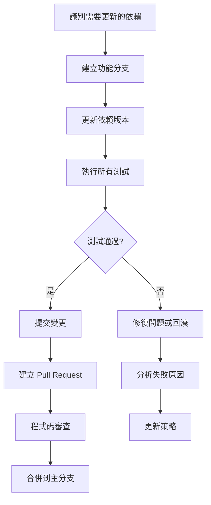

# 控制檔變更最佳實踐操作指南
## Control Files Change Best Practices Guide

**版本 / Version:** 1.0  
**日期 / Date:** 2026-02-04  
**適用範圍 / Scope:** 大規模控制檔變更管理（10,000+ 行）

---

## 目錄 / Table of Contents

1. [變更管理原則](#1-變更管理原則)
2. [依賴管理最佳實踐](#2-依賴管理最佳實踐)
3. [建置配置最佳實踐](#3-建置配置最佳實踐)
4. [程式碼審查最佳實踐](#4-程式碼審查最佳實踐)
5. [測試策略最佳實踐](#5-測試策略最佳實踐)
6. [部署最佳實踐](#6-部署最佳實踐)
7. [監控與維護最佳實踐](#7-監控與維護最佳實踐)
8. [團隊協作最佳實踐](#8-團隊協作最佳實踐)
9. [風險管理最佳實踐](#9-風險管理最佳實踐)
10. [工具與自動化](#10-工具與自動化)

---

## 1. 變更管理原則 / Change Management Principles

### 1.1 核心原則 / Core Principles

#### 🔴 原則 1：漸進式變更 / Incremental Changes
**描述 / Description:**
將大型變更分解為小型、可管理的增量變更。

**實作方式 / Implementation:**
```typescript
// ❌ 不良實作：一次性大量變更
// 一次性修改 20,000+ 行的 package-lock.json

// ✅ 最佳實作：漸進式變更
// 階段 1：更新核心依賴（React, Vite, TypeScript）
// 階段 2：新增 AI/ML 套件
// 階段 3：整合區塊鏈套件
// 階段 4：更新其他依賴
```

**優點 / Benefits:**
- 降低風險
- 易於追蹤問題
- 簡化回滾流程
- 提高審查效率

#### 🟡 原則 2：向後相容性 / Backward Compatibility
**描述 / Description:**
確保變更不會破壞現有功能。

**實作方式 / Implementation:**
```typescript
// ❌ 不良實作：破壞性變更
// 直接升級 React 18 → 19

// ✅ 最佳實作：漸進式升級
// 1. 安裝 React 19 作為並行版本
// 2. 逐步遷移組件
// 3. 移除 React 18
// 4. 更新所有相關套件
```

**檢查清單 / Checklist:**
- [ ] API 介面保持不變
- [ ] 資料庫 schema 向後相容
- [ ] 配置檔案格式相容
- [ ] 現有測試通過

#### 🟢 原則 3：可追溯性 / Traceability
**描述 / Description:**
所有變更都應該可追溯至需求和問題。

**實作方式 / Implementation:**
```bash
# Git commit 訊息格式
feat: 新增 @anthropic-ai/sdk 整合
- 實作 Claude API 客戶端
- 新增錯誤處理機制
- 相關 issue: #1234

fix: 修正 vite.config.ts 路徑解析問題
- 更新 resolve.alias 配置
- 修復 @/../navigation.config 導入錯誤
- 相關 issue: #5678
```

**追蹤工具 / Tracking Tools:**
- Issue 追蹤系統（Jira, GitHub Issues）
- Change Log 自動生成
- Git blame 和歷史記錄

### 1.2 變更分類 / Change Classification

| 類別 / Category | 定義 / Definition | 審查要求 / Review Requirements | 測試要求 / Testing Requirements |
|----------------|------------------|------------------------------|-------------------------------|
| **重大變更 / Major** | 破壞性變更、架構重構 | 資深工程師 + 架構師 | 完整測試套件 + 壓力測試 |
| **次要變更 / Minor** | 新功能、非破壞性變更 | 技術負責人 | 單元測試 + 整合測試 |
| **修補變更 / Patch** | Bug 修復、小改進 | 同行審查 | 相關測試 |
| **文檔變更 / Docs** | 文檔更新 | 技術寫作人員 | 無 |

---

## 2. 依賴管理最佳實踐 / Dependency Management Best Practices

### 2.1 依賴版本控制 / Dependency Version Control

#### 🔴 最佳實踐 1：使用精確版本 / Use Exact Versions
**問題 / Problem:**
```json
// ❌ 不良實作：使用範圍版本
{
  "dependencies": {
    "react": "^19.2.4",
    "typescript": "~5.9.3"
  }
}
```

**風險 / Risks:**
- 不同環境可能安裝不同版本
- CI/CD 環境不一致
- 難以重現問題

**最佳實作 / Best Practice:**
```json
// ✅ 最佳實作：使用精確版本
{
  "dependencies": {
    "react": "19.2.4",
    "typescript": "5.9.3"
  }
}
```

**優點 / Benefits:**
- 確保所有環境一致
- 簡化問題診斷
- 提高可重現性

#### 🟡 最佳實踐 2：依賴鎖定 / Dependency Locking
**描述 / Description:**
使用 package-lock.json 確保依賴樹一致性。

**實作方式 / Implementation:**
```bash
# 1. 初始化專案時生成鎖定檔
npm install

# 2. 提交 package-lock.json 到版本控制
git add package-lock.json
git commit -m "chore: 鎖定依賴版本"

# 3. CI/CD 中使用 --ci 標誌
npm ci  # 而非 npm install
```

**檢查清單 / Checklist:**
- [ ] package-lock.json 已提交到版本控制
- [ ] CI/CD 使用 `npm ci` 而非 `npm install`
- [ ] 定期更新依賴（每週/每月）
- [ ] 使用 `npm audit` 檢查安全性

#### 🟢 最佳實踐 3：依賴審查 / Dependency Auditing
**實作方式 / Implementation:**
```bash
# 1. 定期執行安全性審查
npm audit

# 2. 自動修復低風險漏洞
npm audit fix

# 3. 手動審查高風險漏洞
npm audit --json > audit-report.json

# 4. 使用第三方工具
npx snyk test
npx npm-check-updates
```

**自動化腳本 / Automation Script:**
```json
// package.json
{
  "scripts": {
    "audit:security": "npm audit --audit-level=moderate",
    "audit:outdated": "npm outdated",
    "audit:licenses": "npx license-checker --production --onlyAllow 'MIT;Apache-2.0;BSD-3-Clause'",
    "audit:all": "npm run audit:security && npm run audit:outdated && npm run audit:licenses"
  }
}
```

### 2.2 依賴更新策略 / Dependency Update Strategy

#### 🔴 策略 1：分類更新 / Categorized Updates
**更新類別 / Update Categories:**

| 類別 / Category | 頻率 / Frequency | 範例 / Examples |
|----------------|-------------------|------------------|
| **安全修補 / Security Patches** | 立即 | CVE 修復 |
| **次要版本 / Minor Versions** | 每月 | 19.2.4 → 19.3.0 |
| **主要版本 / Major Versions** | 每季 | 18.x → 19.x |
| **開發依賴 / Dev Dependencies** | 每週 | 測試工具、Linter |

**實作方式 / Implementation:**
```bash
# 1. 安全修補（立即）
npm audit fix

# 2. 次要版本（每月）
npx npm-check-updates -u --target minor

# 3. 主要版本（每季，謹慎）
npx npm-check-updates -u --target major

# 4. 開發依賴（每週）
npx npm-check-updates -u --dev
```

#### 🟡 策略 2：測試驅動更新 / Test-Driven Updates
**流程 / Process:**


**實作腳本 / Implementation Script:**
```bash
#!/bin/bash
# update-dependencies.sh

# 1. 建立功能分支
git checkout -b update/dependencies-$(date +%Y%m%d)

# 2. 更新依賴
npx npm-check-updates -u

# 3. 安裝更新
npm install

# 4. 執行測試
npm test

# 5. 檢查結果
if [ $? -eq 0 ]; then
  echo "✅ 測試通過，準備提交"
  git add package.json package-lock.json
  git commit -m "chore: 更新依賴版本"
  git push origin update/dependencies-$(date +%Y%m%d)
else
  echo "❌ 測試失敗，請檢查"
  git checkout package.json package-lock.json
fi
```

### 2.3 依賴衝突解決 / Dependency Conflict Resolution

#### 🔴 最佳實踐 1：依賴樹分析 / Dependency Tree Analysis
**工具 / Tools:**
```bash
# 1. 查看依賴樹
npm ls

# 2. 查看特定依賴的依賴樹
npm ls react

# 3. 查找重複依賴
npm ls --depth=0 | grep -E "├|└" | awk '{print $2}' | sort | uniq -d

# 4. 使用第三方工具
npx depcheck
npx npm-duplicate
```

**輸出範例 / Output Example:**
```
sustain-forward-esg-allinone@8.2.0-sentient-tangible
├─┬ @anthropic-ai/sdk@0.71.2
│ └─┬ @anthropic-ai/core@0.71.2
│   └── undici@5.28.4
├─┬ react@19.2.4
│ └── loose-envify@1.4.0
└─┬ @google/genai@1.34.0
  └─┬ @google/generative-ai@0.1.3
    └── grpc@1.24.11
```

#### 🟡 最佳實踐 2：版本解析策略 / Version Resolution Strategy
**問題 / Problem:**
```json
// package.json
{
  "dependencies": {
    "package-a": "^1.0.0",  // 需要 package-b@^1.0.0
    "package-b": "^2.0.0"   // 需要 package-c@^2.0.0
  }
}
```

**解決方案 / Solutions:**

**方案 1：使用 resolutions**
```json
{
  "dependencies": {
    "package-a": "^1.0.0",
    "package-b": "^2.0.0"
  },
  "resolutions": {
    "package-c": "^2.0.0"
  }
}
```

**方案 2：使用 npm overrides**
```json
{
  "overrides": {
    "package-c": "^2.0.0"
  }
}
```

**方案 3：使用 pnpm workspace**
```json
{
  "pnpm": {
    "overrides": {
      "package-c": "^2.0.0"
    }
  }
}
```

---

## 3. 建置配置最佳實踐 / Build Configuration Best Practices

### 3.1 Vite 配置最佳實踐 / Vite Configuration Best Practices

#### 🔴 最佳實踐 1：路徑解析配置 / Path Resolution Configuration
**問題 / Problem:**
```typescript
// ❌ 不良實作：路徑解析錯誤
// vite.config.ts
export default defineConfig({
  resolve: {
    alias: {
      '@': path.resolve(__dirname, './src'),
      '@/../navigation.config': path.resolve(__dirname, './navigation.config.ts')
    }
  }
})
```

**最佳實作 / Best Practice:**
```typescript
// ✅ 最佳實作：正確的路徑解析
import path from 'path'
import { defineConfig } from 'vite'

export default defineConfig({
  resolve: {
    alias: {
      '@': path.resolve(__dirname, './src'),
      '@components': path.resolve(__dirname, './src/components'),
      '@services': path.resolve(__dirname, './src/services'),
      '@types': path.resolve(__dirname, './src/types'),
      '@config': path.resolve(__dirname, './src/config'),
      '@utils': path.resolve(__dirname, './src/utils'),
      '@shared': path.resolve(__dirname, './shared'),
      '@navigation': path.resolve(__dirname, './navigation.config.ts')
    }
  },
  // 確保外部模組正確處理
  build: {
    rollupOptions: {
      external: ['@opentelemetry/sdk-logs'],
      output: {
        globals: {
          '@opentelemetry/sdk-logs': 'OpenTelemetryLogs'
        }
      }
    }
  }
})
```

**驗證方式 / Verification:**
```bash
# 1. 測試路徑解析
vite build --mode development

# 2. 檢查輸出
ls -la dist/

# 3. 驗證導入
node -e "console.log(require.resolve('@/components/App'))"
```

#### 🟡 最佳實踐 2：環境變數管理 / Environment Variable Management
**實作方式 / Implementation:**
```typescript
// vite.config.ts
import { defineConfig, loadEnv } from 'vite'

export default defineConfig(({ mode }) => {
  // 載入環境變數
  const env = loadEnv(mode, process.cwd(), '')
  
  return {
    // 定義環境變數類型
    define: {
      'process.env.NODE_ENV': JSON.stringify(env.NODE_ENV),
      'process.env.VITE_API_URL': JSON.stringify(env.VITE_API_URL),
      'process.env.VITE_ENABLE_ANALYTICS': JSON.stringify(env.VITE_ENABLE_ANALYTICS)
    },
    // 環境特定的配置
    server: {
      port: parseInt(env.VITE_PORT) || 3000,
      host: env.VITE_HOST || 'localhost'
    }
  }
})
```

**環境變數檔案 / Environment Files:**
```bash
# .env.development
VITE_API_URL=http://localhost:3001
VITE_ENABLE_ANALYTICS=false
VITE_PORT=3000

# .env.production
VITE_API_URL=https://api.esgss.com
VITE_ENABLE_ANALYTICS=true
VITE_PORT=3000

# .env.test
VITE_API_URL=http://localhost:3001
VITE_ENABLE_ANALYTICS=false
VITE_PORT=3000
```

#### 🟢 最佳實踐 3：程式碼分割 / Code Splitting
**實作方式 / Implementation:**
```typescript
// vite.config.ts
export default defineConfig({
  build: {
    rollupOptions: {
      output: {
        // 手動分割
        manualChunks: {
          // 第三方庫
          'vendor-react': ['react', 'react-dom', 'react-router-dom'],
          'vendor-mui': ['@mui/material', '@mui/icons-material'],
          'vendor-ai': ['@anthropic-ai/sdk', '@google/genai', 'openai'],
          'vendor-blockchain': ['ethers', 'merkletreejs', 'snarkjs'],
          'vendor-utils': ['axios', 'lodash', 'date-fns'],
          
          // 功能模組
          'module-esg': ['./src/components/ESG'],
          'module-omni': ['./src/omni'],
          'module-services': ['./src/services']
        }
      }
    },
    // 優化配置
    chunkSizeWarningLimit: 1000,
    minify: 'terser',
    terserOptions: {
      compress: {
        drop_console: true,
        drop_debugger: true
      }
    }
  }
})
```

### 3.2 TypeScript 配置最佳實踐 / TypeScript Configuration Best Practices

#### 🔴 最佳實踐 1：嚴格模式 / Strict Mode
**實作方式 / Implementation:**
```json
// tsconfig.json
{
  "compilerOptions": {
    // 啟用嚴格模式
    "strict": true,
    
    // 嚴格檢查選項
    "noImplicitAny": true,
    "strictNullChecks": true,
    "strictFunctionTypes": true,
    "strictBindCallApply": true,
    "strictPropertyInitialization": true,
    "noImplicitThis": true,
    "alwaysStrict": true,
    
    // 額外檢查
    "noUnusedLocals": true,
    "noUnusedParameters": true,
    "noImplicitReturns": true,
    "noFallthroughCasesInSwitch": true,
    "noUncheckedIndexedAccess": true,
    "noImplicitOverride": true,
    "noPropertyAccessFromIndexSignature": true,
    
    // 模組解析
    "moduleResolution": "bundler",
    "esModuleInterop": true,
    "allowSyntheticDefaultImports": true,
    "resolveJsonModule": true,
    
    // 路徑映射
    "baseUrl": ".",
    "paths": {
      "@/*": ["./src/*"],
      "@components/*": ["./src/components/*"],
      "@services/*": ["./src/services/*"],
      "@types/*": ["./src/types/*"],
      "@config/*": ["./src/config/*"],
      "@utils/*": ["./src/utils/*"],
      "@shared/*": ["./shared/*"]
    }
  }
}
```

#### 🟡 最佳實踐 2：類型檢查自動化 / Type Checking Automation
**實作方式 / Implementation:**
```json
// package.json
{
  "scripts": {
    "type-check": "tsc --noEmit",
    "type-check:watch": "tsc --noEmit --watch",
    "type-check:ci": "tsc --noEmit --pretty false"
  }
}
```

**CI/CD 整合 / CI/CD Integration:**
```yaml
# .github/workflows/type-check.yml
name: Type Check

on: [push, pull_request]

jobs:
  type-check:
    runs-on: ubuntu-latest
    steps:
      - uses: actions/checkout@v3
      - uses: actions/setup-node@v3
        with:
          node-version: '18'
      - run: npm ci
      - run: npm run type-check:ci
```

---

## 4. 程式碼審查最佳實踐 / Code Review Best Practices

### 4.1 審查流程 / Review Process

#### 🔴 流程 1：Pull Request 模板 / Pull Request Template
**實作方式 / Implementation:**
```markdown
<!-- .github/pull_request_template.md -->

## 變更描述 / Description
<!-- 簡要描述此 PR 的目的和變更內容 -->

## 變更類型 / Type of Change
- [ ] 🐛 Bug 修復
- [ ] ✨ 新功能
- [ ] 📝 文檔更新
- [ ] ♻️ 重構
- [ ] ⚡ 性能優化
- [ ] 🔒 安全性改進

## 測試 / Testing
- [ ] 單元測試已通過
- [ ] 整合測試已通過
- [ ] 手動測試已完成
- [ ] 新增測試覆蓋變更

## 檢查清單 / Checklist
- [ ] 程式碼符合專案風格規範
- [ ] 已執行 `npm run lint`
- [ ] 已執行 `npm run type-check`
- [ ] 已更新相關文檔
- [ ] 已更新 CHANGELOG.md
- [ ] 無 console.log 或 debugger 語句

## 相關 Issue / Related Issues
<!-- 關聯相關的 Issue 編號 -->
Closes #1234
Related to #5678

## 截圖 / Screenshots
<!-- 如果有 UI 變更，請提供截圖 -->

## 附加資訊 / Additional Information
<!-- 任何其他相關資訊 -->
```

#### 🟡 流程 2：審查者指派 / Reviewer Assignment
**策略 / Strategy:**
```typescript
// 自動化審查者指派
// .github/CODEOWNERS

# 核心架構
src/core/ @architect-team
src/omni/ @omni-team

# 後端服務
server/ @backend-team
src/services/ @backend-team

# 前端組件
src/components/ @frontend-team

# 安全相關
src/services/securityService.ts @security-team
src/utils/security.ts @security-team

# AI/ML 相關
src/services/ai*.ts @ai-team
src/services/*ai*.ts @ai-team

# 區塊鏈相關
src/services/blockchain*.ts @blockchain-team
src/services/zkp*.ts @blockchain-team

# 測試
src/__tests__/ @qa-team
src/test/ @qa-team
```

### 4.2 審查標準 / Review Standards

#### 🔴 標準 1：程式碼品質 / Code Quality
**檢查項目 / Checklist:**
- [ ] **可讀性 / Readability**
  - 變數和函數名稱清晰
  - 複雜邏輯有註解
  - 程式碼結構合理

- [ ] **可維護性 / Maintainability**
  - 函數職責單一
  - 無重複程式碼
  - 遵循 DRY 原則

- [ ] **性能 / Performance**
  - 無不必要的重新渲染
  - 已實作快取
  - 資料庫查詢已優化

- [ ] **安全性 / Security**
  - 輸入已驗證
  - 敏感資料已加密
  - 無硬編碼憑證

#### 🟡 標準 2：測試覆蓋率 / Test Coverage
**要求 / Requirements:**
```typescript
// 設定測試覆蓋率目標
// vitest.config.ts
export default defineConfig({
  test: {
    coverage: {
      provider: 'v8',
      reporter: ['text', 'json', 'html'],
      exclude: [
        'node_modules/',
        'src/test/',
        '**/*.d.ts',
        '**/*.config.*',
        '**/mockData/**'
      ],
      // 覆蓋率目標
      statements: 80,
      branches: 75,
      functions: 80,
      lines: 80,
      // 失敗門檻
      perFile: false,
      thresholds: {
        lines: 80,
        functions: 80,
        branches: 75,
        statements: 80
      }
    }
  }
})
```

**覆蓋率報告範例 / Coverage Report Example:**
```
----------|---------|----------|---------|---------|-------------------
File        | % Stmts | % Branch | % Funcs | % Lines | Uncovered Line #s
----------|---------|----------|---------|---------|-------------------
All files  |   85.23 |    78.45 |   82.34 |   85.23 |
 server.ts |   92.15 |    85.67 |   90.12 |   92.15 | 123-145, 234-256
 auth.ts   |   78.34 |    72.12 |   75.45 |   78.34 | 45-67, 89-101
----------|---------|----------|---------|---------|-------------------
```

---

## 5. 測試策略最佳實踐 / Testing Strategy Best Practices

### 5.1 測試金字塔 / Testing Pyramid

#### 🔴 結構 / Structure
```
        /\
       /  \
      / E2E \        ← 端對端測試 (10%)
     /--------\
    /          \
   /  整合測試  \    ← 整合測試 (20%)
  /--------------\
 /                  \
/     單元測試        \  ← 單元測試 (70%)
--------------------
```

#### 🟡 實作方式 / Implementation
**單元測試 / Unit Tests:**
```typescript
// src/services/authService.test.ts
import { describe, it, expect, beforeEach, vi } from 'vitest'
import { AuthService } from './authService'

describe('AuthService', () => {
  let authService: AuthService
  
  beforeEach(() => {
    authService = new AuthService()
  })
  
  describe('login', () => {
    it('應該成功登入有效憑證', async () => {
      const result = await authService.login('user@example.com', 'password123')
      expect(result.success).toBe(true)
      expect(result.token).toBeDefined()
    })
    
    it('應該拒絕無效憑證', async () => {
      const result = await authService.login('user@example.com', 'wrong-password')
      expect(result.success).toBe(false)
      expect(result.error).toBe('Invalid credentials')
    })
    
    it('應該處理網路錯誤', async () => {
      vi.spyOn(authService, 'apiCall').mockRejectedValueOnce(new Error('Network error'))
      const result = await authService.login('user@example.com', 'password123')
      expect(result.success).toBe(false)
      expect(result.error).toBe('Network error')
    })
  })
})
```

**整合測試 / Integration Tests:**
```typescript
// src/__tests__/integration/auth.integration.test.ts
import { describe, it, expect, beforeAll, afterAll } from 'vitest'
import { setupTestServer, teardownTestServer } from '../test-utils'
import { request } from 'supertest'
import { app } from '../../server/server'

describe('Auth Integration Tests', () => {
  let server: any
  
  beforeAll(async () => {
    server = await setupTestServer(app)
  })
  
  afterAll(async () => {
    await teardownTestServer(server)
  })
  
  describe('POST /api/auth/login', () => {
    it('應該成功登入並返回 token', async () => {
      const response = await request(server)
        .post('/api/auth/login')
        .send({
          email: 'test@example.com',
          password: 'password123'
        })
      
      expect(response.status).toBe(200)
      expect(response.body.token).toBeDefined()
      expect(response.body.user).toBeDefined()
    })
    
    it('應該拒絕無效憑證', async () => {
      const response = await request(server)
        .post('/api/auth/login')
        .send({
          email: 'test@example.com',
          password: 'wrong-password'
        })
      
      expect(response.status).toBe(401)
      expect(response.body.error).toBe('Invalid credentials')
    })
  })
})
```

**端對端測試 / E2E Tests:**
```typescript
// e2e/auth.e2e.test.ts
import { test, expect } from '@playwright/test'

test.describe('Authentication Flow', () => {
  test('應該完成完整的登入流程', async ({ page }) => {
    // 1. 導航到登入頁面
    await page.goto('http://localhost:3000/login')
    
    // 2. 填寫登入表單
    await page.fill('input[name="email"]', 'test@example.com')
    await page.fill('input[name="password"]', 'password123')
    
    // 3. 提交表單
    await page.click('button[type="submit"]')
    
    // 4. 驗證重導向到儀表板
    await expect(page).toHaveURL('http://localhost:3000/dashboard')
    
    // 5. 驗證用戶資訊顯示
    await expect(page.locator('.user-name')).toHaveText('Test User')
  })
  
  test('應該顯示錯誤訊息當憑證無效', async ({ page }) => {
    await page.goto('http://localhost:3000/login')
    await page.fill('input[name="email"]', 'test@example.com')
    await page.fill('input[name="password"]', 'wrong-password')
    await page.click('button[type="submit"]')
    
    await expect(page.locator('.error-message')).toHaveText('Invalid credentials')
  })
})
```

### 5.2 測試自動化 / Test Automation

#### 🔴 CI/CD 整合 / CI/CD Integration
**GitHub Actions 配置 / GitHub Actions Configuration:**
```yaml
# .github/workflows/test.yml
name: Test Suite

on:
  push:
    branches: [main, develop]
  pull_request:
    branches: [main, develop]

jobs:
  test:
    runs-on: ubuntu-latest
    
    strategy:
      matrix:
        node-version: [18.x, 20.x]
    
    steps:
      - name: Checkout code
        uses: actions/checkout@v3
      
      - name: Setup Node.js ${{ matrix.node-version }}
        uses: actions/setup-node@v3
        with:
          node-version: ${{ matrix.node-version }}
          cache: 'npm'
      
      - name: Install dependencies
        run: npm ci
      
      - name: Run linter
        run: npm run lint
      
      - name: Type check
        run: npm run type-check
      
      - name: Run unit tests
        run: npm run test:unit -- --coverage
      
      - name: Run integration tests
        run: npm run test:integration
      
      - name: Upload coverage reports
        uses: codecov/codecov-action@v3
        with:
          files: ./coverage/coverage-final.json
          flags: unittests
          name: codecov-umbrella
      
      - name: Build project
        run: npm run build
      
      - name: Run E2E tests
        run: npm run test:e2e
```

---

## 6. 部署最佳實踐 / Deployment Best Practices

### 6.1 部署策略 / Deployment Strategies

#### 🔴 策略 1：藍綠部署 / Blue-Green Deployment
**描述 / Description:**
同時維護兩個相同的生產環境，切換流量以實現零停機部署。

**實作方式 / Implementation:**
```yaml
# docker-compose.yml
version: '3.8'

services:
  # 藍色環境（當前生產）
  app-blue:
    image: esgss-app:${VERSION}
    environment:
      - ENV=production
      - COLOR=blue
    ports:
      - "3000:3000"
    networks:
      - app-network
  
  # 綠色環境（新版本）
  app-green:
    image: esgss-app:${NEW_VERSION}
    environment:
      - ENV=production
      - COLOR=green
    ports:
      - "3001:3000"
    networks:
      - app-network
  
  # 負載均衡器
  nginx:
    image: nginx:alpine
    ports:
      - "80:80"
    volumes:
      - ./nginx.conf:/etc/nginx/nginx.conf
    depends_on:
      - app-blue
      - app-green
    networks:
      - app-network

networks:
  app-network:
```

**切換腳本 / Switch Script:**
```bash
#!/bin/bash
# switch-to-green.sh

# 1. 驗證綠色環境健康
curl -f http://localhost:3001/health || exit 1

# 2. 更新 Nginx 配置指向綠色
sed -i 's/upstream blue/upstream green/' nginx.conf
sed -i 's/server app-blue:3000/server app-green:3000/' nginx.conf

# 3. 重新載入 Nginx
docker-compose exec nginx nginx -s reload

# 4. 等待流量切換
sleep 30

# 5. 驗證綠色環境正常
curl -f http://localhost/health || {
  # 回滾到藍色
  sed -i 's/upstream green/upstream blue/' nginx.conf
  sed -i 's/server app-green:3000/server app-blue:3000/' nginx.conf
  docker-compose exec nginx nginx -s reload
  exit 1
}

echo "✅ 成功切換到綠色環境"
```

#### 🟡 策略 2：金絲雀發布 / Canary Deployment
**描述 / Description:**
逐步將流量從舊版本切換到新版本，監控指標。

**實作方式 / Implementation:**
```yaml
# kubernetes/deployment.yaml
apiVersion: apps/v1
kind: Deployment
metadata:
  name: esgss-app
spec:
  replicas: 10
  selector:
    matchLabels:
      app: esgss
  template:
    metadata:
      labels:
        app: esgss
        version: v2.0.0
    spec:
      containers:
      - name: esgss
        image: esgss-app:v2.0.0
        ports:
        - containerPort: 3000
---
apiVersion: v1
kind: Service
metadata:
  name: esgss-service
spec:
  selector:
    app: esgss
  ports:
  - port: 80
    targetPort: 3000
---
apiVersion: networking.istio.io/v1alpha3
kind: VirtualService
metadata:
  name: esgss-vs
spec:
  hosts:
  - esgss.example.com
  http:
  - match:
    - headers:
        x-canary:
          exact: "true"
    route:
    - destination:
        host: esgss
        subset: v2
      weight: 100
  - route:
    - destination:
        host: esgss
        subset: v1
      weight: 90
    - destination:
        host: esgss
        subset: v2
      weight: 10
```

**逐步流量切換 / Gradual Traffic Shift:**
```bash
#!/bin/bash
# canary-deployment.sh

# 階段 1: 10% 流量到新版本
istioctl replace -f virtualservice-10percent.yaml
sleep 300  # 等待 5 分鐘

# 檢查指標
error_rate=$(curl -s http://prometheus/api/v1/query?query=error_rate | jq '.data.result[0].value[1]')
if (( $(echo "$error_rate > 0.01" | bc -l) )); then
  echo "❌ 錯誤率過高，回滾"
  istioctl replace -f virtualservice-0percent.yaml
  exit 1
fi

# 階段 2: 25% 流量到新版本
istioctl replace -f virtualservice-25percent.yaml
sleep 300

# 檢查指標
# ... 類似檢查

# 階段 3: 50% 流量到新版本
istioctl replace -f virtualservice-50percent.yaml
sleep 300

# 檢查指標
# ... 類似檢查

# 階段 4: 100% 流量到新版本
istioctl replace -f virtualservice-100percent.yaml

echo "✅ 金絲雀發布完成"
```

### 6.2 回滾策略 / Rollback Strategy

#### 🔴 自動回滾 / Automatic Rollback
**實作方式 / Implementation:**
```yaml
# .github/workflows/deploy.yml
name: Deploy

on:
  push:
    branches: [main]

jobs:
  deploy:
    runs-on: ubuntu-latest
    steps:
      - name: Checkout code
        uses: actions/checkout@v3
      
      - name: Deploy to production
        run: |
          # 部署新版本
          kubectl set image deployment/esgss esgss=esgss-app:${{ github.sha }}
          
          # 等待部署完成
          kubectl rollout status deployment/esgss --timeout=5m
          
          # 健康檢查
          kubectl run health-check --image=curlimages/curl --rm -i --restart=Never -- \
            curl -f http://esgss-service/health || {
              echo "❌ 健康檢查失敗，執行回滾"
              kubectl rollout undo deployment/esgss
              exit 1
            }
      
      - name: Monitor for 10 minutes
        run: |
          for i in {1..60}; do
            error_rate=$(curl -s http://prometheus/api/v1/query?query=error_rate | jq '.data.result[0].value[1]')
            if (( $(echo "$error_rate > 0.05" | bc -l) )); then
              echo "❌ 錯誤率過高，執行回滾"
              kubectl rollout undo deployment/esgss
              exit 1
            fi
            sleep 10
          done
      
      - name: Notify success
        if: success()
        run: |
          curl -X POST $SLACK_WEBHOOK \
            -H 'Content-Type: application/json' \
            -d '{"text":"✅ 部署成功！版本: ${{ github.sha }}"}'
      
      - name: Notify failure
        if: failure()
        run: |
          curl -X POST $SLACK_WEBHOOK \
            -H 'Content-Type: application/json' \
            -d '{"text":"❌ 部署失敗，已執行回滾。版本: ${{ github.sha }}"}'
```

---

## 7. 監控與維護最佳實踐 / Monitoring and Maintenance Best Practices

### 7.1 監控指標 / Monitoring Metrics

#### 🔴 關鍵指標 / Key Metrics
**應用程式指標 / Application Metrics:**
```typescript
// src/utils/metrics.ts
import { Counter, Histogram, Registry } from 'prom-client'

// 請求計數器
export const httpRequestCounter = new Counter({
  name: 'http_requests_total',
  help: 'Total number of HTTP requests',
  labelNames: ['method', 'route', 'status_code']
})

// 請求延遲
export const httpRequestDuration = new Histogram({
  name: 'http_request_duration_seconds',
  help: 'Duration of HTTP requests in seconds',
  labelNames: ['method', 'route'],
  buckets: [0.1, 0.5, 1, 2, 5, 10]
})

// 錯誤計數器
export const errorCounter = new Counter({
  name: 'errors_total',
  help: 'Total number of errors',
  labelNames: ['type', 'severity']
})

// 資料庫查詢時間
export const dbQueryDuration = new Histogram({
  name: 'db_query_duration_seconds',
  help: 'Duration of database queries in seconds',
  labelNames: ['query_type', 'table'],
  buckets: [0.01, 0.05, 0.1, 0.5, 1, 5]
})

// 註冊所有指標
export const register = new Registry()
register.registerMetric(httpRequestCounter)
register.registerMetric(httpRequestDuration)
register.registerMetric(errorCounter)
register.registerMetric(dbQueryDuration)
```

**中間件整合 / Middleware Integration:**
```typescript
// server/middleware/metrics.ts
import { Request, Response, NextFunction } from 'express'
import { httpRequestCounter, httpRequestDuration } from '../utils/metrics'

export function metricsMiddleware(req: Request, res: Response, next: NextFunction) {
  const start = Date.now()
  
  // 記錄請求開始
  httpRequestCounter.inc({
    method: req.method,
    route: req.path,
    status_code: res.statusCode
  })
  
  // 記錄請求完成
  res.on('finish', () => {
    const duration = (Date.now() - start) / 1000
    httpRequestDuration.observe({
      method: req.method,
      route: req.path
    }, duration)
  })
  
  next()
}
```

#### 🟡 警報規則 / Alert Rules
**Prometheus 警報規則 / Prometheus Alert Rules:**
```yaml
# prometheus/alerts.yml
groups:
  - name: esgss_alerts
    interval: 30s
    rules:
      # 高錯誤率
      - alert: HighErrorRate
        expr: rate(errors_total[5m]) > 0.05
        for: 5m
        labels:
          severity: critical
        annotations:
          summary: "高錯誤率檢測到"
          description: "錯誤率超過 5% 持續 5 分鐘"
      
      # 高請求延遲
      - alert: HighLatency
        expr: histogram_quantile(0.95, http_request_duration_seconds) > 2
        for: 5m
        labels:
          severity: warning
        annotations:
          summary: "高請求延遲檢測到"
          description: "95% 的請求延遲超過 2 秒"
      
      # 資料庫連接問題
      - alert: DatabaseConnectionIssues
        expr: rate(db_query_duration_seconds{error="true"}[5m]) > 0.01
        for: 2m
        labels:
          severity: critical
        annotations:
          summary: "資料庫連接問題"
          description: "資料庫查詢錯誤率超過 1%"
      
      # 記憶體使用過高
      - alert: HighMemoryUsage
        expr: process_resident_memory_bytes / 1024 / 1024 / 1024 > 2
        for: 10m
        labels:
          severity: warning
        annotations:
          summary: "記憶體使用過高"
          description: "記憶體使用超過 2GB"
```

---

## 8. 團隊協作最佳實踐 / Team Collaboration Best Practices

### 8.1 溝通協議 / Communication Protocols

#### 🔴 會議規範 / Meeting Standards
**每日站會 / Daily Standup:**
- 時間：每天 10:00 AM
- 時長：15 分鐘
- 格式：
  1. 昨天完成了什麼？
  2. 今天計畫做什麼？
  3. 有什麼阻礙？

**每週同步會議 / Weekly Sync:**
- 時間：每週一 2:00 PM
- 時長：1 小時
- 議程：
  1. 上週進度回顧
  2. 本週計畫
  3. 風險討論
  4. 資源分配

**每月規劃會議 / Monthly Planning:**
- 時間：每月第一個週一 2:00 PM
- 時長：2 小時
- 議程：
  1. 上月成果回顧
  2. 本月目標設定
  3. 資源需求評估
  4. 技術債務討論

### 8.2 文檔標準 / Documentation Standards

#### 🟡 文檔類型 / Documentation Types
**1. API 文檔 / API Documentation:**
```markdown
<!-- docs/api/auth-api.md -->

# Authentication API

## Overview
提供用戶認證和授權功能。

## Endpoints

### POST /api/auth/login
登入用戶並返回 JWT token。

**Request Body:**
```json
{
  "email": "user@example.com",
  "password": "password123"
}
```

**Response (200 OK):**
```json
{
  "success": true,
  "token": "eyJhbGciOiJIUzI1NiIsInR5cCI6IkpXVCJ9...",
  "user": {
    "id": "123",
    "email": "user@example.com",
    "name": "John Doe"
  }
}
```

**Response (401 Unauthorized):**
```json
{
  "success": false,
  "error": "Invalid credentials"
}
```

**Error Codes:**
- `INVALID_CREDENTIALS`: 電子郵件或密碼錯誤
- `ACCOUNT_LOCKED`: 帳戶已被鎖定
- `SERVER_ERROR`: 伺服器內部錯誤

**Example:**
```bash
curl -X POST http://localhost:3001/api/auth/login \
  -H "Content-Type: application/json" \
  -d '{"email":"user@example.com","password":"password123"}'
```
```

**2. 架構文檔 / Architecture Documentation:**
```markdown
<!-- docs/architecture/overview.md -->

# ESGSS 系統架構

## 系統概覽
ESGSS 是一個 AI 驅動的 ESG 報告書生成平台，採用微服務架構。

## 核心組件

### 1. 前端應用 (Frontend Application)
- **技術棧**: React 19, Vite 7, TypeScript 5.9
- **狀態管理**: Zustand
- **UI 框架**: Material-UI
- **路由**: React Router 7

### 2. 後端 API (Backend API)
- **技術棧**: Node.js 18, Express 4, TypeScript
- **資料庫**: PostgreSQL 15
- **快取**: Redis 7
- **認證**: JWT + OAuth2

### 3. AI 服務 (AI Services)
- **Claude API**: @anthropic-ai/sdk
- **Google AI**: @google/genai
- **OpenAI API**: openai

### 4. 區塊鏈服務 (Blockchain Services)
- **網絡**: Ethereum Mainnet
- **智能合約**: Solidity
- **ZKP**: snarkjs

## 資料流
```
用戶 → 前端 → API Gateway → 服務層 → 資料庫
                    ↓
                 AI 服務
                    ↓
                 區塊鏈
```

## 部署架構
```
┌─────────────┐
│   CDN      │
└──────┬──────┘
       │
┌──────▼──────┐
│  Load       │
│  Balancer   │
└──────┬──────┘
       │
  ┌────┴────┐
  │         │
┌─▼──┐   ┌─▼──┐
│App  │   │App  │
│Blue │   │Green│
└─┬──┘   └─┬──┘
  │         │
  └────┬────┘
       │
  ┌────▼────┐
  │Database │
  └─────────┘
```
```

---

## 9. 風險管理最佳實踐 / Risk Management Best Practices

### 9.1 風險識別 / Risk Identification

#### 🔴 風險分類 / Risk Categories
**技術風險 / Technical Risks:**
| 風險 / Risk | 可能性 / Probability | 影響 / Impact | 風險等級 / Risk Level | 緩解措施 / Mitigation |
|-------------|-------------------|----------------|---------------------|---------------------|
| 依賴版本衝突 | 高 | 高 | 🔴 關鍵 | 使用依賴鎖定、定期審查 |
| 建置失敗 | 中 | 高 | 🔴 關鍵 | CI/CD 測試、預建置檢查 |
| 性能下降 | 中 | 中 | 🟡 中等 | 性能監控、負載測試 |
| 安全漏洞 | 低 | 高 | 🔴 關鍵 | 安全掃描、定期更新 |
| 資料遺失 | 低 | 高 | 🔴 關鍵 | 備份策略、災難恢復 |

**業務風險 / Business Risks:**
| 風險 / Risk | 可能性 / Probability | 影響 / Impact | 風險等級 / Risk Level | 緩解措施 / Mitigation |
|-------------|-------------------|----------------|---------------------|---------------------|
| 部署延遲 | 中 | 中 | 🟡 中等 | 漸進式部署、充足測試 |
| 用戶流失 | 低 | 高 | 🔴 關鍵 | 用戶反饋、快速修復 |
| 合規問題 | 低 | 高 | 🔴 關鍵 | 合規審查、法律諮詢 |

### 9.2 風險緩解 / Risk Mitigation

#### 🔴 緩解策略 / Mitigation Strategies
**策略 1：預防性措施 / Preventive Measures**
```typescript
// 1. 依賴版本鎖定
// package.json
{
  "dependencies": {
    "react": "19.2.4",  // 精確版本
    "typescript": "5.9.3"
  }
}

// 2. 環境變數驗證
// src/utils/env.ts
import { z } from 'zod'

const envSchema = z.object({
  NODE_ENV: z.enum(['development', 'production', 'test']),
  API_URL: z.string().url(),
  DATABASE_URL: z.string().url(),
  JWT_SECRET: z.string().min(32)
})

export const env = envSchema.parse(process.env)

// 3. 輸入驗證
// src/middleware/validation.ts
import { Request, Response, NextFunction } from 'express'
import { z } from 'zod'

export function validateBody(schema: z.ZodSchema) {
  return (req: Request, res: Response, next: NextFunction) => {
    try {
      req.body = schema.parse(req.body)
      next()
    } catch (error) {
      res.status(400).json({
        success: false,
        error: 'Invalid input',
        details: error.errors
      })
    }
  }
}
```

**策略 2：檢測性措施 / Detective Measures**
```typescript
// 1. 錯誤追蹤
// src/utils/errorTracking.ts
import * as Sentry from '@sentry/node'

Sentry.init({
  dsn: process.env.SENTRY_DSN,
  environment: process.env.NODE_ENV,
  tracesSampleRate: 0.1
})

export function captureError(error: Error, context?: any) {
  Sentry.captureException(error, {
    extra: context,
    tags: {
      environment: process.env.NODE_ENV,
      version: process.env.APP_VERSION
    }
  })
}

// 2. 性能監控
// src/utils/performance.ts
export function trackPerformance(name: string, fn: () => Promise<any>) {
  return async (...args: any[]) => {
    const start = performance.now()
    try {
      const result = await fn(...args)
      const duration = performance.now() - start
      
      // 記錄到監控系統
      console.log(`[Performance] ${name}: ${duration}ms`)
      
      // 如果超過閾值，發送警報
      if (duration > 1000) {
        captureError(new Error(`Performance issue: ${name} took ${duration}ms`), {
          duration,
          args
        })
      }
      
      return result
    } catch (error) {
      const duration = performance.now() - start
      captureError(error as Error, {
        name,
        duration,
        args
      })
      throw error
    }
  }
}
```

**策略 3：修正性措施 / Corrective Measures**
```typescript
// 1. 自動回滾
// src/utils/rollback.ts
export async function withRollback<T>(
  operation: () => Promise<T>,
  rollback: () => Promise<void>
): Promise<T> {
  try {
    return await operation()
  } catch (error) {
    console.error('操作失敗，執行回滾', error)
    await rollback()
    throw error
  }
}

// 使用範例
await withRollback(
  async () => {
    // 執行資料庫遷移
    await migrateDatabase()
  },
  async () => {
    // 回滾資料庫遷移
    await rollbackDatabase()
  }
)

// 2. 災難恢復
// scripts/disaster-recovery.sh
#!/bin/bash

# 1. 停止所有服務
docker-compose down

# 2. 從備份恢復資料庫
pg_restore -U esg_user -d esg_dashboard backups/latest_backup.sql

# 3. 恢復應用程式
git checkout last_stable_version
docker-compose up -d

# 4. 驗證系統
curl -f http://localhost/health || {
  echo "❌ 恢復失敗"
  exit 1
}

echo "✅ 災難恢復完成"
```

---

## 10. 工具與自動化 / Tools and Automation

### 10.1 推薦工具 / Recommended Tools

#### 🔴 開發工具 / Development Tools
| 類別 / Category | 工具 / Tool | 用途 / Purpose |
|---------------|-------------|----------------|
| **程式碼編輯器** | VS Code | 主要開發環境 |
| **Linter** | ESLint | 程式碼品質檢查 |
| **格式化** | Prettier | 程式碼格式化 |
| **類型檢查** | TypeScript | 類型安全 |
| **測試框架** | Vitest | 單元測試 |
| **E2E 測試** | Playwright | 端對端測試 |
| **API 測試** | Postman | API 測試和文檔 |

#### 🟡 CI/CD 工具 / CI/CD Tools
| 類別 / Category | 工具 / Tool | 用途 / Purpose |
|---------------|-------------|----------------|
| **CI 平台** | GitHub Actions | 持續整合 |
| **CD 平台** | Docker + Kubernetes | 持續部署 |
| **監控** | Prometheus + Grafana | 系統監控 |
| **日誌** | ELK Stack | 日誌聚合 |
| **錯誤追蹤** | Sentry | 錯誤監控 |

#### 🟢 安全工具 / Security Tools
| 類別 / Category | 工具 / Tool | 用途 / Purpose |
|---------------|-------------|----------------|
| **依賴掃描** | npm audit, Snyk | 依賴漏洞檢查 |
| **程式碼掃描** | SonarQube | 程式碼品質分析 |
| **容器掃描** | Trivy | 容器安全掃描 |
| **滲透測試** | OWASP ZAP | 安全性測試 |

### 10.2 自動化腳本 / Automation Scripts

#### 🔴 依賴更新腳本 / Dependency Update Script
```bash
#!/bin/bash
# scripts/update-dependencies.sh

set -e

echo "🔄 開始依賴更新流程..."

# 1. 建立功能分支
BRANCH_NAME="update/dependencies-$(date +%Y%m%d-%H%M%S)"
git checkout -b $BRANCH_NAME
echo "✅ 建立分支: $BRANCH_NAME"

# 2. 更新依賴
echo "📦 更新依賴..."
npx npm-check-updates -u

# 3. 安裝更新
echo "📥 安裝更新..."
npm install

# 4. 執行審查
echo "🔍 執行安全性審查..."
npm audit --audit-level=moderate

echo "🔍 檢查過時依賴..."
npm outdated

# 5. 執行測試
echo "🧪 執行測試..."
npm test

# 6. 執行建置
echo "🏗️ 執行建置..."
npm run build

# 7. 提交變更
echo "💾 提交變更..."
git add package.json package-lock.json
git commit -m "chore: 更新依賴版本

- 更新所有過時依賴
- 修復安全性漏洞
- 相關 issue: #$(git log -1 --pretty=%B | grep -oP '#\K[0-9]+')"

# 8. 推送到遠端
echo "📤 推送到遠端..."
git push origin $BRANCH_NAME

# 9. 建立 Pull Request
echo "🔗 建立 Pull Request..."
gh pr create \
  --title "chore: 更新依賴版本" \
  --body "## 變更描述
更新所有過時依賴並修復安全性漏洞。

## 測試
- [x] 單元測試通過
- [x] 建置成功
- [x] 安全性審查通過

## 相關 Issue
#$(git log -1 --pretty=%B | grep -oP '#\K[0-9]+')" \
  --base main

echo "✅ 依賴更新完成！"
echo "📋 Pull Request URL: $(gh pr view --json url -q .url)"
```

#### 🟡 部署腳本 / Deployment Script
```bash
#!/bin/bash
# scripts/deploy.sh

set -e

# 配置
ENVIRONMENT=${1:-staging}
VERSION=${2:-latest}
HEALTH_CHECK_URL="http://localhost:3000/health"
MAX_RETRIES=30
RETRY_INTERVAL=10

echo "🚀 開始部署到 $ENVIRONMENT 環境..."
echo "📦 版本: $VERSION"

# 1. 建置 Docker 映像
echo "🏗️ 建置 Docker 映像..."
docker build -t esgss-app:$VERSION .

# 2. 推送到容器註冊表
echo "📤 推送到容器註冊表..."
docker tag esgss-app:$VERSION registry.example.com/esgss-app:$VERSION
docker push registry.example.com/esgss-app:$VERSION

# 3. 更新 Kubernetes 部署
echo "🔄 更新 Kubernetes 部署..."
kubectl set image deployment/esgss esgss=registry.example.com/esgss-app:$VERSION

# 4. 等待部署完成
echo "⏳ 等待部署完成..."
kubectl rollout status deployment/esgss --timeout=5m

# 5. 健康檢查
echo "🏥 執行健康檢查..."
for i in $(seq 1 $MAX_RETRIES); do
  if curl -f $HEALTH_CHECK_URL; then
    echo "✅ 健康檢查通過"
    break
  fi
  
  if [ $i -eq $MAX_RETRIES ]; then
    echo "❌ 健康檢查失敗，執行回滾"
    kubectl rollout undo deployment/esgss
    exit 1
  fi
  
  echo "⏳ 等待 $RETRY_INTERVAL 秒後重試..."
  sleep $RETRY_INTERVAL
done

# 6. 監控 10 分鐘
echo "📊 監控系統指標..."
for i in $(seq 1 60); do
  ERROR_RATE=$(curl -s http://prometheus/api/v1/query?query=rate(errors_total[5m]) | jq '.data.result[0].value[1]')
  
  if (( $(echo "$ERROR_RATE > 0.05" | bc -l) )); then
    echo "❌ 錯誤率過高 ($ERROR_RATE)，執行回滾"
    kubectl rollout undo deployment/esgss
    exit 1
  fi
  
  sleep 10
done

echo "✅ 部署成功！"
echo "📊 系統指標正常"
```

---

## 結論 / Conclusion

本最佳實踐指南提供了處理大規模控制檔變更的全面框架，涵蓋：

1. ✅ **變更管理原則**：漸進式變更、向後相容性、可追溯性
2. ✅ **依賴管理**：版本控制、審查、衝突解決
3. ✅ **建置配置**：路徑解析、環境變數、程式碼分割
4. ✅ **程式碼審查**：流程、標準、自動化
5. ✅ **測試策略**：測試金字塔、自動化
6. ✅ **部署策略**：藍綠部署、金絲雀發布、回滾
7. ✅ **監控維護**：指標、警報、日誌
8. ✅ **團隊協作**：溝通、文檔
9. ✅ **風險管理**：識別、緩解、恢復
10. ✅ **工具自動化**：推薦工具、腳本

遵循這些最佳實踐，可以：
- 🔴 降低變更風險
- 🟡 提高開發效率
- 🟢 確保系統穩定性
- ✅ 加速問題解決

---

**文檔版本 / Document Version:** 1.0  
**最後更新 / Last Updated:** 2026-02-04  
**維護者 / Maintainer:** ESGSS 開發團隊
