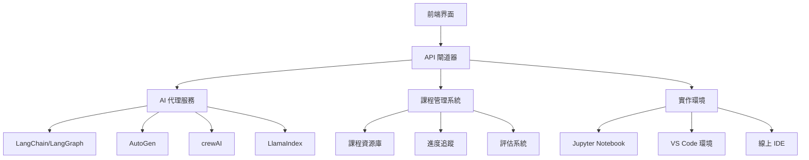

# 🌟 善向技術 [內部識別代號]

## AI 代理學習平台 - 2026 年人工智慧代理建構指南

**專案狀態**: 🚀 **開發中**
**版本**: 1.0.0-alpha
**專案代號**: ShanXiang-Tech-2026

---

## 📋 專案概述

善向技術是一個專門針對人工智慧代理學習和實作的綜合平台。隨著 AI 代理在自動化、決策制定和智慧工作流程中扮演越來越重要的角色，本平台提供完整的學習路徑和實作工具，幫助開發者、產品經理和企業家掌握 AI 代理建構的核心技能。

### 🎯 核心使命

- **普及 AI 代理知識**：讓更多人能夠理解和應用 AI 代理技術
- **提供實戰經驗**：通過實際項目培養建構 AI 代理的能力
- **促進技術創新**：探索 AI 代理在各行業的應用可能性
- **建立學習社群**：創建一個交流和合作的技術社群

---

## 🧠 AI 代理學習資源

### 📚 2026 年不容錯過的 9 門免費課程

#### 🧠 1. 使用 crewAI 建構多 AI 智能體系統
- **平台**: DeepLearning.AI
- **講師**: João Moura
- **時長**: 2 小時 14 分鐘
- **重點**: 學習 crewAI 框架建構多智能體協作系統
- **適用對象**: 對智能體團隊協作和角色委派感興趣者
- **連結**: https://learn.deeplearning.ai/courses/multi-ai-agent-systems-with-crewai

#### 🧩 2. 提示工程基礎（AWS）
- **平台**: SkillBuilder.AWS
- **講師**: 亞馬遜團隊
- **時長**: 3 小時 50 分鐘
- **重點**: 提示設計、上下文管理和工具使用
- **適用對象**: AI 代理開發基礎
- **連結**: https://explore.skillbuilder.aws/learn/course/3/play/1/introduction-to-prompt-engineering

#### 🔗 3. LangGraph 簡介
- **平台**: Academy.LangChain.com
- **講師**: Harrison Chase
- **時長**: 5 小時 58 分鐘
- **重點**: 基於圖的編排框架，複雜代理工作流程
- **適用對象**: LangChain 用戶和代理開發者
- **連結**: https://academy.langchain.com/courses/introduction-to-langgraph

#### 🎓 4. 大型語言模型代理 MOOC
- **平台**: LLMAgents-Learning.org
- **講師**: Dawn Song
- **時長**: 4 小時 4 分鐘
- **重點**: 代理架構、決策循環、多代理協作
- **適用對象**: 學術學習者和研究人員
- **連結**: https://llmagents-learning.org/

#### 🧠 5. LangGraph 中的 AI 代理
- **平台**: DeepLearning.AI
- **講師**: Harrison Chase
- **時長**: 1 小時 32 分鐘
- **重點**: 記憶體、工具和回饋循環實現
- **適用對象**: LangChain 高級用戶
- **連結**: https://learn.deeplearning.ai/courses/ai-agents-in-langgraph

#### 🎥 6. 使用多模態模型建構 AI 智能體
- **平台**: Learn.Nvidia.com
- **講師**: Nvidia
- **時長**: 7 小時 10 分鐘
- **重點**: 處理文字、圖像和音訊的智能體
- **適用對象**: 多模態 AI 應用開發者
- **連結**: https://learn.nvidia.com/courses/building-ai-agents-with-multimodal-models

#### 🧠 7. 使用 AutoGen 建構 AI 智能體設計模式
- **平台**: DeepLearning.AI
- **講師**: 王馳
- **時長**: 1 小時 25 分鐘
- **重點**: 可重複使用設計模式、角色提示、重試循環
- **適用對象**: AutoGen 框架學習者
- **連結**: https://learn.deeplearning.ai/courses/building-agentic-rag-with-autogen

#### 🧠 8. LLM 作為作業系統：智能體記憶
- **平台**: DeepLearning.AI
- **講師**: Charles Packer
- **時長**: 1 小時 22 分鐘
- **重點**: 短期記憶和長期記憶實現
- **適用對象**: 記憶體管理學習者
- **連結**: https://learn.deeplearning.ai/courses/llms-as-operating-systems

#### 📚 9. 使用 LlamaIndex 建構智慧型 RAG
- **平台**: DeepLearning.AI
- **講師**: Jerry Liu
- **時長**: 44 分鐘
- **重點**: 檢索增強生成與智慧工作流程結合
- **適用對象**: RAG 和知識庫智能體開發者
- **連結**: https://learn.deeplearning.ai/courses/building-llm-applications-with-llamaindex

---

## 🛠️ 技術架構

### 核心技術棧



### 主要元件

#### 🤖 AI 代理服務
- 多框架支持 (LangChain, AutoGen, crewAI)
- 代理編排和協作
- 工具整合和記憶體管理

#### 📚 課程管理系統
- 課程資源組織和分發
- 學習進度追蹤
- 實作練習和評估

#### 🏭 實作環境
- 雲端開發環境
- 即時代碼執行
- 協作編程功能

---

## 📁 專案結構

```
shan-xiang-tech/
├── docs/                      # 文檔
│   ├── curriculum/           # 課程大綱
│   ├── tutorials/            # 教學指南
│   └── api/                  # API 文檔
├── courses/                  # 課程資源
│   ├── langchain-basics/     # LangChain 基礎
│   ├── autogen-patterns/     # AutoGen 設計模式
│   └── multimodal-agents/    # 多模態代理
├── labs/                     # 實作實驗室
│   ├── crewai-multiagent/    # 多代理系統
│   ├── langgraph-workflows/  # 工作流程編排
│   └── rag-agents/           # RAG 代理
├── services/                 # 後端服務
│   ├── agent-runner/         # 代理執行器
│   ├── course-manager/       # 課程管理器
│   └── evaluation-engine/    # 評估引擎
├── web/                      # 前端應用
│   ├── components/           # React 元件
│   ├── pages/                # 頁面
│   └── utils/                # 工具函數
└── tools/                    # 開發工具
    ├── scripts/              # 建構腳本
    ├── docker/               # 容器配置
    └── ci/                   # CI/CD 配置
```

---

## 🚀 快速開始

### 環境設置

```bash
# 1. 克隆專案
git clone https://github.com/shan-xiang-tech/ai-agents-platform.git
cd shan-xiang-tech

# 2. 安裝依賴
npm install

# 3. 啟動開發環境
npm run dev

# 4. 訪問平台
open http://localhost:3000
```

### 第一個 AI 代理

```python
from langchain.agents import initialize_agent, Tool
from langchain.llms import OpenAI

# 創建簡單的 AI 代理
llm = OpenAI(temperature=0)
tools = [/* 定義工具 */]

agent = initialize_agent(
    tools,
    llm,
    agent="zero-shot-react-description",
    verbose=True
)

# 執行任務
result = agent.run("分析這份 ESG 報告的關鍵指標")
```

---

## 📊 學習路徑

### 🏆 初學者路徑 (4-6 周)

1. **第 1-2 周**: Python 基礎與提示工程
   - 課程: 提示工程基礎 (AWS)
   - 實作: 基本提示設計練習

2. **第 3-4 周**: LangChain 入門
   - 課程: LangGraph 簡介
   - 實作: 簡單的 LangChain 代理

### 🏆 中級路徑 (6-8 周)

3. **第 5-6 周**: 多代理系統
   - 課程: 使用 crewAI 建構多 AI 智能體系統
   - 實作: 協作代理團隊

4. **第 7-8 周**: 進階框架
   - 課程: 使用 AutoGen 建構 AI 智能體設計模式
   - 實作: 自訂代理模式

### 🏆 高級路徑 (8-12 周)

5. **第 9-10 周**: 多模態代理
   - 課程: 使用多模態模型建構 AI 智能體
   - 實作: 圖像和文字處理代理

6. **第 11-12 周**: 企業應用
   - 課程: 使用 LlamaIndex 建構智慧型 RAG
   - 實作: 企業級知識庫代理

---

## 🔧 開發工具

### 本地開發

```bash
# 安裝開發依賴
npm install

# 啟動開發服務器
npm run dev

# 運行測試
npm test

# 建構生產版本
npm run build
```

### Docker 環境

```bash
# 建構容器
docker build -t shan-xiang-tech .

# 運行容器
docker run -p 3000:3000 shan-xiang-tech

# 使用 Docker Compose
docker-compose up -d
```

---

## 🤝 貢獻指南

歡迎參與善向技術專案的開發！

### 貢獻類型

- 🐛 **錯誤修復**: 修復程式碼錯誤
- ✨ **新功能**: 新增功能或改進
- 📚 **文檔**: 改進文檔
- 🧪 **測試**: 新增或改進測試
- 🎨 **UI/UX**: 改進用戶界面

### 貢獻流程

1. Fork 本專案
2. 建立功能分支 (`git checkout -b feature/AmazingFeature`)
3. 提交更改 (`git commit -m 'Add some AmazingFeature'`)
4. 推送到分支 (`git push origin feature/AmazingFeature`)
5. 開啟 Pull Request

---

## 📈 專案進度

- [x] 專案架構設計
- [x] 課程資源整合
- [ ] 前端界面開發
- [ ] 代理執行環境
- [ ] 課程管理系統
- [ ] 評估和認證系統
- [ ] 社群功能

---

## 📞 聯絡資訊

**專案負責人**: 善向技術團隊
**技術支持**: tech@shan-xiang.com
**學習社群**: https://community.shan-xiang.com
**GitHub**: https://github.com/shan-xiang-tech

---

## 🙏 致謝

感謝所有為 AI 代理技術發展做出貢獻的開源社群和教育平台：

- **DeepLearning.AI** - 提供優質的 AI 課程
- **LangChain** - 開源 AI 應用框架
- **Microsoft AutoGen** - 多代理協作框架
- **NVIDIA** - GPU 加速和多模態支持

**讓我們一起探索 AI 代理的無限可能！** 🚀

---

*本專案由善向技術團隊維護，致力於普及 AI 代理技術知識。*