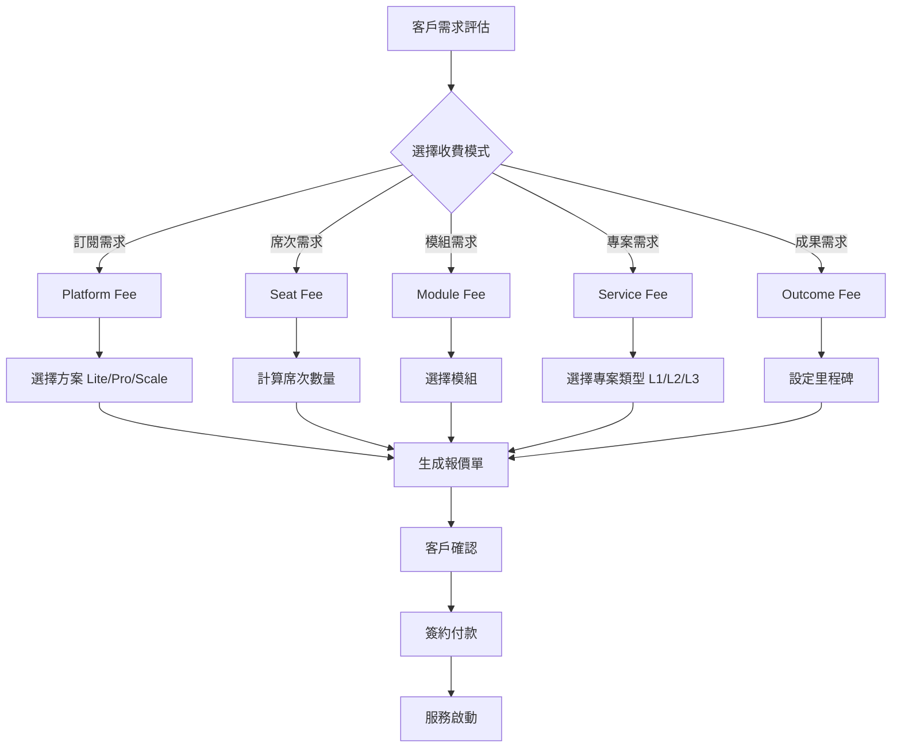
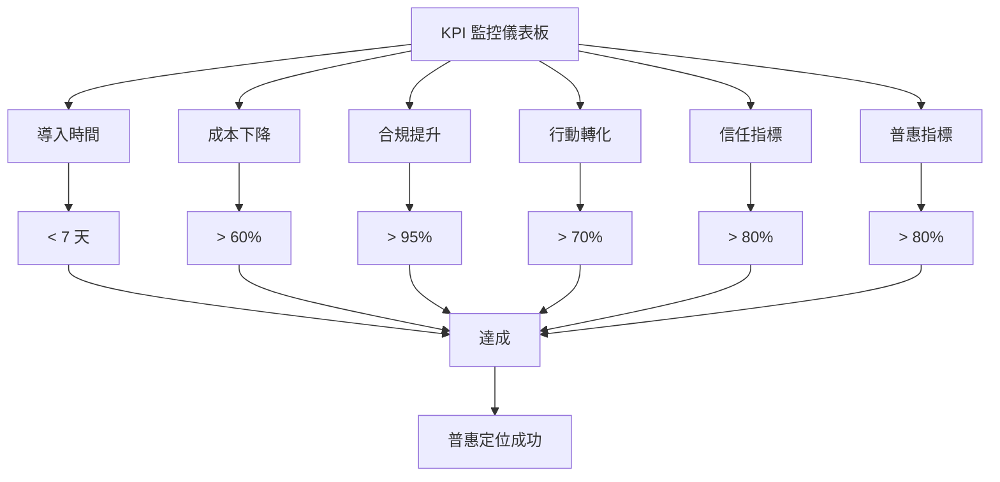
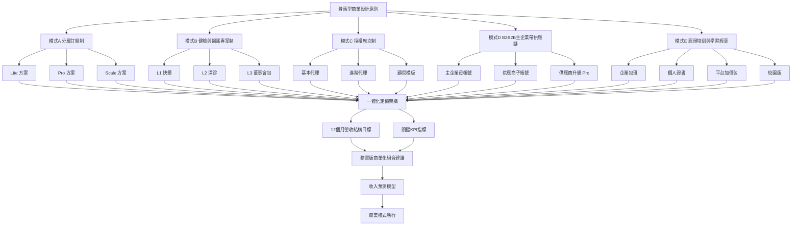
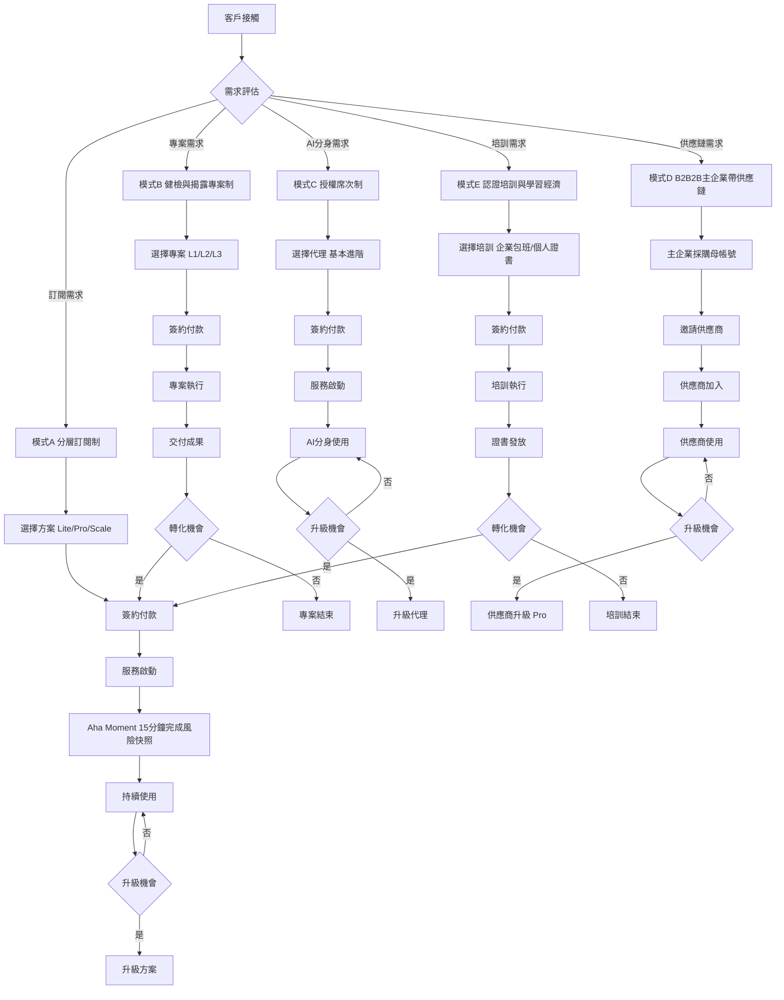
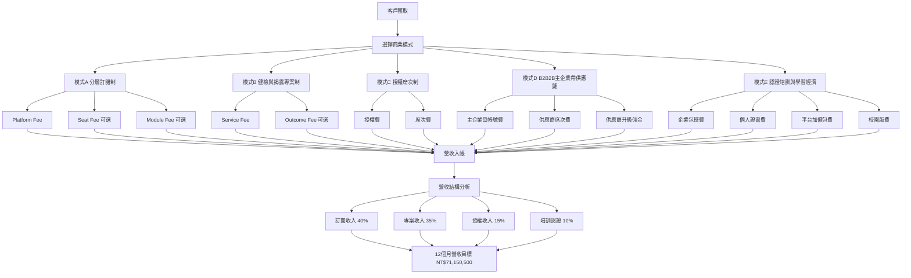

# ESG GO 商業模式地圖

**文件版本：** v1.0  
**建立日期：** 2026-02-11  
**文件狀態：** 正式版  
**適用範圍：** ESGss JunAiKey 平台商業模式規劃

---

## 📋 目錄

1. [執行摘要](#1-執行摘要)
2. [普惠型商業設計原則](#2-普惠型商業設計原則)
3. [商業模式地圖](#3-商業模式地圖)
   - [模式A：分層訂閱制（普惠核心）](#模式a分層訂閱制普惠核心)
   - [模式B：健檢與揭露專案制（短期現金流引擎）](#模式b健檢與揭露專案制短期現金流引擎)
   - [模式C：授權＋席次制（AI分身/代理商店）](#模式c授權席次制ai分身代理商店)
   - [模式D：B2B2B主企業帶供應鏈（最快放大普惠）](#模式db2b2b主企業帶供應鏈最快放大普惠)
   - [模式E：認證/培訓與學習經濟](#模式e認證培訓與學習經濟)
4. [一體化定價架構](#4-一體化定價架構)
5. [12個月營收結構目標](#5-12個月營收結構目標)
6. [關鍵KPI指標](#6-關鍵kpi指標)
7. [務實版商業化組合建議](#7-務實版商業化組合建議)
8. [收入預測模型](#8-收入預測模型)
9. [商業模式地圖流程圖](#9-商業模式地圖流程圖)

---

## 1. 執行摘要

### 1.1 文件目的

本文件為 ESGss JunAiKey 平台建立完整的商業模式地圖，基於普惠型商業設計原則，規劃 5 種互補的商業模式，以實現中小企業 ESG 服務的普及化與可持續營運。

### 1.2 核心定位

ESGss JunAiKey 定位為 **「普惠型 ESG 永續發展平台」**，透過 AI 驅動的自動化工具與專業服務結合，大幅降低中小企業採用 ESG 的門檻與成本。

### 1.3 商業模式概覽

| 模式 | 核心價值 | 目標客群 | 收費方式 | 優先級 |
|------|----------|----------|----------|--------|
| **模式A** | 分層訂閱、穩定現金流 | 中小企業（10-300人） | 月/年訂閱制 | P0 |
| **模式B** | 健檢專案、快速成交 | 首次揭露企業 | 專案制收費 | P0 |
| **模式C** | AI分身、可規模化 | 有內部ESG窗口的企業 | 授權＋席次制 | P1 |
| **模式D** | 供應鏈網絡、低CAC | 大型買方＋供應商 | B2B2B模式 | P1 |
| **模式E** | 培訓認證、品牌擴散 | 企業＋個人 | 培訓/認證收費 | P2 |

### 1.4 與現有文件的關聯

| 關聯文件 | 關聯內容 |
|----------|----------|
| [`ESG_GO_PRODUCT_ROADMAP.md`](ESG_GO_PRODUCT_ROADMAP.md) | 24 項服務功能對接 |
| [`ESG_GO_USER_JOURNEYS.md`](ESG_GO_USER_JOURNEYS.md) | 6 種 Persona 對接 |
| [`ESG_GO_POC_EXECUTION_PLAN.md`](ESG_GO_POC_EXECUTION_PLAN.md) | 4 個 POC 方案對接 |

---

## 2. 普惠型商業設計原則

### 2.1 原則概覽

| 原則 | 核心內容 | 應用場景 |
|------|----------|----------|
| **Land and Expand** | 先低價進入（工具化），再升級（顧問化/治理化） | 模式A、模式B |
| **雙引擎營收** | SaaS 經常性收入 + 高毛利專業服務 | 所有模式 |
| **共享而非重做** | 模板、代理、報告骨架可重複利用，壓低交付成本 | 模式B、模式C |
| **結果導向收費** | 部分方案採里程碑/成果付費，降低中小企業決策壓力 | 模式B、模式D |
| **主企業帶供應鏈** | 用 B2B2B 降低 SME 客獲成本 | 模式D |

### 2.2 Land and Expand 原則

#### 2.2.1 原則說明

透過低門檻的入門方案快速獲取客戶，再透過升級路徑逐步提升客戶價值與營收。

#### 2.2.2 實施策略

| 階段 | 入門方案 | 升級路徑 | 目標轉化率 |
|------|----------|----------|------------|
| **認知階段** | 免費 L1 健檢 + 商情摘要 | Pro 訂閱 | 30% |
| **採用階段** | Lite 訂閱（月費） | Scale 訂閱 | 40% |
| **深化階段** | 基本服務 | 顧問服務/專案制 | 25% |

#### 2.2.3 成功案例

- **Lite → Pro 轉化**：透過「15分鐘完成第一份風險快照」的 Aha moment 觸發升級
- **Pro → Scale 轉化**：透過 Board Copilot 與 Evidence Vault 的差異化功能吸引升級

### 2.3 雙引擎營收原則

#### 2.3.1 原則說明

結合 SaaS 經常性收入與高毛利專業服務，實現現金流穩定與利潤最大化。

#### 2.3.2 營收結構

| 營收類型 | 佔比 | 毛利率 | 現金流特點 |
|----------|------|--------|------------|
| **SaaS 訂閱** | 40% | 85% | 穩定、可預測 |
| **專案服務** | 35% | 45% | 波動、高客單 |
| **授權收入** | 15% | 90% | 高毛利、可規模 |
| **培訓認證** | 10% | 60% | 季節性、品牌擴散 |

#### 2.3.3 實施策略

1. **SaaS 訂閱**：建立穩定現金流基礎
2. **專案服務**：提供高價值、高客單的深度服務
3. **交叉銷售**：專案客戶轉化為訂閱客戶
4. **升級路徑**：訂閱客戶升級為專案客戶

### 2.4 共享而非重做原則

#### 2.4.1 原則說明

透過模板化、標準化、自動化，將 80% 的交付流程標準化，顧問只處理 20% 的高價值判讀工作。

#### 2.4.2 可重複利用資產

| 資產類型 | 內容 | 重複利用率 | 成本降低 |
|----------|------|------------|----------|
| **模板庫** | 健檢問卷、報告模板、合規清單 | 95% | 70% |
| **AI 代理** | 法遵長分身、碳管理長分身、策略長分身 | 90% | 80% |
| **報告骨架** | GRI/SASB/TCFD/ISSB 標準框架 | 100% | 60% |
| **證據結構** | Evidence Vault 標準化證據類型 | 85% | 50% |

#### 2.4.3 實施策略

1. **建立模板庫**：累積 50+ 行業模板
2. **AI 自動化**：80% 流程由 AI 自動完成
3. **顧問聚焦**：顧問只處理高價值判讀與策略建議
4. **持續優化**：基於用戶反饋持續優化模板與 AI 模型

### 2.5 結果導向收費原則

#### 2.5.1 原則說明

部分方案採用里程碑/成果付費，降低中小企業決策壓力，提升採用意願。

#### 2.5.2 收費模式

| 收費模式 | 適用場景 | 里程碑設定 | 風險控制 |
|----------|----------|------------|----------|
| **里程碑付費** | L2/L3 健檢專案 | 健檢完成、報告生成、揭露提交 | 分階段收費 |
| **成果付費** | 供應鏈改善專案 | 供應商參與率、合規通過率 | 設定最低門檻 |
| **混合付費** | 綜合服務包 | 基礎訂閱 + 成果獎勵 | 風險共擔 |

#### 2.5.3 實施策略

1. **明確里程碑**：設定可量化、可驗證的里程碑
2. **風險控制**：設定最低門檻與上限
3. **透明化**：向客戶清楚說明收費邏輯
4. **靈活調整**：根據客戶需求調整收費模式

### 2.6 主企業帶供應鏈原則

#### 2.6.1 原則說明

透過 B2B2B 模式，由大型買方企業帶動其供應鏈中小企業採用平台，大幅降低 SME 客獲成本。

#### 2.6.2 實施策略

| 策略 | 具體做法 | 預期效果 |
|------|----------|----------|
| **主企業採購** | 主企業購買母帳號 + 供應商席次包 | 降低 SME CAC 60% |
| **供應商激勵** | 完成填報獲得 Pro 版免費試用 | 提升參與率 40% |
| **合規證明** | 提供可分享給客戶的合規證明 | 增加 SME 採用動機 |
| **網絡效應** | 供應商間形成學習與競爭效應 | 提升留存率 30% |

#### 2.6.3 成功案例

- **電子製造業試點**：1 家主企業 + 30 家供應商，供應商參與率達 75%
- **零售業擴散**：3 家零售商帶動 100+ 供應商加入平台

---

## 3. 商業模式地圖

### 模式A：分層訂閱制（普惠核心）

#### 3.1.1 模式概述

分層訂閱制是 ESGss JunAiKey 的核心商業模式，透過三層訂閱方案滿足不同規模企業的需求，實現普惠定位與穩定現金流。

#### 3.1.2 適用產品

| 產品類別 | 具體服務 | Lite | Pro | Scale |
|----------|----------|------|-----|-------|
| **商情系統** | 產業趨勢、競爭對手分析 | ✅ 基礎版 | ✅ 進階版 | ✅ 深度版 |
| **總體衝擊** | 法規時間表、風險評估 | ✅ 基礎版 | ✅ 進階版 | ✅ 深度版 |
| **基本健檢** | L1 快篩健康檢查 | ✅ | ✅ | ✅ |
| **AI分身** | 基礎 AI 助理 | ✅ 有限額度 | ✅ 標準額度 | ✅ 無限額度 |
| **遊戲化學習** | 員工素養提升 | ❌ | ✅ 基礎版 | ✅ 進階版 |
| **Board Copilot** | 董事會決策支援 | ❌ | ❌ | ✅ |
| **Evidence Vault** | 證據管理 | ❌ | ✅ 基礎版 | ✅ 進階版 |
| **專家分身** | 法遵長/碳管理長分身 | ❌ | ❌ | ✅ 席次制 |

#### 3.1.3 目標客群

| 客群類型 | 公司規模 | ESG 成熟度 | 推薦方案 |
|----------|----------|------------|----------|
| **入門型企業** | 10-50人 | 初學者 | Lite |
| **成長型企業** | 50-200人 | 進階者 | Pro |
| **進階型企業** | 200-500人 | 專業者 | Scale |

#### 3.1.4 方案詳情

##### Lite 方案（入門）

| 項目 | 內容 |
|------|------|
| **定價** | NT$2,990/月 或 NT$29,900/年（年付 8.3 折） |
| **適用對象** | 10-50人企業、ESG 初學者 |
| **核心功能** | ESG 商情系統（基礎版）、總體環境衝擊（基礎版）、L1 健檢、AI 助理（每月 100 次對話） |
| **席次限制** | 5 個用戶席次 |
| **儲存空間** | 5 GB |
| **支援服務** | 郵件支援（48 小時回應） |
| **Aha Moment** | 15 分鐘完成第一份風險快照 |

##### Pro 方案（成長）

| 項目 | 內容 |
|------|------|
| **定價** | NT$9,990/月 或 NT$99,900/年（年付 8.3 折） |
| **適用對象** | 50-200人企業、ESG 進階者 |
| **核心功能** | Lite 所有功能 + ESG 商情系統（進階版）、總體環境衝擊（進階版）、L2 健檢、AI 助理（每月 500 次對話）、遊戲化素養（基礎版）、Evidence Vault（基礎版） |
| **席次限制** | 20 個用戶席次 |
| **儲存空間** | 50 GB |
| **支援服務** | 郵件支援（24 小時回應）+ 線上客服 |
| **升級誘因** | Board Copilot 試用、專家分身體驗 |

##### Scale 方案（進階）

| 項目 | 內容 |
|------|------|
| **定價** | NT$29,990/月 或 NT$299,900/年（年付 8.3 折） |
| **適用對象** | 200-500人企業、ESG 專業者 |
| **核心功能** | Pro 所有功能 + ESG 商情系統（深度版）、總體環境衝擊（深度版）、L3 健檢、AI 助理（無限額度）、遊戲化素養（進階版）、Evidence Vault（進階版）、Board Copilot、專家分身席次（每月 10 小時） |
| **席次限制** | 無限制 |
| **儲存空間** | 500 GB |
| **支援服務** | 專屬客戶成功經理 + 24/7 電話支援 |
| **升級誘因** | 顧問服務折扣、產業專版包優先權 |

#### 3.1.5 定價邏輯

| 定價因素 | 說明 |
|----------|------|
| **公司規模** | 依員工人數分級，10-50人、50-200人、200-500人 |
| **功能包** | 依功能深度分級，基礎版、進階版、深度版 |
| **席次數量** | Lite 5 席、Pro 20 席、Scale 無限制 |
| **使用額度** | AI 對話次數、專家分身時數、儲存空間 |

#### 3.1.6 優點

1. **現金流穩定**：訂閱制提供可預測的經常性收入
2. **可普及**：低門檻入門方案讓更多中小企業能夠採用
3. **升級路徑清晰**：三層方案提供明確的升級路徑
4. **客戶黏著度高**：訂閱制客戶黏著度優於專案制

#### 3.1.7 風險

1. **Onboarding 複雜**：若導入流程複雜，轉換率會下降
2. **價格敏感**：中小企業對價格敏感，需平衡價值與價格
3. **競爭激烈**：SaaS 市場競爭激烈，需持續差異化

#### 3.1.8 控管策略

| 控管措施 | 具體做法 | 目標指標 |
|----------|----------|----------|
| **Aha Moment 設計** | 首月必須有「15分鐘完成第一份風險快照」的體驗 | 轉換率 > 30% |
| **簡化 Onboarding** | 一鍵註冊、拖曳上傳、引導式填寫 | 啟用率 > 70% |
| **價值傳達** | 清楚展示 ROI、成功案例、客戶見證 | 付費轉化 > 10% |
| **持續優化** | 基於用戶反饋持續優化產品體驗 | 滿意度 > 4.2/5 |

#### 3.1.9 收入預測模型

| 指標 | Lite | Pro | Scale | 總計 |
|------|------|-----|-------|------|
| **目標客戶數（12個月）** | 200 家 | 100 家 | 30 家 | 330 家 |
| **平均客單價（年）** | NT$29,900 | NT$99,900 | NT$299,900 | - |
| **年收入預測** | NT$5,980,000 | NT$9,990,000 | NT$8,997,000 | NT$24,967,000 |
| **佔總營收比例** | 24% | 40% | 36% | 100% |

---

### 模式B：健檢與揭露專案制（短期現金流引擎）

#### 3.2.1 模式概述

健檢與揭露專案制是短期現金流引擎，透過一次性專案收費快速獲取營收，同時作為訂閱制的導入入口。

#### 3.2.2 適用產品

| 產品類別 | 具體服務 | L1 | L2 | L3 |
|----------|----------|----|----|----|
| **健康檢查** | ESG 健康評估 | ✅ 快篩 | ✅ 深診 | ✅ 董事會包 |
| **報告生成** | 多標準報告生成 | ❌ | ✅ | ✅ |
| **法遵補強** | 法規合規檢查與改善 | ❌ | ✅ | ✅ |
| **QA 分數** | Report QA Score | ❌ | ✅ | ✅ |
| **顧問諮詢** | 專業顧問諮詢 | ❌ | ❌ | ✅ |

#### 3.2.3 目標客群

| 客群類型 | 觸發情境 | 推薦方案 |
|----------|----------|----------|
| **首次揭露企業** | 首次需要發布 ESG 報告 | L2 深診 |
| **被客戶要求揭露** | 大客戶要求供應商提供 ESG 報告 | L1 快篩 |
| **被金流要求揭露** | 銀行/投資人要求提供 ESG 資訊 | L2 深診 |
| **董事會報告需求** | 需要向董事會報告 ESG 進度 | L3 董事會包 |

#### 3.2.4 收費方式

##### L1 快篩（固定價）

| 項目 | 內容 |
|------|------|
| **定價** | NT$49,900（一次性） |
| **適用對象** | 首次做揭露、被客戶/金流要求揭露的企業 |
| **服務內容** | L1 健康檢查（10-15 題）、風險快照報告、改善建議清單 |
| **交付時間** | 3-5 個工作日 |
| **交付物** | 風險快照報告（PDF）、改善建議清單（Excel） |
| **升級誘因** | L2 深診折扣 20%、Pro 訂閱免費試用 1 個月 |

##### L2 深診（固定價 + 模組加價）

| 項目 | 內容 |
|------|------|
| **基礎定價** | NT$149,900（一次性） |
| **適用對象** | 需要深度健康檢查、報告生成的企業 |
| **基礎服務內容** | L2 健康檢查（50-70 題）、多標準報告生成（GRI/SASB）、QA Score 評分、法遵補強檢查 |
| **模組加價** | 碳盤查模組 +NT$49,900、供應鏈模組 +NT$49,900、治理模組 +NT$29,900 |
| **交付時間** | 2-3 週 |
| **交付物** | 深度健康檢查報告（PDF）、多標準報告（Word/PDF）、QA Score 評分報告、改善計劃（Excel） |
| **升級誘因** | L3 董事會包折扣 15%、Pro 訂閱免費試用 2 個月 |

##### L3 董事會包（高單價季約）

| 項目 | 內容 |
|------|------|
| **定價** | NT$499,900/季（3 個月） |
| **適用對象** | 需要定期向董事會報告 ESG 進度的企業 |
| **服務內容** | L2 所有服務 + Board Copilot、專家分身（每月 20 小時）、董事會簡報生成、季度進度追蹤 |
| **交付時間** | 持續服務（每季度交付） |
| **交付物** | 季度 ESG 報告、董事會簡報（PPT）、進度追蹤儀表板、專家諮詢記錄 |
| **升級誘因** | Scale 訂閱折扣 20%、產業專版包優先權 |

#### 3.2.5 優點

1. **成交快**：專案制決策週期短，可快速成交
2. **客單高**：單次專案客單價高，可快速提升營收
3. **可導入訂閱**：專案客戶可轉化為訂閱客戶
4. **建立信任**：透過專案服務建立客戶信任

#### 3.2.6 風險

1. **人力密集**：專案制需要大量人力投入
2. **現金流波動**：專案制營收波動較大
3. **客戶黏著度低**：專案制客戶黏著度低於訂閱制
4. **交付壓力**：專案交付時間壓力大

#### 3.2.7 控管策略

| 控管措施 | 具體做法 | 目標指標 |
|----------|----------|----------|
| **流程模板化** | 把 80% 流程模板化（自動檢查＋標準輸出） | 交付效率提升 60% |
| **顧問聚焦** | 顧問只做 20% 高價值判讀 | 顧問利用率提升 40% |
| **AI 自動化** | AI 自動完成健檢評估、報告生成 | AI 自動化率 > 80% |
| **品質控制** | 建立 QA Score 評分機制 | 報告品質 > 4.5/5 |
| **轉化路徑** | 專案客戶轉化為訂閱客戶 | 轉化率 > 30% |

#### 3.2.8 收入預測模型

| 指標 | L1 快篩 | L2 深診 | L3 董事會包 | 總計 |
|------|---------|---------|-------------|------|
| **目標專案數（12個月）** | 50 個 | 30 個 | 10 個 | 90 個 |
| **平均客單價** | NT$49,900 | NT$199,800（含模組） | NT$1,499,700（3 季） | - |
| **年收入預測** | NT$2,495,000 | NT$5,994,000 | NT$14,997,000 | NT$23,486,000 |
| **佔總營收比例** | 11% | 26% | 64% | 100% |

---

### 模式C：授權＋席次制（AI分身/代理商店）

#### 3.3.1 模式概述

授權＋席次制是可規模化的商業模式，透過 AI 分身與代理商店的授權收費，實現邊際成本極低的規模化擴張。

#### 3.3.2 適用產品

| 產品類別 | 具體服務 | 基本代理 | 進階代理 | 顧問模板 |
|----------|----------|----------|----------|----------|
| **法遵長分身** | 法規遵循諮詢 | ✅ | ✅ | - |
| **碳管理長分身** | 碳排放管理諮詢 | ✅ | ✅ | - |
| **策略長分身** | ESG 策略諮詢 | ✅ | ✅ | - |
| **顧問模板市集** | 專業顧問模板 | ❌ | ❌ | ✅ |

#### 3.3.3 目標客群

| 客群類型 | 公司特徵 | 核心需求 | 推薦方案 |
|----------|----------|----------|----------|
| **有內部 ESG 窗口的企業** | 有專職 ESG 人員但缺專家能力 | 專業諮詢支援 | 進階代理 |
| **顧問公司** | 需要提升交付效率 | 模板與工具支援 | 顧問模板 |
| **中小企業** | 無專職 ESG 人員 | 基礎諮詢支援 | 基本代理 |

#### 3.3.4 收費方式

##### 基本代理（含每月 token/任務額度）

| 項目 | 內容 |
|------|------|
| **定價** | NT$4,990/月 或 NT$49,900/年（年付 8.3 折） |
| **適用對象** | 有基礎 ESG 需求的中小企業 |
| **服務內容** | 法遵長分身（每月 500 token）、碳管理長分身（每月 500 token）、策略長分身（每月 500 token） |
| **Token 額度** | 每月 1,500 token（可跨分身使用） |
| **支援服務** | 郵件支援（48 小時回應） |
| **升級誘因** | 進階代理折扣 15% |

##### 進階代理（含專家覆核時數）

| 項目 | 內容 |
|------|------|
| **定價** | NT$14,990/月 或 NT$149,900/年（年付 8.3 折） |
| **適用對象** | 有專職 ESG 人員但缺專家能力的企業 |
| **服務內容** | 基本代理所有功能 + 專家覆核（每月 5 小時）、優先回應（24 小時）、定制化建議 |
| **Token 額度** | 每月 5,000 token（可跨分身使用） |
| **專家覆核** | 每月 5 小時專家覆核時數 |
| **支援服務** | 專屬客戶成功經理 + 24/7 線上支援 |
| **升級誘因** | 顧問模板市集折扣 20% |

##### 顧問模板加購（一次性或訂閱）

| 項目 | 內容 |
|------|------|
| **一次性購買** | NT$9,900/模板（永久使用） |
| **訂閱制** | NT$2,990/月（全模板庫無限使用） |
| **適用對象** | 顧問公司、需要提升交付效率的企業 |
| **模板類型** | 健檢問卷模板、報告模板、合規清單模板、改善計劃模板 |
| **模板數量** | 50+ 行業模板、持續更新 |
| **升級誘因** | 進階代理折扣 10% |

#### 3.3.5 優點

1. **可規模化**：AI 分身可無限複製，邊際成本極低
2. **邊際成本低**：每增加一個客戶的成本極低
3. **高毛利**：授權收費毛利率高達 90%
4. **持續收入**：訂閱制提供持續收入

#### 3.3.6 風險

1. **品質控制**：AI 分身的回答品質需要嚴格控制
2. **責任邊界**：AI 建議的責任邊界需要明確
3. **用戶信任**：用戶對 AI 建議的信任度需要建立
4. **競爭激烈**：AI 分身市場競爭激烈

#### 3.3.7 控管策略

| 控管措施 | 具體做法 | 目標指標 |
|----------|----------|----------|
| **可信度等級** | 每份建議標示可信度等級（高/中/低） | 高可信度建議 > 80% |
| **證據鏈** | 每份建議提供證據鏈與參考來源 | 證據鏈完整率 > 90% |
| **人工覆核點** | 關鍵決策點設置人工覆核 | 人工覆核率 > 20% |
| **責任聲明** | 明確聲明 AI 建議的責任邊界 | 用戶理解率 > 95% |
| **持續優化** | 基於用戶反饋持續優化 AI 模型 | 滿意度 > 4.3/5 |

#### 3.3.8 收入預測模型

| 指標 | 基本代理 | 進階代理 | 顧問模板 | 總計 |
|------|----------|----------|----------|------|
| **目標客戶數（12個月）** | 150 家 | 50 家 | 30 家 | 230 家 |
| **平均客單價（年）** | NT$49,900 | NT$149,900 | NT$35,880（訂閱平均） | - |
| **年收入預測** | NT$7,485,000 | NT$7,495,000 | NT$1,076,400 | NT$16,056,400 |
| **佔總營收比例** | 47% | 47% | 6% | 100% |

---

### 模式D：B2B2B主企業帶供應鏈（最快放大普惠）

#### 3.4.1 模式概述

B2B2B 主企業帶供應鏈是放大普惠的最快模式，透過大型買方企業帶動其供應鏈中小企業採用平台，大幅降低 SME 客獲成本。

#### 3.4.2 適用產品

| 產品類別 | 具體服務 | 主企業 | 供應商 |
|----------|----------|--------|--------|
| **供應鏈協作網** | 供應鏈管理平台 | ✅ 母帳號 | ✅ 子帳號 |
| **共同溯源** | 供應鏈 ESG 溯源 | ✅ | ✅ |
| **供應商訓練** | 遊戲化訓練 | ✅ | ✅ |
| **合規證明** | 可分享的合規證明 | ✅ | ✅ |

#### 3.4.3 目標客群

| 客群類型 | 公司特徵 | 核心需求 | 推薦方案 |
|----------|----------|----------|----------|
| **大型買方企業** | 上市櫃公司、大型製造商 | 供應鏈 ESG 管理 | 主企業母帳號 |
| **供應鏈中小企業** | 供應商、分包商 | 滿足客戶 ESG 要求 | 供應商子帳號 |

#### 3.4.4 收費方式

##### 主企業母帳號

| 項目 | 內容 |
|------|------|
| **定價** | NT$199,900/年（基礎包）+ NT$4,990/供應商席次/年 |
| **適用對象** | 大型買方企業、上市櫃公司 |
| **基礎包內容** | 供應鏈協作網（母帳號）、共同溯源、供應商訓練平台、合規證明生成、專屬客戶成功經理 |
| **供應商席次** | 每個供應商席次 NT$4,990/年（Lite 版功能） |
| **最低席次** | 10 個供應商席次起 |
| **升級誘因** | 供應商升級 Pro 版，主企業獲得 20% 佣金 |

##### 供應商子帳號（Lite 版）

| 項目 | 內容 |
|------|------|
| **定價** | 由主企業支付（NT$4,990/年）或供應商自付（NT$2,990/年） |
| **適用對象** | 供應鏈中小企業 |
| **服務內容** | 供應鏈協作網（子帳號）、簡版填報、合規證明生成、基礎訓練 |
| **席次限制** | 3 個用戶席次 |
| **升級誘因** | 升級 Pro 版（NT$9,990/年），獲得完整功能 |

##### 供應商升級 Pro 版

| 項目 | 內容 |
|------|------|
| **定價** | NT$9,990/年（供應商專屬優惠價） |
| **適用對象** | 需要完整功能的供應商 |
| **服務內容** | Lite 版所有功能 + ESG 商情系統、總體環境衝擊、L1 健檢、AI 助理、Evidence Vault（基礎版） |
| **席次限制** | 10 個用戶席次 |
| **升級誘因** | 主企業獲得 20% 佣金 |

#### 3.4.5 優點

1. **大幅降低 SME CAC**：主企業帶動供應商加入，降低 SME 客獲成本 60%
2. **網絡效應**：供應商間形成學習與競爭效應
3. **快速擴散**：透過主企業快速擴散到整個供應鏈
4. **雙贏模式**：主企業獲得供應鏈透明度，供應商獲得合規證明

#### 3.4.6 風險

1. **主企業採購周期長**：大型企業採購周期長，影響擴散速度
2. **供應商參與度低**：供應商可能不願意參與
3. **數據隱私問題**：供應商可能擔心數據隱私
4. **依賴主企業**：過度依賴主企業可能影響平台獨立性

#### 3.4.7 控管策略

| 控管措施 | 具體做法 | 目標指標 |
|----------|----------|----------|
| **單一產業試點** | 先做「單一產業試點（如電子製造）」拿成功案例再擴散 | 試點成功率 > 80% |
| **激勵機制** | 供應商完成填報獲得 Pro 版免費試用 | 供應商參與率 > 65% |
| **隱私保護** | 明確數據隱私政策，供應商數據僅對主企業可見 | 隱私滿意度 > 90% |
| **簡化流程** | 簡化供應商填報流程，提供引導式填寫 | 填報完成率 > 80% |
| **客服支援** | 提供專屬客服支援，降低供應商使用門檻 | 客服滿意度 > 4.3/5 |

#### 3.4.8 收入預測模型

| 指標 | 主企業母帳號 | 供應商子帳號 | 供應商升級 Pro | 總計 |
|------|--------------|--------------|----------------|------|
| **目標主企業數（12個月）** | 5 家 | - | - | 5 家 |
| **平均供應商數/主企業** | - | 50 家 | 15 家（30%升級） | - |
| **總供應商數** | - | 250 家 | 75 家 | 325 家 |
| **平均客單價（年）** | NT$449,900（含50席次） | NT$4,990 | NT$9,990 | - |
| **年收入預測** | NT$2,249,500 | NT$1,247,500 | NT$749,250 | NT$4,246,250 |
| **佔總營收比例** | 53% | 29% | 18% | 100% |

---

### 模式E：認證/培訓與學習經濟

#### 3.5.1 模式概述

認證/培訓與學習經濟是品牌擴散模式，透過遊戲化素養、微證書、企業內訓等服務，快速擴散品牌並帶動主產品導流。

#### 3.5.2 適用產品

| 產品類別 | 具體服務 | 企業包班 | 個人證書 | 平台加價包 |
|----------|----------|----------|----------|------------|
| **遊戲化素養** | 員工 ESG 素養提升 | ✅ | ✅ | ✅ |
| **微證書** | ESG 專業認證 | ❌ | ✅ | ✅ |
| **企業內訓** | 定制化企業培訓 | ✅ | ❌ | ❌ |
| **校園版** | 校園 ESG 教育 | ❌ | ✅ | ❌ |

#### 3.5.3 目標客群

| 客群類型 | 公司特徵 | 核心需求 | 推薦方案 |
|----------|----------|----------|----------|
| **企業 HR 部門** | 需要提升員工 ESG 素養 | 企業包班、平台加價包 |
| **個人學習者** | 需要提升 ESG 專業能力 | 個人證書、微證書 |
| **學校/教育機構** | 需要開設 ESG 課程 | 校園版、平台加價包 |

#### 3.5.4 收費方式

##### 企業包班

| 項目 | 內容 |
|------|------|
| **定價** | NT$99,900/班（20人）+ NT$2,990/額外人 |
| **適用對象** | 需要提升員工 ESG 素養的企業 |
| **服務內容** | 遊戲化素養課程（8 小時）、線上學習平台、學習報告、證書 |
| **課程類型** | ESG 基礎、碳管理、法規遵循、供應鏈管理 |
| **交付方式** | 線上直播或線下實體 |
| **升級誘因** | Pro 訂閱折扣 15% |

##### 個人證書

| 項目 | 內容 |
|------|------|
| **定價** | NT$4,990/證書 |
| **適用對象** | 需要提升 ESG 專業能力的個人 |
| **證書類型** | ESG 基礎認證、碳管理認證、法規遵循認證、供應鏈管理認證 |
| **服務內容** | 線上課程（10 小時）、考試、證書 |
| **證書有效期** | 2 年（需續認） |
| **升級誘因** | Pro 訂閱免費試用 1 個月 |

##### 平台加價包（LMS）

| 項目 | 內容 |
|------|------|
| **定價** | NT$9,990/年（企業版）或 NT$1,990/年（個人版） |
| **適用對象** | 已訂閱 Pro/Scale 的企業或個人 |
| **服務內容** | 完整 LMS 平台、所有課程無限學習、學習追蹤、團隊競賽 |
| **課程數量** | 50+ 課程、持續更新 |
| **升級誘因** | 企業包班折扣 10% |

##### 校園版

| 項目 | 內容 |
|------|------|
| **定價** | NT$149,900/學期（100 學生）+ NT$990/額外學生 |
| **適用對象** | 學校、教育機構 |
| **服務內容** | 校園版 LMS 平台、教師帳號、學生帳號、課程內容、考試系統 |
| **課程類型** | ESG 基礎、碳管理、法規遵循、供應鏈管理 |
| **升級誘因** | 畢業生 Pro 訂閱折扣 20% |

#### 3.5.5 優點

1. **品牌擴散快**：透過培訓認證快速擴散品牌
2. **帶動主產品導流**：培訓學員可轉化為主產品客戶
3. **季節性收入**：培訓認證提供季節性收入
4. **建立生態系**：透過培訓認證建立專業生態系

#### 3.5.6 風險

1. **與實務脫節**：若培訓內容與實務脫節，續費率會下降
2. **競爭激烈**：培訓認證市場競爭激烈
3. **品質控制**：培訓品質需要嚴格控制
4. **轉化率低**：培訓學員轉化為主產品客戶的轉化率可能較低

#### 3.5.7 控管策略

| 控管措施 | 具體做法 | 目標指標 |
|----------|----------|----------|
| **學習任務綁定 KPI** | 學習任務必須和真實改善 KPI 綁定 | KPI 達成率 > 70% |
| **實務導向** | 培訓內容必須與實務結合 | 實務滿意度 > 4.3/5 |
| **持續更新** | 基於市場變化持續更新課程內容 | 課程更新率 > 20%/年 |
| **品質控制** | 建立培訓品質評估機制 | 品質評分 > 4.5/5 |
| **轉化路徑** | 建立培訓學員轉化為主產品客戶的路徑 | 轉化率 > 15% |

#### 3.5.8 收入預測模型

| 指標 | 企業包班 | 個人證書 | 平台加價包 | 校園版 | 總計 |
|------|----------|----------|------------|--------|------|
| **目標數量（12個月）** | 20 班 | 500 人 | 100 企業 + 200 個人 | 5 學校 | - |
| **平均客單價** | NT$99,900 | NT$4,990 | NT$9,990（企業）/ NT$1,990（個人） | NT$149,900 | - |
| **年收入預測** | NT$1,998,000 | NT$2,495,000 | NT$1,398,600 | NT$749,500 | NT$6,641,100 |
| **佔總營收比例** | 30% | 38% | 21% | 11% | 100% |

---

## 4. 一體化定價架構

### 4.1 架構概覽

ESGss JunAiKey 採用一體化定價架構，將所有服務整合為 5 種收費類型，提供靈活且透明的定價選項。

### 4.2 五種收費類型

#### 4.2.1 Platform Fee（平台年費）

| 項目 | 內容 |
|------|------|
| **定義** | 依功能級別收取的平台使用年費 |
| **收費標準** | Lite NT$29,900/年、Pro NT$99,900/年、Scale NT$299,900/年 |
| **適用範圍** | 所有訂閱制客戶 |
| **付款方式** | 年付（8.3 折）或月付 |
| **包含內容** | 平台基礎功能、儲存空間、用戶席次、支援服務 |

#### 4.2.2 Seat Fee（席次費）

| 項目 | 內容 |
|------|------|
| **定義** | 依使用人數/供應商節點收取的席次費 |
| **收費標準** | NT$4,990/席次/年（供應商）、NT$1,990/額外用戶/年 |
| **適用範圍** | 供應鏈模式、額外用戶 |
| **付款方式** | 年付 |
| **包含內容** | 用戶帳號、基本功能、儲存空間 |

#### 4.2.3 Module Fee（模組費）

| 項目 | 內容 |
|------|------|
| **定義** | 依特定模組收取的模組費 |
| **收費標準** | Evidence Vault NT$9,990/年、Board Copilot NT$19,990/年、產業專版包 NT$29,990/年 |
| **適用範圍** | 進階功能模組 |
| **付款方式** | 年付 |
| **包含內容** | 模組完整功能、專屬支援 |

#### 4.2.4 Service Fee（服務費）

| 項目 | 內容 |
|------|------|
| **定義** | 依專案服務收取的服務費 |
| **收費標準** | L1 NT$49,900、L2 NT$149,900（基礎）+ 模組加價、L3 NT$499,900/季 |
| **適用範圍** | 健檢專案、揭露專案、顧問服務 |
| **付款方式** | 專案制（分階段付款） |
| **包含內容** | 專案服務、報告生成、顧問諮詢 |

#### 4.2.5 Outcome Fee（成果費，可選）

| 項目 | 內容 |
|------|------|
| **定義** | 依里程碑/成果收取的成果費 |
| **收費標準** | 依具體里程碑設定（如揭露完成 NT$29,900、缺失下降 20% NT$49,900） |
| **適用範圍** | 供應鏈改善專案、綜合服務包 |
| **付款方式** | 里程碑達成後付款 |
| **包含內容** | 成果驗證、改善建議、持續追蹤 |

### 4.3 定價策略

| 策略 | 具體做法 | 目標 |
|------|----------|------|
| **年付優惠** | 年付 8.3 折 | 提升年付比例 |
| **升級折扣** | 升級方案提供 10-20% 折扣 | 鼓勵升級 |
| **批量折扣** | 供應商席次批量購買折扣 | 提升批量採購 |
| **綁定銷售** | 模組與平台綁定銷售 | 提升模組採用率 |
| **成果付費** | 部分服務採成果付費 | 降低客戶決策壓力 |

### 4.4 定價流程圖

---

## 5. 12個月營收結構目標

### 5.1 營收結構目標

| 營收類型 | 佔比 | 目標金額（12個月） | 主要來源 |
|----------|------|-------------------|----------|
| **訂閱收入** | 40% | NT$24,967,000 | 模式A（分層訂閱制） |
| **專案收入** | 35% | NT$23,486,000 | 模式B（健檢與揭露專案制） |
| **授權收入** | 15% | NT$16,056,400 | 模式C（授權＋席次制） |
| **培訓認證** | 10% | NT$6,641,100 | 模式E（認證/培訓與學習經濟） |
| **總計** | 100% | **NT$71,150,500** | - |

### 5.2 營收成長預測

| 月份 | 訂閱收入 | 專案收入 | 授權收入 | 培訓認證 | 月總計 | 累計 |
|------|----------|----------|----------|----------|--------|------|
| **M1** | NT$500,000 | NT$800,000 | NT$300,000 | NT$100,000 | NT$1,700,000 | NT$1,700,000 |
| **M2** | NT$800,000 | NT$1,200,000 | NT$500,000 | NT$200,000 | NT$2,700,000 | NT$4,400,000 |
| **M3** | NT$1,200,000 | NT$1,800,000 | NT$800,000 | NT$300,000 | NT$4,100,000 | NT$8,500,000 |
| **M4** | NT$1,600,000 | NT$2,000,000 | NT$1,000,000 | NT$400,000 | NT$5,000,000 | NT$13,500,000 |
| **M5** | NT$1,900,000 | NT$2,100,000 | NT$1,200,000 | NT$500,000 | NT$5,700,000 | NT$19,200,000 |
| **M6** | NT$2,100,000 | NT$2,000,000 | NT$1,300,000 | NT$600,000 | NT$6,000,000 | NT$25,200,000 |
| **M7** | NT$2,200,000 | NT$2,100,000 | NT$1,400,000 | NT$600,000 | NT$6,300,000 | NT$31,500,000 |
| **M8** | NT$2,300,000 | NT$2,200,000 | NT$1,500,000 | NT$700,000 | NT$6,700,000 | NT$38,200,000 |
| **M9** | NT$2,400,000 | NT$2,300,000 | NT$1,600,000 | NT$700,000 | NT$7,000,000 | NT$45,200,000 |
| **M10** | NT$2,500,000 | NT$2,400,000 | NT$1,700,000 | NT$800,000 | NT$7,400,000 | NT$52,600,000 |
| **M11** | NT$2,600,000 | NT$2,500,000 | NT$1,800,000 | NT$800,000 | NT$7,700,000 | NT$60,300,000 |
| **M12** | NT$2,867,000 | NT$2,586,000 | NT$1,956,400 | NT$741,100 | NT$8,150,500 | NT$68,450,500 |

### 5.3 營收來源分析

#### 5.3.1 訂閱收入（40%）

| 方案 | 客戶數 | 平均客單價（年） | 年收入 | 佔比 |
|------|--------|------------------|--------|------|
| Lite | 200 家 | NT$29,900 | NT$5,980,000 | 24% |
| Pro | 100 家 | NT$99,900 | NT$9,990,000 | 40% |
| Scale | 30 家 | NT$299,900 | NT$8,997,000 | 36% |
| **總計** | **330 家** | - | **NT$24,967,000** | **100%** |

#### 5.3.2 專案收入（35%）

| 專案類型 | 專案數 | 平均客單價 | 年收入 | 佔比 |
|----------|--------|------------|--------|------|
| L1 快篩 | 50 個 | NT$49,900 | NT$2,495,000 | 11% |
| L2 深診 | 30 個 | NT$199,800 | NT$5,994,000 | 26% |
| L3 董事會包 | 10 個 | NT$1,499,700 | NT$14,997,000 | 64% |
| **總計** | **90 個** | - | **NT$23,486,000** | **100%** |

#### 5.3.3 授權收入（15%）

| 服務類型 | 客戶數 | 平均客單價（年） | 年收入 | 佔比 |
|----------|--------|------------------|--------|------|
| 基本代理 | 150 家 | NT$49,900 | NT$7,485,000 | 47% |
| 進階代理 | 50 家 | NT$149,900 | NT$7,495,000 | 47% |
| 顧問模板 | 30 家 | NT$35,880 | NT$1,076,400 | 6% |
| **總計** | **230 家** | - | **NT$16,056,400** | **100%** |

#### 5.3.4 培訓認證（10%）

| 服務類型 | 數量 | 平均客單價 | 年收入 | 佔比 |
|----------|------|------------|--------|------|
| 企業包班 | 20 班 | NT$99,900 | NT$1,998,000 | 30% |
| 個人證書 | 500 人 | NT$4,990 | NT$2,495,000 | 38% |
| 平台加價包 | 300 個 | NT$4,662 | NT$1,398,600 | 21% |
| 校園版 | 5 學校 | NT$149,900 | NT$749,500 | 11% |
| **總計** | **-** | - | **NT$6,641,100** | **100%** |

### 5.4 營收成長驅動因素

| 驅動因素 | 具體措施 | 預期效果 |
|----------|----------|----------|
| **客戶獲取** | 透過 POC 成功案例快速擴散 | 客戶數月增長 15% |
| **升級轉化** | 透過 Aha moment 觸發升級 | 升級轉化率 30% |
| **交叉銷售** | 專案客戶轉化為訂閱客戶 | 轉化率 30% |
| **供應鏈擴散** | 透過主企業帶動供應商 | 供應商月增長 20% |
| **培訓導流** | 透過培訓認證導流主產品 | 轉化率 15% |

---

## 6. 關鍵KPI指標

### 6.1 普惠定位下的關鍵KPI

#### 6.1.1 導入時間

| 指標 | 定義 | 目標值 | 測量方式 |
|------|------|--------|----------|
| **導入時間** | 從簽約到第一份可用診斷的天數 | < 7 天 | 系統記錄 |
| **首次啟用時間** | 從註冊到首次使用的時間 | < 15 分鐘 | 系統記錄 |
| **健檢完成時間** | 完成健康檢查的時間 | < 30 分鐘 | 系統記錄 |

#### 6.1.2 成本下降

| 指標 | 定義 | 目標值 | 測量方式 |
|------|------|--------|----------|
| **總成本下降比例** | 相較傳統顧問模式的總成本下降比例 | > 60% | 客戶調查 |
| **人力成本下降** | 相較傳統模式的人力成本下降 | > 70% | 客戶調查 |
| **時間成本下降** | 相較傳統模式的時間成本下降 | > 80% | 客戶調查 |

#### 6.1.3 合規提升

| 指標 | 定義 | 目標值 | 測量方式 |
|------|------|--------|----------|
| **缺失率下降** | 使用平台後缺失率下降比例 | > 40% | 健檢對比 |
| **揭露完整度提升** | 使用平台後揭露完整度提升比例 | > 50% | 報告對比 |
| **法規合規率** | 法規合規檢查通過率 | > 95% | 系統記錄 |

#### 6.1.4 行動轉化

| 指標 | 定義 | 目標值 | 測量方式 |
|------|------|--------|----------|
| **情報→任務轉化率** | 從查看情報到建立任務的轉化率 | > 40% | 系統記錄 |
| **任務→完成率** | 任務完成率 | > 70% | 系統記錄 |
| **改善計劃執行率** | 改善計劃執行率 | > 60% | 系統記錄 |

#### 6.1.5 信任指標

| 指標 | 定義 | 目標值 | 測量方式 |
|------|------|--------|----------|
| **可追溯證據覆蓋率** | 5T 落地率（可追溯證據覆蓋率） | > 80% | 系統記錄 |
| **證據鏈完整率** | 證據鏈完整率 | > 90% | 系統記錄 |
| **AI 建議可信度** | AI 建議可信度評分 | > 4.3/5 | 用戶調查 |

#### 6.1.6 普惠指標

| 指標 | 定義 | 目標值 | 測量方式 |
|------|------|--------|----------|
| **中小企業客戶占比** | 中小企業客戶佔總客戶比例 | > 80% | 客戶數據 |
| **續約率** | 客戶續約率 | > 85% | 系統記錄 |
| **活躍率** | 月活躍用戶比例 | > 60% | 系統記錄 |
| **NPS 分數** | 淨推薦值 | > 50 | 用戶調查 |

### 6.2 KPI 監控儀表板

### 6.3 KPI 追蹤頻率

| KPI 類別 | 追蹤頻率 | 負責人 | 報告對象 |
|----------|----------|--------|----------|
| **導入時間** | 每週 | 客戶成功經理 | 產品經理 |
| **成本下降** | 每月 | 數據分析師 | 管理層 |
| **合規提升** | 每月 | 產品經理 | 管理層 |
| **行動轉化** | 每週 | 產品經理 | 銷售經理 |
| **信任指標** | 每月 | AI 工程師 | 技術負責人 |
| **普惠指標** | 每月 | 行銷經理 | 管理層 |

---

## 7. 務實版商業化組合建議

### 7.1 三支箭策略

基於普惠定位與務實考量，建議先打三支箭，快速建立現金流與市場地位。

#### 7.1.1 箭1：L1/L2健檢＋揭露專案（現金流）

| 項目 | 內容 |
|------|------|
| **核心服務** | L1 快篩、L2 深診、揭露專案 |
| **目標客群** | 首次揭露企業、被客戶/金流要求揭露的企業 |
| **收費方式** | 專案制收費（L1 NT$49,900、L2 NT$149,900+） |
| **預期效果** | 快速建立現金流、建立客戶信任 |
| **成功指標** | 12 個月完成 80 個專案、營收 NT$23,486,000 |
| **優先級** | P0 |

#### 7.1.2 箭2：Pro訂閱（商情+任務+提醒）（經常性收入）

| 項目 | 內容 |
|------|------|
| **核心服務** | ESG 商情系統、總體環境衝擊、L1 健檢、AI 助理、任務管理、法規提醒 |
| **目標客群** | 50-200人企業、ESG 進階者 |
| **收費方式** | 月/年訂閱制（NT$9,990/月 或 NT$99,900/年） |
| **預期效果** | 建立穩定現金流、提升客戶黏著度 |
| **成功指標** | 12 個月獲取 100 家 Pro 客戶、營收 NT$9,990,000 |
| **優先級** | P0 |

#### 7.1.3 箭3：Evidence Vault 加購（差異化高毛利）

| 項目 | 內容 |
|------|------|
| **核心服務** | Evidence Vault 證據庫、證據管理、審計追蹤 |
| **目標客群** | 需要證據管理的企業、上市櫃公司 |
| **收費方式** | 模組費（NT$9,990/年）或 Pro/Scale 包含 |
| **預期效果** | 差異化競爭、高毛利收入 |
| **成功指標** | 12 個月獲取 150 家 Evidence Vault 客戶、營收 NT$1,498,500 |
| **優先級** | P1 |

### 7.2 三支箭執行時間表

| 階段 | 時間範圍 | 主要目標 | 關鍵動作 |
|------|----------|----------|----------|
| **階段1** | 週 1-4 | 箭1 上線 | L1/L2 健檢功能開發、專案流程建立 |
| **階段2** | 週 5-8 | 箭2 上線 | Pro 訂閱功能開發、商情系統整合 |
| **階段3** | 週 9-12 | 箭3 上線 | Evidence Vault 開發、加購機制建立 |
| **階段4** | 週 13-16 | 優化擴散 | 三支箭優化、市場推廣 |

### 7.3 三支箭預期效果

| 指標 | 箭1 | 箭2 | 箭3 | 總計 |
|------|-----|-----|-----|------|
| **目標客戶數（12個月）** | 80 家 | 100 家 | 150 家 | 330 家 |
| **平均客單價** | NT$293,575 | NT$99,900 | NT$9,990 | - |
| **年收入預測** | NT$23,486,000 | NT$9,990,000 | NT$1,498,500 | NT$34,974,500 |
| **佔總營收比例** | 67% | 29% | 4% | 100% |

### 7.4 後續擴展策略

| 擴展方向 | 具體措施 | 預期效果 |
|----------|----------|----------|
| **模式C 擴展** | 推廣 AI 分身授權＋席次制 | 增加授權收入 |
| **模式D 擴展** | 推廣 B2B2B 供應鏈模式 | 快速擴散 SME 客戶 |
| **模式E 擴展** | 推廣培訓認證服務 | 品牌擴散、導流主產品 |

---

## 8. 收入預測模型

### 8.1 總收入預測

| 月份 | 模式A | 模式B | 模式C | 模式D | 模式E | 月總計 | 累計 |
|------|-------|-------|-------|-------|-------|--------|------|
| **M1** | NT$500,000 | NT$800,000 | NT$300,000 | NT$50,000 | NT$50,000 | NT$1,700,000 | NT$1,700,000 |
| **M2** | NT$800,000 | NT$1,200,000 | NT$500,000 | NT$100,000 | NT$100,000 | NT$2,700,000 | NT$4,400,000 |
| **M3** | NT$1,200,000 | NT$1,800,000 | NT$800,000 | NT$150,000 | NT$150,000 | NT$4,100,000 | NT$8,500,000 |
| **M4** | NT$1,600,000 | NT$2,000,000 | NT$1,000,000 | NT$200,000 | NT$200,000 | NT$5,000,000 | NT$13,500,000 |
| **M5** | NT$1,900,000 | NT$2,100,000 | NT$1,200,000 | NT$250,000 | NT$250,000 | NT$5,700,000 | NT$19,200,000 |
| **M6** | NT$2,100,000 | NT$2,000,000 | NT$1,300,000 | NT$300,000 | NT$300,000 | NT$6,000,000 | NT$25,200,000 |
| **M7** | NT$2,200,000 | NT$2,100,000 | NT$1,400,000 | NT$350,000 | NT$250,000 | NT$6,300,000 | NT$31,500,000 |
| **M8** | NT$2,300,000 | NT$2,200,000 | NT$1,500,000 | NT$350,000 | NT$350,000 | NT$6,700,000 | NT$38,200,000 |
| **M9** | NT$2,400,000 | NT$2,300,000 | NT$1,600,000 | NT$350,000 | NT$300,000 | NT$7,000,000 | NT$45,200,000 |
| **M10** | NT$2,500,000 | NT$2,400,000 | NT$1,700,000 | NT$350,000 | NT$450,000 | NT$7,400,000 | NT$52,600,000 |
| **M11** | NT$2,600,000 | NT$2,500,000 | NT$1,800,000 | NT$350,000 | NT$450,000 | NT$7,700,000 | NT$60,300,000 |
| **M12** | NT$2,867,000 | NT$2,586,000 | NT$1,956,400 | NT$354,250 | NT$386,850 | NT$8,150,500 | NT$68,450,500 |

### 8.2 各模式收入預測詳情

#### 8.2.1 模式A：分層訂閱制

| 方案 | M1-M3 | M4-M6 | M7-M9 | M10-M12 | 總計 |
|------|-------|-------|-------|---------|------|
| Lite | NT$900,000 | NT$1,800,000 | NT$2,100,000 | NT$1,180,000 | NT$5,980,000 |
| Pro | NT$1,200,000 | NT$2,400,000 | NT$3,300,000 | NT$3,090,000 | NT$9,990,000 |
| Scale | NT$400,000 | NT$1,200,000 | NT$2,400,000 | NT$4,997,000 | NT$8,997,000 |
| **總計** | **NT$2,500,000** | **NT$5,400,000** | **NT$7,800,000** | **NT$9,267,000** | **NT$24,967,000** |

#### 8.2.2 模式B：健檢與揭露專案制

| 專案類型 | M1-M3 | M4-M6 | M7-M9 | M10-M12 | 總計 |
|----------|-------|-------|-------|---------|------|
| L1 快篩 | NT$300,000 | NT$600,000 | NT$800,000 | NT$795,000 | NT$2,495,000 |
| L2 深診 | NT$1,200,000 | NT$1,800,000 | NT$1,800,000 | NT$1,194,000 | NT$5,994,000 |
| L3 董事會包 | NT$2,500,000 | NT$2,500,000 | NT$4,998,500 | NT$4,998,500 | NT$14,997,000 |
| **總計** | **NT$4,000,000** | **NT$4,900,000** | **NT$7,598,500** | **NT$6,987,500** | **NT$23,486,000** |

#### 8.2.3 模式C：授權＋席次制

| 服務類型 | M1-M3 | M4-M6 | M7-M9 | M10-M12 | 總計 |
|----------|-------|-------|-------|---------|------|
| 基本代理 | NT$900,000 | NT$1,800,000 | NT$2,400,000 | NT$2,385,000 | NT$7,485,000 |
| 進階代理 | NT$600,000 | NT$1,200,000 | NT$2,400,000 | NT$3,295,000 | NT$7,495,000 |
| 顧問模板 | NT$100,000 | NT$200,000 | NT$300,000 | NT$476,400 | NT$1,076,400 |
| **總計** | **NT$1,600,000** | **NT$3,200,000** | **NT$5,100,000** | **NT$6,156,400** | **NT$16,056,400** |

#### 8.2.4 模式D：B2B2B主企業帶供應鏈

| 服務類型 | M1-M3 | M4-M6 | M7-M9 | M10-M12 | 總計 |
|----------|-------|-------|-------|---------|------|
| 主企業母帳號 | NT$150,000 | NT$450,000 | NT$899,500 | NT$750,000 | NT$2,249,500 |
| 供應商子帳號 | NT$100,000 | NT$300,000 | NT$448,000 | NT$399,500 | NT$1,247,500 |
| 供應商升級 Pro | NT$50,000 | NT$100,000 | NT$249,750 | NT$349,500 | NT$749,250 |
| **總計** | **NT$300,000** | **NT$850,000** | **NT$1,597,250** | **NT$1,499,000** | **NT$4,246,250** |

#### 8.2.5 模式E：認證/培訓與學習經濟

| 服務類型 | M1-M3 | M4-M6 | M7-M9 | M10-M12 | 總計 |
|----------|-------|-------|-------|---------|------|
| 企業包班 | NT$150,000 | NT$450,000 | NT$699,000 | NT$699,000 | NT$1,998,000 |
| 個人證書 | NT$200,000 | NT$600,000 | NT$898,500 | NT$796,500 | NT$2,495,000 |
| 平台加價包 | NT$100,000 | NT$300,000 | NT$499,500 | NT$499,100 | NT$1,398,600 |
| 校園版 | NT$50,000 | NT$150,000 | NT$299,850 | NT$249,650 | NT$749,500 |
| **總計** | **NT$500,000** | **NT$1,500,000** | **NT$2,396,850** | **NT$2,244,250** | **NT$6,641,100** |

### 8.3 收入預測假設

| 假設項目 | 假設值 | 說明 |
|----------|--------|------|
| **客戶獲取率** | 月增長 15% | 基於 POC 成功案例擴散 |
| **升級轉化率** | 30% | Lite → Pro、Pro → Scale |
| **專案轉化率** | 30% | 專案客戶轉化為訂閱客戶 |
| **續約率** | 85% | 訂閱客戶續約率 |
| **平均客單價** | 依各模式定價 | 見各模式詳細說明 |
| **付款方式** | 70% 年付、30% 月付 | 年付提供 8.3 折優惠 |

---

## 9. 商業模式地圖流程圖

### 9.1 商業模式整體流程圖

### 9.2 客戶旅程流程圖

### 9.3 營收流程圖

---

## 10. 結論

### 10.1 商業模式地圖總結

ESGss JunAiKey 採用普惠型商業設計原則，建立 5 種互補的商業模式，實現中小企業 ESG 服務的普及化與可持續營運。

### 10.2 核心優勢

1. **普惠定位**：透過低門檻入門方案，讓更多中小企業能夠採用 ESG 服務
2. **雙引擎營收**：結合 SaaS 經常性收入與高毛利專業服務
3. **可規模化**：透過 AI 自動化與模板化，實現規模化擴張
4. **網絡效應**：透過 B2B2B 模式快速擴散 SME 客戶

### 10.3 務實執行策略

建議先打三支箭：
- **箭1**：L1/L2健檢＋揭露專案（現金流）
- **箭2**：Pro訂閱（商情+任務+提醒）（經常性收入）
- **箭3**：Evidence Vault 加購（差異化高毛利）

### 10.4 預期成果

12 個月內實現：
- 總營收：NT$71,150,500
- 客戶數：330+ 家
- 中小企業客戶占比：> 80%
- 續約率：> 85%
- NPS 分數：> 50

### 10.5 下一步行動

1. 確認商業模式地圖
2. 啟動三支箭執行計劃
3. 建立 KPI 監控機制
4. 持續優化商業模式

---

**文件結束**
