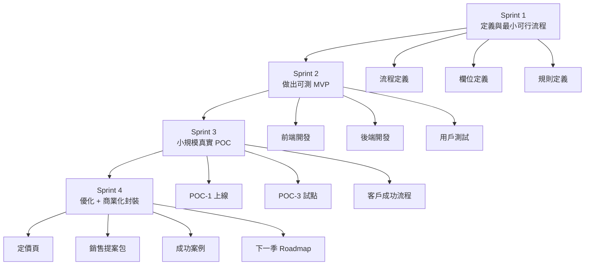
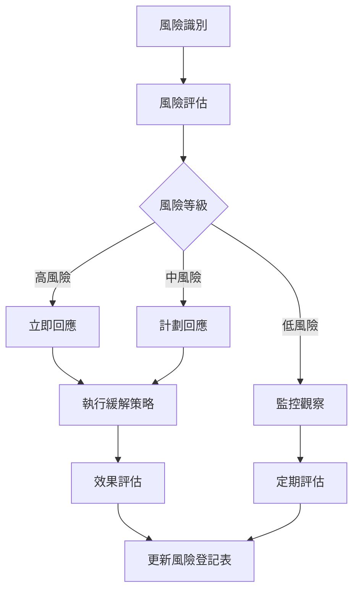

# ESG GO POC 評分表與執行計劃

**文件版本：** v1.0
**建立日期：** 2026-02-11
**文件狀態：** 正式版
**適用範圍：** ESGss JunAiKey 平台 POC 實施規劃

---

## 📋 目錄

1. [執行摘要](#1-執行摘要)
2. [POC 評分表](#2-poc-評分表)
3. [POC 成功門檻與停損線](#3-poc-成功門檻與停損線)
4. [Sprint 1-4 執行計劃](#4-sprint-1-4-執行計劃)
5. [團隊分工建議](#5-團隊分工建議)
6. [風險管理策略](#6-風險管理策略)
7. [下一步行動](#7-下一步行動)

---

## 1. 執行摘要

### 1.1 文件目的

本文件為 ESGss JunAiKey 平台建立完整的 POC 評分表與執行計劃，透過系統化的評分機制選擇最優先的 POC 方案，並制定詳細的 Sprint 執行計劃，確保在 8-12 週內完成 POC 驗證。

### 1.2 POC 候選方案概覽

| POC 編號 | 名稱 | 目標客群 | 核心服務 | 優先順序 |
|----------|------|----------|----------|----------|
| **POC-1** | SME L1健檢 + 商情 + Vault | 傳產中小企業 | ESG 揭露與健檢、ESG 商情系統、Evidence Vault | **第 1 優先** |
| **POC-2** | 上市櫃 L2健檢 + QA Score + Board | 上市櫃公司 | ESG 揭露與健檢、Report QA Score、Board Copilot | 第 3 優先 |
| **POC-3** | 供應鏈 溯源網 + 簡版填報 + QA | 供應鏈管理 | 供應鏈共同溯源網、簡版填報、Report QA Score | **第 2 優先** |
| **POC-4** | 顧問/金融 模板市集 + Vault + 投審摘要 | 顧問公司/金融機構 | 產業專版包、Evidence Vault、投審摘要 | 第 4 優先 |

### 1.3 執行時間表

| 階段 | 時間範圍 | 主要目標 |
|------|----------|----------|
| **Sprint 1** | 週 1-2 | 定義與最小可行流程 |
| **Sprint 2** | 週 3-4 | 做出可測 MVP |
| **Sprint 3** | 週 5-6 | 小規模真實 POC |
| **Sprint 4** | 週 7-8 | 優化 + 商業化封裝 |

---

## 2. POC 評分表

### 2.1 評分維度說明

| 維度 | 評分說明 | 權重 |
|------|----------|------|
| **商業價值** | 營收潛力、客單價值、續約可能性 | 30% |
| **落地速度** | 8-12 週內可交付的可行性 | 20% |
| **可複製性** | 可擴展到其他客群的能力 | 20% |
| **差異化** | 市場替代難度、競爭優勢 | 20% |
| **實作風險** | 技術與商業風險（5=低風險） | 10% |

### 2.2 評分標準

| 分數 | 商業價值 | 落地速度 | 可複製性 | 差異化 | 實作風險 |
|------|----------|----------|----------|--------|----------|
| **5 分** | 高營收潛力、高客單、高續約 | 4 週內可交付 | 可擴展到所有客群 | 無替代方案 | 低風險 |
| **4 分** | 中高營收潛力、中高客單 | 6 週內可交付 | 可擴展到多數客群 | 替代困難 | 中低風險 |
| **3 分** | 中等營收潛力、中等客單 | 8 週內可交付 | 可擴展到部分客群 | 有替代方案 | 中等風險 |
| **2 分** | 中低營收潛力、中低客單 | 10 週內可交付 | 可擴展到少數客群 | 替代容易 | 中高風險 |
| **1 分** | 低營收潛力、低客單 | 12 週以上可交付 | 難以擴展 | 無競爭優勢 | 高風險 |

### 2.3 POC 評分結果

#### POC-1：SME L1健檢 + 商情 + Vault

| 維度 | 評分 | 權重 | 加權分數 | 評分理由 |
|------|------|------|----------|----------|
| 商業價值 | 4 | 30% | 1.20 | 中高營收潛力、客單中等、續約可能性高 |
| 落地速度 | 5 | 20% | 1.00 | 4 週內可交付，流程簡單 |
| 可複製性 | 5 | 20% | 1.00 | 可擴展到所有中小企業客群 |
| 差異化 | 3 | 20% | 0.60 | 有替代方案，但整合度高 |
| 實作風險 | 4 | 10% | 0.40 | 中低風險，技術成熟 |
| **總分** | - | - | **4.20** | - |

#### POC-2：上市櫃 L2健檢 + QA Score + Board

| 維度 | 評分 | 權重 | 加權分數 | 評分理由 |
|------|------|------|----------|----------|
| 商業價值 | 5 | 30% | 1.50 | 高營收潛力、高客單、高續約 |
| 落地速度 | 3 | 20% | 0.60 | 8 週內可交付，流程複雜 |
| 可複製性 | 3 | 20% | 0.60 | 可擴展到上市櫃客群 |
| 差異化 | 4 | 20% | 0.80 | 替代困難，技術門檻高 |
| 實作風險 | 3 | 10% | 0.30 | 中等風險，技術複雜度高 |
| **總分** | - | - | **3.80** | - |

#### POC-3：供應鏈 溯源網 + 簡版填報 + QA

| 維度 | 評分 | 權重 | 加權分數 | 評分理由 |
|------|------|------|----------|----------|
| 商業價值 | 4 | 30% | 1.20 | 中高營收潛力、客單中等、續約可能性高 |
| 落地速度 | 4 | 20% | 0.80 | 6 週內可交付，流程中等 |
| 可複製性 | 4 | 20% | 0.80 | 可擴展到多數產業供應鏈 |
| 差異化 | 4 | 20% | 0.80 | 替代困難，網絡效應強 |
| 實作風險 | 3 | 10% | 0.30 | 中等風險，依賴供應商參與 |
| **總分** | - | - | **3.90** | - |

#### POC-4：顧問/金融 模板市集 + Vault + 投審摘要

| 維度 | 評分 | 權重 | 加權分數 | 評分理由 |
|------|------|------|----------|----------|
| 商業價值 | 3 | 30% | 0.90 | 中等營收潛力、客單中等、續約可能性中等 |
| 落地速度 | 3 | 20% | 0.60 | 8 週內可交付，流程複雜 |
| 可複製性 | 3 | 20% | 0.60 | 可擴展到顧問與金融客群 |
| 差異化 | 3 | 20% | 0.60 | 有替代方案，競爭激烈 |
| 實作風險 | 2 | 10% | 0.20 | 中高風險，依賴外部合作 |
| **總分** | - | - | **2.90** | - |

### 2.4 評分結果總結

| POC 編號 | 總分 | 排名 | 建議執行順序 |
|----------|------|------|--------------|
| **POC-1** | 4.20 | 1 | **第 1 優先** |
| **POC-3** | 3.90 | 2 | **第 2 優先** |
| **POC-2** | 3.80 | 3 | 第 3 優先 |
| **POC-4** | 2.90 | 4 | 第 4 優先 |

### 2.5 POC 執行順序建議

```
POC-1 (SME) → POC-3 (供應鏈) → POC-2 (上市櫃) → POC-4 (顧問/金融)
```

**理由說明：**
1. **POC-1 優先**：落地速度最快、可複製性最高、風險最低，可快速驗證核心價值
2. **POC-3 次之**：商業價值高、差異化強，可建立網絡效應
3. **POC-2 第三**：商業價值最高但落地速度較慢，需等待技術成熟
4. **POC-4 最後**：依賴外部合作，風險較高，需等待其他 POC 成功

---

## 3. POC 成功門檻與停損線

### 3.1 POC-1（SME L1健檢 + 商情 + Vault）

#### 成功門檻（8-10 週）

| 指標類別 | 具體指標 | 目標值 | 測量方式 |
|----------|----------|--------|----------|
| **導入規模** | 首次導入中小企業數量 | ≥ 10 家 | 註冊帳號數 |
| **啟用率** | 註冊後啟用服務比例 | ≥ 70% | 完成首次登入 |
| **完成率** | L1 健檢完成比例 | ≥ 60% | 完成健檢問卷 |
| **留存率** | 30 天留存比例 | ≥ 50% | 30 天後仍活躍 |
| **付費轉化** | 轉付費客戶數量 | ≥ 3 家 | 訂閱付費方案 |

#### 停損線

| 指標類別 | 停損條件 | 應對措施 |
|----------|----------|----------|
| **啟用率** | < 40% | 重新評估註冊流程、簡化啟動步驟 |
| **完成率** | < 30% | 簡化健檢問卷、改善用戶體驗 |
| **付費轉化** | < 10% | 調整定價策略、強化價值傳達 |

### 3.2 POC-2（上市櫃 L2健檢 + QA Score + Board）

#### 成功門檻

| 指標類別 | 具體指標 | 目標值 | 測量方式 |
|----------|----------|--------|----------|
| **導入規模** | 客戶導入 L2/QA/Board 流程數量 | ≥ 3 家 | 完成完整流程 |
| **效率提升** | 報告修訂輪次下降比例 | ≥ 30% | 對比歷史數據 |
| **週期縮短** | 定稿週期縮短比例 | ≥ 20% | 對比歷史數據 |
| **可用率** | 董事會簡報可用率 | ≥ 8/10 | 董事會滿意度調查 |

#### 停損線

| 指標類別 | 停損條件 | 應對措施 |
|----------|----------|----------|
| **修訂輪次** | 無改善 | 優化 QA Score 規則、改善報告品質 |
| **Board 輸出** | 需大量手工改寫 | 優化 Board Copilot 生成邏輯 |

### 3.3 POC-3（供應鏈 溯源網 + 簡版填報 + QA）

#### 成功門檻

| 指標類別 | 具體指標 | 目標值 | 測量方式 |
|----------|----------|--------|----------|
| **導入規模** | 主企業 + 供應商上線數量 | 1 主企業 + ≥ 30 供應商 | 註冊帳號數 |
| **回收率** | 供應商回收比例 | ≥ 65% | 完成填報比例 |
| **通過率** | 一次填報通過比例 | ≥ 50% | QA Score 通過比例 |
| **覆蓋率** | 高風險供應商識別覆蓋率 | ≥ 80% | 風險評估覆蓋比例 |

#### 停損線

| 指標類別 | 停損條件 | 應對措施 |
|----------|----------|----------|
| **回收率** | < 35% | 簡化填報流程、增加激勵機制 |
| **客服工單** | 爆量且無法自助下降 | 優化自助服務、改善填報引導 |

### 3.4 POC-4（顧問/金融 模板市集 + Vault + 投審摘要）

#### 成功門檻

| 指標類別 | 具體指標 | 目標值 | 測量方式 |
|----------|----------|--------|----------|
| **採用規模** | 顧問團隊採用模板數量 | ≥ 2 家 | 訂閱模板市集 |
| **效率提升** | 每案前期工時下降比例 | ≥ 25% | 對比歷史數據 |
| **金融接受度** | 金融端可接受演示流程數量 | ≥ 1 家 | 完成演示並接受 |

#### 停損線

| 指標類別 | 停損條件 | 應對措施 |
|----------|----------|----------|
| **顧問覆用率** | 低 | 優化模板品質、增加模板數量 |
| **金融端接受度** | 無法接受可解釋性/責任邊界 | 明確責任邊界、改善可解釋性 |

---

## 4. Sprint 1-4 執行計劃

### 4.1 Sprint 1（週 1-2）：定義與最小可行流程

#### 目標
建立 3 個核心旅程流程圖，定義最小欄位集與證據結構，完成 QA Score v0 規則。

#### 主要任務

| 任務類別 | 具體任務 | 負責人 | 交付物 | 驗收標準 |
|----------|----------|--------|--------|----------|
| **流程定義** | SME L1 健檢流程圖 | 產品經理 | 流程圖文件 | 每條旅程可在 15 分鐘內完成 demo |
| **流程定義** | 供應鏈填報流程圖 | 產品經理 | 流程圖文件 | 每條旅程可在 15 分鐘內完成 demo |
| **流程定義** | 上市櫃 L2 健檢流程圖 | 產品經理 | 流程圖文件 | 每條旅程可在 15 分鐘內完成 demo |
| **欄位定義** | L1 健檢最小欄位集 | 資料庫工程師 | 欄位定義文件 | 欄位數 ≤ 15 個 |
| **欄位定義** | Evidence Vault 最小證據結構 | 資料庫工程師 | 證據結構文件 | 支援 3 種證據類型 |
| **規則定義** | QA Score v0 規則 | AI 工程師 | 規則文件 | 支援 GRI 基礎檢查 |

#### 驗收標準
- 每條旅程可在 15 分鐘內完成 demo 一圈
- 流程圖通過 stakeholder 審核
- 欄位定義通過技術審核

### 4.2 Sprint 2（週 3-4）：做出可測 MVP

#### 目標
建立 SME 入口頁、Vault 上傳/標籤/指標綁定、QA Score 基礎評分、Board Copilot Lite。

#### 主要任務

| 任務類別 | 具體任務 | 負責人 | 交付物 | 驗收標準 |
|----------|----------|--------|--------|----------|
| **前端開發** | SME 入口頁 | 前端工程師 | 頁面組件 | 註冊流程 < 3 分鐘 |
| **前端開發** | Vault 上傳/標籤/指標綁定 | 前端工程師 | Vault 組件 | 支援拖曳上傳 |
| **後端開發** | QA Score 基礎評分 API | 後端工程師 | API 介面 | 評分時間 < 5 秒 |
| **後端開發** | Board Copilot Lite API | 後端工程師 | API 介面 | 生成時間 < 30 秒 |
| **測試** | 5 位目標用戶實測 | 測試工程師 | 測試報告 | 完成率 ≥ 70% |

#### 驗收標準
- 5 位目標用戶實測，完成率 ≥ 70%
- 所有核心功能可正常運作
- 無阻塞性 bug

### 4.3 Sprint 3（週 5-6）：小規模真實 POC

#### 目標
POC-1 正式上線（10 家目標）、POC-3 試點啟動（1 主企業 + 10 供應商起步）、建立客戶成功流程。

#### 主要任務

| 任務類別 | 具體任務 | 負責人 | 交付物 | 驗收標準 |
|----------|----------|--------|--------|----------|
| **上線準備** | POC-1 正式上線 | 產品經理 | 上線計劃 | 10 家目標客戶導入 |
| **上線準備** | POC-3 試點啟動 | 產品經理 | 試點計劃 | 1 主企業 + 10 供應商導入 |
| **客戶成功** | 客戶成功流程建立 | 客戶成功經理 | 流程文件 | 完整 onboarding 流程 |
| **數據收集** | 取得首批實際 KPI | 數據分析師 | KPI 報告 | 啟用、完成、留存、回收率數據 |
| **監控** | 實時監控系統建立 | DevOps 工程師 | 監控儀表板 | 即時警報機制 |

#### 驗收標準
- 取得首批實際 KPI（啟用、完成、留存、回收率）
- 客戶成功流程可正常運作
- 無重大系統故障

### 4.4 Sprint 4（週 7-8）：優化 + 商業化封裝

#### 目標
建立定價頁、銷售提案包、成功案例 one-pager、下一季 Roadmap。

#### 主要任務

| 任務類別 | 具體任務 | 負責人 | 交付物 | 驗收標準 |
|----------|----------|--------|--------|----------|
| **商業化** | 定價頁建立 | 產品經理 | 定價頁 | 支援 3 種訂閱方案 |
| **商業化** | 銷售提案包建立 | 銷售經理 | 提案包 | 包含 ROI 分析 |
| **商業化** | 成功案例 one-pager | 行銷經理 | one-pager | 至少 2 個成功案例 |
| **規劃** | 下一季 Roadmap | 產品經理 | Roadmap 文件 | 包含 POC-2/4 規劃 |
| **優化** | 系統優化 | 技術負責人 | 優化報告 | 效能提升 ≥ 20% |

#### 驗收標準
- 產品可賣、可擴、可複製
- 定價策略通過財務審核
- 銷售團隊可使用提案包

### 4.5 Sprint 執行流程圖



---

## 5. 團隊分工建議

### 5.1 核心團隊結構

| 角色 | 職責 | 關鍵技能 | 建議人數 |
|------|------|----------|----------|
| **產品經理** | 需求定義、流程設計、優先級管理 | 產品思維、溝通能力 | 1 人 |
| **技術負責人** | 技術架構、技術決策、品質把控 | 系統架構、技術領導力 | 1 人 |
| **前端工程師** | UI/UX 實作、前端邏輯 | React、TypeScript、CSS | 2 人 |
| **後端工程師** | API 開發、資料庫設計 | Node.js、PostgreSQL、API 設計 | 2 人 |
| **AI 工程師** | AI 模型整合、QA Score 規則 | AI/ML、自然語言處理 | 1 人 |
| **測試工程師** | 測試計劃、品質保證 | 測試框架、自動化測試 | 1 人 |
| **DevOps 工程師** | 部署、監控、維運 | CI/CD、雲端服務 | 1 人 |
| **客戶成功經理** | 客戶導入、問題解決 | 客戶服務、問題解決 | 1 人 |
| **銷售經理** | 銷售策略、客戶開發 | 銷售技巧、商業談判 | 1 人 |
| **行銷經理** | 行銷策略、內容製作 | 行銷、內容行銷 | 1 人 |

### 5.2 Sprint 角色分配

#### Sprint 1（週 1-2）

| 角色 | 主要任務 | 工作量 |
|------|----------|--------|
| 產品經理 | 流程定義、欄位定義 | 100% |
| 技術負責人 | 技術架構設計 | 100% |
| 資料庫工程師 | 欄位定義、證據結構 | 100% |
| AI 工程師 | QA Score v0 規則 | 100% |

#### Sprint 2（週 3-4）

| 角色 | 主要任務 | 工作量 |
|------|----------|--------|
| 前端工程師 | SME 入口頁、Vault 組件 | 100% |
| 後端工程師 | QA Score API、Board Copilot API | 100% |
| 測試工程師 | 測試計劃、用戶測試 | 100% |
| 產品經理 | 需求確認、進度追蹤 | 50% |

#### Sprint 3（週 5-6）

| 角色 | 主要任務 | 工作量 |
|------|----------|--------|
| 產品經理 | POC 上線、試點啟動 | 100% |
| 客戶成功經理 | 客戶導入、問題解決 | 100% |
| DevOps 工程師 | 監控系統建立 | 100% |
| 數據分析師 | KPI 收集與分析 | 100% |

#### Sprint 4（週 7-8）

| 角色 | 主要任務 | 工作量 |
|------|----------|--------|
| 產品經理 | 定價頁、Roadmap | 100% |
| 銷售經理 | 銷售提案包 | 100% |
| 行銷經理 | 成功案例 one-pager | 100% |
| 技術負責人 | 系統優化 | 100% |

### 5.3 溝通機制

| 機制類型 | 頻率 | 參與者 | 目的 |
|----------|------|--------|------|
| **每日站會** | 每日 15 分鐘 | 全體成員 | 進度同步、問題識別 |
| **Sprint 規劃會** | 每週一 1 小時 | 全體成員 | 任務分配、目標確認 |
| **Sprint 回顧會** | 每週五 1 小時 | 全體成員 | 總結、改進 |
| **Stakeholder 會議** | 每兩週 1 小時 | 產品經理、技術負責人、相關利益相關者 | 進度報告、決策確認 |

---

## 6. 風險管理策略

### 6.1 風險識別與評估

| 風險類別 | 風險描述 | 影響程度 | 發生機率 | 風險等級 |
|----------|----------|----------|----------|----------|
| **技術風險** | AI 模型準確度不足 | 高 | 中 | 高 |
| **技術風險** | 系統效能不達標 | 中 | 中 | 中 |
| **商業風險** | 客戶採用率低 | 高 | 中 | 高 |
| **商業風險** | 付費轉化率低 | 高 | 中 | 高 |
| **執行風險** | 開發進度延遲 | 中 | 中 | 中 |
| **執行風險** | 團隊成員流失 | 高 | 低 | 中 |
| **外部風險** | 競爭對手推出類似產品 | 中 | 中 | 中 |
| **外部風險** | 法規變化影響需求 | 中 | 低 | 低 |

### 6.2 風險緩解策略

#### 技術風險

| 風險 | 緩解策略 | 負責人 | 監控指標 |
|------|----------|--------|----------|
| AI 模型準確度不足 | 1. 建立多模型對比機制<br>2. 持續收集用戶反饋<br>3. 定期模型優化 | AI 工程師 | 準確率 > 85% |
| 系統效能不達標 | 1. 早期效能測試<br>2. 程式碼優化<br>3. 擴展性設計 | 技術負責人 | 響應時間 < 2 秒 |

#### 商業風險

| 風險 | 緩解策略 | 負責人 | 監控指標 |
|------|----------|--------|----------|
| 客戶採用率低 | 1. 早期用戶測試<br>2. 快速迭代優化<br>3. 強化價值傳達 | 產品經理 | 啟用率 > 70% |
| 付費轉化率低 | 1. 彈性定價策略<br>2. 免費試用期<br>3. 價值證明 | 銷售經理 | 付費轉化 > 10% |

#### 執行風險

| 風險 | 緩解策略 | 負責人 | 監控指標 |
|------|----------|--------|----------|
| 開發進度延遲 | 1. 敏捷開發方法<br>2. 每日進度追蹤<br>3. 優先級管理 | 技術負責人 | 里程碑達成率 > 90% |
| 團隊成員流失 | 1. 知識文檔化<br>2. 交叉培訓<br>3. 團隊建設 | 技術負責人 | 團隊穩定性 > 90% |

#### 外部風險

| 風險 | 緩解策略 | 負責人 | 監控指標 |
|------|----------|--------|----------|
| 競爭對手推出類似產品 | 1. 持續市場監控<br>2. 差異化策略<br>3. 快速迭代 | 產品經理 | 市場份額維持 |
| 法規變化影響需求 | 1. 法規追蹤機制<br>2. 彈性架構設計<br>3. 專家諮詢 | 產品經理 | 法規合規率 > 95% |

### 6.3 風險監控與回應

#### 監控機制

| 監控類型 | 頻率 | 負責人 | 報告對象 |
|----------|------|--------|----------|
| **技術監控** | 每日 | DevOps 工程師 | 技術負責人 |
| **商業監控** | 每週 | 產品經理 | 管理層 |
| **風險審查** | 每兩週 | 全體成員 | 管理層 |

#### 回應流程



### 6.4 應急計劃

#### POC-1 失敗應急計劃

| 失敗情境 | 應急措施 | 啟動條件 |
|----------|----------|----------|
| 啟用率 < 40% | 1. 暫停新客戶導入<br>2. 重新設計註冊流程<br>3. 簡化啟動步驟 | Sprint 3 結束時 |
| 完成率 < 30% | 1. 簡化健檢問卷<br>2. 改善用戶引導<br>3. 增加激勵機制 | Sprint 3 結束時 |
| 付費轉化 < 10% | 1. 調整定價策略<br>2. 延長免費試用期<br>3. 強化價值傳達 | Sprint 4 結束時 |

#### POC-3 失敗應急計劃

| 失敗情境 | 應急措施 | 啟動條件 |
|----------|----------|----------|
| 供應商回收率 < 35% | 1. 簡化填報流程<br>2. 增加激勵機制<br>3. 提供客服支援 | Sprint 3 結束時 |
| 客服工單爆量 | 1. 優化自助服務<br>2. 改善填報引導<br>3. 增加客服人力 | Sprint 3 進行中 |

---

## 7. 下一步行動

### 7.1 立即行動（本週內）

| 行動項 | 負責人 | 截止日期 | 優先級 |
|--------|--------|----------|--------|
| 確認 POC 評分表 | 產品經理 | 2026-02-13 | P0 |
| 組建核心團隊 | 技術負責人 | 2026-02-14 | P0 |
| 啟動 Sprint 1 規劃會 | 產品經理 | 2026-02-15 | P0 |
| 建立專案管理工具 | DevOps 工程師 | 2026-02-15 | P1 |

### 7.2 短期行動（未來 2 週）

| 行動項 | 負責人 | 截止日期 | 優先級 |
|--------|--------|----------|--------|
| 完成 Sprint 1 所有任務 | 全體成員 | 2026-02-25 | P0 |
| 建立 3 個核心旅程流程圖 | 產品經理 | 2026-02-22 | P0 |
| 完成 L1 健檢最小欄位集 | 資料庫工程師 | 2026-02-22 | P0 |
| 完成 QA Score v0 規則 | AI 工程師 | 2026-02-22 | P0 |

### 7.3 中期行動（未來 4 週）

| 行動項 | 負責人 | 截止日期 | 優先級 |
|--------|--------|----------|--------|
| 完成 Sprint 2 所有任務 | 全體成員 | 2026-03-10 | P0 |
| 完成 MVP 開發 | 技術負責人 | 2026-03-10 | P0 |
| 完成 5 位用戶測試 | 測試工程師 | 2026-03-10 | P0 |
| 準備 POC-1 上線 | 產品經理 | 2026-03-10 | P1 |

### 7.4 長期行動（未來 8 週）

| 行動項 | 負責人 | 截止日期 | 優先級 |
|--------|--------|----------|--------|
| 完成 Sprint 3 所有任務 | 全體成員 | 2026-03-24 | P0 |
| POC-1 正式上線 | 產品經理 | 2026-03-24 | P0 |
| POC-3 試點啟動 | 產品經理 | 2026-03-24 | P0 |
| 完成 Sprint 4 所有任務 | 全體成員 | 2026-04-07 | P0 |
| 完成商業化封裝 | 銷售經理 | 2026-04-07 | P0 |

### 7.5 成功指標追蹤

| 指標類別 | 具體指標 | 目標值 | 測量頻率 |
|----------|----------|--------|----------|
| **開發進度** | Sprint 達成率 | > 90% | 每週 |
| **品質指標** | Bug 數量 | < 5 個/Sprint | 每週 |
| **用戶指標** | 啟用率 | > 70% | 每週 |
| **用戶指標** | 完成率 | > 60% | 每週 |
| **商業指標** | 付費轉化率 | > 10% | 每月 |
| **商業指標** | 客戶滿意度 | > 4.0/5 | 每月 |

---

## 附錄

### 附錄 A：POC 評分表計算範例

#### POC-1 詳細計算

```
商業價值：4 分 × 30% = 1.20
落地速度：5 分 × 20% = 1.00
可複製性：5 分 × 20% = 1.00
差異化：3 分 × 20% = 0.60
實作風險：4 分 × 10% = 0.40
─────────────────────────
總分：4.20 分
```

### 附錄 B：Sprint 檢查清單

#### Sprint 1 檢查清單

- [ ] 3 個核心旅程流程圖完成
- [ ] L1 健檢最小欄位集定義完成
- [ ] Evidence Vault 最小證據結構定義完成
- [ ] QA Score v0 規則定義完成
- [ ] 所有交付物通過審核
- [ ] 每條旅程可在 15 分鐘內完成 demo

#### Sprint 2 檢查清單

- [ ] SME 入口頁開發完成
- [ ] Vault 上傳/標籤/指標綁定開發完成
- [ ] QA Score 基礎評分 API 開發完成
- [ ] Board Copilot Lite API 開發完成
- [ ] 5 位目標用戶實測完成
- [ ] 完成率 ≥ 70%

#### Sprint 3 檢查清單

- [ ] POC-1 正式上線（10 家目標）
- [ ] POC-3 試點啟動（1 主企業 + 10 供應商）
- [ ] 客戶成功流程建立完成
- [ ] 首批實際 KPI 收集完成
- [ ] 實時監控系統建立完成

#### Sprint 4 檢查清單

- [ ] 定價頁建立完成
- [ ] 銷售提案包建立完成
- [ ] 成功案例 one-pager 建立完成
- [ ] 下一季 Roadmap 建立完成
- [ ] 系統優化完成
- [ ] 產品可賣、可擴、可複製

### 附錄 C：聯絡資訊

| 角色 | 姓名 | Email | 電話 |
|------|------|-------|------|
| 產品經理 | - | - | - |
| 技術負責人 | - | - | - |
| 銷售經理 | - | - | - |
| 客戶成功經理 | - | - | - |

---

**文件結束**
