# ESG GO 使用者體驗流程設計

**文件版本：** v1.0
**建立日期：** 2026-02-11
**文件狀態：** 正式版
**適用範圍：** ESGss JunAiKey 平台使用者體驗流程設計

---

## 📋 目錄

1. [執行摘要](#1-執行摘要)
2. [永續普惠體驗設計原則](#2-永續普惠體驗設計原則)
3. [6 種 Persona 的關鍵體驗流程](#3-6-種-persona-的關鍵體驗流程)
4. [6 個核心使用者旅程流程圖](#4-6-個核心使用者旅程流程圖)
5. [關鍵觸點與轉換點設計](#5-關鍵觸點與轉換點設計)
6. [流失點預防機制](#6-流失點預防機制)
7. [端到端使用者旅程圖](#7-端到端使用者旅程圖)

---

## 1. 執行摘要

### 1.1 文件目的

本文件為 ESGss JunAiKey 平台建立完整的使用者體驗流程設計，基於永續普惠體驗設計原則，為 6 種 Persona 設計關鍵體驗流程，並定義核心使用者旅程、關鍵觸點與流失點預防機制。

### 1.2 與現有文件的關聯

| 關聯文件 | 關聯內容 |
|----------|----------|
| [`ESG_GO_USER_JOURNEYS.md`](ESG_GO_USER_JOURNEYS.md) | 6 種 Persona 用戶旅程基礎 |
| [`ESG_GO_PRODUCT_ROADMAP.md`](ESG_GO_PRODUCT_ROADMAP.md) | 24 項服務功能對接 |
| [`ESG_GO_BUSINESS_MODEL.md`](ESG_GO_BUSINESS_MODEL.md) | 5 種商業模式對接 |
| [`ESG_GO_POC_EXECUTION_PLAN.md`](ESG_GO_POC_EXECUTION_PLAN.md) | 4 個 POC 方案對接 |

### 1.3 核心設計目標

| 目標類別 | 具體目標 | 成功指標 |
|----------|----------|----------|
| **首日價值** | 15 分鐘內完成風險快照 | 完成率 > 80% |
| **行動導向** | 洞察可轉化為可執行任務 | 轉化率 > 60% |
| **降低門檻** | 任務有模板可套用 | 模板使用率 > 70% |
| **管理層溝通** | 每月自動產生董事會摘要 | 生成時間 < 30 分鐘 |
| **可問責性** | 每個指標都有證據入口 | 證據連結率 > 90% |
| **混合支持** | 客服 + 顧問混合支持 | 問題解決率 > 95% |

---

## 2. 永續普惠體驗設計原則

### 2.1 原則概覽

| 原則 | 核心內容 | 目標用戶 | 成功指標 |
|------|----------|----------|----------|
| **15分鐘得到第一份快照** | 註冊後 15 分鐘內完成風險快照 | 所有新用戶 | 完成率 > 80% |
| **一鍵把洞察轉任務** | 每個洞察都可轉化為可執行任務 | 所有用戶 | 轉化率 > 60% |
| **任務有模板可套** | 提供標準化任務模板 | 中小企業 | 模板使用率 > 70% |
| **每月自動產生董事會摘要** | 自動生成月度董事會報告 | 管理層 | 生成時間 < 30 分鐘 |
| **每個指標都有證據入口** | 所有數據都可追溯證據來源 | 合規用戶 | 證據連結率 > 90% |
| **有客服+顧問混合支持** | 自助服務 + 專業顧問支持 | 中小企業 | 問題解決率 > 95% |

### 2.2 原則 1：15分鐘得到第一份快照（首日價值）

#### 2.2.1 原則說明

註冊後 15 分鐘內完成風險快照，快速展示平台價值，建立 Aha moment，降低導入門檻。

#### 2.2.2 實施策略

| 策略 | 具體做法 | 預期效果 |
|------|----------|----------|
| **簡化註冊** | 只收集必要資訊（公司名稱、產業、聯絡人） | 註冊時間 < 2 分鐘 |
| **引導式填寫** | 逐步引導填寫 L1 健檢問卷（10-15 題） | 填寫時間 < 10 分鐘 |
| **即時回饋** | 每完成一題立即顯示進度與預估時間 | 降低放棄率 |
| **快速生成** | AI 自動評估並生成風險快照報告 | 生成時間 < 3 分鐘 |
| **Aha Moment** | 報告首頁顯示關鍵風險與改善建議 | 建立價值認知 |

#### 2.2.3 流程圖

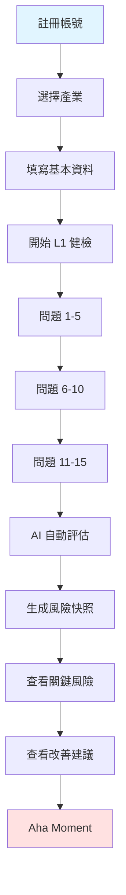

#### 2.2.4 成功指標

| 指標類別 | 具體指標 | 目標值 |
|----------|----------|--------|
| **註冊效率** | 註冊完成時間 | < 2 分鐘 |
| **填寫效率** | L1 健檢完成時間 | < 10 分鐘 |
| **生成效率** | 風險快照生成時間 | < 3 分鐘 |
| **總體效率** | 註冊到快照完成時間 | < 15 分鐘 |
| **完成率** | 註冊後完成快照比例 | > 80% |

### 2.3 原則 2：一鍵把洞察轉任務（不只看報告）

#### 2.3.1 原則說明

每個洞察都可轉化為可執行任務，連接任務矩陣與智能工作流，確保洞察能落地執行。

#### 2.3.2 實施策略

| 策略 | 具體做法 | 預期效果 |
|------|----------|----------|
| **洞察標記** | 每個洞察顯示可執行性標籤 | 識別可執行洞察 |
| **一鍵轉任務** | 每個洞察旁邊提供「轉任務」按鈕 | 降低轉換門檻 |
| **任務模板** | 自動預填任務標題、描述、優先級 | 減少填寫時間 |
| **智能指派** | 根據洞察類型建議負責人 | 提高指派準確度 |
| **進度追蹤** | 任務完成後更新洞察狀態 | 形成閉環 |

#### 2.3.3 流程圖

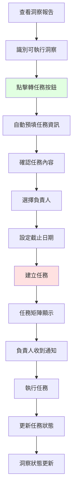

#### 2.3.4 成功指標

| 指標類別 | 具體指標 | 目標值 |
|----------|----------|--------|
| **轉化率** | 洞察轉任務比例 | > 60% |
| **執行率** | 任務完成比例 | > 70% |
| **效率** | 洞察轉任務時間 | < 1 分鐘 |
| **閉環率** | 任務完成後洞察更新比例 | > 90% |

### 2.4 原則 3：任務有模板可套（降低人力門檻）

#### 2.4.1 原則說明

提供標準化任務模板，減少使用者填寫時間，提高任務完成率。

#### 2.4.2 實施策略

| 策略 | 具體做法 | 預期效果 |
|------|----------|----------|
| **模板庫** | 建立 50+ 行業任務模板 | 覆蓋多數場景 |
| **智能推薦** | 根據洞察類型推薦適用模板 | 提高匹配度 |
| **一鍵套用** | 點擊模板即可套用 | 減少填寫時間 |
| **客製化調整** | 允許在模板基礎上調整 | 保持彈性 |
| **持續優化** | 基於用戶反饋優化模板 | 提升品質 |

#### 2.4.3 模板類型

| 模板類型 | 適用場景 | 模板數量 |
|----------|----------|----------|
| **法規合規** | 新法規應對、合規檢查 | 15 個 |
| **環境管理** | 碳盤查、能源管理、廢棄物追蹤 | 12 個 |
| **社會責任** | 員工福利、社區參與 | 10 個 |
| **公司治理** | 董事會效能、內部控制 | 8 個 |
| **供應鏈管理** | 供應商評估、溯源追蹤 | 10 個 |

#### 2.4.4 成功指標

| 指標類別 | 具體指標 | 目標值 |
|----------|----------|--------|
| **使用率** | 任務模板使用比例 | > 70% |
| **效率** | 使用模板的任務建立時間 | < 30 秒 |
| **完成率** | 使用模板的任務完成率 | > 80% |
| **滿意度** | 模板滿意度評分 | > 4.2/5 |

### 2.5 原則 4：每月自動產生董事會摘要（讓管理層看得懂）

#### 2.5.1 原則說明

自動生成月度董事會報告，用管理語言呈現 ESG 進展，簡化高層溝通。

#### 2.5.2 實施策略

| 策略 | 具體做法 | 預期效果 |
|------|----------|----------|
| **自動匯總** | 每月自動匯總 ESG 進展數據 | 減少人工整理 |
| **管理語言** | 用財務與風險語言呈現 | 提高理解度 |
| **多格式輸出** | 支援 PDF、PPT、Word 格式 | 滿足不同需求 |
| **版本管理** | 保留歷史版本供對比 | 追蹤進展 |
| **Q&A 生成** | 自動生成董事會可能問的問題 | 準備充分 |

#### 2.5.3 報告結構

| 章節 | 內容 | 資料來源 |
|------|------|----------|
| **執行摘要** | 關鍵指標、主要成就、風險警示 | 儀表板數據 |
| **環境績效** | 碳排放、能源使用、廢棄物管理 | 環境數據 |
| **社會責任** | 員工滿意度、社區參與、供應鏈管理 | 社會數據 |
| **公司治理** | 董事會效能、內部控制、風險管理 | 治理數據 |
| **財務影響** | ESG 投資回報、成本效益分析 | 財務數據 |
| **下一步行動** | 優先改善項目、資源需求 | 任務矩陣 |

#### 2.5.4 成功指標

| 指標類別 | 具體指標 | 目標值 |
|----------|----------|--------|
| **生成效率** | 董事會摘要生成時間 | < 30 分鐘 |
| **使用率** | 月度摘要生成比例 | > 90% |
| **滿意度** | 董事會滿意度評分 | > 4.3/5 |
| **節省時間** | 相比人工整理節省時間 | > 80% |

### 2.6 原則 5：每個指標都有證據入口（可問責）

#### 2.6.1 原則說明

所有數據都可追溯證據來源，連接 Evidence Vault，確保資料可信度。

#### 2.6.2 實施策略

| 策略 | 具體做法 | 預期效果 |
|------|----------|----------|
| **證據綁定** | 每個指標綁定對應證據文件 | 建立證據鏈 |
| **一鍵查看** | 點擊指標即可查看證據 | 提高透明度 |
| **版本管理** | 證據文件版本控制 | 確保可追溯 |
| **稽核匯出** | 一鍵匯出稽核包 | 簡化合規檢查 |
| **自動提醒** | 證據即將過期自動提醒 | 確保有效性 |

#### 2.6.3 證據類型

| 證據類型 | 說明 | 常見格式 |
|----------|------|----------|
| **政策文件** | 公司政策、程序文件 | PDF、Word |
| **數據記錄** | 測量數據、監測記錄 | Excel、CSV |
| **證書認證** | 第三方認證、許可證 | PDF、圖片 |
| **會議記錄** | 會議紀錄、決議文件 | Word、PDF |
| **照片影片** | 現場照片、監控影片 | JPG、MP4 |

#### 2.6.4 成功指標

| 指標類別 | 具體指標 | 目標值 |
|----------|----------|--------|
| **連結率** | 指標證據連結比例 | > 90% |
| **有效性** | 證據文件有效比例 | > 95% |
| **稽核效率** | 稽核包匯出時間 | < 5 分鐘 |
| **滿意度** | 稽核人員滿意度評分 | > 4.4/5 |

### 2.7 原則 6：有客服+顧問混合支持（中小企業最需要）

#### 2.7.1 原則說明

自助服務 + 專業顧問支持，降低使用門檻，提升問題解決效率。

#### 2.7.2 實施策略

| 策略 | 具體做法 | 預期效果 |
|------|----------|----------|
| **自助服務** | 知識庫、影片教學、FAQ | 解決常見問題 |
| **AI 助理** | 24/7 AI 問題解答 | 即時回應 |
| **線上客服** | 工作時間線上客服支援 | 處理複雜問題 |
| **專業顧問** | 預約專家諮詢服務 | 深度問題解決 |
| **混合模式** | 自助 → AI → 客服 → 顧問 | 分級處理 |

#### 2.7.3 支援層級

| 層級 | 支援方式 | 響應時間 | 適用場景 |
|------|----------|----------|----------|
| **L1 自助** | 知識庫、FAQ、影片 | 即時 | 常見問題 |
| **L2 AI** | AI 助理、聊天機器人 | < 2 分鐘 | 一般問題 |
| **L3 客服** | 線上客服、電話 | < 4 小時 | 複雜問題 |
| **L4 顧問** | 專家諮詢、現場支援 | 預約制 | 深度問題 |

#### 2.7.4 成功指標

| 指標類別 | 具體指標 | 目標值 |
|----------|----------|--------|
| **解決率** | 問題解決比例 | > 95% |
| **自助率** | 自助服務解決比例 | > 60% |
| **滿意度** | 用戶滿意度評分 | > 4.3/5 |
| **回應時間** | 平均問題回應時間 | < 4 小時 |

---

## 3. 6 種 Persona 的關鍵體驗流程

### 3.1 Persona 1：傳產中小企業老闆

#### 3.1.1 核心特徵

| 特徵項目 | 內容描述 |
|----------|----------|
| **年齡層** | 45-60 歲 |
| **產業類型** | 傳統製造業、服務業 |
| **公司規模** | 50-300 人 |
| **ESG 團隊** | 無完整 ESG 團隊，可能由行政或財務兼職 |
| **ESG 認知** | 基礎了解，知道重要性但不清楚如何開始 |
| **決策風格** | 實務導向，重視成本效益與快速見效 |
| **痛點** | 預算有限、人力不足、不確定如何開始、擔心成本與效益 |
| **期望** | 快速了解 ESG 現況、低成本解決方案、明確的改善建議 |

#### 3.1.2 關鍵體驗流程

**流程 A：註冊 → 選產業 → 接收本週3件必看 → 查看影響分數 → 一鍵轉任務**

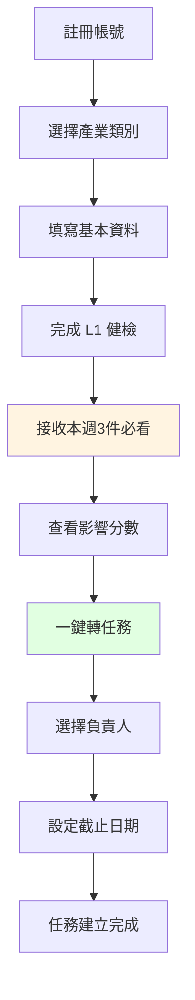

**流程 B：L1 快篩健檢 → 查看缺失清單 → 決定是否升級 L2**

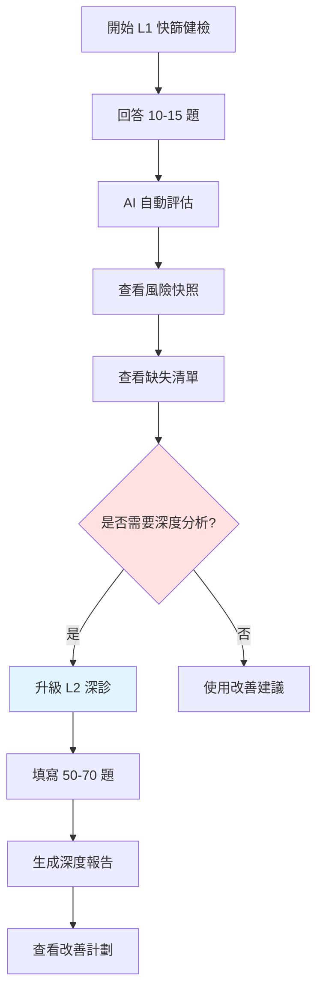

**流程 C：Board Copilot Lite → 生成董事會摘要 → 15分鐘講清楚**

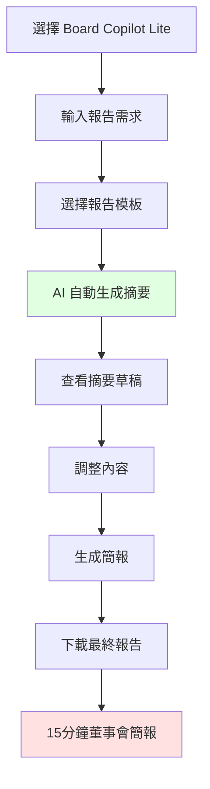

#### 3.1.3 成功指標

| 指標類別 | 具體指標 | 目標值 |
|----------|----------|--------|
| **註冊效率** | 註冊到首份快照時間 | < 15 分鐘 |
| **完成率** | L1 健檢完成率 | > 80% |
| **升級率** | L1 升級 L2 比例 | > 30% |
| **任務轉化** | 洞察轉任務比例 | > 60% |
| **滿意度** | 用戶滿意度評分 | > 4.2/5 |

### 3.2 Persona 2：上市櫃公司 ESG 專員

#### 3.2.1 核心特徵

| 特徵項目 | 內容描述 |
|----------|----------|
| **年齡層** | 30-45 歲 |
| **產業類型** | 上市櫃公司（製造業、科技業、金融業等） |
| **公司規模** | 500-5000 人 |
| **ESG 團隊** | 有專職 ESG 團隊（2-10 人） |
| **ESG 認知** | 專業，熟悉 GRI、SASB、TCFD、ISSB 等國際標準 |
| **決策風格** | 系統化、數據導向、重視合規與品質 |
| **痛點** | 跨部門協調困難、數據收集耗時、報告生成壓力、合規要求嚴格 |
| **期望** | 數據整合、自動化報告、合規管理、跨部門協作工具 |

#### 3.2.2 關鍵體驗流程

**流程 A：每日晨報 → 標記關聯部門 → 一鍵派任務**

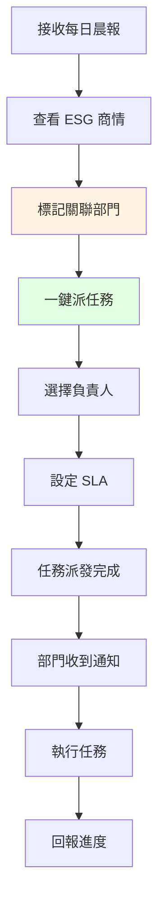

**流程 B：L1/L2 健檢 → 部門填報 SLA → 缺失修復 → 索引生成**

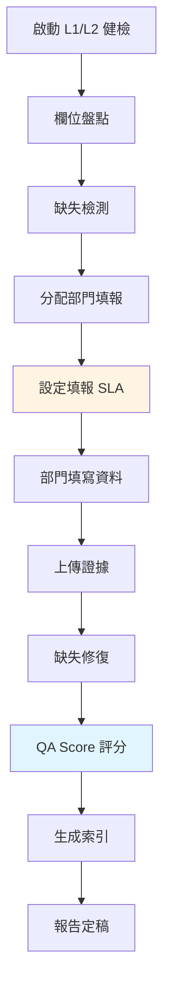

**流程 C：Evidence Vault → 上傳證據 → 欄位綁定 → 匯出稽核包**

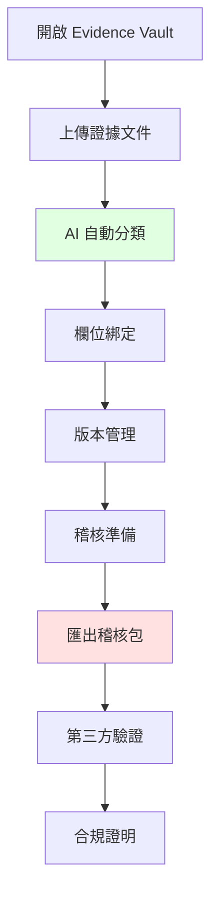

#### 3.2.3 成功指標

| 指標類別 | 具體指標 | 目標值 |
|----------|----------|--------|
| **報告效率** | 報告生成時間 | < 2 週 |
| **數據整合** | 跨部門數據收集效率提升 | > 60% |
| **合規管理** | 法規合規率 | > 95% |
| **報告品質** | 報告品質評分 | > 4.5/5 |
| **投資人滿意** | 投資人問題回應時間 | < 24 小時 |

### 3.3 Persona 3：CFO/財務主管

#### 3.3.1 核心特徵

| 特徵項目 | 內容描述 |
|----------|----------|
| **年齡層** | 40-55 歲 |
| **產業類型** | 各產業中大型企業 |
| **公司規模** | 500-5000 人 |
| **ESG 角色** | 預算守門人、風險定價者、投資決策者 |
| **ESG 認知** | 財務導向，重視 ROI、風險量化、成本效益 |
| **決策風格** | 數據導向、風險意識強、重視財務影響 |
| **痛點** | 預算控制、ESG 投資回報難以量化、風險定價困難、投資人壓力 |
| **期望** | ROI 證明、風險量化、成本效益分析、投資人溝通支援 |

#### 3.3.2 關鍵體驗流程

**流程 A：CFO 版月報 → 標記財務影響 → 形成預算備忘**

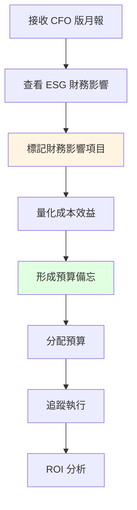

**流程 B：L1/L2 健檢 → 追蹤重工工時 → 成本儀表板**

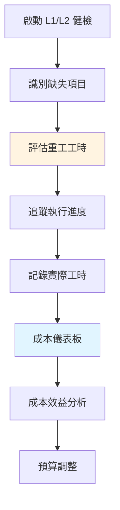

**流程 C：Board Copilot → 財務敘事版 → 現金流影響分析**

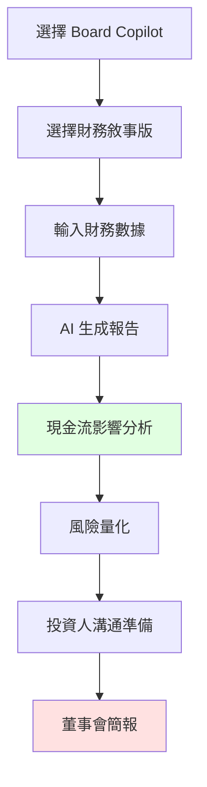

#### 3.3.3 成功指標

| 指標類別 | 具體指標 | 目標值 |
|----------|----------|--------|
| **ROI 證明** | ESG 投資回報率 | > 1.5 倍 |
| **風險量化** | ESG 風險量化準確度 | > 85% |
| **成本效益** | ESG 成本效益分析 | > 1.2 倍 |
| **投資人滿意** | 投資人 ESG 問題滿意度 | > 85% |
| **預算控制** | ESG 預算執行率 | 90-110% |

### 3.4 Persona 4：供應鏈管理主管

#### 3.4.1 核心特徵

| 特徵項目 | 內容描述 |
|----------|----------|
| **年齡層** | 35-50 歲 |
| **產業類型** | 製造業、零售業 |
| **公司規模** | 500-5000 人 |
| **ESG 角色** | 供應穩定管理者 |
| **ESG 認知** | 實務導向，重視供應穩定與合規 |
| **決策風格** | 風險意識強、重視供應穩定 |
| **痛點** | 供應穩定、客戶合規雙壓力、供應商配合度低 |
| **期望** | 供應鏈追蹤、風險管理、合規證明 |

#### 3.4.2 關鍵體驗流程

**流程 A：供應鏈版週報 → 標記影響供應商群 → 產生追蹤任務**

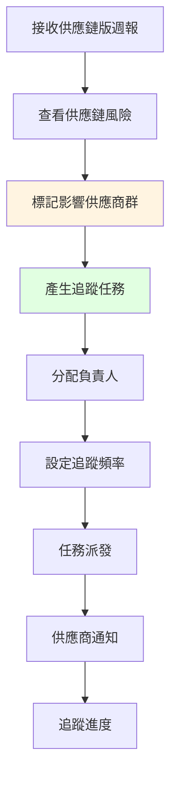

**流程 B：供應鏈共同溯源網 → 邀請供應商 → 回收率追蹤 → 風險熱圖**

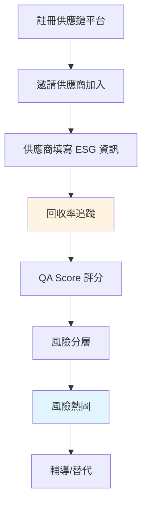

**流程 C：供應商簡版填報 → 10分鐘完成 → QA Score 評分**

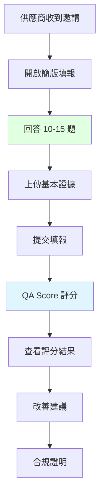

#### 3.4.3 成功指標

| 指標類別 | 具體指標 | 目標值 |
|----------|----------|--------|
| **供應商參與** | 供應商參與率 | > 60% |
| **回收率** | 供應商填報回收率 | > 65% |
| **通過率** | 一次填報通過比例 | > 50% |
| **風險識別** | 高風險供應商識別覆蓋率 | > 80% |
| **滿意度** | 供應商滿意度評分 | > 4.0/5 |

### 3.5 Persona 5：顧問公司專案經理

#### 3.5.1 核心特徵

| 特徵項目 | 內容描述 |
|----------|----------|
| **年齡層** | 30-45 歲 |
| **產業類型** | 顧問公司 |
| **公司規模** | 50-200 人 |
| **ESG 角色** | 交付管理者 |
| **ESG 認知** | 專業，熟悉多種標準與工具 |
| **決策風格** | 效率導向、重視品質與交付 |
| **痛點** | 交付壓力、毛利壓力、品質壓力 |
| **期望** | 效率提升、品質保證、成本控制 |

#### 3.5.2 關鍵體驗流程

**流程 A：顧問版周報 → 標記受影響專案 → 建立變更任務**

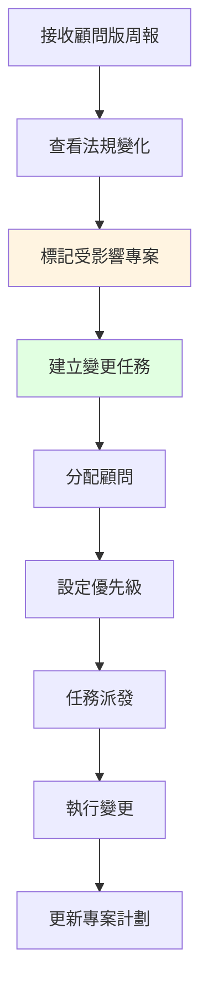

**流程 B：顧問分析模板市集 → 選模板 → 匯入客戶資料 → 產生初稿**

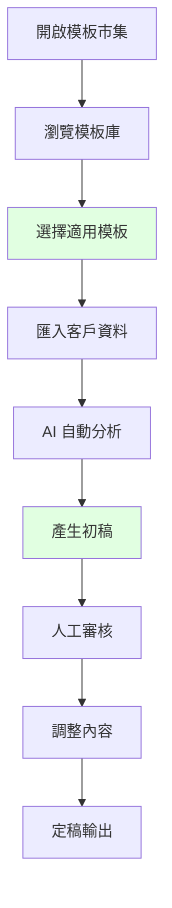

**流程 C：Report QA Score → 草稿打分 → 修復清單 → 二次驗證**

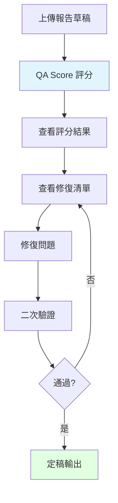

#### 3.5.3 成功指標

| 指標類別 | 具體指標 | 目標值 |
|----------|----------|--------|
| **效率提升** | 每案前期工時下降比例 | > 25% |
| **品質保證** | 報告品質評分 | > 4.5/5 |
| **成本控制** | 顧問成本下降比例 | > 20% |
| **交付速度** | 報告交付時間縮短 | > 30% |
| **客戶滿意** | 客戶滿意度評分 | > 4.4/5 |

### 3.6 Persona 6：銀行授信/投資評估端

#### 3.6.1 核心特徵

| 特徵項目 | 內容描述 |
|----------|----------|
| **年齡層** | 35-50 歲 |
| **產業類型** | 金融機構 |
| **公司規模** | 500-5000 人 |
| **ESG 角色** | 風險評估者 |
| **ESG 認知** | 專業，重視風險定價與盡職調查 |
| **決策風格** | 風險意識強、數據導向 |
| **痛點** | 風險定價、盡職調查、資料可信度 |
| **期望** | 數據可信度、風險量化、盡職調查工具 |

#### 3.6.2 關鍵體驗流程

**流程 A：金融版風險快訊 → 事件進件 → 影響分級 → 標記需重審案件**

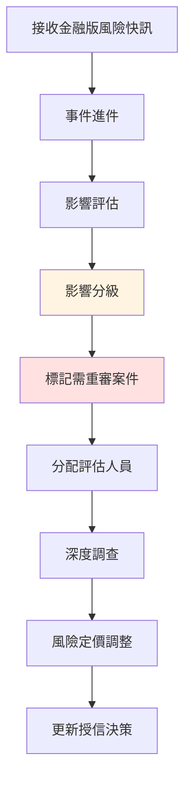

**流程 B：授信評估模板 → 匯入企業資料 → 跑模型 → 輸出風險分層**

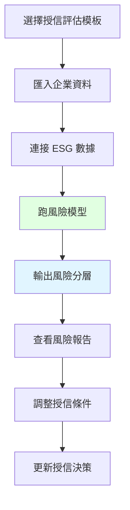

**流程 C：Evidence Vault → 收證 → 驗證 → 抽查 → 留痕**

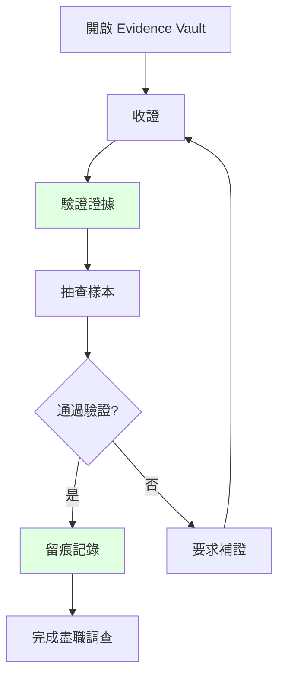

#### 3.6.3 成功指標

| 指標類別 | 具體指標 | 目標值 |
|----------|----------|--------|
| **風險識別** | ESG 風險識別率 | > 90% |
| **評估效率** | 授信評估時間縮短 | > 40% |
| **資料可信度** | 證據驗證通過率 | > 95% |
| **風險定價** | 風險定價準確度 | > 85% |
| **盡職調查** | 盡職調查完成率 | > 95% |

---

## 4. 6 個核心使用者旅程流程圖

### 4.1 流程圖 1：新用戶導入流程

```mermaid
graph TD
    A[註冊帳號] --> B[選擇產業]
    B --> C[填寫基本資料]
    C --> D[開始 L1 健檢]
    D --> D1[問題 1-5]
    D1 --> D2[問題 6-10]
    D2 --> D3[問題 11-15]
    D3 --> E[AI 自動評估]
    E --> F[生成風險快照]
    F --> G[查看關鍵風險]
    G --> H[查看改善建議]
    H --> I[選擇方案]
    I --> J[開始使用]
    
    style A fill:#e1f5ff
    style F fill:#e1ffe1
    style J fill:#e1ffe1
```

### 4.2 流程圖 2：L1/L2 健檢流程

```mermaid
graph TD
    A[啟動健檢] --> B[選擇健檢層級]
    B --> C{L1 or L2?}
    C -->|L1| D[回答 10-15 題]
    C -->|L2| E[回答 50-70 題]
    D --> F[AI 自動評估]
    E --> F
    F --> G[欄位盤點]
    G --> H[缺失檢測]
    H --> I[上傳證據]
    I --> J[修復計畫]
    J --> K[定稿輸出]
    
    style C fill:#ffe1e1
    style K fill:#e1ffe1
```

### 4.3 流程圖 3：商情轉任務流程

```mermaid
graph TD
    A[接收商情情報] --> B[關聯分數計算]
    B --> C[建議行動]
    C --> D[一鍵轉任務]
    D --> E[選擇任務模板]
    E --> F[指派責任人]
    F --> G[設定截止日期]
    G --> H[任務建立]
    H --> I[追蹤完成]
    I --> J[更新商情狀態]
    
    style D fill:#e1ffe1
    style H fill:#e1ffe1
```

### 4.4 流程圖 4：Evidence Vault 流程

```mermaid
graph TD
    A[上傳證據] --> B[AI 自動打標]
    B --> C[欄位綁定]
    C --> D[版本管理]
    D --> E[證據審核]
    E --> F{通過審核?}
    F -->|是| G[證據歸檔]
    F -->|否| H[要求補證]
    H --> A
    G --> I[稽核匯出]
    
    style B fill:#e1ffe1
    style G fill:#e1ffe1
```

### 4.5 流程圖 5：Board Copilot 流程

```mermaid
graph TD
    A[選擇 Board Copilot] --> B[輸入報告需求]
    B --> C[選擇報告模板]
    C --> D[AI 自動摘要]
    D --> E[生成 Q&A]
    E --> F[會前演練]
    F --> G[會議決議追蹤]
    G --> H[更新行動計劃]
    H --> I[生成下次報告]
    
    style D fill:#e1ffe1
    style G fill:#e1ffe1
```

### 4.6 流程圖 6：供應鏈協作流程

```mermaid
graph TD
    A[主企業邀請] --> B[供應商填報]
    B --> C[回收率追蹤]
    C --> D[QA Score 評分]
    D --> E[風險分層]
    E --> F{風險等級}
    F -->|低| G[持續監控]
    F -->|中| H[輔導改善]
    F -->|高| I[尋找替代]
    H --> G
    I --> J[更換供應商]
    
    style D fill:#e1ffe1
    style F fill:#ffe1e1
```

---

## 5. 關鍵觸點與轉換點設計

### 5.1 觸點 1：註冊完成

| 項目 | 內容 |
|------|------|
| **目標** | 15 分鐘內完成風險快照 |
| **設計** | 簡化註冊流程，只收集必要資訊 |
| **成功指標** | 完成率 > 80% |
| **流失點** | 註冊流程複雜、問卷過長 |
| **預防措施** | 引導式填寫、即時進度顯示 |

### 5.2 觸點 2：L1 健檢完成

| 項目 | 內容 |
|------|------|
| **目標** | 引導升級 L2 |
| **設計** | 顯示升級價值，提供優惠 |
| **成功指標** | 升級率 > 30% |
| **流失點** | 升級價值不明顯、價格過高 |
| **預防措施** | 清楚展示差異、提供試用 |

### 5.3 觸點 3：首次付費

| 項目 | 內容 |
|------|------|
| **目標** | 建立付費習慣 |
| **設計** | 提供多種付費方式，簡化流程 |
| **成功指標** | 付費成功率 > 90% |
| **流失點** | 付費流程複雜、支付失敗 |
| **預防措施** | 多種支付方式、即時客服支援 |

### 5.4 觸點 4：30 天留存

| 項目 | 內容 |
|------|------|
| **目標** | 確保用戶持續使用 |
| **設計** | 主動推送價值，提供支援 |
| **成功指標** | 留存率 > 50% |
| **流失點** | 價值不明顯、缺乏持續動機 |
| **預防措施** | 定期推送洞察、任務提醒 |

### 5.5 觸點 5：續約提醒

| 項目 | 內容 |
|------|------|
| **目標** | 提高續約率 |
| **設計** | 提前 30 天提醒，展示價值 |
| **成功指標** | 續約率 > 70% |
| **流失點** | 價值不夠明顯、價格敏感 |
| **預防措施** | 價值報告、優惠方案 |

---

## 6. 流失點預防機制

### 6.1 流失點 1：註冊後未完成快照

| 項目 | 內容 |
|------|------|
| **預防** | 引導式填寫，即時協助 |
| **機制** | 自動提醒，客服介入 |
| **觸發條件** | 註冊後 24 小時未完成 |
| **提醒頻率** | 第 1 天、第 3 天、第 7 天 |
| **客服介入** | 第 7 天未完成主動聯繫 |

### 6.2 流失點 2：L1 健檢後未升級

| 項目 | 內容 |
|------|------|
| **預防** | 展示升級價值，提供試用 |
| **機制** | 優惠方案，顧問跟進 |
| **觸發條件** | L1 完成 7 天後未升級 |
| **優惠方案** | 7 天內升級享 8 折 |
| **顧問跟進** | 高價值客戶主動聯繫 |

### 6.3 流失點 3：任務完成率低

| 項目 | 內容 |
|------|------|
| **預防** | 任務模板，自動提醒 |
| **機制** | 進度追蹤，團隊協作 |
| **觸發條件** | 任務逾期超過 3 天 |
| **提醒頻率** | 逾期前 1 天、逾期當天、逾期後 3 天 |
| **團隊協作** | 支援任務轉派、協作完成 |

### 6.4 流失點 4：供應商配合度低

| 項目 | 內容 |
|------|------|
| **預防** | 簡化填報，提供獎勵 |
| **機制** | 分級要求，差異化提醒 |
| **觸發條件** | 供應商未回應超過 7 天 |
| **簡化填報** | 簡版問卷（10-15 題） |
| **獎勵機制** | 完成填報獲得 Pro 版試用 |

### 6.5 流失點 5：AI 分身使用率低

| 項目 | 內容 |
|------|------|
| **預防** | 場景化推薦，使用教學 |
| **機制** | 使用統計，優化建議 |
| **觸發條件** | 30 天未使用 AI 分身 |
| **場景推薦** | 根據用戶行為推薦使用場景 |
| **使用教學** | 提供影片教學、操作指南 |

---

## 7. 端到端使用者旅程圖

### 7.1 整合旅程圖

```mermaid
graph TB
    subgraph 註冊階段
        A[註冊帳號] --> B[選擇產業]
        B --> C[填寫基本資料]
    end
    
    subgraph 首次價值
        C --> D[完成 L1 健檢]
        D --> E[生成風險快照]
        E --> F[Aha Moment]
    end
    
    subgraph 持續使用
        F --> G[接收每日商情]
        G --> H[一鍵轉任務]
        H --> I[執行任務]
        I --> J[上傳證據]
    end
    
    subgraph 價值深化
        J --> K[升級 L2 健檢]
        K --> L[生成深度報告]
        L --> M[Board Copilot]
        M --> N[董事會摘要]
    end
    
    subgraph 供應鏈擴展
        N --> O[邀請供應商]
        O --> P[供應商填報]
        P --> Q[風險分層]
        Q --> R[合規證明]
    end
    
    subgraph 續約與擴展
        R --> S[價值報告]
        S --> T[續約提醒]
        T --> U[續約成功]
        U --> V[擴展使用]
    end
    
    style F fill:#ffe1e1
    style N fill:#e1ffe1
    style U fill:#e1ffe1
```

### 7.2 6 種 Persona 旅程對比

```mermaid
graph LR
    subgraph Persona1[傳產中小企業老闆]
        P1A[註冊 → L1 健檢] --> P1B[風險快照] --> P1C[Board Copilot Lite]
    end
    
    subgraph Persona2[上市櫃 ESG 專員]
        P2A[每日晨報] --> P2B[L1/L2 健檢] --> P2C[Evidence Vault]
    end
    
    subgraph Persona3[CFO/財務主管]
        P3A[CFO 版月報] --> P3B[成本儀表板] --> P3C[財務敘事版]
    end
    
    subgraph Persona4[供應鏈管理主管]
        P4A[供應鏈版週報] --> P4B[溯源網] --> P4C[風險熱圖]
    end
    
    subgraph Persona5[顧問公司專案經理]
        P5A[顧問版周報] --> P5B[模板市集] --> P5C[Report QA Score]
    end
    
    subgraph Persona6[銀行授信/投資評估]
        P6A[金融版風險快訊] --> P6B[授信評估模板] --> P6C[Evidence Vault]
    end
```

---

## 8. 總結

### 8.1 核心成就

| 成就類別 | 具體內容 |
|----------|----------|
| **6 個設計原則** | 建立永續普惠體驗設計原則 |
| **6 種 Persona** | 為每種 Persona 設計關鍵體驗流程 |
| **6 個核心流程** | 設計核心使用者旅程流程圖 |
| **5 個關鍵觸點** | 定義關鍵觸點與轉換點設計 |
| **5 個流失點** | 建立流失點預防機制 |
| **端到端旅程** | 整合所有流程的端到端使用者旅程圖 |

### 8.2 與現有文件的關聯

| 關聯文件 | 關聯內容 |
|----------|----------|
| [`ESG_GO_USER_JOURNEYS.md`](ESG_GO_USER_JOURNEYS.md) | 6 種 Persona 用戶旅程基礎 |
| [`ESG_GO_PRODUCT_ROADMAP.md`](ESG_GO_PRODUCT_ROADMAP.md) | 24 項服務功能對接 |
| [`ESG_GO_BUSINESS_MODEL.md`](ESG_GO_BUSINESS_MODEL.md) | 5 種商業模式對接 |
| [`ESG_GO_POC_EXECUTION_PLAN.md`](ESG_GO_POC_EXECUTION_PLAN.md) | 4 個 POC 方案對接 |

### 8.3 下一步行動

| 行動項 | 說明 |
|--------|------|
| **POC 實施** | 根據 POC 執行計劃實施驗證 |
| **用戶測試** | 邀請目標用戶測試流程 |
| **數據收集** | 收集實際使用數據 |
| **持續優化** | 基於反饋持續優化體驗 |

---

**文件結束**
