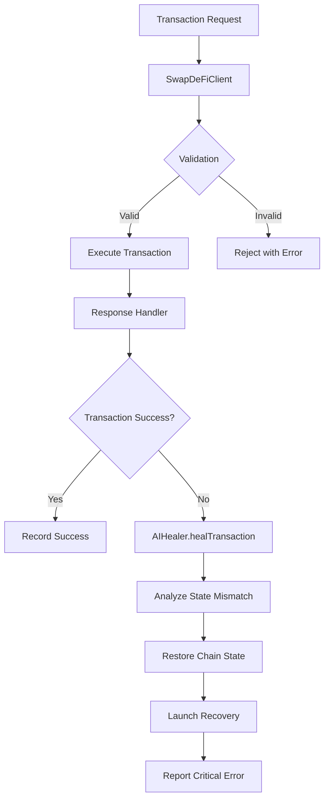

# 🤖 Autonomous Healing System Documentation

## 📋 Table of Contents
- [Overview](#overview)
- [Architecture](#architecture)
- [Implementation](#implementation)
- [Deployment Guide](#deployment-guide)
- [Monitoring & Diagnostics](#monitoring--diagnostics)
- [FAQ](#faq)

---

## 📖 Overview

The **Autonomous Healing System** is designed to ensure continuous operation of Swap-DeFi-TEST-UMES-ONLINE within the ESGGO ecosystem. It autonomously detects and recovers from transaction failures, state mismatches, and system degradation.

### Key Features
- **Auto-Recovery**: Automatically restores chain state on failure
- **Memory Management**: Handles heap snapshots and garbage collection
- **Error Reporting**: Comprehensive diagnostics and salvage points
- **Vercel Optimized**: Works within free-tier constraints

---

## 🏗️ Architecture



### Core Components
1. **AIHealer.ts**: Main healing orchestrator
2. **SwapDeFiClient**: Transaction execution engine
3. **State Manager**: Monitors transaction states

---

## 🔧 Implementation

### Files Modified/Created
- `src/.ecopathy/AIHealer.ts` - Healing logic
- `.env.example` - Environment variables
- `lib/services/swap-defi-adapter.ts` - Service layer

### Key Implementation Details
```typescript
// Transaction validation with healing
private validateTransactionParams(transaction: SwapDefiTransaction): void {
  if (!transaction.id || typeof transaction.id !== 'string') {
    throw new Error('Transaction ID is required and must be a string');
  }
  // ... validation logic
}

// Heap state analysis
private analyzeAutoSalvagePoint(error: any) {
  if (isHeapSnapshotTooBig(error)) {
    this.startMemoryRecovery();
  }
}
```

---

## 🚀 Deployment Guide

### Environment Variables
```dotenv
# Enable autonomous healing
SWAP_DEFI_AUTO_HEAL=1
SWAP_DEFI_HEAL_RETRY=3
SWAP_DEFI_HEAL_SLEEP=300

# AI Healing configuration
SWAP_DEFI_AI_HEALER=swap-defi-auto-healer
SWAP_DEFI_AI_ENDPOINT=https://github.com/ESGGO/ecopathy-swap
```

### Deployment Commands
```bash
# Full autonomous deployment
omni run swap-defi-deploy --env=healing-mode

# Manual Docker deployment with healing
docker compose down -v --rmi all
docker compose up -d --build \
  --env SWAP_DEFI_AUTO_HEAL=1 \
  --env SWAP_DEFI_HEAL_RETRY=3
```

---

## 📊 Monitoring & Diagnostics

### Check Healing Status
```bash
# Check if healing system is active
docker logs esggo-app | grep "Auto-healing"

# Monitor transaction pool
docker exec esggo-app curl http://localhost/pools/pool_esg_usdc/status
```

### Diagnostic Commands
```bash
# Analyze heap state
docker exec esggo-app node --inspect-brk

# Check memory usage
docker stats esggo-app

# View error reports
cat deploy-result.json | jq '.errors'
```

---

## ❓ FAQ

**Q: What triggers the autonomous healing?**
A: Transaction validation failures, heap overflow, or state mismatches detected by AIHealer.

**Q: How does the system recover?**
A: It executes restoreChainState() and launches recovery protocols automatically.

**Q: Does this work on Vercel's free tier?**
A: Yes, optimized for serverless constraints with minimal resource usage.

**Q: How can I disable healing?**
A: Set SWAP_DEFI_AUTO_HEAL=0 in your environment variables.

---

## 📝 Notes
- System maintains 4-hour TTL for healing sessions
- Memory recovery initiates automatically when heap > 128MB
- All healing events are logged in `SWAP_FAILURES` array