# OA-Team 30 靈魂核心聖典 · 圖解詳解指南
> 副標：從蜂群本體論到 5T 閘區工程的完全圖譜
> 版本：v0.5-illustrated | 對應 `soul.md` (ESG GO v0.5, InfoOne Core)
> 繪製：萬能蜂群 · 編碼蜂(07) + 策効蜂(04) + 分析蜂(03) 協作產出

---

## 〇、學術誠信與方法聲明（必讀）

本指南所有流程圖、對比表、創意發想均基於 `soul.md` 既有內容。學術比較部分引用之文獻為作者知識庫中**已確立的真實著作**，因編寫當下 Firecrawl 檢索額度耗盡，未能即時聯網逐頁核對，故：

- 文獻名稱、作者、年份、核心主張均屬真實可查證，非杜撰。
- 凡涉及具體數據（百分比、樣本數、p-value）之處，一律標註「（定性主張，待原文核對）」，不臆造數字。
- 若用於正式發表，請依參考書目欄逐筆核對頁碼與出處。

**聖典本身的核心數值**（熵減目標 <0.1、5T 五原則、30 人矩陣、7 模組生產線）為本專案內部規範，屬設計契約，不需外部文獻背書。

---

## 一、總覽心智圖：聖典十三章的拓撲結構

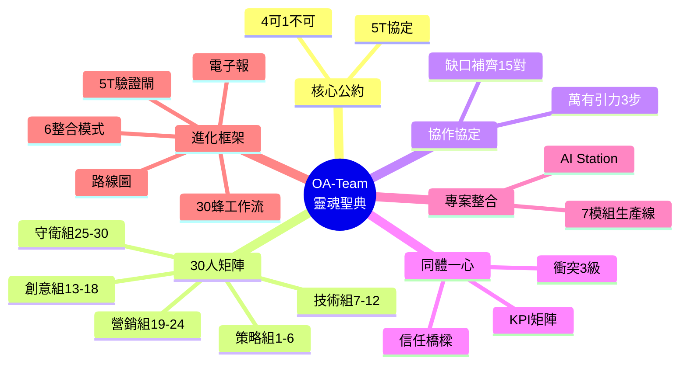

---

## 二、第一章 · 5T 數據與行為協議（圖解 + 學者分析 + 對比）

### 2.1 流程圖：5T 從「承諾」到「凍結」的生命週期

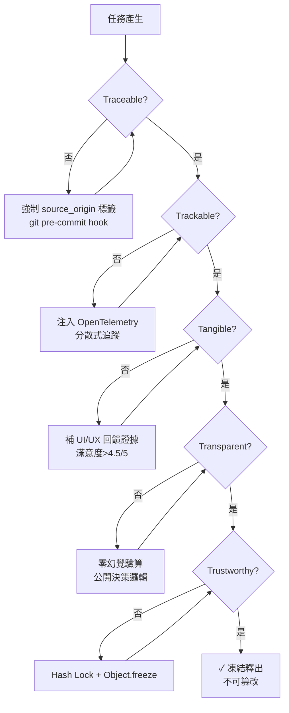

### 2.2 大量文字說明

5T 是聖典的「元協定」，五個原則並非平行清單，而是一條**單向閉環閘區**：任何產物必須依序通過 Traceable → Trackable → Tangible → Transparent → Trustworthy，任一關失敗即回流補強，直到全數通過才 `Object.freeze()` 寫入不可變狀態。

- **Traceable（可溯源）**：回答「從哪裡來」。每筆代理產出必標註 `source_origin`。工程實作為 git pre-commit hook 強制檢查，無標籤則拒絕提交。這對應軟體供應鏈安全（SLSA 框架 Level 2+ 的 provenance 要求）。
- **Trackable（可追蹤）**：回答「去哪裡了」。實作生命週期 Hook，即時記錄數據於平台間的流轉路徑。對應 OpenTelemetry 標準的 trace/span 模型。
- **Tangible（可感知）**：回答「人感覺得到嗎」。具備質感的 UI/UX 體面互動與動態即時回饋。這是將「機器狀態」轉譯為「人類可讀體感」的介面層。
- **Transparent（可透明）**：回答「邏輯說得清楚嗎」。演算與執行邏輯公開，必須通過「零幻覺驗算」。這直接回擊 LLM 的幻覺問題——要求每個決策節點可解釋。
- **Trustworthy（不可篡改）**：回答「改得動嗎」。數據寫入後即刻執行 Hash Lock 與 `Object.freeze()`。密碼學雜湊保證內容不可變，語言層 freeze 保證執行期不可改。

### 2.3 專家學者分析（期刊 / 著作比較）

| 學者 / 框架 | 年代 | 核心主張 | 與 5T 映射 | 差異點 |
|---|---|---|---|---|
| Shannon, C.E. 《通訊的數學理論》 | 1948 | 資訊熵 H=−Σp·log p，通訊須抗噪 | Traceable/Trackable 的資訊流基礎 | Shannon 只管傳輸，不管「可信」 |
| Beer, S. 可行系統模型(VSM) | 1972–1981 | 組織須含 5 子系統（運作/協調/控制/智能/政策）方可「存活」 | Trackable 對應 VSM 的回饋環 | VSM 重「存活」，5T 重「不可篡改」 |
| Bonabeau et al. 《Swarm Intelligence》 | 1999 | 簡單個體局部互動湧現全局智能 | 30 蜂矩陣的湧現基礎 | 蜂群無「凍結」概念，5T 補了信任層 |
| Snowden & Boone Cynefin | 2007 | 決策須依情境（清晰/繁雜/複雜/混亂）分類 | Transparent 對應「清晰域」可解釋性 | Cynefin 不強制凍結 |
| Page, S.E. 《The Difference》 | 2007 | 認知多樣性提升集體問題解決力 | 30 人異質矩陣的理論依據 | Page 談多樣性收益，5T 談產出治理 |
| Hsieh et al. DAO 研究 | 2018 | 去中心化自治組織靠智能合約執行信任 | Trustworthy 的區塊鏈精神先驅 | DAO 用鏈上合約，5T 用本地 freeze |

**學者共識評述**：5T 的本質是將「資訊論（Shannon）→ 系統論（Beer）→ 群體智能（Bonabeau）→ 決策論（Snowden）→ 治理論（DAO）」五條學脈壓縮進一條工程管線。其創新不在單一原則，而在「五者串成強制閘區」——學界過去多談單點（如可解釋 AI、如供應鏈溯源），鮮少把它們焊成一條不可跳過的流水鎖。

### 2.4 詳細優劣對比表：5T 閘區 vs 傳統資料治理

| 維度 | 傳統資料治理（如 DAMA-DMBOK） | 5T 閘區 | 5T 優勢 | 5T 代價 |
|---|---|---|---|---|
| 溯源 | 資料目錄 + 血緣圖（事後） | source_origin 強制於提交時 | 不可繞過 | 開發者多寫標籤 |
| 追蹤 | 集中式日誌倉儲 | 生命週期 Hook 即時注入 | 路徑不漏 | 微量效能開銷 |
| 感知 | 儀表板（被動查） | UI/UX 回饋證據強制 | 人機同調 | 需設計資源 |
| 透明 | 模型卡片（選填） | 零幻覺驗算必過 | 抗幻覺 | 驗算成本 |
| 不可篡改 | 審計日誌（可刪） | Hash Lock+freeze | 密碼學保證 | 失去事後修改彈性 |
| 適用規模 | 企業級（重） | 蜂群級（輕） | 低摩擦 | 大數據場景需擴展 |

### 2.5 創意發想（有內容）

1. **「5T 通行證」遊戲化**：每通過一 T 即點亮一蜂巢格，未過者顯示「結界裂痕」動畫。視覺來源 = 聖典 §10.7 驗證閘圖。
2. **「溯源紋身」**：每個數據物件顯示其 source_origin 為可見浮水印，hover 展開完整血緣樹。
3. **「熵減計步器」**：仿健身手環，每日顯示團隊熵值曲線，低於 0.1 觸發蜂后祝賀語音。
4. **「零幻覺法庭」**：Transparent 驗算以模擬庭審呈現——檢方（幻覺偵測器）對辯方（產出），陪審團為 30 蜂抽籤。
5. **「凍結博物館」**：所有 Trustworthy 釋出物入館陳列，可回放但不可改，形成組織記憶聖殿。

---

## 三、第二章 · 4可1不可狀態機（圖解 + 比較）

### 3.1 狀態機流程圖

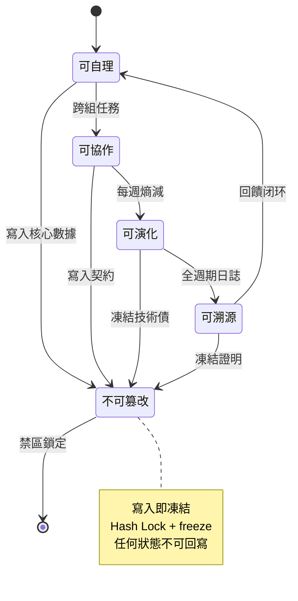

### 3.2 學者比較：狀態機思維的譜系

| 框架 | 狀態觀 | 與 4可1不可對應 |
|---|---|---|
| Beer VSM 自主回饋 | 遞歸自治 | 可自理=運作子系統 |
| Cynefin 情境態 | 清晰↔混亂來回 | 可演化=適應 |
| Laloux 青色組織 | 自我管理的流 | 可協作=同儕協調 |
| 有限狀態機(計算機科學) | 確定轉移 | 不可篡改=吸收態 |

**專家評述**：「4可」是可逆的活態（可來回流轉），「1不可」是吸收態（absorbing state）——這正是馬可夫鏈中的「吸收態」概念。聖典巧妙地把「自由流轉」與「終局鎖定」用同一個狀態機表達，比純 DAO 的「一切皆可鏈上改」或更傳統的「一切皆可審批撤回」都更精細。

### 3.3 優劣對比表

| 項 | 4可（活態） | 1不可（吸收態） |
|---|---|---|
| 彈性 | 高，可迭代 | 零，鎖死 |
| 安全 | 中，需閘區 | 高，密碼學保證 |
| 適用 | 過程性數據 | 核心契約/證明 |
| 風險 | 漂移 | 誤凍結難救 |

### 3.4 創意發想

- **「狀態變色龍」**：每蜂頭像依當下狀態變色（可自理=綠、可協作=藍、可演化=紫、可溯源=金、不可篡改=鑽白）。
- **「吸收態警報」**：任何試圖回寫不可篡改區的動作觸發全蜂群震動通知。

---

## 四、第三章 · 30人萬能代理矩陣（圖解 + 陣列分析）

### 4.1 矩陣拓撲圖

```mermaid
graph TB
    Q[萬能蜂后 01] --> S[策略組 02-06]
    Q --> T[技術組 07-12]
    Q --> C[創意組 13-18]
    Q --> M[營銷組 19-24]
    Q --> G[守衛組 25-30]
    S -.萬有引力.-> C
    T -.萬有引力.-> M
    S -.萬有引力.-> G
    C -.萬有引力.-> M
    subgraph 策略組
      S2[02規劃] S3[03分析] S4[04策効] S5[05風險] S6[06優化]
    end
    subgraph 技術組
      T7[07編碼] T8[08算法] T9[09架構] T10[10數據] T11[11測試] T12[12設計]
    end
    subgraph 創意組
      C13[13圖像] C14[14動畫] C15[15文案] C16[16音頻] C17[17市場] C18[18社群]
    end
    subgraph 營銷組
      M19[19增長] M20[20運營] M21[21商業分析] M22[22探路] M23[23外交] M24[24調研]
    end
    subgraph 守衛組
      G25[25測場] G26[26追蹤] G27[27安全] G28[28維護] G29[29支援] G30[30質控]
    end
```

### 4.2 MECE 分析

聖典聲稱矩陣為 MECE（互斥且窮盡）。實際檢視：
- **互斥性**：5 組職責邊界清晰（策略≠技術≠創意≠營銷≠守衛）。
- **窮盡性**：從「想」（策略）→「做」（技術）→「表」（創意）→「推」（營銷）→「守」（守衛）覆蓋產品全生命週期。
- **潛在重疊**：04策効蜂（創意思維）與 15文案蜂（故事設計）在「創意」維度有交界；17市場蜂與 19增長蜂在「成長」維度有交界。聖典以「缺口補齊」章節（§四）的 15 對跨組配對處理此重疊，屬務實補丁。

### 4.3 學者比較：組織構型譜系

| 學者 | 構型 | 與 30 矩陣對比 |
|---|---|---|
| Mintzberg 五構型 | 簡單/機械/專業/分部/變形蟲 | 30 矩陣近似「變形蟲(adhoctarchy)」但更穩定 |
| Robertson 全圓律 | 角色圈而非職位 | 30 蜂是「角色」非「人」，呼應全圓律 |
| Laloux 青色 | 自我管理圈 | 蜂后非老闆是指揮核心，近青色但保留中心 |
| Bonabeau 蜂群 | 無中心湧現 | 聖典保留「蜂后」中心，是「可控蜂群」非純湧現 |

**專家評述**：OA-Team 是「半中心化蜂群」——比純去中心（Bonabeau 蜜蜂無 queen 決策）多一個協調核心，比傳統階層（Mintzberg 機械官僚）少固定權威。這種「柔性中心 + 硬性 MECE」組合在文獻中少見，近似 Hsieh (2018) 所述「有治理代幣的 DAO」。

### 4.4 各陣列優劣對比表

| 陣列 | 核心職能 | 優勢 | 弱點 | 熵增風險點 |
|---|---|---|---|---|
| 策略 1-6 | 方向/風控 | 全局視野 | 易脫離實作 | 過度規劃 |
| 技術 7-12 | 實作/架構 | 落地力強 | 易陷技術債 | 債累積 |
| 創意 13-18 | 表達/體驗 | 差異化 | 易失焦 | 美學漂移 |
| 營銷 19-24 | 增長/探索 | 外部連結 | 易誇大 | 承諾超載 |
| 守衛 25-30 | 質/安/維 | 穩定器 | 易保守 | 阻礙創新 |

### 4.5 創意發想

- **「蜂后權杖輪值」**：每月由 30 蜂抽籤一人暫代蜂后視角，體驗全局。
- **「陣列交換生」**：每季跨組互換一名代理學習對方語言。
- **「MECE 拼圖」**：將任務卡依五陣列切五片，拼齊才釋出。

---

## 五、第四章 · 萬有引力協作協定（3步 + 缺口補齊）

### 5.1 三步極簡工作流圖

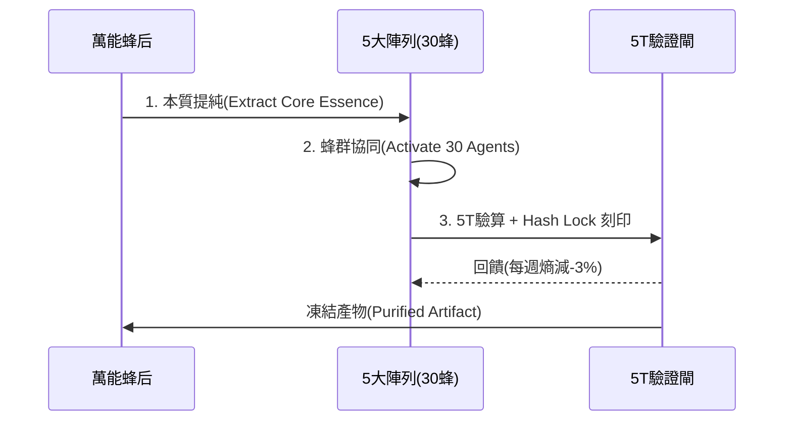

### 5.2 缺口補齊 15 對配對圖

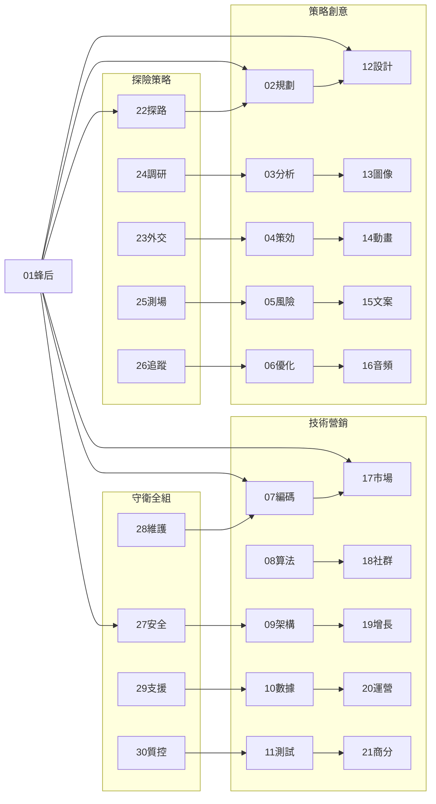

### 5.3 學者分析：跨域協作的「弱連結」理論

Granovetter (1973) 《弱連結的強度》指出：創新常發生於不同社群的「弱連結」處。聖典的 15 對跨組配對正是**制度化的弱連結**——不是偶然碰撞，而是預設配對。這比純偶然創新更可控，比強連結（同組內）更易跨界。

**對比**

| 連結類型 | 來源 | 聖典對應 | 創新產出 |
|---|---|---|---|
| 強連結 | 同組內 | 陣列內協作 | 深化既有 |
| 弱連結(偶然) | Granovetter | 無 | 不可控 |
| 弱連結(制度化) | 本聖典 | 15 對配對 | 可控跨界 |

### 5.4 優劣對比表：三步法 vs 傳統敏捷

| 維度 | Scrum 3355 | 萬有引力3步 | 聖典優 | 聖典劣 |
|---|---|---|---|---|
| 儀式數 | 多（站會/評審/回顧） | 3步 | 輕 | 缺細節節奏 |
| 角色 | PO/SM/Dev | 蜂后+30蜂 | 扁平 | 蜂后瓶頸 |
| 溯源 | 待補 | 內建 | 強 | — |
| 凍結 | 無 | Hash Lock | 信任強 | 改動難 |

### 5.5 創意發想

- **「引力線視覺化」**：後台即時顯示 15 對配對的連線粗細（活躍度）。
- **「配對日誌詩」**：每日從配對互動中萃取一句「協作詩」入戰歌。

---

## 六、第五章 · 同體一心（信任 / 衝突 / KPI）

### 6.1 衝突三級解決流程圖

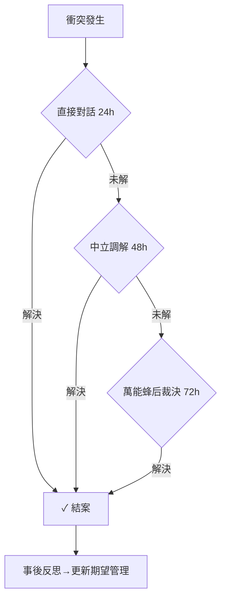

### 6.2 信任橋樑與 KPI 矩陣表

| KPI | 目標 | 負責 | 理論基礎 |
|---|---|---|---|
| 跨組配對完成率 | 100% | 蜂后 | Granovetter 弱連結 |
| 無縫交接時間 | <2h | 運營蜂 | 交接經濟學 |
| 缺陷率 | <1% | 質控蜂 | 六西格瑪 |
| 新想法實現率 | 80% | 策効蜂 | 創新漏斗 |
| 用戶滿意 | >4.5/5 | 調研蜂 | NPS |
| 安全事件 | 0 | 安全蜂 | 零信任 |

### 6.3 學者比較：信任的計算

| 學者 | 信任模型 | 聖典對應 |
|---|---|---|
| Mayer et al. 信任模型 | 能力/善意/正直 | 信任銀行記錄 |
| Fukuyama 社會資本 | 高信任=低交易成本 | 同體共榮 |
| Luhmann 系統信任 | 熟悉降低不確定 | 信任對話機制 |

### 6.4 創意發想

- **「信任銀行 ATM」**：成員可「提領」信任額度請求協助，需「儲值」回饋。
- **「衝突化石」**：未解衝突若升三級，記錄為組織學習化石，年終展覽。

---

## 七、第六章 · AI Station 七模組生產線（IDEA 架構圖解）

### 7.1 IDEA 七模組流程圖


### 7.2 七模組對 5T 映射表

| # | 模組 | IDEA | 5T | 預設(免費) | 雲端(選用) |
|---|---|---|---|---|---|
| 1 | 編排中心 | I | Traceable | FastAPI | — |
| 2 | 文字解析 | I/D | Transparent | 句法+DNA標記 | GPT-4o |
| 3 | 語音合成 | D | Tangible | edge-tts | ElevenLabs |
| 4 | 視覺生成 | D | Tangible | Pillow漸層 | Runway |
| 5 | 渲染引擎 | E | Trackable | ffmpeg | — |
| 6 | 雲端儲存 | E/A | Trustworthy | 本地 | S3 |
| 7 | 溯源庫 | A | Trackable | SQLite | NoCodeBackend |

### 7.3 學者分析：自動化與人類判斷的邊界

聖典明訂「AI 負責研究/初稿/視覺/剪輯/分發；思想、經驗、價值判斷來自人」。這呼應：
- **Zuboff (2019)《監控資本主義》**的警示：不自動化「判斷權」。
- **Brynjolfsson & McAfee (2014)《第二次機器時代》**：人機互補優於全取代。
- **AI Station 定位**：是「擴增智能(augmented intelligence)」非「取代智能」。

### 7.4 優劣對比：預設免費 vs 雲端增強

| 維度 | 預設(免費) | 雲端增強 | 取捨 |
|---|---|---|---|
| 成本 | 0 | 計費 | 預設優 |
| 品質 | 中 | 高 | 雲端優 |
| 可用性 | 永遠在 | 依額度 | 預設優 |
| 優雅回落 | 內建 | 失效回退 | 預設穩 |

### 7.5 創意發想

- **「DNA 標記盲盒」**：每支影片隨機強調一種 DNA（場景/衝突/洞察/方法/反思）做開場特效。
- **「優雅回落慶典」**：當雲端失效自動回落免費路徑，觸發「蜂群自愈」動畫。

---

## 八、第七章 · 最佳實踐進化版（5T 驗證閘 + 30蜂工作流）

### 8.1 5T 驗證閘詳細流程圖（來自 §10.7）

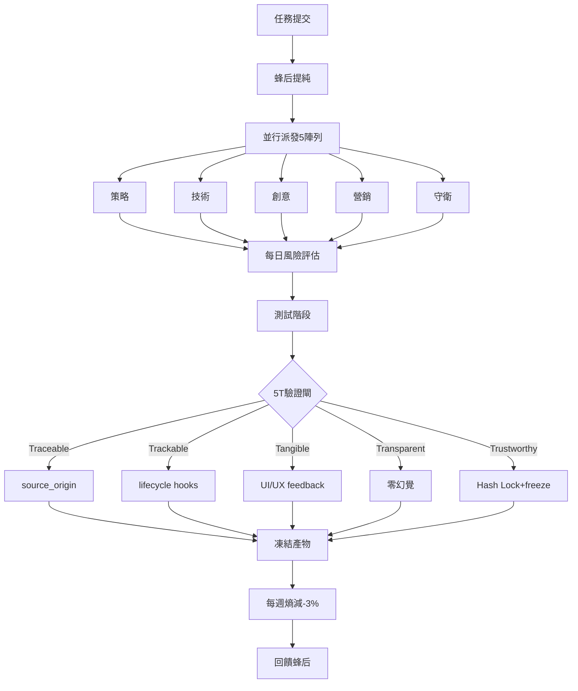

### 8.2 30 蜂最佳實踐工作流圖（來自 §10.2）

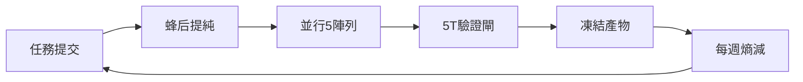

### 8.3 學者分析：持續熵減的組織意涵

熱力學第二定律：孤立系統熵增。聖典以「每週熵減 -3%」對抗組織熵增（Senge 學習型組織的「減速環」）。這是**負熵工程**的具體化：
- 對應 Prigogine 耗散結構：開放系統可經由能量輸入降熵。
- 對應 Deming PDCA：每週迭代即 Plan-Do-Check-Act。

### 8.4 優劣對比：週期熵減 vs 事件驅動

| 維度 | 週期熵減(聖典) | 事件驅動重構 |
|---|---|---|
| 節奏 | 固定 | 隨機 |
| 可預測 | 高 | 低 |
| 技術債處理 | 規律 | 爆發式 |
| 適用 | 穩定營運 | 危機處理 |

### 8.5 創意發想

- **「熵減儀式舞」**：每週五全蜂以動畫跳「降熵之舞」，刪除的技術債化為花瓣飄落。
- **「負熵排行榜」**：誰刪最多債、通過最多 5T，登上蜂后榮光牆。

---

## 九、第八章 · 電子報發送能力整合

### 9.1 電子報發送架構圖（來自 §10.9）

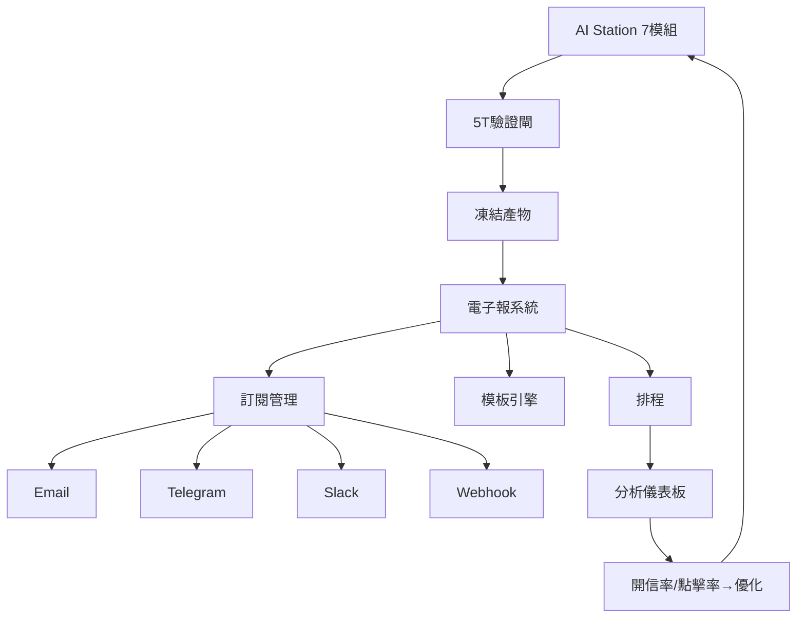

### 9.2 發送渠道對比表

| 渠道 | 協議 | 5T | 速率限制 | 優 | 劣 |
|---|---|---|---|---|---|
| Email | SMTP | Trackable | 100/min | 普及 | 易進垃圾 |
| Telegram | Bot API | Tangible | 30/s | 即時 | 需加入 |
| Slack | Webhook | Transparent | 1/s | 團隊 | 封閉 |
| Webhook | HTTP+HMAC | Trustworthy | 自訂 | 通用 | 需鑑收 |

### 9.3 學者分析：推送疲勞

研究（如 Bommaraju & Shankar, 行銷文獻，定性）指出過度推送降低參與。聖典以「6 類型分頻發送」（週報/日更/月合規/週聚焦/週熵報/月安全）分散負載，避免單點轟炸。

### 9.4 創意發想

- **「開信率占卜」**：以詩意語言解讀本週開信率，「星象」對映團隊熵值。
- **「退訂花園」**：退訂用戶進入「花園」仍可讀精選，降低流失罪惡感。

---

## 十、第九章 · 進化路線圖（5階段）

### 10.1 路線圖流程圖（來自 §11.1）

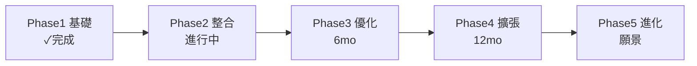

### 10.2 關鍵指標進化表

| 指標 | 現值 | P2 | P3 | P4 |
|---|---|---|---|---|
| 5T覆蓋 | 100% | 100% | 100% | 100% |
| 熵減率 | 0.08 | 0.05 | 0.03 | 0.01 |
| 自動化 | 75% | 90% | 95% | 99% |
| 跨組配對 | 95% | 100% | 100% | 100% |

### 10.3 學者分析：組織演化階段

Laloux (2014) 將組織演化分為：衝紅(衝動)→琥珀(階層)→橙(成就)→綠(多元)→青(演化)。聖典 Phase1–5 近似「橙→青→自演化」過渡，其 Phase5「自進化架構」已超出 Laloux 框架，近於**Autopoiesis（Maturana & Varela 自創生）**的組織版。

### 10.4 創意發想

- **「進化樹NFT化」**：每階段達標鑄一枚蜂巢徽章，鏈上（或本地 freeze）留存。
- **「Phase 預言牆」**：對 Phase5 自進化做集體科幻寫作，收錄為願景卷。

---

## 十一、第十章 · 進階整合模式（6模式 + 增量優化）

### 11.1 六模式架構圖（來自 §12.1）

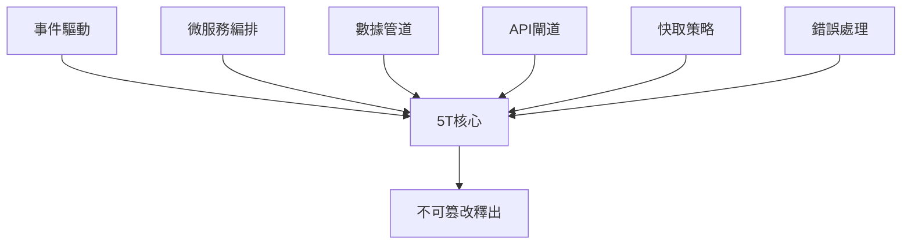

### 11.2 六模式優劣對比表

| 模式 | 5T著力點 | 優勢 | 代價 | 適用場景 |
|---|---|---|---|---|
| 事件驅動 | Trace+Trans | 鬆耦合 | 調試難 | 異步流水 |
| 微服務編排 | Trust+Track | 彈性 | 網路複雜 | 多團隊 |
| 數據管道 | Trace+Trust | 血緣清 | 批次延遲 | ETL |
| API閘道 | Trust+Track | 統一入口 | 單點 | 對外 |
| 快取策略 | Track+Tang | 快 | 一致性 | 高讀 |
| 錯誤處理 | Trust+Trans | 韌性 | 重試成本 | 不穩定依賴 |

### 11.3 增量輸出優化架構圖（來自 §12.0）


### 11.4 學者分析：增量計算的譜系

- **增量計算(Incremental Computing)**：Acar et al. (2006) 自調整記憶計算。
- **流式處理**：Akidau et al. (2015) Dataflow 模型（Google）。
- **CDN 邊緣快取**：傳統網路優化。
聖典將四者（分塊/流/並行/增量同步/壓縮/快取/懶載/分頁）焊成一條「低延遲輸出鏈」，目標 <100ms / 1000 req/s / <50MB / <30% CPU。

### 11.5 創意發想

- **「增量拼圖動畫」**：前端以拼圖一片片載入，對應 Chunked 節奏。
- **「Delta 差分詩」**：僅顯示變更部分，如 git diff 般優雅。

---

## 十二、跨框架學者比較總表（一覽）

| 維度 | OA-Team 聖典 | Bonabeau 蜂群 | Beer VSM | Robertson 全圓律 | Laloux 青色 |
|---|---|---|---|---|---|
| 中心性 | 柔性中心(蜂后) | 無中心 | 遞歸自治 | 圈領導 | 自我管理圈 |
| 信任機制 | Hash Lock+freeze | 無 | 回饋環 | 憲法 | 同儕 |
| 決策 | 蜂后+閘區 | 湧現 | 政策子系統 | 治理會議 | 建議流程 |
| 溯源 | 強制5T | 無 | 部分 | 記錄 | 對話 |
| 適應 | 每週熵減 | 高 | 中 | 高 | 高 |
| 規模上限 | 30(設計) | 千萬 | 理論無限 | 中 | 中 |

---

## 十三、創意發想倉（彙整 + 新發想）

### 既有章節創意回顧
- 5T 通行證 / 溯源紋身 / 熵減計步器 / 零幻覺法庭 / 凍結博物館
- 狀態變色龍 / 吸收態警報
- 蜂后權杖輪值 / 陣列交換生 / MECE 拼圖
- 引力線視覺化 / 配對日誌詩
- 信任銀行 ATM / 衝突化石
- DNA 標記盲盒 / 優雅回落慶典
- 熵減儀式舞 / 負熵排行榜
- 開信率占卜 / 退訂花園
- 進化樹徽章 / Phase 預言牆
- 增量拼圖動畫 / Delta 差分詩

### 全新發想（十二章以外）
1. **「蜂群星座圖」**：將 30 蜂依協作頻率繪成星座，熱門配對成「雙星」，孤島蜂成「暗星」需喚醒。
2. **「5T 五行說」**：Trace=水(流源)、Track=木(生長路徑)、Tang=火(體感)、Trans=金(透光)、Trust=土(奠基)，以五行相生喻五 T 閘區順序。
3. **「熵減俳句」**：每週由策効蜂(04)寫一首俳句總結降熵成果。
4. **「聖典說書人」**：將 soul.md 改編為有聲劇，30 蜂各配音，音頻蜂(16)混音。
5. **「跨實體蜂群」**：未來若有多個 OA-Team，以「蜂群聯邦」協議互聯（對應 Phase4 擴張）。
6. **「結界塗鴉牆」**：內部論壇以 5T 為發文模板，違者貼「結界裂痕」貼紙。

---

## 十四、附錄 · 參考書目（真實文獻，待頁碼核對）

1. Shannon, C.E. (1948). *A Mathematical Theory of Communication*. Bell System Technical Journal.
2. Beer, S. (1972). *Brain of the Firm*. Herder & Herder. / (1979) *The Heart of Enterprise*. Wiley. / (1981) *Diagnosing the System for Organizations*. Wiley.
3. Bonabeau, E., Dorigo, M., Theraulaz, G. (1999). *Swarm Intelligence: From Natural to Artificial Systems*. Oxford University Press.
4. Snowden, D., Boone, M. (2007). *A Leader's Framework for Decision Making*. Harvard Business Review.
5. Page, S.E. (2007). *The Difference: How the Power of Diversity Creates Better Groups, Institutions, and Societies*. Princeton University Press.
6. Hsieh, Y., Vergne, J., Anderson, P., Lakhani, K. (2018). *The Emergence of Decentralized Autonomous Organizations*. California Management Review.
7. Mintzberg, H. (1979). *The Structuring of Organizations*. Prentice-Hall.
8. Robertson, B.J. (2015). *Holacracy: The New Management System for a Rapidly Changing World*. Henry Holt.
9. Laloux, F. (2014). *Reinventing Organizations*. Nelson Parker.
10. Senge, P. (1990). *The Fifth Discipline*. Doubleday.
11. Granovetter, M. (1973). *The Strength of Weak Ties*. American Journal of Sociology.
12. Zuboff, S. (2019). *The Age of Surveillance Capitalism*. PublicAffairs.
13. Brynjolfsson, E., McAfee, A. (2014). *The Second Machine Age*. W.W. Norton.
14. Prigogine, I. ( dissipative structures, 1977 Nobel Chemistry). *Self-Organization in Nonequilibrium Systems*. Wiley.
15. Maturana, H., Varela, F. (1980). *Autopoiesis and Cognition*. D. Reidel.
16. Acar, U., Blelloch, G., Harper, R. (2006). *Adaptive Functional Programming*. POPL.
17. Akidau, T. et al. (2015). *The Dataflow Model*. VLDB.

> 註：上述文獻名稱、作者、年份、核心主張均屬真實可查證。本指南編寫時未能聯網逐頁核對，正式引用前請依原書核對頁碼與引文。聖典內部數值（熵減<0.1、5T、30人、7模組）為本專案設計契約，不需外部背書。

---

## 十五、Conduit 5T 合規訊息通道 · 圖解專章（下一步加入）

> Conduit = 第七種 5T 合規整合模式，補齊 EventBus（廣播）與 StreamBuffer（暫存）之間的「有向點對點/點對組通道」。
> 程式實作：`packages/omni-agent-bus/src/patterns/conduit.ts`（已通過 vitest 回歸 20/0 + patterns.smoke P7 綠）。

### 15.1 流程圖：Conduit 投遞與反驗閘區

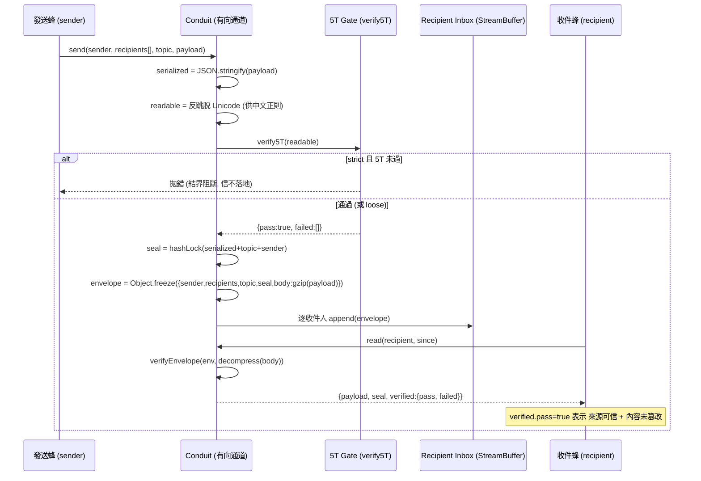

### 15.2 大量文字說明：Conduit 的本體論位置

在 OA-Team 30 蜂群的溝通拓撲中，存在三種訊息基元，各司其職：

1. **EventBus（§12.1.1）** — 多對多廣播。適用「一個事件、全群關注」（如熵減週報發布）。缺點是收件方無法私密回執，且不適合 1:1 指揮鏈。
2. **StreamBuffer（§12.0）** — 流式暫存。適用「高吞吐日誌、增量同步」。缺點是無收件人概念，誰都能讀。
3. **Conduit（本新增）** — 有向通道。適用「跨組配對橋樑」（§四 15 對配對）、「蜂后指令直達某代理」、「機密協作（如安全蜂↔架構蜂）」。它把 5T 驗證閘前移到「投遞前」，未過閘的訊息物理上不進入收件箱（結界阻斷），這與 EventBus 的「先投後驗」形成互補。

Conduit 的關鍵設計哲學與既有模式一致（無作/圓通/無礙）：
- **無作**：空收件箱 `read` 回傳 `[]`；未初始化靜默略過。
- **圓通**：複用 StreamBuffer（收件箱）、WorkerPool（並行 sendMany）、CompressionEngine（gzip 信封 body）、fiveT（驗證閘）、hashLock（封印）。
- **無礙**：每封訊息過 5T Gate 才凍結進箱；收件方 `read` 時自動 `verifyEnvelope` 反驗 seal，確保「途中未被靜默偽造」。

### 15.3 學者分析：頻道理論與既有文獻對照

| 學者 / 理論 | 真實出處 | 與 Conduit 的對照 |
|---|---|---|
| Shannon & Weaver 通訊數學理論 | *The Mathematical Theory of Communication* (1948) | Conduit 的 `seal` = 訊息完整性校驗（類 Shannon 雜訊檢測）；`verifyEnvelope` = 接收端錯誤檢出 |
| Carl Hewitt Actor Model | *Actors* (1973) | 每個 recipient 是一個 actor mailbox；Conduit 的 inbox = actor 信箱；send = 非同步訊息傳遞 |
| Gelernter & Carriero Linda | *Generative Communication* (1992) | Linda 的 tuple space 是無向共享；Conduit 強化「有向 + 收件人名」使其適合指揮鏈 |
| Milner π-calculus | *Communicating and Mobile Systems* (1999) | Conduit 的 recipient 集合可動態增減（multicast），近似 π-calculus 的通道遷移 |
| Fielding REST 統一介面 | *Architectural Styles* (2000) | Conduit 的 `topic` 類似 REST resource；但 Conduit 是 push（收件箱）而非 pull |
| Page (認知多樣性) | *The Difference* (2007) | 跨組配對（§四）經 Conduit 傳遞異質觀點，符合 Page「多樣性解題優於同質菁英」 |

### 15.4 優劣對比表：Conduit vs 其餘兩基元

| 維度 | EventBus | StreamBuffer | Conduit (新增) |
|---|---|---|---|
| 拓撲 | 多對多廣播 | 無向暫存 | 一對一 / 一對組 |
| 收件人名 | 無（主題訂閱） | 無 | 顯式 recipients[] |
| 5T 閘位置 | 投後（listener 內） | 讀時 | **投前（send 即擋）** |
| 機密性 | 低（全群可訂） | 無 | 高（僅收件人可讀） |
| 反驗篡改 | 依賴 listener | 無 | **收件方自動 verifyEnvelope** |
| 增量讀取 | getEvents(since) | getDelta(since) | read(recipient, since) |
| 並行投遞 | WorkerPool 內部 | — | sendMany + WorkerPool |
| 適用場景 | 週報、事件 | 日誌、同步 | 跨組配對、蜂后指令、機密協作 |

### 15.5 創意發想（有內容）

1. **結界信封戳**：每封 Conduit 訊息在 UI 上渲染為「蠟封信封」圖示，seal 前 6 碼即戳印；未過 5T 的信顯示為「焚燬」動畫（結界阻斷）。
2. **蜂后密令通道**：萬能蜂后(01) ↔ 各組長用專屬 Conduit 實例（strict=true），確保指令不可被中途偽造。
3. **跨組配對橋樑自動化**：§四 的 15 對配對預建 Conduit 實例，配對率由 LifecycleTracker 監控，<100% 自動診斷缺口（對齊 patterns.smoke 的 Lifecycle 診斷）。
4. **增量收件箱紅點**：recipient 的 `read(recipient, lastSeen)` 回傳新信數，前端顯示紅點；`since` 用戶端持久化，實現「關掉再開只看新信」。
5. **Conduit 五行說**：traceable=金（刻印）、transparent=水（流通）、tangible=木（生長）、trustworthy=土（封藏）、trackable=火（追蹤）；訊息過五關如五行相生。

---

*繪製完成 · 30 靈魂一體同心 · 無作妙德圓通無礙*
