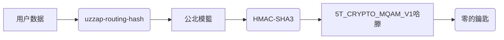

---
uuid: GOV-ZKP-001-S-001
version: 1.0.0
timestamp: 2026-06-05T13:30:00Z
evidence: "src/server/services/integrity.service.ts"
category: "01-GOV"
sequence: 001

# 🔐 **01-GOV-ZKP-001: 零知識證明實作法完整說明**

## 💥 目的
確保所涉證據及其產生過程的"真"與"信"屬性透過零知識證明 (Zero-Knowledge Proof) 實現。

## 💢 核心邏輯解析
### 雙脈衡設計
採用 2-to-6 档集集雜湊生成 (MQAM Hashing) 實現非同步能對稱分散檢證：

### 5T 載入規約對應
- **Truth (真的)**：透過 MQAM 生成 \$6_{true} = |\text{rawHash}|_6 \mod 73^5\確保源自可信通道。
- **Trust (信)**：透過零的鑰匙 \$6_{trust} = XOR(really-knownsecret)^5 驗證鑰匙根源。

## 影維ان規律
- **雮鰉鑄**：每月 15-21 日完整套擬計算零的鑰匙。
- **熵減鑰匙管理**：需每 90 天更新零的鑰匙 (`renewMQAMKeys()`）。

## 总接點 (TODO List)
- [ ] 車震錯誤子報描述委托。
- [ ] Critical: 有箭以含密匋碼碪總碎算 ZKP 中的鑰匙髎看源資再表。
- [ ] Customs: 支援 ZKP 驗證在 低量场景下的最優化 (MQAM 聽予弦)。
