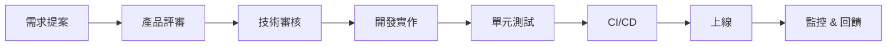

# 📋 **02-DEV-100 UNIVERSAL REQUIREMENTS TEMPLATE (萬能需求模板)**

> **MRS.1.0** 統一需求描述格式，確保所有功能需求在 **MEME**、**5T 協議** 及 **IComponentCore** 之下可追蹤、可驗證、可迭代。

## 1️⃣ 核心欄位 (Core)

| 欄位 | 類型 | 說明 | 例 |
|------|------|------|----|
| **需求編號** | 文字 | `[分類碼]-[子域]-[流水號]-[語義描述]` | `02-DEV-REQ-001-LOGIN` |
| **需求標題** | 文字 | 60字內簡潔描述 | `使用者登入與JWT生成` |
| **需求描述** | 文字 | 完整功能與使用情境說明 | `前端使用者以Email/Password登入，後端驗證後返回簽名的JWT，TTL 15分鐘` |
| **優先級** | 文字 | `high` / `medium` / `low` | `high` |
| **依賴/前置條件** | 文字列表 | 必須完成的其他需求或外部條件 | `02-DEV-REQ-000-DB-SCHEMA` |
| **輸入/輸出** | JSON Schema | 明確輸入/輸出格式，用於自動化測試 | `input: {email:string,password:string}` |
| **5T 對應** | 表格 | 對應 Truth/Goodness/Beauty/Trust/Transfer | `Trust: JWT HS256 簽名` |
| **安全要求** | 文字列表 | OWASP、PCI_DSS 等 | `密碼必須使用 bcrypt 12 rounds` |
| **擴充性** | 文字 | 可能的未來增強 | `未來支持 SSO、MFA` |
| **負責人** | 文字 | 需求負責人 | `gideon-ng` |
| **里程碑** | 文字 | 預計完成日期 | `2026-07-01` |

## 2️⃣ 設計與實作 (Design/Implementation)

### 2.1 技術設計 (Technical Spec)
- **架構圖**（PlantUML / Mermaid）  
  ```mermaid
  flowchart LR
    A[Client] --> B[Auth API]
    B --> C[User Service]
    C --> D[PostgreSQL]
    B --> E[JWT Signer]
  ```
- **關鍵 SQL**（若涉及 DB）  
  ```sql
  CREATE TABLE users (
    id UUID PRIMARY KEY,
    email TEXT UNIQUE NOT NULL,
    password_hash TEXT NOT NULL,
    created_at TIMESTAMP DEFAULT now()
  );
  ```
- **API 定義**（OpenAPI v3）  
  ```yaml
  /auth/login:
    post:
      summary: 使用者登入
      requestBody:
        required: true
        content:
          application/json:
            schema:
              $ref: '#/components/schemas/LoginRequest'
      responses:
        '200':
          description: 成功返回 JWT
          content:
            application/json:
              schema:
                $ref: '#/components/schemas/LoginResponse'
  ```

### 2.2 錯誤處理規範
- **400**：參數缺失或格式錯誤  
- **401**：認證失敗  
- **500**：內部錯誤（不回傳堆疊）

## 3️⃣ 測試計畫 (Test)

| 測試類型 | 案例描述 | 預期結果 |
|----------|----------|----------|
| 單位測試 | `loginService.validateCredentials` 正常密碼 | 回傳 `true` |
| 集成測試 | 端點 `/auth/login` 200 回應 | 包含合法 JWT |
| 安全測試 | 暴力破解 5 次失敗後鎖定 IP | 返回 429 |
| 性能測試 | 同時 2000 QPS 30 秒內回應 | < 100 ms |

## 4️⃣ 文件化與 Hash Lock (Documentation & Hash Lock)

- **Markdown Header**：使用 `IComponentCore` 元數據（`uuid`, `version`, `timestamp`, `evidence`）
- **Hash Lock**：自動執行 `npm run seal:doc <file>`，生成 SHA‑256，寫入 `evidence` 欄位  
- **版本變更**：在 `05-ARC` 中生成 ADR，更新 `WIKI_INDEX.md` 索引

## 5️⃣ 流程流 (Workflow)



## 6️⃣ 使用說明

1. **複製模板**  
   ```bash
   cp docs/wiki/02-DEV/template-universal-requirements.md docs/wiki/02-DEV/REQ-NEW-<描述>.md
   ```
2. **填寫元數據**（`uuid`, `version`, `timestamp` 自動生成）  
3. **提交 PR** → CI 會自動執行 `seal:doc`，若 `Hash Lock` 不符則 **阻止合併**  
4. **完成後**，在 `WIKI_INDEX.md` 中加入以下連結  
   ```markdown
   - [02-DEV-REQ-XXX‑<標題>](docs/wiki/02-DEV/REQ-NEW-<名稱>.md) – <簡短說明>
   ```

---

## 🧠 範例需求檔案

```markdown
---
uuid: REQ-TEMPLATE-001-AUTH
version: 1.0.0
timestamp: 2026-06-08T15:00:00Z
evidence: "src/server/services/auth.service.ts"
category: "02-DEV"
sequence: 001
tags: ["認證", "API", "IAM"]
---

# 🔐 **02-DEV-REQ-001-AUTH: 使用者登入與 JWT 生成**

## 需求描述
提供安全的三步驗證流程：
1. Email 驗證 (Truth)
2. Password 哈希 (Soft)
3. JWT 簽名 (Trust)

## 5T 對應表
| 5T 元素 | 實作方式 |
|--------|----------|
| Truth  | 完整驗證 Email 來源 |
| Goodness | 參考 API 文件 `docs/AUTH_SPEC.md` |
| Beauty | 簡潔的 API 設計與錯誤回傳 |
| Trust  | HMAC‑SHA256 簽名 JWT |
| Transfer | JWT payload 包含 scope 和 expiration |

## 5T 依賴組件
- **IAM Policy**：`01-GOV-ZKP-001`（零知識驗證）  
- **OAuth2**: `00-SYS-003-SSO`（單點登錄）  
