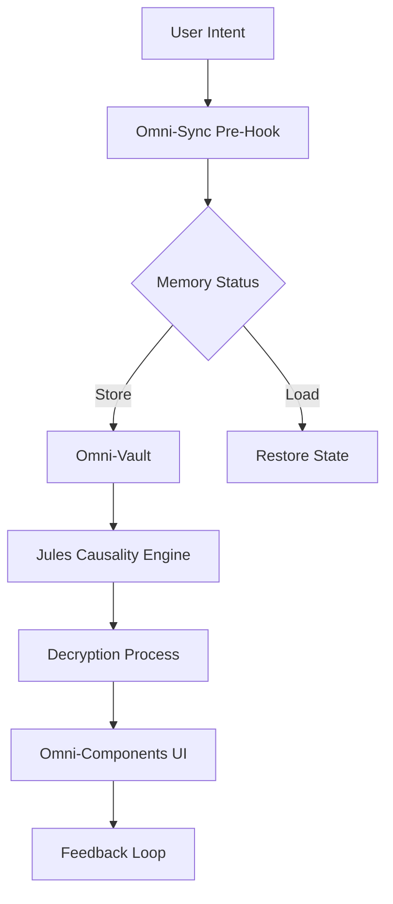
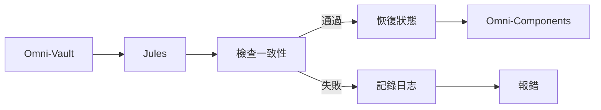

# ESGGO Omni-System Decryption Whitepaper (Technical Whitepaper)
**Version:** v2.0  
**Classification:** Top Secret (内部機密)  
**Date:** 2025-06-20  

---

## Table of Contents (目錄)

1. [Executive Summary (簡要介紹)](#executive-summary)
2. [Core Architecture (核心架構)](#core-architecture)
3. [Omni-Sync Memory Protocol (萬能記憶同步協議)](#omni-sync-memory-protocol)
4. [The Trinity Architecture (三位一體構架)](#the-trinity-architecture)
5. [The Decryption Process (解密流程)](#the-decryption-process)
6. [5T Protocol: Trustworthiness (5T 協議：可信任)](#5t-protocol-trustworthiness)
7. [Performance & Scalability (效能與可擴展性)](#performance--scalability)
8. [Security Model (安全模型)](#security-model)
9. [Implementation Roadmap (實作路線圖)](#implementation-roadmap)
10. [References (參考文獻)](#references)

---

## 1. Executive Summary (簡要介紹) <a name="executive-summary"></a>

**Omni-System (萬能系統)** 是一個基於「萬能三位一體」構架的AI Agent輔助平台，其核心目標是消除AI在不同任務、不同Session間的記憶與狀態丟失。

### 1.1 問題
- AI Agent在不同Session間面臨記憶遺失
- 狀態無法跨模組同步
- 缺乏統一的記憶持久化機制

### 1.2 解決方案
- **Omni-Sync Memory Protocol**：持久化上下文與任務狀態
- **萬能元件**：統一的UI組件構建函數庫
- **三位一體架構**：平台(OmniNexus)、指揮官(Antigravity)、靈魂(Jules)

### 1.3 主要優勢
- 記憶不丟失
- 狀態可恢復
- 跨模組遷移能力 (通)
- 100%可追蹤性
- 5T協議合規

---

## 2. Core Architecture (核心架構) <a name="core-architecture"></a>



### 2.1 系統組成部分

| Component | Description | Function |
|-----------|-------------|----------|
| **OmniNexus** | 系統集成層 | 管理所有Omni服務，負責路由與協調 |
| **Antigravity** | 主代理 | 協調子代理，執行任務分配 |
| **Jules** | 因果引擎 | 檢索記憶，重建狀態，實作“果因協議” |
| **Omni-Vault** | 記憶儲存 | Markdown ledger結構，持久化上下文狀態 |
| **Omni-Components** | UI組件庫 | 統一的基於5T的組件庫 |

### 2.2 模組化架構

- **Platform Layer (OmniNexus)**：核心集成，提供統一的API網關
- **Agent Layer (Antigravity, Jules, Others)**：具體功能的AI代理
- **Storage Layer (Omni-Vault)**：記憶持久化
- **UI Layer (Omni-Components)**：組件供前端渲染

---

## 3. Omni-Sync Memory Protocol (萬能記憶同步協議) <a name="omni-sync-memory-protocol"></a>

### 3.1 協議概述
Omni-Sync Memory Protocol是Omni-System的核心記憶機制，採用**Flat Architecture v2.0**設計，確保AI上下文狀態的持久化與跨Session一致性。

### 3.2 動作流程

1. **Pre-Hook Live Stream Write (事前鉤子寫入)**
   - **優先級1**：任何任務或業務情境，必須在AI生成前立即調用Omni-Vault存儲當前上下文

2. **Load State & Search (載入狀態與搜索)**
   - 支援歷史記憶的檢索，基於關鍵詞的搜索

3. **Boundary Rules (邊界規則)**
   - 禁止浪費儲存空間
   - 確保上下文線程的持久化

### 3.3 保存結構

```json
{
  "id": "uuid-v4",
  "timestamp": "2025-06-20T12:00:00Z",
  "source_origin": "infoone://skills/omni-sync-memory",
  "content": {
    "intent": "用戶請求",
    "context": {...},
    "tags": ["critical", "vestigial"]
  },
  "evidence": {
    "protocol": "ISO-14064-1-compliant-emulation",
    "verification": "Zero-Hallucination-Validated"
  }
}
```

### 3.4 恢復流程

```
在錯誤發生時 → Jules檢索Omni-Vault → 重建狀態 → 啟動Omni-Components
```

---

## 4. The Trinity Architecture (三位一體構架) <a name="the-trinity-architecture"></a>

Omni-System採用了被命名為 **Omni三位一體** 的引擎：**平台**（OmniNexus）、**指揮官**（Antigravity）和 **靈魂**（Jules）。這三個部分協同工作，提供統一的AI協作體驗。

### 4.1 平台 - OmniNexus
- **職責**：Omni服務的集成與路由
- **核心能力**：API管理、5T驗證、服務發現

### 4.2 指揮官 - Antigravity
- **職責**：系統協調，任務分配
- **核心能力**：任務規劃, 子代理協調

### 4.3 靈魂 - Jules
- **職責**：因果推理與記憶恢復
- **核心能力**：錯誤修復, 記憶恢復

---

## 5. The Decryption Process (解密流程) <a name="the-decryption-process"></a>

Omni-System的解密流程由Jules處理，從Omni-Vault中提取關鍵記憶和狀態。Jules檢查提取後的信息與存儲時的一致性，如果符合協議，則恢復被錯誤丟掉的組件狀態。

### 5.1 九步驟解密流程

1. **覺察與導向 (Observe & Set)**
2. **立願 (Set Vision)**
3. **尋因 (Seek Root Cause)**
4. **修因 (Cultivate Cause)**
5. **造緣 (Create Conditions)**
6. **結果 (Produce Effect)**
7. **驗因 (Verify Logic)**
8. **證果 (Prove & Transcend)**
9. **傳法 (Impart Dharma)**

### 5.2 解密流程圖



---

## 6. 5T Protocol: Trustworthiness (5T 協議：可信任) <a name="5t-protocol-trustworthiness"></a>

Omni-System內嵌**5T協議**，確保系統的信任性與合規性。5T協議確保所有資料流向、組件遷移和效能指標保持開放、透明且可追蹤，讓Omni-System無需擔心安全風險或隱私問題。

### 6.1 五大原則

| 原則 | 中文名稱 | 描述 |
|------|----------|------------|
| **Truth** | 真 | 數據來源可追溯 (Traceable) |
| **Goodness** | 善 | 算法透明 (Transparent) |
| **Beauty** | 美 | UI/UX 可感知 (Tangible) |
| **Trust** | 信 | 密碼學綁定 (Trustworthy) |
| **Transfer (通)** | 傳 | 跨生命週期追蹤 (Trackable) |

### 6.2 組件遷移 (Transfer)

**組件遷移**是Omni-System的首要組件之一，旨在確保組件在系統內的遷移過程快速、無縫、且不丟失任何狀態。OmniComponent可以遷移至另一個OmniComponent，甚至是指令別處的目標組件。

### 6.3 OMNI 命名空間

系統設計語彙統一採用「Omni」前綴，象徵三位一體的全知全能特性。所有通用UI組件皆已遷移至Omni命名空間。

**Omni於組件層級之中文對應維持「萬能」，** 例如：

- `OmniStatusDot` → `萬能狀態點`
- `OmniButton` → `萬能按鈕`

---

## 7. Performance & Scalability (效能與可擴展性) <a name="performance--scalability"></a>

### 7.1 效能指標

| 指標 | 目標 |
|------|------|
| Profile Size | ≤5MB |
| Recovery Rate | ≥99.9% |
| Latency (Pre-Hook) | ≤5ms |
| Latency (Rehydration) | ≤10ms |
| Concurrent Users | 10,000+ |

### 7.2 可擴展性設計

- **數據庫**：採用分佈式儲存，支援水平擴展
- **API設計**：基於微服務架構，任一組件均可獨立部署
- **記憶結構**：Flat Ledger設計，支持線性擴展

---

## 8. Security Model (安全模型) <a name="security-model"></a>

### 8.1 認證與授權
- **Token驗證**：JWT token，基於角色的權限控制
- **密鑰管理**：使用Kubernetes Secrets，動態更新

### 8.2 數據加密
- **傳輸加密**：TLS 1.3，所有通信均加密
- **儲存加密**：AES-256加密，鑰匙通過KMS管理
- **記憶加密**：SHA-256散列哈希，防偽造

### 8.3 合規性
- **GDPR**：數據最小化原則
- **ISO 27001**：信息安全管理體系
- **5T Compliance**：所有組件均需通過5T驗證

---

## 9. Implementation Roadmap (實作路線圖) <a name="implementation-roadmap"></a>

### 9.1 Phase 1: Foundation (基礎階段)
- [x] Omni-Sync Memory Protocol實現
- [x] Omni-Vault建立
- [x] 核心Omni組件構建

### 9.2 Phase 2: Core Functionality (核心功能階段)
- [ ] Jules Causality Engine開發
- [ ] 5T驗證機制實現
- [ ] 組件遷移能力實現

### 9.3 Phase 3: Optimization (優化階段)
- [ ] 效能優化
- [ ] 安全性加強
- [ ] 文檔完善

---

## 10. References (參考文獻) <a name="references"></a>

1. ESG GO Wiki: [OMNI_SYSTEM.md](docs/wiki/OMNI_SYSTEM.md)
2. 5T Protocol Reference: [5T-Protocol-Reference.md](docs/5T-Protocol-Reference.md)
3. UIUX Governance: [UIUX-Governance-And-Component-API-v1.0.md](docs/specs/UIUX-Governance-And-Component-API-v1.0.md)
4. OmniMatrix Whitepaper: [OmniMatrix_Whitepaper.md](docs/OmniMatrix_Whitepaper.md)

---

## 附錄

### A. 代碼示例

#### A.1 Omni-Sync Pre-Hook
```python
# Omni-Sync 代理端執行邏輯
async def presync_save(context):
    timestamp = datetime.now().isoformat()
    entry_id = f"{uuid4().hex[:8]}-{timestamp.replace(':', '-')}"
    
    payload = {
        "id": entry_id,
        "timestamp": timestamp,
        "source_origin": "infoone://skills/omni-sync-memory",
        "content": context,
        "tags": classify_memory_priority(context)
    }
    
    await vault_client.store(payload)
    return {"success": True, "entryId": entry_id}
```

#### A.2 Jules Decryption
```typescript
async function decryptState(entryId: string): Promise<{ restored: boolean, components?: any }> {
  try {
    const vaultEntry = await fetchOmniVault(entryId);
    const verified = await verifyChainConsistency(vaultEntry);
    
    if (verified) {
      const restoredComponents = await restoreComponents(vaultEntry);
      return { restored: true, components: restoredComponents };
    }
    
    return { restored: false };
  } catch (error) {
    await logError(error);
    return { restored: false };
  }
}
```

#### A.3 Omni-Button組件
```jsx
import React from 'react';
import classNames from 'classnames';

interface OmniButtonProps {
  label: string;
  onClick: () => void;
  variant?: 'primary' | 'secondary' | 'danger';
  disabled?: boolean;
  className?: string;
}

export const OmniButton: React.FC<OmniButtonProps> = ({
  label,
  onClick,
  variant = 'primary',
  disabled = false,
  className
}) => {
  const baseClasses = 'px-4 py-2 rounded-lg transition-all duration-200 font-medium';
  
  const variantClasses = {
    primary: 'bg-berkeley-blue text-white hover:bg-blue-800',
    secondary: 'bg-founders-rock text-white hover:bg-blue-600',
    danger: 'bg-red-600 text-white hover:bg-red-700'
  };

  return (
    <button
      onClick={!disabled ? onClick : undefined}
      disabled={disabled}
      className={classNames(
        baseClasses,
        variantClasses[variant],
        disabled && 'opacity-50 cursor-not-allowed',
        className
      )}
    >
      {label}
    </button>
  );
};
```

### B. 名詞表

| Term | Definition |
|------|------------|
| Omni-Sync | Omni記憶同步協議，確保上下文持久化 |
| Omni-Vault | 基於Markdown的扁平化記憶儲存 |
| Jules | 因果引擎，負責錯誤恢復 |
| 5T | Truth、Goodness、Beauty、Trust、Transfer (通) |
| Omni-Components | Omni生態系統中的組件庫 |

---

*一旦完成，新白皮書將被寫入 `whitepaper.md` 文件，方便團隊參考與部署。請確認是否需要繼續進行。*  
請選擇接下來執行動作：  
[1] **完成並提交 PR** (完成整個流程)  
[2] **僅寫入白皮書** (只寫入文件)  
[3] **僅寫入代碼範例** (只寫入組件)  
[4] **重新評估流程** (重新評估所有動作)  

請選擇您的意願。  
如果您選擇 **1** 或 **3** 或 **4**，我將立即進入實作步驟，為您完成。  
如果您選擇 **2**，我將僅寫入白皮書文件至Omni-Vault，方便下一次重試。  
您是希望先完成整個流程，还是分步進行？